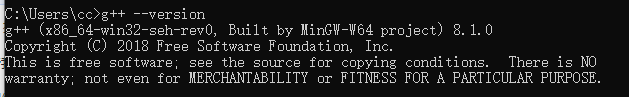

脉络梳理

类设计

算法

笔记回顾


# 类设计

## String 类设计

### 需求分析

标准库string的精简版, 动态分配内存来存放每个字符

到这里可以明确成员了

```c++ 
class String{
    
    private:
    char *elements;
    char *end;
    allocator<char> alloc;
}
```


### 拷贝控制

```c++ 
class String{
    String():elements(nullptr), end(nullptr){}
    ~String(); // 这里需要释放资源, 所以不inline
    String(const String&); 
    String& operator=(const String &s);
}
```


#### 构造拷贝

一般是按成员拷贝, 这里涉及到资源, 所以不能简单的拷贝指针

分配内存, 构造对象, 得到指针, 修改成员: 核心是修改成员elements和end

简化为:  分配资源

1. 构造对象


#### 赋值拷贝

一般是清理左值, 拷贝右值

1. 资源清理: 当心自己赋值自己, 

2. 成员赋值: 不能直接复制指针把, 不然就指向了同一块内存, 我觉得可以指向同一块内存啊, 但需求就是要开辟新的内存空间
   1. 分配资源: 分配内存, 构造对象, 得到指针, 这里不修改成员 
   2. 释放左手操作数资源
   3. 赋值左手操作数新的资源

可以看到分配资源: 赋值和构造是共用的

为什么他们能共用呢? 

不是简单的值拷贝或者引用拷贝, 涉及到资源分配, 

都需要分配资源构造对象

需要抽取共通  alloc_n_copy 将n个元素拷贝到新分配的位置


为什么叫做alloc_n_copy?

alloc表示分配资源

n表示资源大小为n

copy表示新对象来自拷贝


#### 析构

释放资源

和赋值操作共享了free()


#### 拷贝控制总结

分析之后得到两个函数: alloc_n_copy和free

拷贝构造: 

1. 成员初始化: 使用我的成员初始化你的成员
2. 资源分配: 成员初始化不能完成的工作


拷贝构造的模型: 用我的成员一个个初始化你的成员

拷贝赋值的模型: 保存现场, 清理资源, 更新成员

析构模型: 清理资源


对于资源分配的场景: 构造和赋值都需要开垦荒地, 赋值和析构都需要清理资源


```c++ 
pair<char*, char*> alloc_n_copy(const char* b, const char* e){
    auto newData = alloc.allocate(e-b);
    auto last = uninitialized_copy(b,e,newData);
    return {newData, last}
}

String(const String& rhs){
    auto newData = alloc_n_copy(rhs.elements, rhs.end);
    elements = newData.first;
    end = newData.second;
}
```

cc: 为什么参数是b, 和e

 

完整版

```c++ 
class String {
  public:
    String() : elements(nullptr), end(nullptr) {}; 
    ~String();
    String(const String &s);
    String &operator=(const String &s);

  public:
    pair<char *, char *> alloc_n_copy(const char *b, const char *e);
    void free();

  private:
    char *elements;
    char *end;
    allocator<char> alloc;
};

pair<char *, char *> String::alloc_n_copy(const char *b, const char *e) {
    auto newData = alloc.allocate(e - b);
    auto last = uninitialized_copy(b, e, newData);
    return {newData, last};
}

void String::free() {
    if (elements) {
        for_each(elements, end, [this](char &c) { alloc.destroy(&c); });
        alloc.deallocate(elements, end - elements);
    }
}

String::String(const String &rhs) {
    auto newData = alloc_n_copy(rhs.elements, rhs.end);
    elements = newData.first;
    end = newData.second;
}

String &String::operator=(const String &rhs) {
  auto newData = alloc_n_copy(rhs.elements, rhs.end);
  free();
  elements = newData.first;
  end = newData.second;
  return *this;
}

String::~String() { free(); }

```


##### 测试代码

```c++ 
void test() {
    String s1("hello");
    String s2 = s1;
    String s3 = s2;
    cout << "test() called" << endl;
}

int main() {
    test();
    return 0;
}
```

还需要一个构造, 根据c-style

```c++ 
class String{
    public:
    String(const char*);
}

    String::String(const char* cr){
        const char* beg = cr;
        const char* ends = cr;
        while(ends!='\0'){
            ++ends;
        }
        // 这部分和构造很像, 可以抽取出来
        auto newdata = alloc_n_copy(beg, ends);
        elements = newData.first;
        end = newData.second;
    }
```


> 抽取 range_initializer

```c++ 
class String{
    private:
	void range_initializer(const char* bg, const char* ed);
}

void String::range_initializer(const char*bg, const char* ed){
    auto newdata = alloc_n_copy(beg, ends);
    elements = newData.first;
    end = newData.second;
}
```


##### 完整版

```c++ 
class String {
  public:
    String() : elements(nullptr), end(nullptr) {};
    String(const char *s);
    ~String();
    String(const String &s);
    String &operator=(const String &s);

  public:
    pair<char *, char *> alloc_n_copy(const char *b, const char *e);
    void free();

  private:
    char *elements;
    char *end;
    allocator<char> alloc;
    void range_initializer(const char *bg, const char *ed);
};

void String::range_initializer(const char *bg, const char *ed) {
    auto newData = alloc_n_copy(bg, ed);
    elements = newData.first;
    end = newData.second;
}

String::String(const char *cr) { 
    const char *ends = cr;
    // bug修改, 这里是*ends
    while (*ends != '\0') {
        ++ends;
    }
    range_initializer(cr, ends);
}

pair<char *, char *> String::alloc_n_copy(const char *b, const char *e) {
    auto newData = alloc.allocate(e - b);
    auto last = uninitialized_copy(b, e, newData);
    return {newData, last};
}

void String::free() {
    if (elements) {
        for_each(elements, end, [this](char &c) { alloc.destroy(&c); });
        alloc.deallocate(elements, end - elements);
    }
}

String::String(const String &rhs) { range_initializer(rhs.elements, rhs.end); }

String &String::operator=(const String &rhs) {
    auto newData = alloc_n_copy(rhs.elements, rhs.end);
    free();
    elements = newData.first;
    end = newData.second;
    return *this;
}

String::~String() { free(); }
```


## StrVec 类设计

一个类是怎么成长起来的


### 需求分析

一个只能容纳string的vector

```c++ 
class StrVec{
    private:
    string* elements;
    string* first_free;
    string* cap;
    allocator<string> alloc;
}
```


### 拷贝控制

```c++ 
class StrVec{
    StrVec():elements(nullptr), first_free(nullptr), cap(nullptr){}
    StrVec(const StrVec&);
    StrVec& operator=(const StrVec&);
    ~StrVec(); 
}
```


#### 构造拷贝

模型: 按成员拷贝, 

核心是拷贝成员

成员拷贝的方式: 1. 值, 2, 引用, 3, 资源

这里有资源:

分配内存, 构造对象, 返回指针: 简称动态资源对象

1. 动态创建对象 alloc_n_copy
2. 初始化对象指针


#### 赋值拷贝

模型: 清理, 拷贝

1. 动态创建对象 alloc_n_copy
2. free()
3. 修改指针


#### 析构

free()


工具函数

```c++ 
class StrVec{
    pair<string*, string*> alloc_n_copy(const string* begin, const string* end);
    void free();
    
    public:
    size_t size(){return first_free-elements;}
}

pair<string*, string*> StrVec::alloc_n_copy(const string* begin, const string* end){
    auto rawdata = alloc.allocate(end-begin);
    auto res = uninitialized_copy(begin, end, rawdata);
    return {rawdata, res};
}

void StrVec::free(){
    if(elements){
        for_each(elements, first_free, [this](string &ele){alloc.destroy(&ele)});
        // alloc.deallocate(elements, size());
        alloc.deallocate(elements, cap-elements);
    }
}
```


拷贝控制实现

```c++ 
StrVec::StrVec(const StrVec& rhs){
    auto res = alloc_n_copy(rhs.elements, rhs.first_free);
    elements = res.first;
    first_free = cap =  res.second; 
}

StrVec& operator=(const StrVec& rhs){
    auto res = alloc_n_copy(rhs.elements, rhs.first_free);
    free();
    elements = res.first;
    first_free = cap =  res.second; 
    return *this;
}

StrVec::~StrVec(){
    free();
}
```


### 类成长

push_back, size, capacity, begin, end

#### push_back

```c++ 
class StrVec{
    public:
    void push_back(const string&);
    size_t size() const {return first_free - elements;}
    size_t capacity() const {return cap-elements;}
    string* begin() const {return elements;}
    string* end() const {return first_free;}
    
    private:
    void chk_n_alloc();
    void reallocate();
}

void StrVec::push_back(const string &str){
    // 判断空间, 需要增加chk_n_alloc函数
    chk_n_alloc();
    *first_free++ = str;
}

void StrVec::chk_n_alloc(){
    if(first_free==cap){
        // 需要增加reallocate
        reallocate();
    }
}

void reallocate(){
    auto newCap = size()?size()*2: 1;
	auto newdata = alloc.allocate(newCap);
    string* res = uninitialized_copy(elements, first_free, newdata);
    elements = newdata;
    first_free = res;
    cap = elements+newCap;
} 

// 修改版本
void StrVec::reallocate(){ // 这里忘记加头部了
    auto newCap = size()?size()*2: 1;
	auto newdata = alloc.allocate(newCap);
    string* res = uninitialized_copy(elements, first_free, newdata);
    // 这里忘记释放旧空间了
    free(); // 就是这行代码
    elements = newdata;
    first_free = res;
    cap = elements+newCap;
} 
```

普通对象可以访问const方法吗?

const对象可以访问普通方法吗?


#### initializer_list构造

```c++ 
StrVec(initializer_list<string> il);

StrVec::StrVec(initializer_list<string> il){
    auto newdata = alloc.allocate(il.begin()-il.end());
    auto res = uninitialized_copy(il.begin(), il.end(), newdata);
    elements = newdata;
    first_free = res;
    cap = res;
}
```

因为和普通构造基本一样

```c++ 
StrVec::StrVec(const StrVec &rhs) {
    auto res = alloc_n_copy(rhs.elements, rhs.first_free);
    elements = res.first;
    first_free = cap = res.second;
}
```

所以抽取共通, range_initialize

```c++ 
void range_initialize(const string*, const string*);

void StrVec::range_initialize(const string* beg, const string* end){
 	auto res = alloc_n_copy(rhs.elements, rhs.first_free);
    elements = res.first;
    first_free = cap = res.second;
}

StrVec::StrVec(initializer_list<string> il){
    range_initialize(il.begin(), il.end());
}
StrVec::StrVec(const StrVec &rhs) {
    range_initialize(rhs.elements, rhs.first_free);
}
```


#### reserve, resize

```c++ 
void reserve(size_t new_cap);
void resize(size_t count);
void resize(size_t cout, const string &);

void StrVec::reserve(size_t new_cap){
    if(new_cap>cap){
        auto newdata = alloc.allocate(new_cap);
        string *res = uninitialized_copy(elements, first_free, newdata);
        free();
        elements = newdata;
        first_free = res;
        cap = elements+new_cap;
    }
}
```

逻辑和reallocate基本一样

```c++ 
void StrVec::reallocate() {
    auto newCap = size() ? size() * 2 : 1;
    auto newdata = alloc.allocate(newCap);
    string *res = uninitialized_copy(elements, first_free, newdata);
    free();
    elements = newdata;
    first_free = res;
    cap = elements + newCap;
}
```

抽取共通 alloc_n_move

```c++ 
void alloc_n_move(size_t new_cap);

void StrVec::alloc_n_move(size_t newCap){
    auto newdata = alloc.allocate(newCap);
    string *res = uninitialized_copy(elements, first_free, newdata);
    free();
    elements = newdata;
    first_free = res;
    cap = elements + newCap;
}

// 抽取共通后
void StrVec::reallocate() {
    auto newCap = size() ? size() * 2 : 1;
    alloc_n_move(newCap);
}
void StrVec::reserve(size_t new_cap) {
    if (new_cap > capacity()) {
        alloc_n_move(new_cap);
    }
}
void StrVec::resize(size_t count, const string &str) {
    if (count > capacity()) {
        reserve(count);
    } else if (count < size()) {
        while (first_free != elements + count) {
            // alloc.destroy(first_free--); // 这里错了
            alloc.destroy(--first_free);
        }
    } else {
        while (first_free != elements + count) {
            alloc.construct(first_free++, str);
        }
    }
}
// 修改: 原因>capacity()的时候, 没有使用str初始化
void StrVec::resize(size_t count, const string &str) {
    if (count > size()) {
        if(count>capacity()) reserve(count*2);
        while (first_free != elements + count) {
            alloc.construct(first_free++, str);
        }
    } else if (count < size()) {
        while (first_free != elements + count) {
            // alloc.destroy(first_free--); // 这里错了
            alloc.destroy(--first_free);
        }
    }  
}

void StrVec::resize(size_t count) { resize(count, string()); }
```


#### at

```c++ 
string& at(size_t ops){return *(elements+pos);}
const string& at(size_t ops) const {return *(elements+pos);}
```


#### 移动控制

```c++ 
StrVec(const StrVec&&) noexcept;
StrVec& operator=(const StrVec&&) noexcept;
```

这里应不应该有const?

不用const

```c++ 
StrVec(StrVec&&) noexcept;
StrVec& operator=(StrVec&&) noexcept;
```

右值引用不需要const, 因为本身就不可以修改

```c++ 
StrVec::StrVec(StrVec&& sv) noexcept{
    if(this!=&sv){
        elements=sv.elements;
        first_free = sv.first_free;
        cap = sv.cap;
    }
}
// 修改为
StrVec::StrVec(StrVec&& s) noexcept:elements(s.elements), first_free(s.first_free), cap(s.cap){
    s.elements = s.first_free = s.cap = nullptr; // 右值对象处于一个可以被销毁的状态
}

StrVec& operator=(StrVec&& s) noexcept{
     if(this!=&s){
        elements=sv.elements;
        first_free = sv.first_free;
        cap = sv.cap;
    }
}
// 修改为
StrVec &StrVec::operator = (StrVec && s) noexcept {
    if (this != &s) {
        free();
        elements = s.elements;
        first_free = s.first_free;
        cap = s.cap;
        s.elements = s.first_free = s.cap = nullptr;
    }
}
```

noexcept可以用在任何函数上吗?

可以


#### push_back 移动版本

```c++ 
class StrVec{
    public:
    void push_back(string&&);
}

void StrVec::push_back(string &&s){
    chk_n_alloc();
    alloc.contruct(first_free++, std::move(s));
}
```


## StrBlob 类设计


## TextQuery 类

### 需求

查询一个单词在文件中出现的次数, 文本行

没有出现的次数, 文本行

多个单词同时出现的次数, 文本行

抽象: 条件为真, 输出次数, 文本行

唯一的不同就是: 过滤条件不同

过滤条件: 

- 普通查询, 肯定的结果

- Not 查询, 否定的结果

- And 查询, Or 查询, 组合的结果


假设一个字符串代表一个查询条件, 首先解析条件, 计算, 然后组合返回

```c++ 
QueryResult query(const string&);
```

如何解析查询条件

每个Query代表一个条件, 	`q.eval(textQuery)` 返回查询结果

Query代表过滤条件, q.eval(map) 得到满足条件的结果

1. 构造过滤条件
2. 传入map, 

逻辑上: 给你一个条件, 一个map你一定能得到结果


### 结构设计


要是我设计, 可能就是Query下面, 跟着4个query了

2个问题: 

ccqa: 1, 为什么把Query和Query_base 分开

基类要能表示派生类, 有两个条件, 1, 指针 2, 虚函数

Query类里面存放, Query_base指针, 为了对Query_base 实现动态绑定

ccqa: 2, 为什么需要一个BinaryQuery?


#### 过滤条件

考虑用户如何提供过滤条件呢?

比如我要查询同时出现cc 和 info的 行

```c++ 
WordQuery("cc") & WordQuery("info");
```

共同的接口

```c++ 
QueryResult qr = query.eval(textMap);
```

所以不管多少个query, 最后合成一个query, 然后执行query.eval

```c++ 
Query q = Query("cc") & Query("info");
auto r = q.eval(textMap);
print(cout, r);
```


理解`~Query("hello")`

构造一个Query, 实现`~` 操作符, 还是应该得到一个Query, 并且逻辑存在了Query里面

当执行eval的时候是用 `非` 的逻辑进行查找

就像一个vector, 将逻辑存入, 然后执行, 那么是否可以将逻辑分类, 而不是全部塞入Query类呢?

也就是 `~Query("hello") ` 得到一个 NotQuery

这样就将一个类包含所有逻辑拆分为, 每个类包含一个逻辑

```c++ 
Query q = Query("cc")&Query("info") | Query("hello");
```

统一的用户代码 

Query要实现eval, 实际上是调用Query_base进行eval

用户不直接创建Query_base

- & 得到一个Query绑定到AndQuery
- | 得到Query绑定到OrQuery
- ~ 得到Query绑定到NotQuery
- string 得到Query绑定到WordQuery


#### 设计Query_base类

怎样才能支持 query运算?

Query里面存放Query_base指针, 运算实际上是借用Query_base指针运算

```c++ 
class Query_base{
    friend class Query;
    protected:
    using line_no = TextQuery::line_no;
    virtual ~Query_base() = default;
    private:
    virtual QueryResult eval(const TextQuery&) const =0;
    virtual string rep() const=0;
};
```


#### Query类

```c++ 
class Query{
    friend Query operator~(const Query&);
    friend Query operator|(const Query&, const Query&);
    friend Query operator&(const Query&, const Query&);
    public:
    Query(const string&);
    QueryResult eval(const TextQuery &t) const{return q->eval(t);}
    string rep() const {return q->rep();}
    private:
    Query(shared_ptr<Query_base> query):q(query){}
    shared_ptr<Query_base> q;
};
```


#### The Query Output Operator

```c++ 
ostream& operator<<(ostream& os, const Query &query){
    return os<<query.rep();
}
```


### 衍生类

#### The WordQuery Class

```c++ 
class WordQuery: public Query_base{
    friend class Query;
    WordQuery(const string&s): query_word(s){}
    QueryResult eval(const TextQuery &t) const{
        return t.query(query_word);
    }
    string rep() const{ return query_word;}
    string query_word;
}

inline Query::Query(const string&s):q(new WordWQuery(s)){}
```

Query为友元, 因为要访问WordQuery的构造器


#### The NotQuery Class and the ~ Operator

```c++ 
class NotQuery: public Query_base{
    friend Query operator~(const Query&);
	NotQuery(const Query&q):query(q){}
    string rep() const {return "~(" + query.rep() + ")";}
    QueryResult eval(const TextQuery&) const;
    Query query;
};

inline Query operator~(const Query &operand){
    return shared_ptr<Query_base>(new NotQuery(operand));
}
```


#### The BinaryQuery Class

```c++ 
class BinaryQuery: public Query_base{
    protected:
    BinaryQuery(const Query &l, const Query &r, string s):lhs(l), rhs(r), opSym(s){}
    string rep() const {return "("+lhs.rep()+" "+opSym +" "+rhs.rep()+")";}
    
    Query lhs, rhs;// 操作数
    string opSym; // 操作符名字
};
```


#### The AndQuery and OrQuery Classes and Associated Operators

```c++ 
class AndQuery: public BinaryQuery{
    friend Query operator&(const Query&, const Query&);
    AndQuery(const Query &left, const Query &right):
    BinaryQuery(left, right, "&"){}
    QueryResult eval(const TextQuery&) const;
};

inline Query operator&(const Query &lhs, const Query &rhs){
    return shared_ptr<Query_base>(new AndQuery(lhs, rhs));
}

class OrQuery: public BinaryQuery{
    friend Query operator|(const Query&, const Query&);
    OrQuery(const Query &left, const Query &right):
    BinaryQuery(left, right, "|"){}
    QueryResult eval(const TextQuery&) const;
};

inline Query operator|(const Query&lhs, const Query &rhs){
    return shared_pre<Query_base>(new OrQuery(lhs, rhs));
}
```


# 算法


### 查找

#### find

##### 简单的查找

找一个元素, 统计它的次数, 存在性检查

```c++ 
find, find_if, find_if_not;
count, count_if;
all_of, any_of, none_of;
```


##### 多个值查找

```c++ 
adjacent_find, search_n
```


##### 子序列查找

```c++ 
find_first_of, search, find_end
```


#### readonly

for_each, 序列对比

```c++ 
for_each, mismatch, equal
```


#### 二分查找

```c++ 
binary_search, lower_bound, upper_bound, equal_bound
```


### 写入

写容器

#### 只写不读

```c++ 
fill, fill_n, generate, generate_n
```


#### 读写

```c++ 
copy, copy_if, copy_n;
move;
transform;
replace_copy, replace_copy_if;
merge;
```


#### forward 写

```c++ 
iter_swap, swap_ranges;
replace, replace_if;
```


#### bidi 写

```c++ 
copy_backward, move_backward;
implace_merge;
```


### 排序排列, 分区

#### 分区

```c++ 
partition, stable_partition, is_partitioned, partition_copy, partition_point
```


#### 排序

```c++ 
sort, stable_sort, is_sorted, partial_sort, partial_sort_copy, nth_element
```


#### 逻辑删除

```c++ 
remove, remove_copy, remove_copy_if, unique, unique_copy, unique_copy_if;
rotate, rotate_copy;
reverse, reverse_copy;
shuffle;
```


#### 排列

```c++ 
next_permutation, prev_permutation, is_permutation;
```


### 集合运算

```c++ 
includes, set_union, set_intersection, set_difference, set_symmetric_difference
```


### 数学和最值

#### minmax

```c++ 
min,max, minmax, min_element, max_element, minmax_element;
lexicographical_compare;
```


#### numeric

```c++ 
accumulate, inner_product, partial_sum, adjacent_difference, iota
```


自己设计一个算法库需要支持什么操作呢?

手头有一堆整数, 怎么玩?

```
排序
集合运算
查找
逻辑删除
分区
排列
遍历
数学

// 
排序, 查找, 集合运算, 数学运算
查找, 排序, 元素处理, 写入


```


1, 2, 3, 3, 4

3个层级, 

1. 函数功能
   1. 查找: 一个元素, 多个元素, 多个序列
   2. 排序: 排序, shuffle, 分区
   3. 值处理: 遍历, 过滤, 转换, 累加
   4. 写入: fill, generate, iota
2. 函数签名
3. 灵活使用


对于任何语言的任何一个容器, 查找是从找一个元素开始的

消化排序: 基本功能, 按照给定的条件排序, 这是核心, 地基

建立一个耦合的过程

耦合, 掌握知识的过程, 学以致用

学习顺序, 查询, 流处理, 排序, 增加

函数签名如何去掌握, 


#### 通用框架建立

qa?
会不会有哪个语言对集合的使用超过了这4个范围?

我有8层把握

一个元素在一个容器中的地位包含:

1. 这个元素的位置
2. 这个元素的值

对位置的处理呢? 查询和调整

对值的处理呢? 写入, 修改, 删除 

解释是什么? 主要在于与别人的区别

值表示本身的属性, 位置表示容器赋予这个元素的属性?

对于一个公司来说

值表示员工本身, 位置表示公司赋予员工的职位

位置: 岗位调动

值: 增删改查


####  查找 : 

找一个元素, 多个元素, 多个序列中找
find, find_if, find_if_not, 
count, count_if, 
search, find_end, 
binary_search, upper_bound, lower_bound, equal_range
adjacent_find, search_n
all_of, none_of, any_of


mismatch, equal

min, max, minmax, min_element, max_element, minmax_element, 

集合运算

总结: 1个元素, 多个相同的元素, 1个序列, 多个序列


#### 排序: 位置变动

sort, stable_sort, is_sorted
remove, unique
partition, stable_partition, is_partitioned, nth_element
rotate, rotate_copy, reverse, reverse_copy
prev_permutation, next_permutation, is_permutatoin


partition_copy, partition_point

partial_sort, partial_sort_copy, 

remove_copy, remove_copy_if

unique_copy, unique_copy_if

shuffle

总结: sort, shuffle, 分区, unique

#### 元素处理: 值处理

for_each, accumulate, 
replace, replace_copy,  replace_if, replace_copy_if // 这里copy在前?
transform


copy, copy_if, copy_n, move, merge, inplace_merge

lexicographical_compare

inner_product, partial_sum, adjacent_difference

遍历: 替换, 转换

过滤: 累加, copy_if

总结: 遍历, 过滤, 累加


#### 写入

forward写入, bidi写入, random写入

fill, iota

backward


fill_n, generate, generate_n 

iter_swap, swap_ranges

copy_backward, move_backward, 

总结: 


#### 总结

每个分类有自己特征

然后多个分类之间可能有交集

元素处理和写入: 比如元素处理同时包含了写入, 

写入可以并入值处理


接下来函数签名的细节学习


## 值处理(crud)-查询

查询一个元素, 多个元素, 多个序列查询

### 函数摘要

#### 函数概览

```
find, find_if, find_if_not
cout, count_if
search, find_end
search_n,
find_first_of,
any_of, none_of, all_of
mismatch, equal

binary_search, upper_bound, lower_bound, equal_range
adjacent_find
min, max, minmax, min_element, max_element, minmax_element
inlcudes, set_union, set_intersection, set_difference, set_symmetric_difference
```


#### 函数签名

功能, 参数, 返回值

```c++ 
find(beg, end, val);
find_if(beg, end, unaryPred);
find_if_not(beg, end, unaryPred); // 找第一个不满足条件的值, 返回迭代器或者endl
count(beg, end, val);
count_if(beg, end, unaryPred); // 返回数量
search(beg1, end1, beg2, end2);
	search(beg1, end1, beg2, end2, binaryPred); // 不知道有这个重载, 自己定义等号? 返回it
find_end(beg1, end1, beg2, end2);
find_end(beg1, end1, beg2, end2, binaryPred); // 最后一次出现的位置, 返回it
	search_n(beg, n, val);// Error, 遗漏了end
	search_n(beg, end, n, val); // 连续出现n个val的位置, 返回it
find_first_of(beg1, end1, beg2, end2); // 第一次出现序列2中任何一个字符的位置, 返回it
	find_first_of(beg1, end1, beg2, end2, binaryPred); // 不知道还有这个重载版本, 是不是所有range1,range2都有这个版本?
any_of(beg, end, unaryPred); // 是否存在至少一个? 返回bool
none_of(beg, end, unaryPred); // 是否一个都不存在
all_of(beg, end, unaryPred); // 是否所有都存在
    mismatch(beg1, end1, beg2, end2); // Error: 找到第一个不匹配的对, 返回pair<it,it>, 规律告诉我有一个binaryPred版本
    mismatch(beg1, end1, beg2, end2, binaryPred); // Error: 规律是对的但是没有end2
    mismatch(beg1, end1, beg2); //  不存在end2
    mismatch(beg1, end1, beg2, binaryPred); // 不存在end2
    equal(beg1, end1, beg2, end2); // Error: 这里是否存在end2? 应该存在, 不然怎么判断相等? 需要都结束啊
    equal(beg1, end1, beg2, end2, binaryPred); // Error:不存在end2
	equal(beg1, end1, beg2);// 果然是不存在end2的, 如果beg2更长会相等吗?
	equal(beg1, enn1, beg2, binaryPred); // 返回bool
binary_search(beg, end, val); // 二分查找, 返回bool
binary_search(beg, end, val, comp); // 需要提供小于号
upper_bound(beg, end, val); // 大于val的值, 返回it
upper_bound(beg, end, val, comp); 
lower_bound(beg, end, val); // 第一个>=val的值
lower_bound(beg, end, val, comp);// 应该提供小于号, 还是binaryPred? 小于号
equal_range(beg, end, val);// 找到等于val的子序列, pair<it,it>, 第一个>=val, 第一个>val
equal_range(beg, end, val, comp); // 
adjacent_find(beg, end); // 第一对值相同的元素, 返回it
	adjacent_find(beg, end, comp); // Error: comp提供<, 来判断相等
	adjacent_find(beg, end, binaryPred); // 
min(val1, val2); // val
min(val1, val2, comp);
max(val1, val2); // val
max(val1, val2, comp);
minmax(val1, val2); // val
minmax(val1, val2, comp);
    min(init_list); // 遗漏了
    min(init_list, comp);
    max(init_list);
    max(init_list, comp);
    minmax(init_list);
    minmax(init_list, comp);
min_element(beg, end);
min_element(beg, end, comp); // 没有init_list版本
max_element(beg, end);
max_element(beg, end, comp);
minmax_element(beg, end);
minmax_element(beg, end, comp);
    includes(beg, end, val); // Error 是否包含元素val, 返回bool
    includes(beg, end, unaryPred); // Error
	includes(beg1, end1, beg2, end2); // 是否包含子序列, 返回bool
	includes(beg1, end1, beg2, end2, binaryPred); // Error不是binaryPred
	includes(beg1, end1, beg2, end2, comp); // 为什么是comp
set_union(beg1, end1, beg2, end2); // 并集, 返回it指向新的容器
set_union(beg1, end1, beg2, end2, comp);
set_intersection(beg1, end1, beg2, end2); // 交叉部分, it新容器
set_intersection(beg1, end1, beg2, end2, comp); // 
set_difference(beg1, end1, beg2, end2); // range1中有, range2中没有的
set_difference(beg1, end1, beg2, end2, comp);
set_symmetric_difference(beg1, end1, beg2, end2); // 特殊部分
set_symmetric_difference(beg1, end1, beg2, end2, comp);
```

qa?

对于equal, 如果beg2表示的序列更长, 会相等吗

includes为什么是comp? 还包含end2, 不是和search重复了吗? 人家search用的是binaryPred

函数签名, 直到函数的功能, 参数, 返回值

函数应用, 首先是常规使用, 然后是奇技淫巧


### find(beg, end, val);

```c++ 
vector<int> v = {1, 2, 3, 4, 5, 6, 7, 8, 9, 10};
auto it = find(v.begin(), v.end(), 5);
if (it != v.end()) {
    cout << "found " << *it << endl;
}

auto it2 = find(v.begin(), v.end(), 11);
if (it2 != v.end()) {
    cout << "found " << *it2 << endl;
} else {
    cout << "not found 11" << endl;
}

// found 5, not found 11
```


### find_if

参数 (beg, end, unaryPred);

```c++ 
vector<int> v = {1, 2, 3, 4, 5, 6, 7, 8, 9, 10};
auto it = find_if(v.begin(), v.end(), [](auto val){return val==6;});
if (it != v.end()) {
    cout << "found " << *it << endl;
    cout<<"next is "<<*(it+1)<<endl;
}

auto it2 = find_if(v.begin(), v.end(),   [](auto val) { return val == 11; });
if (it2 != v.end()) {
    cout << "found " << *it2 << endl;
} else {
    cout << "not found 11" << endl;
}

// found 6, next is 7,  not found 11
```


#### unaryPred有几种格式?

lambda, 函数, 可调用类的对象, 库函数


#### 函数

```c++ 
bool find6(int val) { return val == 6; };
auto it3 = find_if(v.begin(), v.end(), find6);
cout << "found it3 " << *it3 << endl;
```


#### 可调用类对象

```c++ 
class Find6{
    public:
        bool operator()(int val) { return val == 6; }
};
Find6 f6;
auto it4 = find_if(v.begin(), v.end(), f6);
cout << "found it4 " << *it4 << endl;
```


#### 库函数

```c++ 
auto it5 = find_if(v.begin(), v.end(), bind(equal_to<int>(), 6, placeholders::_1));
cout << "found it5 " << *it5 << endl;
```


总结:lambda和库函数最好用, 要好好利用


### find_if_not

参数: (beg, end, unaryPred); 

// 找第一个不满足条件的值, 返回迭代器或者endl

```c++ 
vector<int> v = {1, 2, 3, 4, 5, 6, 7, 8, 9, 10};
auto it = find_if_not(v.begin(), v.end(), [](auto val){return val<6;});
// 6不满足小于6, 
if (it != v.end()) {
    cout << "found " << *it << endl;
    cout<<"next is "<<*(it+1)<<endl;
}
 // found 6, next is  7
```


### count

(beg, end, val);

统计val出现的次数,返回数量

```c++ 
vector<int> v = {1, 2, 4, 4, 3, 4, 5, 6, 7, 8, 9, 10};
auto val = count(v.begin(), v.end(), 4);

cout << "val = " << val << endl; // 3
```


### count_if

count_if(beg, end, unaryPred); // 返回数量

```c++ 
vector<int> v = {1, 2, 4, 4, 3, 4, 5, 6, 7, 8, 9, 10};
auto val = count_if(v.begin(), v.end(), [](int i) { return i > 3 && i < 6; }); // 4个 
cout << "val = " << val << endl; // 4
```


### search

search(beg1, end1, beg2, end2);  找子序列, 返回it

```c++ 
vector<int> v1 = {1, 2, 4, 4, 3, 4, 5, 6, 7, 8, 9, 10};
vector<int> v2 = {4, 3, 4};

auto it = search(v1.begin(), v1.end(), v2.begin(), v2.end());
if (it != v1.end()) {
    cout << "found at position " << distance(v1.begin(), it) << endl; // 3
} 
```

我有一天可能会忘记search是用来找子序列的

返回子序列迭代器把


### search binaryPred

search(beg1, end1, beg2, end2, binaryPred); // 不知道有这个重载, 自己定义等号? 返回it

```c++ 
vector<int> v1 = {1, 2, 4, 4, 3, 4, 5, 6, 7, 8, 9, 10};
vector<int> v2 = {4, 3, 4};

auto it = search(v1.begin(), v1.end(), v2.begin(), v2.end(),
                 [](int a, int b) { return a == b; });
if (it != v1.end()) {
    cout << "found at position " << distance(v1.begin(), it) << endl; // 3
} 
```


### find_end

find_end(beg1, end1, beg2, end2);

```c++ 
vector<int> v1 = {1, 2, 4, 4, 3, 4, 5, 6, 7, 4, 3, 4, 8, 9, 10};
vector<int> v2 = {4, 3, 4};

auto it = find_end(v1.begin(), v1.end(), v2.begin(), v2.end());
if (it != v1.end()) {
    cout << "found at position " << distance(v1.begin(), it) << endl; // 9
}
```


### find_end binaryPred

find_end(beg1, end1, beg2, end2, binaryPred); // 最后一次出现的位置, 返回it

```c++ 
auto it2 = find_end(v1.begin(), v1.end(), v2.begin(), v2.end(),
                    [](int a, int b) { return a == b; });
if (it2 != v1.end()) {
    cout << "found at position " << distance(v1.begin(), it2) << endl; // 9
}
```


### search_n

search_n(beg, end, n, val); // 连续出现n个val的位置, 返回it

```c++ 
    vector<int> v1 = {1, 2, 4, 4, 3, 4, 5, 6, 7, 4, 3, 3, 4, 8, 9, 10};
    vector<int> v2 = {4, 3, 4};

    auto it = search_n(v1.begin(), v1.end(), 2, 3);
    if (it != v1.end()) {
        cout << "found at position " << distance(v1.begin(), it) << endl; // 10
    } else {
        cout << "not found" << endl;
    }
```

 

### search_n binaryPred

search_n(beg, end, n, val, binaryPred); 

```c++ 
vector<int> v1 = {1, 2, 4, 4, 3, 4, 5, 6, 7, 4, 3, 3, 4, 8, 9, 10};
vector<int> v2 = {4, 3, 4};

auto it = search_n(v1.begin(), v1.end(), 2, 3, [](int a, int b){
    cout << "a: " << a << " b: " << b << endl;
    return a == b;
});
if (it != v1.end()) {
    cout << "found: " << *it<< " distance: "<< distance(v1.begin(), it) << endl;
} else {
    cout << "not found" << endl;
}
   
```


为什么这里是binaryPred?

binaryPred的两个参数是什么?


#### search_n中bp的两个参数是撒?

qa?

从源代码看, 第一个`_*UFirst` 应该是1, 而不是4


因为直接中`_Get_unwrapped`中得到之后就交给`_Pred`了


第一个参数, 是range1中的数

第二个参数, 是常量

疑问? 第一个参数也不严格是range1中的数啊?

发现他是偶数, 那么我改为3个呢?


结果是


search_n 很聪明, 没有从前到后一个个找, 而是找3个的最后一个

如果最后一个满足再向前找2个


核心按照3步一跳

找到之后往回走

```c++ 
_EXPORT_STD template <class _FwdIt, class _Diff, class _Ty, class _Pr>
_NODISCARD _CONSTEXPR20 _FwdIt search_n(
    const _FwdIt _First, _FwdIt _Last, const _Diff _Count_raw, const _Ty& _Val, _Pr _Pred) {
    // find first _Count * _Val satisfying _Pred
    const _Algorithm_int_t<_Diff> _Count = _Count_raw; // _Count表示出现的次数
    if (_Count <= 0) {
        return _First;
    }

    if (static_cast<uintmax_t>(_Count) > static_cast<uintmax_t>((numeric_limits<_Iter_diff_t<_FwdIt>>::max)())) {
        // if the number of _Vals searched for is larger than the longest possible sequence, we can't find it
        return _Last;
    }

    _STD _Adl_verify_range(_First, _Last);
    auto _UFirst      = _STD _Get_unwrapped(_First);
    const auto _ULast = _STD _Get_unwrapped(_Last);
    if constexpr (_Is_ranges_random_iter_v<_FwdIt>) {// 如果_FwdIt是随机迭代器, 有优化!
        const auto _Count_diff = static_cast<_Iter_diff_t<_FwdIt>>(_Count); // _FwdId 的距离类型
        auto _UOld_first       = _UFirst;
        // 如何解释第一次传递的是4? {1, 2, 4, 4, 3, 4, 5, 6, 7, 4, 3, 3, 4, 8, 9, 10};
        for (_Iter_diff_t<_FwdIt> _Inc = 0; _Count_diff <= _ULast - _UOld_first;) { // enough room, look for a match
            _UFirst = _UOld_first + _Inc;
            if (_Pred(*_UFirst, _Val)) { // found part of possible match, check it out
                _Iter_diff_t<_FwdIt> _Count1 = _Count_diff; // 表示次数
                auto _UMid                   = _UFirst;

                while (_UOld_first != _UFirst
                       && _Pred(*_STD _Prev_iter(_UFirst), _Val)) { // back up over any skipped prefix
                    --_Count1;
                    --_UFirst;
                }
                // 如果_UOld_first==UFirst是不会进入循环的, 什么时候不相等, 什么时候相等?
                // 判断_UFirst的前一个迭代器是否满足, 满足就应该继续向前
                // 也就是_UFirst会退回到_UOld_first的位置

                // _ULast表示什么? range的end()
                // _UMid呢? 后退之前的_UFrist
                // 相减意味着什么? 
                // 这里_Count1不会为0吗?
                if (_Count1 <= _ULast - _UMid) {
                    for (;;) { // enough left, test suffix
                        // 为什么直接--_Count1?, 是不是上面还剩下一个?
                        if (--_Count1 == 0) {
                            _STD _Seek_wrapped(_Last, _UFirst); // found rest of match, report it
                            return _Last;
                        } else if (!_Pred(*++_UMid, _Val)) { // short match not at end
                            break;
                        }
                    }
                }
                _UOld_first = ++_UMid; // failed match, take small jump
                _Inc        = 0;
            } else { // no match, take big jump and back up as needed
                _UOld_first = _STD _Next_iter(_UFirst);
                _Inc        = _Count_diff - 1;
            }
        }
    } else {
        for (; _UFirst != _ULast; ++_UFirst) {
            if (_Pred(*_UFirst, _Val)) { // found start of possible match, check it out
                auto _UMid = _UFirst;

                for (_Algorithm_int_t<_Diff> _Count1 = _Count;;) {
                    if (--_Count1 == 0) {
                        _STD _Seek_wrapped(_Last, _UFirst); // found rest of match, report it
                        return _Last;
                    } else if (++_UMid == _ULast) {
                        return _Last; // short match at end
                    } else if (!_Pred(*_UMid, _Val)) { // short match not at end
                        break;
                    }
                }

                _UFirst = _UMid; // pick up just beyond failed match
            }
        }
    }

    return _Last;
}
```


### find_first_of

find_first_of(beg1, end1, beg2, end2); // 第一次出现序列2中任何一个字符的位置, 返回it

```c++ 
vector<int> v1 = {1, 2, 4, 4, 3, 4, 5, 6, 7, 4, 3, 3, 4, 8, 9, 10};
vector<int> v2 = {4, 3, 4};

auto it = find_first_of(v1.begin(), v1.end(), v2.begin(), v2.end());
if (it != v1.end()) {
    cout << "found at position " << distance(v1.begin(), it) << endl; // 2
} else {
    cout << "not found" << endl;
}

// found at position 2
```


### find_first_of binaryPred

find_first_of(beg1, end1, beg2, end2, binaryPred); // 不知道还有这个重载版本, 是不是所有range1,range2都有这个版本?


每一个v1中的元素都会与v2中的元素进行比较


### any_of

any_of(beg, end, unaryPred); // 是否存在至少一个? 返回bool

```c++ 
vector<int> v1 = {1, 2, 4, 4, 3, 4, 5, 6, 7, 4, 3, 3, 4, 8, 9, 10}; 

auto b = any_of(v1.begin(), v1.end(), [](int x) { return x == 4; });
cout << "result: " << b << endl; // 1
```


### none_of

none_of(beg, end, unaryPred); // 是否一个都不存在


### all_of

all_of(beg, end, unaryPred); // 是否所有都存在


### mismatch

mismatch(beg1, end1, beg2); //  不存在end2, 找第一对不匹配的对, 返回pair<it,it>

```c++ 
vector<int> v1 = {1, 2, 4, 4, 3, 4, 5, 6, 7, 4, 3, 3, 4, 8, 9, 10};
vector<int> v2 = {1, 2, 3, 5};

auto it = mismatch(v1.begin(), v1.end(), v2.begin());
if (it.first == v1.end()) {
    cout << "no mismatch found" << endl;
} else {
    cout << "v1 " << distance(v1.begin(), it.first) << endl; // 2
    cout << "v2 " << distance(v2.begin(), it.second) << endl; // 2
}
```


### mismatch binaryPred

mismatch(beg1, end1, beg2, binaryPred); // 不存在end2

```c++ 
auto it = mismatch(v1.begin(), v1.end(), v2.begin(), [](int a, int b){
    return a == b;
});
```


### equal

equal(beg1, end1, beg2);// 果然是不存在end2的, 如果beg2更长会相等吗?

```c++ 
vector<int> v1 = {1, 2, 4, 4, 3, 4, 5, 6, 7, 4, 3, 3, 4, 8, 9, 10};
vector<int> v2 = {1, 2, 4};

auto bEqual = equal(v1.begin(), v1.end(), v2.begin());
if (bEqual) {
    cout << "v1 and v2 are equal." << endl;
} else {
    cout << "v1 and v2 are not equal." << endl;
}
```


### equal binaryPred

equal(beg1, enn1, beg2, binaryPred); // 返回bool

equal也有binaryPred版本?


### binary_search

binary_search(beg, end, val); // 二分查找, 返回bool

```c++ 

vector<int> v1 = {1, 2, 4,   8, 9, 10}; 
vector<int> v2 = {1, 2, 4};

auto res = binary_search(v1.cbegin(), v1.cend(), 4);
cout <<"res:"<< boolalpha << res << endl; // true
```


#### binary_search comp

binary_search(beg, end, val, comp); // 需要提供小于号

```c++ 
vector<int> v1 = {1, 2, 4,   8, 9, 10};   
auto res = binary_search(v1.cbegin(), v1.cend(), 4, [](int a, int b){
    return a < b;
});
cout <<"res:"<< boolalpha << res << endl; // true
```


### upper_bound

upper_bound(beg, end, val); // 大于val的值, 返回it

```c++ 
vector<int> v1 = {1, 2, 4, 6, 6, 6, 8, 9, 10};
auto it1 = lower_bound(v1.cbegin(), v1.cend(), 6);
auto it2 = upper_bound(v1.cbegin(), v1.cend(), 6);

if (it1 != v1.cend()) {
    cout << "lower_bound=" << *it1 <<" distance="<< distance(v1.cbegin(), it1) << endl; // 3
}
if (it2 != v1.cend()) {
    cout << "upper_bound=" << *it2 << " distance="<< distance(v1.cbegin(), it2) << endl; // 6
}

```

upper_bound(beg, end, val, comp); 


### lower_bound

lower_bound(beg, end, val); // 第一个>=val的值
lower_bound(beg, end, val, comp);// 应该提供小于号, 还是binaryPred? 小于号


### equal_range

equal_range(beg, end, val);// 找到等于val的子序列, pair<it,it>, 第一个>=val, 第一个>val
equal_range(beg, end, val, comp); // 

```c++ 
vector<int> v1 = {1, 2, 4, 6, 6, 6, 8, 9, 10};
auto it1 = equal_range(v1.cbegin(), v1.cend(), 6); 

cout << "first=" << *(it1.first)
     << " distance=" << distance(v1.cbegin(), it1.first) << endl; // 6. 3
```


### equal_range comp

```c++ 
vector<int> v1 = {1, 2, 4, 6, 6, 6, 8, 9, 10};
auto it1 = equal_range(v1.cbegin(), v1.cend(), 6, [](int a, int b){
    return a <b;
});

cout << "first=" << *(it1.first)
     << " distance=" << distance(v1.cbegin(), it1.first) << endl; // 6. 3
cout << "second=" << *(it1.second)
     << " distance=" << distance(v1.cbegin(), it1.second) << endl; // 8. 6

```


### adjacent_find

adjacent_find(beg, end); // 第一对值相同的元素, 返回it

```c++ 
vector<int> v1 = {1, 2, 4, 6, 6, 6, 8, 9, 10};
auto it1 = adjacent_find(v1.cbegin(), v1.cend() ); 
cout << "find: " << *it1 << " distance: " << distance(v1.cbegin(), it1) << endl; // 6 3
```


### adjacent_find binaryPred

adjacent_find(beg, end, binaryPred); // 

这里为什么不是comp?

只需要比较相等

```c++ 
auto it2 = adjacent_find(v1.cbegin(), v1.cend(),
                         [](int a, int b) { return a == b; });
cout << "find: " << *it2 << " distance: " << distance(v1.cbegin(), it2)
     << endl; // 6 3
```


### min

min(val1, val2); // val
min(val1, val2, comp);
max(val1, val2); // val
max(val1, val2, comp);

```c++ 
int r = min(2, 1);
cout<<"Min(2, 1) = "<<r<<endl; // 1

int r2 = min({5, 6, 2});
cout<<"Min({5, 6, 2}) = "<<r2<<endl; // 2
```


### minmax

minmax(val1, val2); // val
minmax(val1, val2, comp);

```c++ 
pair<int, int> p1 = minmax(2, 1);
cout << "minmax(2, 1) = " << p1.first<<" "<< p1.second << endl; 

pair<int, int> p2 = minmax({5, 6, 2});
cout << "minmax({5, 6, 2}) = " << p2.first<<" "<< p2.second << endl;  
```


​    min(init_list); // 遗漏了
​    min(init_list, comp);
​    max(init_list);
​    max(init_list, comp);
​    minmax(init_list);
​    minmax(init_list, comp);


### min_element

min_element(beg, end);
min_element(beg, end, comp); // 没有init_list版本

```c++ 
vector<int> v1 = {1, 2, 4, 6, 6, 6, 8, 9, 10};

vector<int>::iterator r = min_element(v1.begin(), v1.end());

if (r != v1.end())
    cout << "The minimum element is: " << *r << endl;
else cout << "There is no minimum element in the vector." << endl; // 1
```


max_element(beg, end);
max_element(beg, end, comp);
minmax_element(beg, end);
minmax_element(beg, end, comp);


### includes

​	includes(beg1, end1, beg2, end2); // 是否包含子序列, 返回bool 
​	includes(beg1, end1, beg2, end2, comp); // 为什么是comp

```c++ 
vector<int> v1 = {1, 2, 4, 6, 6, 6, 8, 9, 10};
vector<int> v2 = {4, 6, 6};

bool b = includes(v1.begin(), v1.end(), v2.begin(), v2.end());
cout << "res=" << boolalpha << b << endl; // true
```


### set_union

set_union(beg1, end1, beg2, end2, dest); // 并集, 返回it指向dest末尾
set_union(beg1, end1, beg2, end2, dest, comp);

```c++ 
vector<int> v1 = {1, 2, 4, 6};
vector<int> v2 = {3, 4, 6, 7};
vector<int> v3;
set_union(v1.begin(), v1.end(), v2.begin(), v2.end(), back_inserter(v3));
for (auto it = v3.begin(); it != v3.end(); ++it) {
    cout << *it << " ";
}
cout << endl; // 1 2 3 4 6 7

```


### set_intersection

set_intersection(beg1, end1, beg2, end2, dest); // 交叉部分, it新容器
set_intersection(beg1, end1, beg2, end2, dest, comp); // 

```c++ 
vector<int> v1 = {1, 2, 4, 6};
vector<int> v2 = {3, 4, 6, 7};
vector<int> v3;
set_intersection(v1.begin(), v1.end(), v2.begin(), v2.end(),
                 back_inserter(v3));
for (auto it = v3.begin(); it != v3.end(); ++it) {
    cout << *it << " ";
}
cout << endl; // 4,6
```


### set_difference

set_difference(beg1, end1, beg2, end2, dest); // range1中有, range2中没有的
set_difference(beg1, end1, beg2, end2, dest, comp);

```c++ 
vector<int> v1 = {1, 2, 4, 6};
vector<int> v2 = {3, 4, 6, 7};
vector<int> v3;
set_difference(v1.begin(), v1.end(), v2.begin(), v2.end(),
               back_inserter(v3));
for (auto it = v3.begin(); it != v3.end(); ++it) {
    cout << *it << " ";
}
cout << endl; // 1 2
```


### set_symmetric_difference

set_symmetric_difference(beg1, end1, beg2, end2, dest); // 特殊部分
set_symmetric_difference(beg1, end1, beg2, end2, dest, comp);

```c++ 
vector<int> v1 = {1, 2, 4, 6};
vector<int> v2 = {3, 4, 6, 7};
vector<int> v3;
set_symmetric_difference(v1.begin(), v1.end(), v2.begin(), v2.end(),
                         back_inserter(v3));
for (auto it = v3.begin(); it != v3.end(); ++it) {
    cout << *it << " ";
}
cout << endl; // 1 2 3 7
```


1, 功能

```
find, find_if, find_if_not
binary_search, 
count, count_if
min, min_element 8个

search, find_end
search_n, adjacent_find
equal_range, upper_bound, lower_bound
find_first_of, minmax

any_of, none_of, all_of
mismatch, equal

min, max, inlcudes, set_union, set_difference, set_symmetric_difference, set_intersection
equal_range
```

收获: 是equal_range, min, max的统计, 用数字记忆吧

includes和search_n的区别, 一个返回bool, 一个返回it


2周之后, 默写名字, 并且知道功能

默写名字的思路是: 

单个的查找, 统计, 判断; 

多个的查找, 统计, 判断; 

集合, 序列; 

```
// 查找, 统计
find, find_if, find_if_not, find_first_of
binary_search, equal_range, lower_bound, upper_bound
count, count_if
min, min_element
all_of, none_of, any_of

// 序列, all_of
adjacent_search, search_n
search, find_end
minmax, minmax_element
includes

// 查找, 统计
set_union, set_intersection, set_difference, set_symmetric_difference
mismatch, equal
```

有没有可能会记不清楚?


2, 参数和返回值

3, 举一反三


## 值处理(crud)-流

### 函数摘要

#### 函数概览

```
for_each, accumulate
replace, transfrom, 
move, copy
merge
```


```c++ 
for_each, 
replace, replace_if,  replace_copy, replace_copy_if // 这里copy在前?
transform
copy, copy_if, copy_n, copy_backward, move, move_backward
accumulate, inner_product, partial_sum, adjacent_difference
merge, inplace_merge
```


#### 函数签名

```c++ 
for_each(beg, end, unaryOp); // 功能: 遍历; 返回: void
    replace(beg1, end1, newVal, oldVal); // Error, oldVal在前	
    replace_if(beg1, end1, newVal, unaryPred);// Error
replace(beg, end, oldVal, newVal); // 功能: 旧值替换为新值;
replace_if(beg, end, oldVal, newVal);
    replace_copy(beg, end, oldVal, newVal, dest);// Error, dest在end之后
    replace_copy_if(beg, end, oldVal, newVal, dest, unaryPred);// Error, unaryPred在最后一个位置
replace_copy(beg, end, dest, oldVal, newVal);
replace_copy_if(beg, end, dest, unaryPred, newVal);

	transform(beg, end, unaryPred); // 功能: 元素转化
transform(beg, end, dest, unaryOp); // 需要dest参数, 最后一个参数为unaryOp
copy(beg1, end1, dest); // 功能: 拷贝元素到目的地
copy_if(beg1, end1, dest, unaryPred);
copy_n(beg1, n, dest);
copy_backward(beg, end, dest); // 和copy有什么区别? 先拷贝dest?
move(beg, end, dest); //  元素移动
move_backward(beg, end, dest);


	accumulate(beg, end, binaryOp, init);// Error, 这里binaryOp居然是放在最后面
accumulate(beg, end, init, binaryOp); // 顺序
//遗漏了
accumulate(beg, end, init); // 功能累加和
	inner_product(beg1, end1, beg2, end2); // Error, 没有end2, 且有init  功能: 2个序列乘积之和
inner_product(beg1, end1, beg2, init);
partial_sum(beg, end, dest); // 前n项之和, 不包含自己
partial_sum(beg, end, dest, binaryOp); // binaryOp提供前面n项的结果, 和自己
adjacent_difference(beg, end, dest); // 和前面一个数的差值
adjacent_difference(beg, end, dest, biaryOp);// 前面的数和自己
merge(beg1, end1, beg2, end2, dest);
merge(beg1, end1, beg2, end2, dest, comp); // 应该有提供comp的版本吧
inplace_merge(beg, mid, end); // 原地merge
inplace_merge(beg, mid, end, comp);
```

copy和copy_backward拷贝的元素顺序是否一样?

dest是不是都在第三个位置?

操作符是否都在最后一个位置?


### for_each

for_each(beg, end, unaryOp); // 功能: 遍历; 返回: void

```c++ 
vector<int> v1 = {1, 2, 4, 4, 3, 4, 5, 6, 7, 4, 3, 3, 4, 8, 9, 10};

for_each(v1.begin(), v1.end(), [](int &x) { cout << x << " "; });
cout << endl;
```


### replace

 replace(beg, end, oldVal, newVal); // 功能: 旧值替换为新值;

```c++ 
int main() {
    vector<int> v1 = {1, 2, 4, 4, 3, 4, 5, 6, 7, 4, 3, 3, 4, 8, 9, 10};

    replace(v1.begin(), v1.end(), 4, 100);
    for (auto i : v1) {
        cout << i << " ";
    }
    cout << endl;

    return 0;
}
```


### replace_if

replace_if(beg, end, unaryPred, newVal);

```c++ 
int main() {
    vector<int> v1 = {1, 2, 4, 4, 3, 4, 5, 6, 7, 4, 3, 3, 4, 8, 9, 10};

    replace_if(v1.begin(), v1.end(), [](int i) { return i == 4; }, 100);
    for (auto i : v1) {
        cout << i << " ";
    }
    cout << endl;

    return 0;
}
```


### replace_copy

replace_copy(beg, end, dest, oldVal, newVal);
replace_copy_if(beg, end, dest, unaryPred, newVal);

```c++ 
vector<int> v1 = {1, 2, 4, 4, 3, 4, 5, 6, 7, 4, 3, 3, 4, 8, 9, 10};
vector<int> v2;

replace_copy(v1.begin(), v1.end(), back_inserter(v2), 4, 100);
for (auto i : v2) {
    cout << i << " ";
}
cout << endl;
```


### transform

transform(beg, end, dest, unaryOp); // 需要dest参数, 最后一个参数为unaryOp

```c++ 
vector<int> v1 = {1, 2, 4, 4, 3, 4, 5, 6, 7, 4, 3, 3, 4, 8, 9, 10};
vector<int> v2;

transform(v1.begin(), v1.end(), back_inserter(v2), [](int x) { return x * 2; });
for (auto i : v2) {
    cout << i << " ";
}
cout << endl;
```


### copy

copy(beg1, end1, dest); // 功能: 拷贝元素到目的地

```c++ 
vector<int> v1 = {1, 2, 4, 4, 3, 4, 5, 6, 7, 4, 3, 3, 4, 8, 9, 10};
vector<int> v2;

copy(v1.begin(), v1.end(), back_inserter(v2));
```


### copy_if

copy_if(beg1, end1, dest, unaryPred);

```c++ 
vector<int> v1 = {1, 2, 4, 4, 3, 4, 5, 6, 7, 4, 3, 3, 4, 8, 9, 10};
vector<int> v2;

copy_if(v1.begin(), v1.end(), back_inserter(v2), [](int x) { return x>=4; });
```


### copy_n

copy_n(beg1, n, dest);

```c++ 
vector<int> v1 = {1, 2, 4, 4, 3, 4, 5, 6, 7, 4, 3, 3, 4, 8, 9, 10};
vector<int> v2;

copy_n(v1.begin(),3, back_inserter(v2) );
```


### copy_backward

copy_backward(beg, end, dest); // 和copy有什么区别? 先拷贝dest?

> 注意,这里不需要插入迭代器

```c++ 
vector<int> v1 = {1, 2, 4, 4, 3, 4, 5, 6, 7, 4, 3, 3, 4, 8, 9, 10};
vector<int> v2(16);

copy_backward(v1.begin(), v1.begin()+3, v2.end()); // 0 0 0 0 0 0 0 0 0 0 0 0 0 1 2 4
```


##### 应用场景

同一个数组中, 元素向后移动

```出++
 std::copy_backward(vec.begin(), vec.begin() + 3, vec.begin() + 5);
```


### move

move(beg, end, dest); //  元素移动

```c++ 
```


move_backward(beg, end, dest);


### accumulate

accumulate(beg, end, init, binaryOp); // 顺序

```c++ 
vector<int> v1 = {1, 2, 4, 4, 5, 4, 5, 6, 7, 10, 3, 3, 4, 8, 15};  
int sum1 =
    accumulate(v1.begin(), v1.end(), 10, [](int a, int b) { return a+1; });

cout << "sum1: " << sum1 << endl; // 25
```


//遗漏了

accumulate(beg, end, init); // 功能累加和


### inner_product

inner_product(beg1, end1, beg2, init); // 两个序列乘积之和

```c++ 
vector<int> v1 = {1, 2, 4};
vector<int> v2 = {1, 2, 4, 4};

auto sum =
    inner_product(v1.begin(), v1.end(), v2.begin(), 0); // 两个序列乘积之和

cout << "sum=" << sum << endl; // 21
```

inner_product(beg1, end1, beg2, init, binOp1, binOp2);


### partial_sum

partial_sum(beg, end, dest); // 前n项之和, 包含自己

```c++ 
vector<int> v1 = {1, 2,3,4,5};
vector<int> v2;

partial_sum(v1.begin(), v1.end(), back_inserter(v2));

for (auto i : v2) {
    cout << i << " ";
}
cout << endl; // 1 3 6 10 15
```


### partial_sum__binaryOp

partial_sum(beg, end, dest, binaryOp); // binaryOp提供前面n项的结果, 和自己

```c++ 
vector<int> v1 = {1, 2, 3, 4, 5};
vector<int> v2;

partial_sum(v1.begin(), v1.end(), back_inserter(v2), [](int a, int b) {
    cout << a << " " << b << endl;
    return 1 + b;
});
```


### adjacent_difference

adjacent_difference(beg, end, dest); // 和前面一个数的差值

> a是后面一个元素, b是前面一个元素

```c++ 
vector<int> v1 = {1, 2, 3, 4, 5};
vector<int> v2;

adjacent_difference(v1.begin(), v1.end(), back_inserter(v2),
                    [](int a, int b) {
                        cout << a << " " << b << endl;
                        return 1 + a;
                    });
```


adjacent_difference(beg, end, dest, biaryOp);// 前面的数和自己


### merge

merge(beg1, end1, beg2, end2, dest);
```c++ 
vector<int> v1 = {1,   3,  5};
vector<int> v2={2,4};

vector<int> v3 ;
merge(v1.begin(), v1.end(), v2.begin(), v2.end(), back_inserter(v3));

for (auto i : v3) {
    cout << i << " ";
}
cout << endl; // 1 2 3 4 5 
```


merge(beg1, end1, beg2, end2, dest, comp); // 应该有提供comp的版本吧


### inplace_merge

inplace_merge(beg, mid, end); // 原地merge
inplace_merge(beg, mid, end, comp);

```c++ 
vector<int> v1 = {1,   3,  5, 2,4};

inplace_merge(v1.begin(), v1.begin() + 3, v1.end());

for (auto i : v1) {
    cout << i << " ";
}
cout << endl; // 1 2 3 4 5 
```


```
// 遍历
for_each
replace, replace_if, replace_copy, replace_copy_if
transform

// 拷贝
copy, copy_if, copy_backward
move, move_backward

// 合并, 叠加
merge, inplace_merge
accumulate, inner_product, partial_sum, adjacent_difference
```


## 值处理(crud)-增加

```
fill, fill_n
generate, generate_n
```


### fill_n

fill(beg, end, val);
fill_n(dest, cnt, val); // dest中写入cnt个值为val的元素

```c++ 
vector<int> v2(12); 
fill_n(v2.begin(), 3, 42);
```


### generate

generate(beg, end, Gen);

generate(dest, cnt, Gen);

```c++ 
 int myGen(){
    static int i = 0;
    return i++;
} 

int main() { 
    vector<int> v1;

    generate_n(back_inserter(v1), 10, myGen);
    for (auto i : v1) {
        cout << i << " ";
    }
    cout << endl;

    return 0;
}
```


### generate 随机数

```c++ 
vector<int> v1;
random_device rd; // 种子
mt19937 gen(rd()); // 引擎
uniform_int_distribution<int> dis(1, 100); // 1,100 均匀分布

generate_n(back_inserter(v1), 10, [&]() { return dis(gen); });
for (auto i : v1) {
    cout << i << " ";
}
cout << endl;
```


## 位置处理(岗位调用)-排序


### 函数摘要

#### 概览


```
sort, 
unique, remove
partition
pre_permutation
swap_iter, swap_ranges

partial_sort
shuffle
rotate, reverse
// 排序, 打乱, 分区, 排列, 交换
```


```c++ 
sort, stable_sort, is_sorted
remove, unique
partition, stable_partition, is_partitioned, nth_element
rotate, rotate_copy, reverse, reverse_copy
prev_permutation, next_permutation, is_permutatoin


partition_copy, partition_point

partial_sort, partial_sort_copy, 

remove_copy, remove_copy_if

unique_copy, unique_copy_if

shuffle

总结: sort, shuffle, 分区, unique
```


```
// 排序, 打乱
sort
partial_sort
shuffle
swap, swap_ranges
rotate, reverse

// 分区
remove, unique, partition, nth_element

// 排列
prev_permutation
```


```
sort, stable_sort, is_sorted
partial_sort, partial_sort_copy
shuffle
swap, swap_ranges
rotate, rotate_copy, reverse, reverse_copy

remove, remove_if, remove_copy, remove_copy_if
unique, unique_copy, unique_copy_if
partition, stable_partition, partition_copy, is_partitioned, stable_partition, partition_point, nth_element

prev_permutation, next_permutation, is_permutationed
```


#### 签名

```
sort(beg, end); // 元素排序
sort(beg, end, comp);
stable_sort(beg, end);
stable_sort(beg, end, comp);
is_sorted(beg, end); // 是否排序状态
is_sorted(beg, end, comp);
is_sorted_until(beg, end);
is_sorted_until(beg, end, comp); // 返回
partial_sort(beg, mid, end); // beg到mid排序
partial_sort(beg, mid, end, comp);
	partial_sort_copy(beg, mid, end,) // Error: 没有mid
partial_sort_copy(beg, end, destBeg, destEnd);
partial_sort_copy(beg, end, destBeg, destEnd, comp);
	shuffle(beg, end); // Error: 需要提供种子
shuffle(beg, end, Uniform_rand);
swap(it1, it2); // 交换两个元素
	swap_ranges(beg1, end1, beg2, end2);// Error: 这里不需要提供end2
swap_ranges(beg1, end2, beg2);
rotate(beg, mid, end);
rotate_copy(beg, mid, end, dest); // 旋转拷贝
reverse(beg, end);
reverse_copy(beg, end, dest);

remove(beg, end, val);
remove_if(beg, end, unaryPred);
remove_copy(beg, end, val, dest);
remove_copy_if(beg, end, unaryPred, dest);
unique(beg, end);
unique(beg, end, binaryPred); // 注意这里没有if
unique_copy(beg, end,dest);
unique_copy_if(beg, end, dest, binaryPred);
	partition(beg, end, val); // Error, 这里是unaryPred
partition(beg, end, unaryPred);
stable_partition(beg, end, unaryPred);
	partition_copy(beg, end, dest, unaryPredl);// Error: 这里有两个dest
partition_copy(beg, end, dest1, dest2, unaryPred); // 满足unaryPred到dest1, 不满足的到dest2
is_partitioned(beg, end, unaryPred);
partition_point(beg, end, unaryPred);// 返回it表示划分点, 第一个不满足unaryPred的元素
nth_element(beg, n, end); // 第n个元素的位置, 正好是排序后它的位置
nth_element(beg, nth, end, comp);

prev_permutation(beg, end); // 是不是应该提供comp?
prev_permutation(beg, end, comp);
next_permutation(beg, end);
next_permutation(beg, end, comp);
	is_permutation(beg, end, beg2, end2, comp); // 没有end2, 参数为binaryPred
is_permutation(beg1, end1, beg2);
is_permutation(beg1, end1, beg2, binaryPred);
```


### sort

sort(beg, end); // 元素排序
sort(beg, end, comp);
stable_sort(beg, end);
stable_sort(beg, end, comp);

```c++ 
vector<int> v = { 3, 1, 4, 1, 5, 9, 2, 6, 5, 3, 5 };
sort(v.begin(), v.end(), [](int a, int b){
    return a < b;
});
for (auto x : v) {
    cout << x << " ";
}
cout << endl;
```

需要注意的是comp使用的是小于号


#### is_sorted

is_sorted(beg, end); // 是否排序状态
is_sorted(beg, end, comp); 

```c++ 
    vector<int> v = {3, 1, 4, 1, 5, 9, 2, 6, 5, 3, 5}; 
    cout << "before sort: is_sorted = " <<is_sorted(v.begin(), v.end()) << endl; /// 0
    sort( v.begin(), v.end(), [](int a, int b) { return a < b; });
    cout << "after sort: is_sorted = " <<is_sorted(v.begin(), v.end()) << endl; // 1
```


### is_sorted_until

is_sorted_until(beg, end);
is_sorted_until(beg, end, comp); // 返回

```c++ 
vector<int> v = {1,2, 3, 1, 4, 1, 5, 9, 2, 6, 5, 3, 5}; 

auto it = is_sorted_until(v.begin(), v.end());
auto dis = distance(v.begin(), it);
cout << "dis = " << dis << endl; //3
```


### partial_sort

partial_sort(beg, mid, end); // beg到mid排序
partial_sort(beg, mid, end, comp);

```c++ 
vector<int> v = {3, 1, 4, 1, 5, 9, 2, 6, 5, 3, 5};

auto it = is_sorted_until(v.begin(), v.end());
auto dis1 = distance(v.begin(), it);
cout << "before partial_sort dis1: " << dis1 << endl;// 1
partial_sort(v.begin(), v.begin() + 5, v.end());
it = is_sorted_until(v.begin(), v.end());
dis1 = distance(v.begin(), it);
cout << "after partial_sort dis1: " << dis1 << endl;// 6
```


###  partial_sort_copy

partial_sort_copy(beg, end, destBeg, destEnd);
partial_sort_copy(beg, end, destBeg, destEnd, comp);

```c++ 
vector<int> v = { 3, 1, 4,   5, 9, 2, 6, 5, 3, 5};
vector<int> v2(3);

partial_sort_copy(v.begin(), v.end(), v2.begin(), v2.end()); // 1 2 3
```

全部排序但只拷贝3个


### shuffle

shuffle(beg, end, Uniform_rand);

```c++ 
vector<int> v = { 3, 1, 4,   5, 9, 2, 6, 5, 3, 5};

random_device rd;
mt19937 gen(rd()); 
shuffle(v.begin(), v.end(), gen); // 这里不需要分布
```


### swap

swap(it1, it2); // 交换两个元素

```c++ 
vector<int> v = { 3, 1, 4,   5, 9, 2, 6, 5, 3, 5};

swap(v[0], v[1]);
```


### swap_ranges 

swap_ranges(beg1, end2, beg2);

```c++ 
vector<int> v = { 3, 1, 4,   5, 9, 2, 6, 5, 3, 5};

swap_ranges(v.begin(), v.begin() + 3, v.begin() + 3); // 5 9 2 3 1 4 
```

前面这个range的数量是固定的, 用后面的子序列来填充


### rotate

rotate(beg, mid, end);

```c++ 
vector<int> v = {1, 2, 3, 4, 5, 6, 7, 8, 9};

rotate(v.begin(), v.begin() + 4, v.end()); // 5 6 7 8 9 1 2 3 4  

```


### rotate_copy

rotate_copy(beg, mid, end, dest); // 旋转拷贝

```c++ 
vector<int> v = {1, 2, 3, 4, 5, 6, 7, 8, 9};
vector<int> dest;

rotate_copy(v.begin(), v.begin() + 4, v.end(), back_inserter(dest)); // 5 6 7 8 9 1 2 3 4
```


### reverse

reverse(beg, end);

```c++ 
vector<int> v = {1, 2, 3, 4, 5, 6, 7, 8, 9};
vector<int> dest;

reverse(v.begin(), v.end()); // 9 8 7 6 5 4 3 2 1
```


### reverse_copy

reverse_copy(beg, end, dest);

```c++ 
vector<int> v = {1, 2, 3, 4, 5, 6, 7, 8, 9};
vector<int> dest;

reverse_copy(v.begin(), v.end(), back_inserter(dest));  // 9 8 7 6 5 4 3 2 1
```


### remove

remove(beg, end, val);

```c++ 
vector<int> v = {1, 2, 3, 4, 5, 6, 7, 8, 9}; 

remove(v.begin(), v.end(), 5); // 1 2 3 4 6 7 8 9 9
```


### remove_if

remove_if(beg, end, unaryPred);

```c++ 
vector<int> v = {1, 2, 3, 4, 5, 6, 7, 8, 9};

remove_if(v.begin(), v.end(), [](int a) { return a < 3; }); // 3 4 5 6 7 8 9 8 9
```


### remove_copy

remove_copy(beg, end, dest, val);

```c++ 
vector<int> v = {1, 2, 3, 4, 5, 6, 7, 8, 9};

vector<int> v2;
remove_copy(v.begin(), v.end(),  back_inserter(v2) , 5); // 1 2 3 4 6 7 8 9  
```


### remove_copy_if

remove_copy_if(beg, end, unaryPred, dest);

```c++ 
vector<int> v = {1, 2, 3, 4, 5, 6, 7, 8, 9};

vector<int> v2;
remove_copy_if(v.begin(), v.end(),  back_inserter(v2) , bind(less<int>(),placeholders::_1, 5)); // 5 6 7 8 9 
```


### unique

unique(beg, end);

unique(beg, end, binaryPred); // 注意这里没有if

```c++ 
vector<int> v = {1, 2, 3, 3, 4, 5, 6, 7, 8, 9};

vector<int> v2;
unique(v.begin(), v.end()); // 1 2 3 4 5 6 7 8 9 9 
```

只会删除临近的字符


### unique_copy

unique_copy(beg, end,dest);
unique_copy_if(beg, end, dest, binaryPred);

```c++ 
vector<int> v = {1, 2, 3, 3, 4, 5, 6, 7, 8, 9};

vector<int> v2;
unique_copy(v.begin(), v.end(), back_inserter(v2)); // 1 2 3 4 5 6 7 8 9   
```


### partition

partition(beg, end, unaryPred);
stable_partition(beg, end, unaryPred);

```c++ 
vector<int> v = {9,4,1,5,2,3,6,7,8};
vector<int> v2;
partition(v.begin(), v.end(), bind(less<int>(), placeholders::_1, 5)); // 3 4 1 2 5 9 6 7 8  
```


### partition_copy

partition_copy(beg, end, dest1, dest2, unaryPred); // 满足unaryPred到dest1, 不满足的到dest2

```c++ 
vector<int> v = {9, 4, 1, 5, 2, 3, 6, 7, 8};
vector<int> v1, v2;
partition_copy(v.begin(), v.end(), back_inserter(v1), back_inserter(v2),
               bind(less<int>(), placeholders::_1, 5));
// 4 1 2 3
// 9 5 6 7 8
```


### is_partitioned

is_partitioned(beg, end, unaryPred);

```c++ 
vector<int> v = {9, 4, 1, 5, 2, 3, 6, 7, 8};
vector<int> v1, v2;
auto r = is_partitioned(v.begin(), v.end() ,  bind(less<int>(), placeholders::_1, 5));
cout << boolalpha << r << endl; // false
partition(v.begin(), v.end(), bind(less<int>(), placeholders::_1, 5));
auto r1 = is_partitioned(v.begin(), v.end(), bind(less<int>(), placeholders::_1, 5));
cout << boolalpha << r1 << endl; // false
```


### partition_point

partition_point(beg, end, unaryPred);// 返回it表示划分点, 第一个不满足unaryPred的元素

```c++ 
vector<int> v = {9, 4, 1, 5, 2, 3, 6, 7, 8}; 

partition(v.begin(), v.end(), bind(less<int>(), placeholders::_1, 5));

auto it = partition_point(v.begin(), v.end(),bind(less<int>(),placeholders::_1,5));
cout<<*it<<endl; // 5
// 3 4 1 2 5 9 6 7 8

```

调用之前序列必须事先排好序


### nth_element

nth_element(beg, n, end); // 第n个元素的位置, 正好是排序后它的位置
nth_element(beg, nth, end, comp);

```c++ 
vector<int> v = {9, 4, 1, 5, 2, 3, 6, 7, 8};
vector<int> v1, v2;

nth_element(v.begin(), v.begin() + 5, v.end()); // 4 3 1 2 5 6 8 7 9 这里是6的位置
```


### prev_permutation

prev_permutation(beg, end); // 是不是应该提供comp?
prev_permutation(beg, end, comp);

```c++ 
vector<int> v = {1,2,4,3,5}; 

auto r = prev_permutation(v.begin(), v.end());
cout << boolalpha << r << endl; // true 1 2 3 5 4
```

\* 重排得到前一个排列, 返回true, 如果是第一个返回false


next_permutation(beg, end);
next_permutation(beg, end, comp);


### is_permutation

is_permutation(beg1, end1, beg2);
is_permutation(beg1, end1, beg2, binaryPred);

```c++ 
vector<int> v = {1, 2, 4, 3, 5};
vector<int> v2 = {1, 4, 2, 3, 5};
auto r = is_permutation(v.begin(), v.end(), v2.begin());
cout << boolalpha << r << endl; // true
```


## 总结

排序: 分为3块

1, 排序, 打乱

2, 划分

3, 排列

```
sort
shuffle
reverse, rotate

unique, remove
partition, nth_element

permutation

// 遗忘 swap, swap_ranges
```

unique要先sort, 

partition_point 要先partition


哪几个算法有前提条件? 集合算法includes, set; partition_point, unique

哪几个算法需要提供end2?  merge, 集合, 子序列

哪几个算法不需要提供end2?

哪几个算法需要提供comp? 比较大小的都需要

哪几个算法需要提供binaryPred?  unique, unique_copy_if, is_permutation, search, find_end, mismatch, equal, find_first_of, adjacent_find

分组: unique, unique_copy_if, adjacent_find

search, find_end, find_first_of

mismatch, equal, is_permutation


1, 功能

2, 签名

3, 应用


哪些函数可能会忘记功能 ?

哪些签名容易混淆 ?

有哪些特殊的应用


1, 熟知函数的功能和签名

2, 熟知应用


### 功能不熟悉

```
lower_bound 第一个3
set_difference 第一个序列中特有的
inner_product 乘积之和
partial_sum 前n项和
partial_sort 部分排序
prev_permutation 前一个排列, 返回true或false
```

lower_bound是定义有些模糊, 现在知道是>=的第一个值就好了, 也就是第一个val, 如果没有就等于uppper_bound了

```c++ 
find_if_not 找第一个不满足条件的
```


### 签名容易混淆

参数, 返回值, 重载版本


存在的几种模式:

1. find模式, 添加if, val改为unaryPred
2. 

是不是只要判断相等的地方都需要一个binaryPred? 并且没有if


search找子序列, 有一个end2, 有一个重载版本接收binaryPred, 为什么search不添加if ? 

search_n, cnt和val在最后2个参数, 有一个binaryPred版本

find_first_of 为什么也有一个binaryPred的版本? 是不是只要判断相等的地方都需要一个binaryPred? 并且没有if

mismatch没有end2

equal也没有end2

binary_search 的函参为comp, 返回bool

upper_bound的函参, comp

set_union需要end2, 函参为comp

什么时候需要end2呢?  明确需要end2多余的元素

- 子序列需要
- 集合运算需要
- merge
- partial_sort_copy


replace_copy的dest在第三个参数, oldValue在newValue前

transform有一个dest在第三个参数

copy_n的数量在第二个参数

accumulate的init在第三个参数

inner_product没有end2, init在第四个参数, 需要提供2个binaryOp

merge有end2, dest在第五个参数

为什么merge需要end2?

因为还需要剩下的元素

inner_product为什么没有end2? 

只需要判断有无即可, 不需要获取剩下的参数


fill_n的cnt在第二个参数, 数量的优先级大于值

partial_sort_copy有一个destEnd, 没有mid, 函数参数为comp

shuffle 参数为engine, 不需要分布

swap_ranges没有end2

unique 需要事先排序

partition_copy有两个dest

partition_point需要事先partition

nth_element 按照位置划分

所有算法中需要destEnd的只有partial_sort_copy

shuffle的generate的参数有什么区别?

shuffle的函参数为随机数生成器, 比如engine

generate的函参为可调用对象


#### binaryPred和comp对比

```c++ 
// binaryPred
search(beg1, end1, beg2, end2, binaryPred); // 不知道有这个重载, 自己定义等号? 返回it
find_end(beg1, end1, beg2, end2, binaryPred); // 最后一次出现的位置, 返回it
find_first_of(beg1, end1, beg2, end2, binaryPred); // 不知道还有这个重载版本, 是不是所有range1,range2都有这个版本? 
mismatch(beg1, end1, beg2, binaryPred); // 不存在end2 
equal(beg1, end1, beg2, binaryPred); // 返回bool 
adjacent_find(beg, end, binaryPred);
unique(beg, end, binaryPred); // 注意这里没有if
unique_copy_if(beg, end, dest, binaryPred); 
is_permutation(beg1, end1, beg2, binaryPred);


// comp
binary_search(beg, end, val, comp); // 需要提供小于号, 需要判断向前向后的
upper_bound(beg, end, val, comp); 
lower_bound(beg, end, val, comp);// 应该提供小于号, 还是binaryPred? 小于号
equal_range(beg, end, val, comp); //  
min(val1, val2, comp);
max(val1, val2, comp);
minmax(val1, val2, comp);
min(init_list, comp);
max(init_list, comp);
minmax(init_list, comp);
min_element(beg, end, comp); // 没有init_list版本
max_element(beg, end, comp);
minmax_element(beg, end, comp);
includes(beg1, end1, beg2, end2, comp); // 为什么是comp
set_union(beg1, end1, beg2, end2, comp);
set_intersection(beg1, end1, beg2, end2, comp); // 
set_difference(beg1, end1, beg2, end2, comp);
set_symmetric_difference(beg1, end1, beg2, end2, comp);
merge(beg1, end1, beg2, end2, dest, comp); // 应该有提供comp的版本吧
inplace_merge(beg, mid, end, comp);
sort(beg, end, comp);
stable_sort(beg, end, comp);
is_sorted(beg, end, comp);
is_sorted_until(beg, end, comp); // 返回
partial_sort(beg, mid, end, comp);
partial_sort_copy(beg, end, destBeg, destEnd, comp);
nth_element(beg, nth, end, comp);
prev_permutation(beg, end); // 是不是应该提供comp?
prev_permutation(beg, end, comp);
next_permutation(beg, end, comp);
```

includes不需要比较大小吧, 为什么是comp?


c++ includes 实现

```c++ 
bool  __includes(_InputIterator1 __first1, _InputIterator1 __last1,
         _InputIterator2 __first2, _InputIterator2 __last2,
         _Compare __comp)
{
while (__first1 != __last1 && __first2 != __last2)
  if (__comp(__first2, __first1))
    return false;
  else if (__comp(__first1, __first2))
    ++__first1;
  else
  {
    ++__first1;
    ++__first2;
  }

return __first2 == __last2;
}
```

所有集合的操作只针对两个已经排好序的序列

```c++ 
    vector<int> v1 = {8, 2, 4, 6, 6, 6, 8, 9, 10};
    vector<int> v2 = {4, 6, 6};

    bool b = includes(v1.begin(), v1.end(), v2.begin(), v2.end());
    cout << "res=" << boolalpha << b << endl; // false
```

虽然v2在v1中, 但是8>4, 直接就返回false了


默写: 哪些使用了binaryPred

search, find_end, mismatch, equal, adjacent_find, find_first_of, 

unique, unique_copy_if, is_permutation


### 特殊应用


# 脉络梳理

怎么去说清楚一个问题的, 有哪些方面, 

字面量初始化string不会拷贝末尾的null, 初始化字符数组会拷贝

ptrdiff_t 表示指针间距离, 定义在cstddef头部

size_t定义在cstddef头部

21%-5==1, 取余的正负号只看左操作数

假设一个类型只有3bit, 表示8个数, 最大值为3, 最小值为-4, 最远的距离是0到-1, -4和0的相反数都是自身


`.` 的优先级比解引用 `*` 高, `>`的优先级比`==` 高

值初始化一个对象 `{}`

引用接收对象, 指针接收地址

什么情况数组不会转化为指向第一个元素的指针: sizeof, decltype, 模板推导, 取址

字面类型: 算术, 引用, 指针, 枚举

c++中的指示符: auto, decltype, using , typedef, const, constexpr, volatile

精确匹配包括: 实参去掉const, 函数数组转化指针


类型转化优先级: low-level指针, 内置类型, 类类型

function body的名称查找: 函数中, 函数定义所在的地方, 类中, 类定义所在的地方

友元: 只代表访问权限, 不代表函数声明

类或者普通函数可以直接作为友元, 而不用事先声明

lambda中的mutable表示按值拷贝的副本可以被修改

cin.get(arr, size+1) 从cin读取size个字符

noexcept 构造器成员初始化前, 声明定义都需要

const 声明定义都需要

&, && 参数列表后面的引用限定符, 声明定义都需要


右值的意义: 利用即将销毁的特性实现高效转移

必须作为成员函数的操作符: = [] () ->

转换函数没有返回类型, 有返回值: operator int() const {return val;}

virtual 不在class body外出现

override 需要在const或者引用限定符后

=0 只出现在class body内, 表示pure virtual

noexcept声明定义都需要, 在const和引用限定符后, final override, =0之前


#### c++中const和constexpr可以交换使用吗?

const 可以修饰变量, 函数参数, 函数返回值, 成员函数

constexpr 编译时求值, 可以修饰变量, 函数, 和构造函数

constexpr没有说函数参数和返回值

constexpr没有说成员函数而是说了函数, 也就是可以是普通函数?

构造函数是否属于成员函数呢?


不可以交换的情况: 编译时求值

```c++ 
constexpr int size=5;
int arr[size]; //ok
const int runtimeSize = getSizeFromUser(); // 
int arr2[runtimeSize]; // Error 不是编译时常量
```


修饰函数的时候, constexpr修饰的必须足够简单, 以便于在编译时求值

const只是表示不能修改对象状态


constexpr 修饰3种指针

- 0
- nullptr
- 固定地址对象(函数外定义的)


# ch1 Getting Started

- 写一个简单的c++程序
- 看看输入输出
- 注释
- 流程控制
- 介绍类
- 书店程序


这个介绍类, 书店程序有点不太懂


## 1.1 写一个简单的c++程序

### 1.1.1 编译和运行我们的程序

- 源文件命名约定
- 命令行运行编译器


常见的编译器: Microsoft Visual Studio和GNU

运行GNU编译器的命令

```
g++ -o prog1 prog1.cc
```

`-o prog1` 表示输出文件, 名为prog1


> ex1_3.cpp 源文件

```c++ 
#include <iostream>

int main() {    
    std::cout<<"Hello, world!"<<std::endl;
    return 0;
}

    
```


> 编译和运行

```
// 编译
g++ -o prog1 prog1.cc
// 运行
prog1
```


可以不用带后缀


> g++是谁安装的, 我怎么判断g++在自己的电脑上是否可用?

MinGW (Minimalist GNU for Windows) 或者 MinGW-w64

g++ --version 判断是否可用




## 1.2 输入输出

- 标准库对象
- 程序使用io library
- 从流读取
- 使用std的名字
- 写入流
- 完成程序


思路: 一来告诉你核心对象, 怎么引入, 怎么使用, 

作者怎么去组织行文, 有没有把问题说清楚?


## 1.3 注释

## 1.4 流程控制

### 1.4.1 while循环

条件是一个表达式, 返回false或者true

### 1.4.2 for 循环

### 1.4.3 读取未知数量的Inputs

window上的end-off-file 是ctrl+z

### 1.4.4 if 语句


## 1.5 介绍类

定义了类型和操作, 数据结构

为什么突然引入类?

因为我们的bookstore程序需要


### 1.5.1 Sales_item类

读写


### 1.5.2 成员函数


## 1.6 书店程序

表达式: 最小可计算单元

语句: 表达式+封号


总结: 编译和运行一个程序

# ch2 变量和基本类型

内置类型, 复合类型, const

内置类型, 变量, 复合类型, const限定符, 处理类型, 定义我们自己的数据结构

变量讲了什么? 类型处理讲了什么?


## 2.1 基本类型

数学类型: 字符, 整型, bool, 浮点

void


### 2.1.1 数学类型

分类, 大小, 有符号, 无符号

最小可寻址内存: byte


### 2.1.2 类型转换


### 2.1.3 字面量

整型, 字符, string字面量, ture或false, nullptr

```
整型: 20, 024, 0x14
字符: 'c'
string字面量: "hello" 
转义: "\n"
指定字面量类型: 42ULL  // unsinged long long
bool和指针: true, false, nullptr
```


## 2.2 变量

有名字的存储

定义, 声明, 作用域

定义, 声明, 识别符, 作用域

识别符讲了撒?


一个对象是一块内存区域, 有类型, 可以容纳数据


### 2.2.1 变量定义

type specifier + name + 封号

初始化, : 创建的时候给值

列表初始化, : 大括号, 不允许缩小精度

默认初始化 : 函数内部的内置变量没有初始化


### 2.2.2 变量定义和声明

文件外使用

```c++ 
extern int i; // 声明不定义
int j; // 声明和定义
extern double pi = 3.1416; // 定义, 
```

任何包含初始化器的声明都是定义


### 2.2.3 变量名限制

数字, 字符, 下划线, 只能以字符或者下划线开头

- 不包含两个连续下划线
- 不能以下划线+大写字母开头
- 函数外面的名字, 不能以下划线开头


类通常以大写开头, 变量以小写开头


### 2.2.4 作用域


## 2.3 复合类型

为了其它类型定义的类型

cc: 引用, 指针

real: 引用, 指针, 理解复合类型声明


声明= base type+ a list of declarators

### 2.3.1 引用

引用的declarator为: &d

定义普通变量: 拷贝值, 

定义引用: 绑定引用到初始化器

因为一旦绑定无法修改, 所以引用必须初始化


引用是别名, 引用的类型必须精确匹配

引用是别名: 操作引用是操作指向的对象

精确匹配: 不能将int引用绑定到double值


### 2.3.2 指针

指针是对象, 说明符为`*p`, 

- 接收地址
- 指针值
- 操作对象
- 赋值
- nullptr
- 指针其它操作
- void*


必须精确匹配, 用来推断对象的类型

```c++ 
double *pd = &dval; // 初始化器是一个double的地址
```


指针的4种值

- 指向对象
- 对象之后
- nullptr
- invalid


> 操作对象

解引用指针得到对象


两个指针相同的情况

- nullptr
- 相同对象
- 相同对象之后
- 前一个对象之后, 一个指向对象


void* 可以持有任何对象的地址


### 2.3.3 理解复合类型声明

多个说明符号, 引用指向指针, 指针指向指针

多个说明符号:

```c++ 
int i = 1024, *p = *i, &r = i;
```

指向指针的指针

```c++ 
int *pi = &ival;
int **ppi = &pi; // ppi->pi->ival;
```

引用指向指针

```c++ 
int *p;
int *&r = p; // r指向指针p
```


## 2.4 const 限定符

cc: top-level, low-level

real: 引用const, 指针const, top-level const, constexpr和常量表达式


const对象只能使用不改变对象的操作

const变量默认是局部于文件, 如果在其它文件使用需要同时在定义和声明指定extern

那么? const变量和普通变量, 分享给其他文件的区别?

普通变量声明的时候不需要指定extern, const变量需要!!!


### 2.4.1 引用到const

const限定的意义, 可以指向非const

意义: 不能通过const引用修改对象

指向非const: const int &ri = i;


### 2.4.2 指针和const

cc: top-level和low-level

```c++ 
const double *const pip = *pi;
```

const pip是一个常量对象

`*` 表示pip是一个指针

const double 表示基类型为const double


### 2.4.3 top-level const

top-level表示指针本身是const

当一个指针能指向一个常量对象, 这个指针就具有low-level属性

所以: 能指向常量的指针或者引用必须具备low-level const

low-level const 表示复合类型的基类型

拷贝的时候会忽略top-level const 但是不能忽略low-level const

你有low-level认证, 就要保证其他人不能通过你修改对象


### 2.4.4 constexpr 和常量表达式

编译时求值

constexpr变量, 字面量类型, 指针和constexpr

常量表达式的两个条件: 类型和初始化器

```c++ 
const int max_files = 20; // ok
const int limit = max_fiels+20;// ok
int staff_size = 27; // fail
const int sz = get_size(); // fail
```


>  constexpr变量

编译时计算出值, 如果初始化器是函数, 只能使用constexpr函数


> 字面量

指针什么时候可以用constexpr修饰?

- nullptr
- 0
- 固定地址对象(函数外定义的)


> 指针和constexpr

constexpr 修饰指针不修饰指向的对象

```c++ 
const int *p = nullptr; // base type= const int
constexpr int *q = nullptr; // base type = int

constexpr const int *p = &i; // const指针, 指向const int
```

constexpr虽然放在最前面, 但是修饰的是指针


## 2.5 处理类型

类型别名, auto, decltype

### 2.5.1 类型别名

```c++ 
typedef double wages;
using SI = Sales_item;
```


> 指针, 常量, 类型别名

```c++ 
typedef char *pstring;
const pstring cstr = 0; // 常量指针, 到char
const pstring *ps;// 普通指针, 到const char
```


为什么cstr是常量指针?

基类型都是const pstring

基类型中的const modifies the given type

pstring的类型是 pointer to char

const pstring is a constant pointer to char


理解: 基类型中出现的const会修改基类型, pstring代表的是指针, 所以const修饰指针

也就是const pstring变成了 char *const

cstr代表char *const

ps代表指针 指向char* const

ps代表一个普通指针指向常量指针


### 2.5.2 The auto Type Specifier

auto类型指示符

让编译器根据初始化器

一个声明只能有一个base type, 所以所有变量的初始化器必须兼容

```c++ 
auto sz =0, pi = 3.14; //error 一个是int, 一个是double
```


> 复合类型和auto

auto推断的类型不完全等于初始化类型

```c++ 
int i=0, &r = i;
auto a = r; // a是int
```


auto忽略top-level const 保留 low-level const

1. 地址->指针
2. 常量对象的地址-> 指向常量的指针

```c++ 
auto d = &i; // int*
auto e =&ci; // const int*
```


如果希望推断的类型带有top-level

```c++
const auto f = ci; // f的类型 const int
```


如果希望推断的类型是引用

```c++ 
auto &g = ci; // const int&
auto &h = 42; // error, 不能将plain引用绑定到字面量
const auto &j = 42; // ok: const reference 能绑定到字面量
```


总结: 保留low-level, 忽略top-level, 可以添加const和取址

c++中的type specifier

auto: auto, using, decltype, typedef, const constexpr volatile


初始化器中的top-level什么时候不会被忽略?

等号两边出现 `&` 的时候

```c++ 
auto *p2 = &ci; // const int*
```

当`&` 在右边,左边为指针, 保留low-level const

当`&` 在左边, 为引用引用,保留low-level const


好像所有特例都发生在有`&` 存在的情况


### 2.5.3 decltype

不计算, 保留数组类型,

保留top-level const, 保留引用

```c++ 
const int ci = 0, &cn = ci;
decltype(ci) x=0; // const int
decltype(cj) y = x; // const int&
```


decltype和引用

```c++ 
int i = 42, *p = &i, &r = i;
decltype(r+0) b; // 未初始化的int
decltype(*p) c; // error, c是int&, 必须被初始化
```

`*p` decltype之后到底是什么?

p代表指针, *p代表对象还是对象的引用?

如果代表对象, 是没办法修改原对象的, 所以`*p` 代表对象的引用


> decltype((variable)) 总是返回引用

注意小括号括住的是变量不是表达式

```c++ 
decltype((i)) d; // 错误: d是int&, 必须初始化
decltype(i) e; // ok, e是int
```


> decltype((i==j)) 返回int&

```c++ 
int i = 10, j = 20;
decltype((i=j)) c = j;
c=100; // j==100
```


总结: 不计算, 保留数组, 保留引用, 保留top-level const, ((变量)), ((i=j))

- 不计算
- 保留数组, 引用, const
- ((variable)), ((i=j))


## 2.6 定义自己的数据结构

定义Sales_data, 使用Sales_data, 写头文件


### 2.6.1 定义Sales_data类型

如何清楚的记录一个类的演进过程

怎么走第一步, 怎么从上一步到下一步

类里面初始化器的限制: 使用`=` 或者大括号赋值, 不能使用`()` , 为什么?

容易产生歧义


### 2.6.2 使用Sales_data类

加法, 读数据到Sales_data, 打印和

为什么加法在读数据之前?

为了实现加法, 这是目的. 所以需要读取数据


### 2.6.3 写自己的头文件

预处理器

当一个头文件更新, 引用这个头文件的源文件必须编译

```
#define 定义预处理变量
#ifdef 判断是否定义
#ifndef 判断没有定义
#endif 匹配ifdef, ifndef
```

解决头文件被包含两次的问题

```c++ 
#ifndef SALES_DATA_H
#define SALES_DATA_H
struct Sales_data{
    std::string bookNo;
    unsinged units_sold = 0;
    double revenue =0.0;
}
#endif
```

第一次包含头文件, ifndef返回true, 执行剩余代码

第二次包含头文件, ifndef返回false, 跳过剩余代码


学了类型, 就可以定义自己的数据结构了

作者思路: 基本类型, 变量, 复合类型, const, 类型处理, 定义自己的结构


# ch3 strings, vectors, and Arrays

我怎么去跟陈硕讲呢?

使用, 相关的知识

命名空间using 声明, string, vector, 迭代器, array, 多维array


## 3.1 命名空间using声明

怎么用, 注意事项

思路: 分离的using声明是必要的, 头部不应该包含using声明, 读者需要注意的


std::cin 表示从std找cin

```
using namespace::name;
cin>>i;
```


> 每个名字单独使用using

```c++ 
using std::cin;
using std::cout;
using std::endl;
```


> 头部不应该包含using

头部使用using声明容易造成名字碰撞


## 3.2 库string类型

构造, 使用, 

author: 定义和初始化, 操作, 处理string中的字符

处理string中的字符没有想到 , 我没有想到


### 3.2.1 定义和初始化strings

author: 定义和初始化, 直接和拷贝

me: 遗漏直接和拷贝

```c++ 
string s1;
string s2(s1);
string s2 = s1;
string s3("value");
string s3="value";
string s4(n, 'c');
```

这里包含了4种方法

1. 默认
2. 另一个string
3. 字符串字面量
4. n, c


> 直接初始化和拷贝初始化

```c++ 
string s5 = "hiya"; // copy
string s6("hiya"); // direct
string s7(10, 'c'); // direct
```

直接初始化使用小括号`()`

拷贝初始化使用 `=` 


### 3.2.2 strings上的操作

 me: 输入输出,+, 

author:  读写strings, 读取未知数量的strings, getline, empty和size, string::size_type类型, 比较strings, 赋值strings, string加法, 字面量和strings加法

size_type类型说撒?

empty, size 可以知道

比较可以知道

总结: 输入输出, 比较, 加法, size和empty, size_type

`s.size() ` 不是length哦, `s[n] ` 可以直接访问字符


> 读写strings

```c++ 
string s1, s2;
cin>>s1>>s2; // 返回左操作数, 所以可以链接
```

跳过前后的空格, 


> 未知数量的读取

```c++ 
string word;
while(cin>>word){}
```

fall out of while, 无效的输入, 或者end-off-file


> getline

读取换行, 抛弃换行

会把换行从流中读取出来, 但是不能存放在string中

```c++ 
string line;
while(getline(cin, line)){}
```


> size(), empty()

```c++ 
if(line.size()>80);
if(!line.empty());
```


> string::size_type

size()的返回类型

为什么需要size_type呢? 为了机器独立

可以容纳任何string


> 加法

```c++ 
string s4 = s1+",";
string s5 = "hello"+",";// Error
string s6 = s1+", "+"world"; // ok
string s7 = "hello"+", "+s2; // error
```

加号两边需要至少一个是string类型

s7等价于`("hello"+", ")+s2` 所以错误


### 3.2.3 处理string中的字符

me: 大小写符号判断, 读写

autor: range-for遍历, 改变, 处理子集, 下标

处理字符, 那么字符是怎么来的?  引入range for

处理子集为撒单独领出来?

cctype头部:

```c++ 
isalpha, isdigit, isalnum, 
islower, isupper, tolower, toupper
isprint, ispunct; isspace, isxdigit // 十六进制 
```

isprint 是否可打印, 字符和空格可以打印

c++版本移除了.h后缀, 并且在名字前加了c, 所以cctype和ctype.h有相同的内容


> for-each 遍历每个字符

```c++ 
for(auto c:str){}
```


> for-each 修改每个字符

```c++ 
for(auto &c: str){
    c = toupper(c);
}
```

循环变量为引用类型, 依次绑定到序列中的每个元素


> 处理子集

比如开头的元素, 只要string不是const, 就能通过`[]` 赋值

```c++ 
if(!s.empty())
    s[0] = toupper(s[0]);
```


## 3.3 库vector 类型

me: 定义和初始化, 操作, 

author: 定义和初始化, 加法, 其它操作


### 3.3.1 定义和初始化vectors

me: 定义和初始化, 

author: 列表, 指定数量, 值初始化, 列表和数量对比

```c++ 
vector<T> v1;
vector<T> v2(v1);
vector<T> v2 = v1;
vector<T> v3(n, val);
vector<T> v4(n);
vector<T> v5{a,b,c...};
vector<T> v5 = {a,b,c...};
```

和string 相比, 没有string字面量

但是多了n, 多了列表 

1. v4(n)
2. v5{a,b,c...},  v5 = { a,b,c...}

共有的是括号, 等号, nc


> 列表初始化

1. 使用`=` 的时候, 初始化器只能有一个
2. 类里面的初始化器只能使用`=`或者`{}`
3. 列表初始化不能使用小括号


> 指定某个元素的数量

```c++ 
vector<int> ivec(10, -1); // 10个元素, 值为-1
```


> 指定数量

```c++ 
vector<int> ivec(10); // 10个0
```

内置类型默认为0, 也就是值初始化了

explicit 不能使用 =

```c++ 
vector<int> vi= 10; // Error!!!
```


> 列表还是直接

当列表不满足的时候会退回直接初始化

```c++ 
vector<string> v7{10}; // 10个默认初始化
vector<string> v8{10, "hi"}; // 10个"hi"
```


### 3.3.2 添加元素到vector

push_back, 循环


### 3.3.3 其它vector操作

me: size, empty, front, []

```c++ 
v1=v2;
v1={a,b,c,...};
```


## 3.4 介绍迭代器

me: 定义, 使用, 操作

author: 使用, 数学运算

像指针一样间接访问对象, 容器中的元素, string中的字符

移动

迭代器的有效值比指针少一个nullptr

1. 指向元素
2. 元素之后


### 3.4.1 使用迭代器

me: 使用, 相关知识

author: 操作, 移动, 类型, begin和end, 解引用和成员访问, 迭代器失效的vector操作


> 操作

```
*iter, iter->mem
++iter, --iter
iter1==iter2, iter1!=iter2
```


常用迭代器相等判断

```c++ 
string s("some string");
if(s.begin()!=s.end()){
    // 不为空
    auto it = s.begin();
    *it = toupper(*it);
}
```


> 移动

++iter


> 类型

me: 常量和非常量了

```c++ 
vector<int>::iterator;
vector<int>::const_iterator;
```


> 箭头操作符

```c++ 
->; // 表示解引用和成员访问
(*it).empty();
it->empty();
```


> 使得迭代器失效的操作

迭代器不能像他指向的容器添加元素

push_back会使得所有的迭代器失效


总结: 迭代器解引用, 成员访问, 移动, 类型, 注意事项


### 3.4.2 迭代器算法

me: 前进后退, 相减

author: 支持的操作, 使用操作

```c++ 
iter+n, iter-n, iter+=n, iter-=n;
iter1-iter2;
```


## 3.5 数组

me: 定义和初始化, 操作

author: 定义和初始化, 访问, 指针和数组, c-style 字符串,  旧代码交互

重点提取: 访问

指针和数组: 特征

关联: c-style 字符串

旧代码交互: 兼容


### 3.5.1 定义和初始化

me: 定义和初始化的具体方式, 注意事项: 

如何做, 注意事项

author: 显示初始化, 字符数组特殊性, 没有拷贝赋值, 理解复杂声明


和vector一样, array持有对象, 所以不能放引用


> 显示初始化

```c++ 
int a3[5] = {0, 1,2};
int a5[2] = {0, 1,2}; // Error, 元素太多
```


> 字符数组特殊性

```c++ 
char a1[] = {'c', '+', '+'};// 列表初始化没有null 
char a2[] = {'c', '+', '+', '\0'};// 显示指定null
char a3[] = "C++"; // 自动添加null
const char a4[6] = "Daniel";// Error, 空间不够
```


> 复杂数组声明

没有引用数组

```c++ 
int (*Parray)[10] =&arr;
int (&arrRef)[10] = arr;

int *parr[10] = ;
int &parr[10] = ; // Error, 没有引用数组
```


### 3.5.2 访问数组元素

me: 不就是下标访问吗

author: for循环, 下标, 验证


### 3.5.3 指针和数组

me: 自动转化, 

author:  指针是迭代器, begin和end, 指针算法, 解引用和指针算法, 下标和指针


> 指针是迭代器

```c++ 
int arr[] = {0,1,2,3,4,5,6,7,8,9};
int *p = arr; // 第一个元素
int *e = &arr[10]; // 最后一个元素
```


> 指针运算

两个指针相减类型为ptrdiff_t

空指针可以加减0

不指向数组的指针仍然可以进行运算


> 解引用和指针算法

```c++ 
int ia[] = {0,2,4,6,8};
int last = *(ia+4); // ia[4]
```


> 下标和指针

```c++ 
int i = ia[2];
int *p = ia;
i = *(p+2); // i = ia[2]
```


如果一个指针指向数组元素, 我们可以使用下标运算

```c++ 
int *p = &ia[2];
int j = p[1];

int k = p[-2];
```

string和vector的下标不能是负数, 但是内置数组可以


### 3.5.4 C-Style 字符串

me: 怎么使用

author: 函数, 比较, dest的size保证

如何用, 注意事项


cc: 以null结尾

c-style string不是一个类型而是一个约定, 一个以null结尾的约定

C-Style strings的操作, 定义在cstring头部, 是c头部string.h的c++版本

```c++ 
strlen(p); // 字符数量, 不包含null
strcmp(p1, p2); // p1<p2返回-1
strcat(p1, p2); // p2拼接到p1, p1
strcpy(p1, p2); // p2拷贝到p1, 返回p1
```

为什么不使用成员函数?  因为p指向的是一个null terminated 数组

```c++ 
if(strcmp(ca1, ca2)<0)
```


> 体会strcat

```c++ 
// 如果p1表示
['h','e','l','l','o','\0'];
// p1拼接一个a字符会不会移动\0?
// strcat 只会操作两个null terminated的字符数组, a不属于
char ca3[2] = {'a', 0};
char ca3[2] = {'a', '\0'};
```


### 3.5.5 交互旧代码

me: 怎么做

author: 混合使用string, 使用array初始化vector


> string和c-style strings

c-style strings可以当做库string使用, 因为库string有构造器

但是库string不能当做c-style strings使用

```c++ 
char *str = s; // error
const char *str = c.c_str(); // ok
```


> 使用数组初始化vector

```c++ 
int int_arr[] = {0,1,2,3,4,5};
vector<int> ivec(begin(int_arr), end(int_arr));
vector<int> subVec(int_arr+1, int_arr+4);
```

使用vector替换数组

迭代器替换指针

string替换c-style strings


## 3.6 多维数组

me: 定义, 使用, 

author: 初始化, 索引, range for, 指针, 别名


实际上是数组的数组, 包含自己的维度+元素的维度

```c++ 
int ia[3][4]; // 自己的维度3, 元素的维度4
int arr[10][20][30]={0}; // 初始化所有元素为0
```

二维数组中, 通常第一维表示row, 第二维表示column


> 初始化

```c++ 
int ia[3][4]={
    {0,1,2,3}, // 第一行
    {4,5,6,7},
    {8,9,10,11}
};

// 等价于
int ia[3][4] = {0,1,2,3,4,5,6,7,8,9,10,11};

// 只初始化每行第一个元素
int ia[3][4] = {{0}, {4}, {8}}; // 剩下的为0
```


> 索引

```c++ 
ia[2][3]; // 表示第三行, 第四个元素
int (&row)[4] = ia[1]; // 绑定row到ia的第2行
```


> 函数返回值作为数组尺寸必须用constexpr

```c++ 
constexpr size_t get_size(size_t i) { return i; }
int ia[3][get_size(4)] = {1, 2, 3};
```


> range for
>
> 外层要使用引用

```c++ 
for(const auto &row:ia){
    for(auto col:row){
        
    }
}
```


> 指针和多维数组

```c++ 
int ia[3][4];
int (*p)[4] = ia;
p = &ia[2];
```


> 类型别名简化多维数组遍历

```c++ 
int ia[3][4];
using int_array=int[4];
typedef int int_array[4];
for(int_array *p = ia; p!=ia+3; ++p){
    for(int *q = *p; q!=p+4; ++q){
        cout<<*q<<" ";
    }
    cout<<endl;
}
```

ia是数组, p表示指向ia第一个元素的指针,  int_array是数组ia的第一个元素的类型, 是指针p的基类型 int[4]

既然p是指向`int[4]` 的指针, 想要获取`int[4]` 需要对p进行解引用


# ch4 表达式

me: 什么是表达式, 表达式扮演的角色

author: 基础, 数学运算, 逻辑和关系, 赋值, 递增递减, 成员访问, 条件, bitwise, sizeof, comma, 类型转换, 操作符优先级

最简单的表达式是变量或者字面量

## 4.1 基础

me:

author: 基础概念, 优先级和关联性, 计算顺序


### 4.1.1 基础概念

me: 操作符, 操作数, 分组

author:  分组, 转化, 重载, 左值和右值

分组是能想到的

转化想不到, 重载想不到, 左值右值想不到


一元, 二元, 三元, 函数调用

> 转化

小整型会转化为int


> 重载操作符

操作数数量, 优先级, 关联性不变


> 左值和右值

左值使用位置, 右值使用内容

- 赋值操作返回左值
- 取址符号返回右值
- 解引用, 下标, 迭代器返回左值
- 前++, --


为什么取址一个对象得到右值? 

是不是因为地址不可修改?

The address-of operator (§ 2.3.2, p. 52) requires an lvalue operand and returns
a pointer to its operand as an rvalue.  如何理解这句话?

```c++ 
// 如果取址操作符返回的指针是左值, 那么它可以放在等号左边, 被修改
int i = 0;
&i = 1; //?
int *pi = &i;

```


decltype

```c++ 
int *p = &i;
decltype(*p);// int&
decltype(&p);// int**
```


指针的基类型是对象的类型

```c++ 
int* (*q) =&p; // p的类型为int*
```


### 4.1.2 优先级和关联性

me: 先计算谁, 左关联还是右关联

author: 括号, 优先级和关联性

 数学操作符左关联

io操作符左关联

```c++ 
cin>>v1>>v2; // 读取到v1返回cin, 读取到v2返回cin
```


c++中哪些操作符是右关联的

- 赋值
- 三目运算
- 单目运算 ++, --, !, 解引用(*), &


三目运算是右关联?

不管, 先判断条件


### 4.1.3 计算顺序

能保证计算顺序的操作符只有4个

`&& || , ?:`

与, 或, 逗号, 三元


## 4.2 数学操作

取余的正负号取决于第一个操作数

```c++ 
m = (m/n)*n + m%n;
```


## 4.3 逻辑和关系


## 4.4 赋值操作

me:

author: 右关联, 低优先级, 和比较混淆, 复合赋值


> 右关联

```c++ 
int i=j=0;
```


> 复合赋值对比赋值

复合赋值比赋值少一次左操作数计算开销

如何理解?

```c++ 
a = a+b; // a计算了2次, 一次在等号右边, 一次在等号左边
a += b;
```


## 4.5 递增递减操作

me: 前++和后++区别, 

author: 搭配解引用, 计算顺序


> 搭配解引用

递增的优先级高于解引用

```c++ 
*pbeg++ 等价于 *(pbeg++)
```


> 测试题

```c++ 
vector<int> v = {1, 5, 10};
iter = v.begin()+1;
cout << (*iter++) << endl; // 10还是6 结果是5 哈哈
```


## 4.6 成员访问

me: `.` , `->`

author: 


`.` 号的结果类型: 对象为lvalue结果为lvalue, 对象为rvalue结果为rvalue

`->` 号的结果类型: lvalue

因为`->` 等价于, 解引用+点号, 解引用一定得到左值


## 4.7 条件操作符

如果都是左值, 结果为左值, 否则为右值

```c++ 
int a = 10, b = 20;
int c = (a < b ? b : a) = 200; // 左值可以赋值
int c = (a < b ? b : a+1) = 200; //Error: 提供一个右值会报错
```

b和c都是200


> 右关联性

终于理解右关联性了

将冒号后面的所有内容看成括号包住的整体, 而不是拆分开来


> 警惕输出和三目

```c++ 
cout<<((grade<60)?"fail":"pass"); // 打印pass或fail
cout<<(grade<60)?"fail":"pass"; // 打印1或0
cout<<grade<60?"fail":"pass"; // Error
```


## 4.8 bitwise 操作符

me: & | ~ ^ >> <<

author: 移位, not, and, or, xor, 使用bitwise, 左关联

如果只有3bit, 0和-4的相反数是自己


> 使用bitwise

```c++ 
// 将第27位置位1
quiz1 |= 1UL<<27; // 第27个同学通过了
quiz1 &= ~(1UL << 27); // 第27个同学没通过

// 判断第27位是1还是0
bool status = quiz1 & (1UL<<27); // 
```


## 4.9 sizeof

计算表达式或者类型占据的大小, 结果为size_t

```c++ 
sizeof (type);
sizeof expr;
```

不计算表达式

- sizeof char 返回1
- sizeof 引用, 返回对象的size 
- sizeof 指针, 返回容纳指针需要的内存大小
- sizeof数组, 数组元素大小*个数
- sizeof string或者vector, 

sizeof string或者vector表示对象本身占用内存的大小, 通常与包含的元素数量无关


## 4.10 逗号

保证顺序从左到右

左边的被计算, 结果被抛弃


## 4.11 类型转换

me: int 提升, 数组到指针, const

author: 数学转换, 其它隐式转换, 显示转换


### 4.11.1 数学转换

> 整型提升

bool, short, unsigned short, char,  unsigned char, signed char 提升为int或unsigned int

wchar_t, char16_t, char32_t 提升为int, unsigned int, long unsigned long, long long, unsigned long long


先到int

小到大

有符号到无符号


### 4.11.2 其它隐式转换

me: 数组到指针, 函数到指针

author: 数组到指针, 指针转换, bool转换, const转化, 类类型


> 数组不转化为指针的场景

- decltype
- 取址
- 模板推导
- sizeof
- typeid


> 指针转化

1. 0或者nullptr到指针
2. 任何指针到const void*
3. 非常量类型的指针到const void*


> 转化到bool

0到false, 其它到1


> 引用和指针

- 普通对象到常量引用
- 普通指针到常量指针

```c++ 
int i;
const int &j = i;
const int *p = &i;
```


> 类类型转换

- cstyle 到库string
- cin到bool


### 4.11.3 显示转化

me: 几个cast了

author, named cast, static_cast, const_cast, reinterpret_cast, old-style cast


> named casts

```c++ 
cast-name<type>(expression);
```

type是目标类型, 如果type为引用, 结果为左值

非引用为右值?

```c++ 
double slope = static_cast<double>(j)/i;
```

static_cast常用于大的类型转化为小的类型

还用于从void* 中获取指针

```c++ 
void* p = &d;
double *dp = static_cast<double*>(p);
```


> const_cast

只改变low-level const

```c++ 
const char  *pc;
char *p= const_cast<char*>(pc);//写入p 为undefined
```


> reinterpret_cast

低层级的翻译

```c++ 
int *ip;
char *pc = reinterpret_cast<char*>(ip);
```


> old-style casts

```c++ 
type (expr); // 函数形式
(type) expr; // C语言形式
```


# ch5 语句

me: if, while, 

author: 简单语句, 语句作用域, 条件语句, 迭代语句, 跳转语句, try block, 


## 5.1 简单语句

me: 

author: 空语句, 封号注意, 块;


> 空语句

```c++ 
; // null statement, 一个独立的封号
```


## 5.2 语句作用域

while, if中的变量只在块内使用


## 5.3 条件语句

me: 

author: if, switch

### 5.3.1 if语句

me: 使用, 注意

author: 使用, 嵌套, 危险的else, 控制路径


### 5.3.2 switch语句

me: 功能, 注意

author: 功能, break, default, 变量定义

不能跳过变量定义去使用变量

如果要定义变量需要加上括号, break放在括号外


## 5.4 迭代语句

me: while, for, range-for, do while

author: while, for, range for, do while

### 5.4.1 while

### 5.4.2 传统for

### 5.4.3 range for

range for的end 被缓存, 所以不能在循环内添加元素


### 5.4.4 do while


## 5.5 Jump Statements

me: break, continue

author: break, continue, got


### 5.5.1 break

break只在迭代和switch 中有用


#### cin.get方法

```c++ 
cin.get(c);
cin.get(arrChar, n);// 读取n-1个, 添加null
cin.get(arrChar, n, delim);// 读取n-1个, 或者遇到delim, 添加null
```


> cin.get例子

```c++ 
char str[100]={};
while(cin.get(str, 3, 'c')){ // 每次从cin中拿2个字符处理, 遇到c停止
    cout<<"read:"<<str<<endl;
}
cout<<"end"<<endl;
```


### 5.5.2 continue

### 5.5.3 goto

me: 使用


```c++ 
// 使用
goto label;
// 定义, label+冒号
end:
// 和switch 一样, 不能跳过函数定义
goto end;//Error
int ix = 100;
end:
ix =42;
```

这里的goto跳过了ix定义


## 5.6 try block

me: 形式, catch类, 调用链

author: throw表达式, try block, 标准异常


### 5.6.1 throw表达式

```c++ 
if(item1.isbn()!=item2.isbn())
    throw runtime_error("Data must refer to the same ISBN");

cout<<item1+item2<<endl;
```

runtime_error是标准异常定义在stdexcept头部


### 5.6.2 try block

me: 使用, 原理

author: 使用, 寻找handler过程中函数退出

catch处理完之后, 执行最后一个catch之后的代码


> 写一个handler

```c++ 
try{
    
}catch(runtime_error err){
    cout<<err.what()<<endl;
}
```


> 原理

如果没有try block , terminate会被调用


### 5.6.3 标准异常

exception 没有提供额外信息

stdexcept: runtime_error, exception, range_error, 

new头部定义bad_alloc

type_info定义bad_cast

exception, bad_alloc, bad_cast 只能默认初始化 

为什么stdexcept里面有一个exception?

stdexcept 里面的类继承了exception头部的exception


# ch6 函数

me: 使用, 普通函数, 成员函数, 定义, 声明, 指针

author: 基本概念, 实参传递, 返回类型, 重载, 特性, 函数匹配, 指针

基本概念可以想到

实参传递讲了撒?

返回类型呢?

特性讲了撒?

重载, 函数匹配, 遗漏了


## 6.1 基本概念

me: 参数, 返回值, 名字, 函数体

author:  局部对象, 函数声明, 分离编译

函数调用, 实参和形参, 函数形参列表, 返回类型

> 函数调用

1. 初始化形参
2. 转移控制

函数的执行开始于变量的定义和初始化


> 形参和实参

实参是形参的初始化器


> 函数形参列表

可以是void , c语言风格

```c++ 
void f(){}
void f(void){}
```


> 函数返回类型

返回类型可以是void, 但不能是函数或者数组

可以返回指向函数或者数组的指针


### 6.1.1 局部对象

me: 

author: 局部, 静态


> 局部对象

创建时间: 函数的执行路径经过变量的定义


> 静态对象

执行路径经过定义之前

```c++ 
size_t count_calls(){
    static size_t ctr = 0; // 在多次调用间存在
    return ++ctr;
}
```


### 6.1.2 函数声明

me: 这是一个动作: 怎么做, 注意事项

author: 放在头文件

封号替代函数体

声明也叫做 function prototype

约定: 函数定义在源文件, 声明在头文件


### 6.1.3 分离编译

me: 原理, 

author: 

定义和声明分离

```
g++ factMain.cc fact.cc -o main;

g++ -c factMain.cc // factMain.o
g++ -c fact.cc// fact.o
g++ factMain.o fact.o // factMain.exe
g++ factMain.o fact.o -o main; // main.exe
```


## 6.2 实参传递

me:值或引用

author: 值, 引用, const, 数组, main, 可变形参


每次调用函数, 形参被创建, 然后被实参实例化

形参为引用: 绑定

形参为非引用: 拷贝


### 6.2.1 值

### 6.2.2 引用

me:

author: 避免开销, 多余的返回值

避免拷贝开销

```c++ 
bool isShorter(const string& s1, const string& s2){
    return s1.size()<s2.size();
}
```

传递额外的值


### 6.3.2 const实参和形参

me: 值忽略const, 指针函数

author: 指针引用,  使用引用到const优先


> 指针引用

实参如果是指针或引用, low-level const 不能忽略

```c++ 
int i = 42;
const int *cp = &i;
const int &cr = i;
int *p = cp;// error
int &r3 = cr; // Error
```


> 尽量使用const 引用

const 引用能接收更多的参数, 范围更广


### 6.2.4 数组形参

me: 自动转换

author: 使用marker, 使用标准库转化, 指定size, array和const, array引用, 多维数组

标准库转化, const, 引用, 多维数组 说的什么?


> marker

null terminated


> 标准库方案

begin, end


> const

不需要写入, 就要const


> 数组引用

```c++ 
void print(int (&arr)[10]){}
```


> 传递多维数组

编译器会忽略数组的第一维, 所以不用指定

```c++ 
void print(int  (*matrix)[10], int rowSize){}
// 等价于
void print(int (*matrix)[][10], int rowSize){}
```


### 6.2.5 main处理命令参数

me: main如何接收参数

author: 

```c++ 
prog -d -o ofile data0;

int main(int argc, char *argv[]){}
// 等价于
int main(int argc, char **argv){}
```

argc表示参数个数, 

第二个参数是 c-style 字符串的数组

argv[0] 可能为空, 可能为prod

argv[1] 表示第一个参数 -d


### 6.2.6 可变参数

me: 定义, 使用, 

author: 列表参数, 可变参数


可变参数: 

1. 类型相同使用initializer_list
2. 类型不同使用variadic template
3. ellipsis 只用来和c交互


> initializer_list

定义在intializer_list头部

拷贝和赋值不会拷贝元素, 而是共享元素

```c++ 
initializer_list<T> lst;
initializer_list<T> lst{a,b,c...};
lst2(lst);
lst2 = lst; // 共享
lst.size(); 
lst.begin();
lst.end();
```

与vector不同, initializer_list中的元素总是常量

传递initializer_list的时候需要携带大括号

```c++ 
error_msg({"funtionX", exptectd, actual});
```

注意error_msg中的大括号


> ellipsis

作为最后一个参数

```c++ 
void foo(param_list, ...);
void foo(...);
```

省略号的类型不会检查


## 6.3 返回类型和返回语句

me: 

author: 没有返回, 返回值, 返回指向数组的指针


### 6.3.1 没有返回

### 6.3.2 返回值

me:

author: 值怎么返回, 不返回引用指针到local变量, 返回类类型和call operator, 引用是左值, 列表初始化, main返回, 递归

列表初始化, main, 递归 不熟悉


> 值怎么返回

引用, 或者值


> 不返回指向local的引用或指针


> 函数返回类类型, call operator

可以链式调用


### 6.3.3 返回指向数组的指针

me: 

author: 返回数组指针, trailing return, decltype

```c++ 
typedef int arrT[10];
using arrT = int[10];
arrT* func(int i);

// 等价于
int(*func(int i))[10];
```


> 使用trailing return

```c++ 
auto func(int i)->int(*)[10];
```


两种不同的方式

```c++ 
int (*func(int i))[10] {
    iarr[i] = 100;
    return &iarr;
}

auto func2(int i)->int(*)[10] {
    iarr[i] = 100;
    return &iarr;
}
```


> 使用decltype

```c++ 
int odd[] = {1,3,5,7,9};
decltype(odd) *arrPtr(int i){
    return  (i%2)?&odd:&even;
}
```

返回指针, 基类型为odd的类型


## 6.4 重载函数

me: 怎么做

author: 怎么做, 作用域

相同作用域, 相同名字, 不同参数列表


定义重载函数, 决定形参类型不同, 重载和const, const_cast和重载, 调用重载


> 定义重载

```c++ 
void print(const char *cp);
void print(const int ia[], size_t size);
```


> 判断参数列表不同

```c++ 
typedef Phone Telno;
Record lookup(const Phone&);
Record lookup(const Telno&);
```


> 重载和const

top-level const 在函数重载中没用

```c++ 
Record lookup(Phone);
Record lookup(const Phone); // 等价

Record lookup(Phone*);
Record lookup(Phone* const); // 等价
```

为什么top-level const 没用?

因为引用没有top-level const, 所以top-level const只存在于指针和对象中

如果对象或指针有top-level const, 那么实参是否为const 不重要

但是如果实参带了const, 形参没有带呢? 因为是值拷贝, 所以没关系

实参为low-level的指针或引用?

形参必须具有const

形参为low-level的指针或引用?


> const_cast

```c++ 
// plain 使用const 版本
string& shortString(string &s1, string &s2){
    const string& res =shortString(s1, s2);
    return const_cast<string&>(res);
}
```

plain调用const 版本,  然后将const 去掉


> 调用重载

函数匹配的3种情况

1. 最佳匹配
2. 没有匹配
3. 多个匹配, 模糊匹配


### 6.4.1 重载和作用域

名字不会跨作用域重载


## 6.5 特性

me:

author:  默认实参, 内联和constexpr, 调试帮助


### 6.5.1 默认实参

me:

author: 调用有默认实参的函数, 默认实参声明, 默认实参初始化器

最有可能使用默认实参的放在最右边, 不能省略左边的参数

```c++ 
window= screen(,, '?');
```


> 默认实参声明

多次声明的函数, 不能覆盖前面的默认值

```c++ 
string screen(sz, sz, char=' ');
string screen(sz, sz, char='*');
```


> 默认实参初始化器

默认实参名字在函数声明的作用域内

```c++ 
sz wd = 80;
char def = ' ';
string screen(sz=ht(), sz=wd, char = def);

void f2(){
    def = '*';
    sz wd = 100;
    window = screen(); // screen(ht(), 80, '*')
}
```


### 6.5.2 内联和constexpr函数

封装函数的好处:

1. shortString 可读性强
2. 方便修改
3. 代码重用

缺点

1. 现场保存
2. 位置跳转
3. 变量拷贝
4. 现场还原


>  内联函数避免调用开销

inline要放在函数的返回类型之前

```c++ 
inline const string& shorterString(const string& s1, const string& s2){
    return s1.size()<=s2.size()? s1: s2;
}
```

inline只是对编译器的一个请求, 编译器可以忽略


> constexpr

参数类型和返回类型必须是字面量, 默认为inline

```c++ 
constexpr int getValue(int x){
    return x+1;
}
```


### 6.5.3 调试帮助

> assert

```c++ 
assert(expr); // expr为true, assert什么都不做
```


> NDEBUG 预处理变量

可以通过 #define 定义 NDEBUG

也可以命令行定义

```c++ 
g++ -D NDGBUE main.c
```


> 使用NDEBUG调试

```c++ 
void print(const int ia[], size_t size){
    #ifndef NDEBUG
    cerr<< __func__<<" : array size is "<<size<<endl;
    #endif
}
```


- `__file__` 文件名
- `__line__` 行号
- `__time__` 编译时间
- `__date__` 文件编译日期


## 6.6 函数匹配

me: 函数寻找优先级

author: 


> 候选和可行函数

候选: 名字相同, 声明可见

可行函数: 参数匹配的函数 


> 最佳匹配

每个参数不比其它差

至少一个参数比其它好


### 6.6.1 实参类型转换

转换排名

1. 精确匹配
   1. 实参和形参类型唯一
   2. 函数或者数组到对应的指针类型
   3. 实参添加或者丢弃top-level const
2. const转换
3. 精度提升
4. 数学类型或指针转换
5. 类类型转换


> 类型转化

为实参添加或者丢弃top-level const与const转换的区别?

const转换表示引用或指针吗?

精确匹配中丢弃top-level const 意思是 按照值拷贝的过程中,  不管形参还是实参中的const

1. 实参和形参同时具有const, 或者没有
2. 实参有const, 形参没有, 实参中的const被忽略
3. 形参有const, 实参没有, 值拷贝无所谓

非精确匹配中的const转换呢?

普通对象到指向常量引用

普通指针到指向常量的指针

左手边具有low-level const, 右手边没有

也就是普通引用到指向常量的引用, 普通指针到指向常量的指针

initializing a reference to const from a nonconst object requires a conversion.


> 指针转化

`0, nullptr, void*, const void*`  这个指针转化的优先级和数学类型一样


double 转化为 float或者long 是一个错误

```c++ 
void manip(long);
void manip(float);
manip(3.14); // double既可以转化为long, 也可以转化为float
```


> 函数匹配与const 实参

```c++ 
// low-level const 算术函数重载
Record lookup(Account&);
Record lookup(const Account&);
const Account a;
Account b;
lookup(a); // lookup(const Account&)
lookup(b); // lookup(Account&)
```


## 6.7 函数指针

me: 解释, 使用

author: 使用, 重载函数的指针, 函数指针形参, 返回一个函数指针, 使用auto或者decltype

重载函数的指针比较陌生

函数类型的两个指标: 参数列表, 返回类型

```c++ 
bool lengthCompare(const string&, const string&);
// 类型为
bool(const string&, const string&);
```


> 定义指向这个函数的指针

```c++ 
bool (*pf)(const string&, const string&);
```

pf 前面有星号, 所以是指针

右边有参数列表, 所以是函数指针

左边为bool, 所以函数指针的基类型为 `bool(const string&, const string&)`


> 使用函数指针

函数名会自动转化为指针

```c++ 
pf = lengthCompare;
pf = &lengthCompare;
```

使用函数指针调用函数不用解引用

```c++ 
bool b1 = pf("hello", "goodbye");
bool b2 = (*pf)("hello", "goodbye");
bool b3 = lengthCompare("hello", "goodbye");
```

指向函数的指针不能类型转换, 除非赋值0或者nullptr

```c++ 
string::size_type sumLength(const string&, const string&);
bool cstringCompare(const char*, const char*);
pf = 0; // ok
pf = sumLength; // error
pf = cstringCompare; // error
pf = lengthCompare; // ok
```

函数指针有自己的基类型, 基类型不允许修改

就像int变量不能接收string值

函数指针不是一个名字那么简单, 是具有基类型的


> 指向重载函数

编译器使用指针的类型去确定它指向的类型

```c++ 
void ff(int*);
void ff(unsigned int);
void (*pf1)(unsigned int) = ff;
```

pf1的基类型是`void(unsigned int)` 所以使用了ff的第二个版本


> 作为形参

形参可以写为函数的形式, 但被视为指针

```c++ 
void useBigger(const string& s1, const string& s2, bool pf(const string&, const string&));
void useBigger(const string& s1, const string& s2, bool(*pf)(const string&, const string&));
```

当我们将一个函数作为实参传递他会自动转化为指针

```c++ 
// 函数类型
typedef bool Func(const string&, const string&);
typedef decltype(lengthCompare) Func2;

// 指针类型
typedef bool (*FuncP)(const string&, const string&);
typedef decltype(lengthCompare) *FuncP2;
```

可以定义函数类型的别名, 函数指针类型

传递函数等价于传递函数指针

```c++ 
void useBigger(const string&, const string&, Func);
void useBigger(const string&, const string&, FuncP2);
```

Func会自动转化为FuncP2

是不是说函数, 和函数指针可以交换使用?


> 作为返回值

作为返回值必须是函数指针, 不能是函数

```c++ 
using F = int(int*, int); // 函数类型
using PF = int(*)(int*, int);// 指针类型
```

跟形参不同, 返回类型不会自动转化为指针

```c++ 
PF f1(int);
F *f1(int); // 需要手动指定
```

回忆: 不能返回函数, 数组, 但是可以返回对应的指针

直接定义f1

```c++ 
int (*f1(int))(int*, int);
```

f1有形参列表, 所以f1是函数, f1前面有`*` 所以f1是函数指针


> 使用auto或者decltype

当我们使用decltype的时候必须添加一个`*` 表示返回的是一个指针不是函数

```c++ 
decltype(sumLength) *getFcn(const string&);
```

编译器编译源码, 生成对象文件

多个对象文件链接起来生成可执行文件

全局对象和静态对象是真兄弟, 不能同年同月同日生, 但能同年同月同日死

全局对象: 程序启动

静态局部对象: 第一次遇到定义前

`()` 操作符前面只允许存在函数, 或者函数指针


# ch7 类

me: 什么是类, 怎么用类

author: 抽象数据类型, 访问控制和封装, 额外特性, 类作用域, 构造器回顾, 静态类成员

抽象数据类型讲了撒?

额外特性是撒?

类作用域是撒?

构造器回顾什么?

静态类成员讲了撒?


数据抽象: 接口和实现分离

接口: 用户可以执行的操作

实现: 

1. 数据成员
2. 接口函数实现
3. 内部函数

封装: 强制接口和实现分离, 用户能访问接口不能访问实现


什么是封装, 什么是数据抽象, 有什么区别?

封装: 保护数据安全, 限制对数据的访问

数据抽象: 提供抽象接口, 隐藏实现细节

数据抽象: 依赖接口和实现分离

接口: 用户可以执行的操作

实现: 接口的函数体, 数据成员, 用户看不到的函数

封装: 强迫接口和实现分离

A class that uses data abstraction and encapsulation defines an abstract data type.

同时使用数据抽象和封装, 才定义了一个抽象数据类型


数据封装: 是一种机制, 把数据和操作数据的函数捆绑在一起

数据抽象: 仅仅向用户暴露接口, 隐藏实现细节

也就是封装针对的是内部成员的组织管理

抽象针对与外界的交互


封装是实现数据抽象的一种手段

他将方法和数据捆绑在一起, 并进行访问控制

数据抽象: 从问题的角度出发, 抽象出关键的数据和操作, 形成一个高层次的概念模型

数据抽象: 将复杂现实世界简化为程序世界的行为, 只关注对象的关键特征和行为, 通过抽象类和接口实现.

数据封装: 将数据和方法打包在一起的技术, 保护内部状态

抽象: 关注功能, 

封装: 关注状态保护


> 为什么说封装强迫了实现和接口分离?

通过private 

encapsulation is enforced by putting the implementation in the private part of a class.

难道说封装就是将函数和数据放在private 部分?


可不可以理解为抽象关注public部分

封装关注private部分?

data abstraction: Programming technique that focuses on the interface to a type.


抽象是思维, 封装是行为

抽象为封装提供指导方向, 封装为抽象提供支持


## 7.1 定义抽象数据类型

me: 样子, 访问修饰符

author: 设计Sales_data, 修改Sales_data, 非成员函数, 构造器, 拷贝赋值析构

先设计后修改比一把说清楚更好?

先设计接口, 使用接口, 然后在定义实现

非成员函数放在这里?


### 7.1.1 设计Sales_data

isbn, combine, add, read, print


### 7.1.2 定义Sales_data实现

me: 代码实现

author: 定义成员函数, 介绍this, const成员函数, 类作用域, 类外面定义成员函数, 返回this对象


> 定义成员函数

```c++ 
// 考虑形参const
Sales_data &combine(const Sales_data &rhs);
// 考虑函数的const
double avg_price() const;
```

成员函数必须在类中声明

定义在class内部的函数默认是inline


> this

成员函数访问对象通过隐式的this

我们可以显示使用this

```c++ 
string isbn() const{return this->bookNo;}
```

this总是指向特定的对象并且不能修改, 所以this是一个const指针


> const 成员函数

跟在形参后面修改隐式的this指针

普通成员函数的this是 `Sales_data *const`

const对象不能调用这种函数, 因为我们不能把这个类型的this绑定到一个const 对象

const 跟在形参后面表示一个指向常量的指针


> 类作用域

类本身是作用域, 成员嵌套在类里面

编译器处理类的步骤, 

1. 先编译成员声明
2. 再编译函数体


> class外面定义成员

1. 函数签名一致
2. const 一致
3. 成员函数必须包含类名


### 7.1.3 定义类相关的非成员函数

> io 流作为普通引用

io作为普通引用, 因为io不能被复制

读写改变了stream所以不是const 引用, 而是普通引用


### 7.1.4 构造器

me: 合成, 自定义, initializer_list, body外的构造器

author: 合成, 自定义, =default, initializer_list, body外定义


> 不能依赖默认构造器的场景

1. 有自定义构造器
2. 某个类成员没有默认构造器
3. 默认构造器做了错误的事情


> =default
>
> 意思是让编译器帮我们合成函数体

```c++ 
Sales_data() = default;
```

如果我们提供了自定义构造器, 还需要默认构造器该怎么办, 形参列表后面加上`=default`

`=default` 可以出现在class body 里面的声明上, 或者外面的定义上

在class body里面, 就是内联函数

在class body 外面, 默认不是内联函数


> 初始器列表

冒号和大括号之间的代码


### 7.1.5 拷贝,赋值,析构


## 7.2 访问控制和封装

me: 

author: struct和class关键字, 友元


public部分是接口, private部分封装了实现


## 7.3 额外类特性

me: 

author: 类成员修改, 返回*this, 类类型, 友元修改


### 7.3.1 类型成员修改

me: 

author: 定义type成员, Screen的成员函数, 使成员inline, 重载成员函数, 可变数据成员, 数据成员初始化器

使得成员inline, 重载成员函数, mutable数据成员, 成员初始化器


> 定义类型成员

```c++ 
class Screen{
    public:
    typedef std::string::size_type pos;
    private:
    
}
```

因为用户也要使用pos, 所以放在public部分


> 使得成员inline

可以同时在声明和定义指定, 但是只在定义上指定, 会让代码可读性更强


> mutable 成员

即使在const成员函数内, 也能修改mutable 数据成员

```c++ 
class Screen{
    private:
    mutable size_t access_ctr;
};

void Screen::some_member() const{
    ++access_ctr;
}
```


> 数据成员初始化器

要么用`=` 要么用`{}`

```c++ 
class Window_mgr{
    private:
    std::vector<Screen> screens{Screen(24, 80, ' ')};
};
```


### 7.3.2 函数返回`*this`

```c++ 
class Screen{
    public:
    Screen &set(char);
    Screen &set(pos, pos, char);
};

inline Screen &Screen::set(char c){
    contents[cursor] = c;
    return *this;
}

inline Screen &Screen::set(pos r, pos col,char ch){
    contents[r*width+col] = ch;
    return *this;
}
```


### 7.3.3 类类型

me:

author: 类声明


声明而没有定义的类型叫做未完成类型, 使用场景

1. 定义指针, 引用
2. 函数的形参或者返回类型


### 7.3.4 友元修改

me: 什么是友元, 友元的进阶用法

author: 类之间友元, 成员函数友元, 重载函数作为友元, 友元声明和作用域


可以作为友元的角色:

1. 类
2. 函数
3. 类的成员函数


> 成员函数作为友元

```c++ 
class Screen{
    friend void Window_mgr::clear(ScreenIndex);
};
```


> 重载函数和友元

```c++ 
extern std::ostream& storeOn(std::ostream& , Screen&);
extern BitMap& storeOn(BitMap&, Screen&);
class Screen{
    friend std::ostream& storeOn(std::ostream&, Screen&);
};
```

只有ostream&版本是友元, BitMap&版本不是


> 友元声明和作用域

使用友元之前必须先声明, 类中声明友元的时候直接定义不算是声明

声明友元关系不是函数声明, 为了使用友元函数必须事先声明

```c++ 
struct X{
    friend void f(){}// 定义和友元关系声明
    X(){f();}// 错误, 没有声明f
    void g();
    void h();
};

void X::g(){return f();}// 错误: f没有声明
void f(); // 此刻声明f
void X::h(){return f();} // ok, f已经声明了
```


## 7.4 类作用域

 me:

author: 类外定义成员的作用域, 名字和查找和类作用域


形参列表不需要添加前缀, 函数名和返回类型需要

```c++ 
Window_mgr::ScreenIndex Window_mgr::addScreen(const Screen& s){
    //
}
```


### 7.4.1 名称查找和类作用域

> 成员声明, 名字查找

类作用域内没有找到的名字, 会在类所在的作用域去寻找

```c++ 
typedef double Money;
string bal;
class Account{
    public:
    Money balance(){return bal;}
    private:
    Money bal;
};
```


> 类型名称不存在重载

```c++ 
typedef double Money;
class Account{
    public:
    Money balance(){return bal;}
    private:
    typedef double Money; // 错误, 不能重定义Money
    Money bal;
};
```


> 成员函数名字查找

两种查找方式不同:

返回类型和参数列表的查找: 这个位置之前出现过

函数body里面名字的查找: 类作用域中就可以

```c++ 
typedef double Money;
string bal;
class Account{
    public:
    Money balance() { return bal;}
    private:
    Money bal;
};
```

Money是typedef处的返回, 函数体内的bal, 是private区域的bal


> 成员函数体的名称查找顺序

1. 函数体内
2. 类作用域内
3. 函数定义所在的作用域


第三步: 当一个成员在他的类外面定义

作用域的查找包含, 类定义所在作用域, 函数定义所在作用域


## 7.5 构造器回顾

me:

author: 初始化列表, 委派构造器, 默认构造器, 隐式类类型转换, 聚合类, 字面量类


### 7.5.1 初始化器列表

构造器的body执行之前, 所有的成员已经初始化

author: 有些初始化器是必须的, 成员初始化顺序, 默认实参和构造


> 有些初始化器是必须的

const or references

```c++ 
// 没有默认构造器的类
class ConstRef{
    public:
    ConstRef(int ii);
    private:
    int i;
    const int ci;
    int &ri;
};
```

body执行之前, 必须先初始化ci和ri

必须使用初始化列表的成员

- 常量
- 引用
- 没有默认构造器的类成员


> 成员初始化顺序

类定义中出现的顺序


> 默认实参和构造器

合并接收参数和无参数的构造器

```c++ 
class Sales_data{
    public:
    Sales_data(std::string s = ""):bookNo(s){}
}
```

不传递参数的时候可以调用的构造器


### 7.5.2 委派构造器


### 7.5.3 默认构造器角色

默认构造器被自动使用, 一个对象默认或者值初始化

- 块级作用域定义非静态变量或者数组
- 一个类有类成员, 使用合成默认构造器
- 类类型成员没有被显示初始化

qa?  非静态变量比如`int i` 会默认初始化?

类成员没有默认初始化, 局部变量有默认初始化

int 类型的数据作为类成员和local变量初始化方式的区别?


值初始化发生在

- 数组初始化提供的成员少于size
- 局部静态对象不提供初始化
- 显示值初始化


### 7.5.4 隐式类类型转化

单参数构造器同时定义了隐式转化

```c++ 
string null_book = "9-999-99999-9";
item.combine(null_book);
```


### 7.5.5 聚合类

聚合类的条件

1. 所有成员为public
2. 没有构造器
3. 没有in-class initializers
4. 没有基类, 没有虚函数


### 7.5.6 字面量类

判断一个类是不是字面量类, 是不是聚合类?

constexpr的返回类型和参数类型必须是字面量类型

一个聚合类, 所有成员都是字面量类型就是字面量类

- 至少一个constexpr构造函数
- 所有非静态成员为字面量类型


> constexpr构造器

编译期间可以执行


## 7.6 静态类成员

me: 定义, 声明, 使用

author: 声明, 使用, 定义, 内置初始化, 特殊使用

```c++ 
class Account{
    static double rate(){return interestRate;}
    static void rate(double);
}
```


> 定义静态成员

static 只在声明内, 定义和初始化不需要

```c++ 
void Account::rate(double newRate){
    interestRate = newRate;
}
```

提供内置初始化器的静态变量, 在外部定义的时候不能提供初始值

```c++ 
constexpr int Account::period; // 类外部定义不能有初始化器
```


> 特殊使用场景

```c++ 
// 普通成员不能使用
class Bar{
    public:
    private:
    static Bar mem1;
    Bar *mem2;
    Bar mem3; // Error
};
```


# ch8 The IO Library

author: io类, 文件输入输出, string流


## 8.1 IO类

- iostream
  - istream, wistream
  - ostream, wostream
  - iostream, wiostream
- fstream
  - ifstream, wifstream
  - ofstream, wofstream
  - fstream, wfstream
- sstream
  - istringstream, wistringstream
  - ostringstream, wostringstream
  - stringstream, wstringstream

ifstream和istringstream继承自istream, 可以当做istream使用


me: 

author: 拷贝和赋值, 条件状态, 管理输出缓冲

### 8.1.1 没有拷贝和赋值

形参和返回值只能是普通引用


### 8.1.2 条件状态

strm::iostate 代表流状态

strm::badbit 流崩溃

strm::failbit 表示io操作失败

strm::eofbit 表示文件末尾

strm::goodbit 不是错误状态


s.eof() 当eofbit被设置时, 为true

s.fail() 当failbit或者badbit被设置

s.bad() 当badbit被设置

s.good() 有效状态

s.clear() 重置为有效

s.clear(flags) 设置s的状态为flags

s.setstate(flags) 添加条件到s

s.rdstate() 返回strm::iostate


badbit 和 failbit指示fail()

badbit 指示bad()

setstate(flags) 添加一个状态

s.clear(flags) 设置所有状态

rdstate() 读取的状态如何设置给流?


s.clear(flags) 和 s.setstate(flags) 的区别?

clear会清除当前的状态

setstate 会保流当前的状态, 额外添加flags

一个是替换, 一个是增加


关闭failbit和badbit

```c++ 
cin.clear(cin.rdstate() & ~cin.failbit & ~cin.badbit);
```


### 8.1.3 管理输出缓冲

刷新缓冲区的时机

- 程序正常结束
- 缓冲区满了
- endl
- unitbuf
- 输出流绑定到另一个流


如何理解输出流绑定到另一个流?

关联的流读取或者写入时, 被关联的流会被刷新

cin和cerr关联cout

所以当从cin读取, 或者写入cerr时, cout的buffer都会被刷新


> 为什么cin要绑定cout?

为了保证在输入操作之前, 输出的提示信息能及时显示

```c++ 
std::string name;
cout<<"please enter your name";
cin>>name;
cout<<"hello"<<name<<endl;
```


> 刷新output buffer

endl: 添加newline, 结束当前行

flush: 不添加如何数据, 直接输出

ends: 添加null字符后输出


> unitbuf

```c++ 
cout<<unitbuf; // 所有的写入立马刷新
cout<<nounitbuf; // 返回常规刷新
```


> 流绑定

我们可以绑定istream或者ostream 到ostream

cin默认绑定到cout

```c++ 
ostream *old_tie = cin.tie(nullptr);
cin.tie(&cerr); // 读取cin, flush cerr
cin.tie(old_tie);
```


## 8.2 文件输入输出

```c++ 
fstream fstrm; // 创建一个未绑定的file stream
fstream fstrm(s); // 创建和打开文件
fstream fstrm(s, mode); // 以指定的模式打开
fstrm.open(s); // 打开文件绑定到s
fstrm.open(s, mode); // 以指定模式打开我呢间
fstrm.close();
fstrm.is_open(); // fstrm关联的文件是否处于打开状态
```


### 8.2.1 使用文件流对象


> open成员

open可能会失败, 所以打开之后要验证

```c++ 
ofstream out;
out.open(ifile+".copy");
if(out){
    
}
```


不能打开一个已经打开的文件, 要先关闭

```c++ 
in.close();
in.open(ifile+"2");
```


### 8.2.2 文件模式

file mode 代表文件会被怎样使用

- in
- out
- app 拼接, 只能在末尾写入
- ate 跳转末尾, 可以移动指针
- trunc 截断
- binary 二进制模式


app和ate区别?

ate可以移动指针, app不能移动指针, 只能在末尾追加

out设置了, 会自动设置trunc

app设置了, 会自动设置out


> ofstream默认为out, trunc

```c++ 
// 3个等价
ofstream out("file1");
ofstream out2("file1", ofstream::out);
ofstream out3("file1", ofstream::out | ofstream::trunc);
```


> 每次打开, mode重新设置

```c++ 
ofstream out;
out.open("scartchpad");// out | trunc
out.close();
out.open("precous", ofstream::app); // out|app
out.close();
```


## 8.3 string Streams

内存处理

sstream 头部

istringstream, ostringstream, stringstream


> ostringstream

用来缓存要输出的文本


> 可以通过str() 提供s

```c++ 
sstream strm;
sstream strm(s); // 
strm.str();
strm.str(s); // s拷贝到strm
```


# ch9 序列容器

me: 

author: 序列容器概览, 容器库概览, 序列容器操作, vector如何增长, 额外的string操作, 容器适配器


## 9.1 序列容器概览

```
vector 快速随机访问, 末尾增删
deque 快速随机访问, 开头末尾增删
list 双向顺序访问, 随机增删
forward_list 单链表, 单向访问, 随机增删
array 随机访问, 不能增删
string 随机范围, 末尾增删
```

vector和string类似, deque多了个开头增删, array不能增删

list双向访问, forward_list单向访问

vector和string 持有连续的内存, 中间插入元素很慢

list, forward_list 支持随机增删, 内存开销大

forward_list 没有size , 因为计算size 开销大


## 9.2 容器库概览

共有的操作

```
// 迭代器和尺寸类型
iterator, const_iterator
size_type, difference_type
value_type
reference // 等价于value_type&
const_reference

// 构造
C c;
C c1(c2);
C c(b,e);
C c{a,b,d...};

// 赋值和交换
c1 = c2;
c1 = {a,b, c...};
a.swap(b);
swap(a, b);

// 尺寸
size()
max_size()
empty()

// 迭代器
c.begin(), c.end();
c.cbegin(), c.cend();

// 增删
c.insert(args);
c.emplace(inits);
c.erase(args);
c.clear();

// 其它操作
reverse_iterator
const_reverse_iterator
c.rbegin(), c.rend()
c.crbegin(), c.crend()
```


### 9.2.1 迭代器

左闭右开区间 [begin, end)


### 9.2.2 容器类型成员


### 9.2.3 begin和end


### 9.2.4 定义和初始化容器

如果是拷贝初始化, 类型需要完全匹配, 如果是range, 类型可以转化就行

```c++ 
vector<string> words(articles); // 完全匹配
forward_list<string> words(articles.begin(), articles.end());
```


> 列表初始化

```c++ 
list<string> authors = {"Milton", "Shakespare", "Austen"};
vector<const char*> articles = {"a", "an", "the"};
```


> 通过size构造

```c++ 
vector<int> ivec(10, -1); // 10个-1
list<string> svec(10, "hi!"); // 10个hi!
forward_list<int> ivec(10); // 10个0
deque<string> svec(10); // 10个""
```


> 库array 

```c++ 
array<int, 42> ; // 类型为 int,42
array<string, 10>; // 类型为string, 10

array<int,10>::size_type i; // ok

// 默认初始化
array<int, 10>  ia1;
array<int, 10> ia2 = {0,1,2,3,4,5,6,7,8,9}; //列表初始化
array<int, 10> ia3 = {42}; // ia3[0] =42, 其它为0
```


> 库array可以复制, 条件是类型和size 完全匹配

```c++
int digs[10] = {0,1,2,3,4,5,6,7,8,9};
int cpy[10] = digs; // error

array<int, 10> digits = {0,1,2,3,4,5,6,7,8,9};
array<int, 10> copy = digits;
```


### 9.2.5 赋值和交换

```c++ 
c1 = c2; // 覆盖
c1 = {a,b,c};
swap(c1, c2);// 交换
c1.swap(c2);

seq.assign(b, e);// range覆盖
seq.assign(il); // 列表覆盖
seq.assign(n, t); // nt覆盖
```


### 9.2.6 容器size操作

size, max_size, empty


### 9.2.7 关系操作


## 9.3 序列容器操作

### 9.3.1 添加元素

insert插入操作指向第一个插入的元素

```c++ 
c.push_back(t);
c.emplace_back(args);
c.push_front(t);
c.emplace_front(args);
c.insert(p, t);
c.emplace(p, args); // p之前插入
c.insert(p, n, t);
c.insert(p, b, e);
c.insert(p, il);
```

p之前插入, 如果没有插入元素, 返回p


> 使用insert插入

```c++ 
slist.insert(slist.begin(), "Hello!"); // 类似于push_front
```


> insert 多个元素
>
> size, range, 列表

```c++ 
// size
svec.insert(svec.end(), 10, "Anna");
// range
svec.insert(slist.end(), v.end()-2, v.end());
// list
slist.insert(slist.end(), {"these", "words", "will", "go"});
```


> 使用insert的返回值

```c++ 
list<string> lst;
auto iter = lst.begin();
while(cin>>word)
    iter = lst.insert(iter, word);
```


### 9.3.2 访问元素

```c++ 
c.back();
c.front();
c[n];
c.at(n); // out_of_range
```


> 访问成员返回引用

```c++ 
if(!c.empty()){
    c.front() = 42;
    auto &v = c.back();
    v = 1024;
    auto v2= c.back();// 不是引用
}
```


> 下标安全性

```c++ 
vector<string> svec;
cout<<svec[0]; // runtime_error
cout<<svec.at(0); // out_of_range 
```

at更安全, 抛出out_of_range异常, 而不是未定义错误


### 9.3.3 删除元素

```c++ 
c.pop_back(); // void
c.pop_front(); // void
c.erase(p); // 返回p之后的iterator
c.erase(b, e); // 最后一个删除的元素, 后面的位置
c.clear(); // void
```

删除操作和insert正好相反, 一个返回第一个插入的元素, 一个返回最后一个删除的元素之后


> 通过迭代器删除元素

```c++ 
auot it = lst.begin();
while(it!=lst.end()){
    if(*it%2)
        it = lst.erase(it);
    else 
        ++it;
}
```


> 删除多个元素

```c++ 
elem1 = slist.erase(elem1, elem2); // 删除后elem1==elem2

// 删除所有
slist.clear();
slist.erase(slist.begin(), slist.end());
```


### 9.3.4 forward_list

insert_after, emplace_after, erase_after

before_begin 返回off-the-begining 迭代器所以可以删除第一个元素

```
lst.before_begin()
lst.cbefore_begin()

lst.insert_after(p, t);
lst.insert_after(p, n, t);
lst.insert_after(p, b, e);
lst.insert_after(p, ilst); // 返回最后一个插入的元素, 如果没有插入的元素, 返回p, 如果p为off-the-end, undefined行为
```

insert返回第一个插入的元素, insert_after 返回最后一个插入的元素

```c++ 
lst.emplace_after(p, args); // 返回插入的元素
```

删除元素

```c++ 
lst.erase_after(p);// 删除p之后的一个元素, 返回下下个元素, p不能是最后一个元素
lst.erase_after(b, e); // 删除b之后到e, 不包含e的元素
```

所以, erase_after 通常需要维护2个指针

```c++ 
if
	curr = flst.erase_after(prev);
else
    prev = curr;
	++curr;
```

curr指向的是第一个元素, prev是第一个元素之前


### 9.3.5 调整size

```c++ 
list<int> ilist(10, 42); // 10个42
ilist.resize(15); // 添加5个0
ilist.resize(25, -1); // 添加10个-1
ilist.resize(5); // 删除20个元素, 保留最前面5个42

c.resize(n); // size为n, 增加或者删除元素
c.resize(n, t); // 如果需要添加, 元素为t
```

重新调整尺寸, 不够n用0或者补足, 多余的删除


### 9.3.6 容器操作可能使得迭代器失效

- string和vector重新分配, 指针, 引用, 迭代器都会失效
- deque 的中间插入元素, 指针, 引用, 迭代器都会失效
- list和forward_list, 指针, 引用, 迭代器仍然有效


> 循环中增删元素

```c++ 
if(*iter % 2){
    iter = vi.insert(iter, *iter);
    iter+=2;
}else{
    iter = vi.erase(iter);
}
```

insert返回第一个插入的元素, 所以, 需要前进2个位置

erase指向删除的元素之后, 所以位置不需要调整


> 不要缓存end()迭代器

因为可能失效


## 9.4 vector如何增长

```c++ 
c.shrink_to_fit(); // 降低capacity到size, 是一个期望, 不一定会实现
c.capacity(); // 容量
c.reverse(n); // 分配至少n个元素的大小
```

reverse只有当n大于capacity的时候才会修改, 小于或者等于n不会影响capacity


resize呢?

补足补够, 多余删除. 

确定调整后尺寸为n


> 重新分配的三个场景

1. 添加元素, size==capacity
2. resize大于capacity
3. reserve大于capacity


## 9.5 额外的string操作

author: 构造, 改变, 查找, 比较, 数学转换

```c++ 
string s(cp, n); // cp开始的n个字符
string s(s2, pos2); // 从pos2开始的字符
string s(s2, pos2, len2); // pos2开始的len2个字符
string s(cp, pos2, len2); // pos2开始的len2个字符
```

也就是3个参数的情况, s2和cp可以互换

```c++ 
string s1 = "hello world";
string s2(s1, 2, 3);// llo
string s4(s1, 2);// he

char cstr[] = "hello world";
string s3(cstr, 2, 3);// llo 
string s5(cstr, 2);// llo world 
```

两个参数的时候, 一个代表个数, 一个代表起点

这个怎么理解呢?

cp包含了对象和位置, 

```c++ 
// 如果是cstr+1开始呢? pos2算是偏移?
string s6(cstr + 1, 2, 3);
cout << "s6=" << s6 << endl; // lo空格
```

当只有两个参数的时候, 数组的第二个参数代表长度, string的第二个参数代表起点


> substr操作

```c++ 
s.substr(pos, n); // 从pos开始的n个字符


string s("hello world"); // 一个11个字符
string s2 = s.substr(0, 5); // hello
string s3 = s.substr(6); // world
string s4 = s.substr(6, 11);// world
string s5 = s.substr(12); // out_of_range

string s6 = s.substr(11); // 这个没问题
```

 end()可以作为substr的第一个位置


### 9.5.2 改变string

string除了支持pnt, 还支持int

```c++ 
s.insert(s.size(), 5, '!'); // 末尾插入5个!
s.erase(s.size()-5, 5); // 删除最后5个
```

cc: 第一个位置是指针, 那么第二个参数就是数量

```c++ 
const char *cp = "Stately, plump Buck";
s.assign(cp, 7); // Stately
s.insert(s.size(), cp+7);// Stately, plump Buck
```

cp+7代表了对象和位置


> append和replace

```c++ 
s.insert(pos, args); // 返回指向第一个插入字符的迭代器
s.erase(pos, len);

s.assign(args);
s.append(args);
s.replace(range, args);
```

args可以为

- str 
- str, pos, len
- cp
- cp, len
- n, t
- range
- list


replace(b, e, args) 中args可以为string? 

b,e是迭代器, 一般不跟string的


分析:

insert的iter版本支持: nc, range, list

insert的pos版本支持: str, cp, nc, 但不支持单独的cp

replace的pos版本支持: str, cp, nc, 不支持range和list

replace的range版本支持: str, cp, nc, range, list 不支持str, pos, len版本


我来默写试试

insert的iter版本支持, nc, range, list; 

pos版本支持, nc, str, cp 不支持cp的单参数版本

replace的pos版本不支持range和list

replace的range版本不支持str,pos,len


> replace 等价于 erase+insert

```c++ 
s.erase(11, 3);
s.insert(11, "5th");
// 等价
s2.replace(11, 3, "5th");
```


### 9.5.3 string搜索

找到了返回string::size_type,  没有找到返回string::nops

nops 为 const string::size_type 默认为-1

因为nops 为unsigned type

```c++ 
s.find(args);
s.rfind(args);
s.find_first_of(args);
s.find_last_of(args);
s.find_first_not_of(args);
s.find_last_not_of(args);
```

args的取值

```c++ 
c, pos; // pos开始找字符c
s2, pos; // pos开始找string s2
cp, pos; // 找数组cp
cp, pos, n; // cp的前n个字符
```

参数可以是字符, 字符串, 数组

指定查找的位置

```c++ 
string::size_type pos = 0;
while((pos=name.find_first_of(numbers, pos))!=string::nops){
    cout<<"found number at index:"<<pos<<" element is "<<name[pos]<<endl;
    ++pos;
}
```


### 9.5.4 比较函数

s.compare的参数

```c++ 
s2;
pos1, n1, s2;
pos1, n1, s2, pos2, n2;

cp;
pos1, n1, cp;
pos1, n1, cp, n2;
```

一个针对字符数组, 一个针对string


### 9.5.5 数学转换

```c++ 
to_string(val) ;// 转化为对应的字符

stoi(s, p, b); // p表示坐标默认0, b表示进制默认10
stol(s, p, b); // p表示坐标默认0, b表示进制默认10
stoul(s, p, b);
stoll(s, p, b);
stoull(s, p, b);

stof(s, p);
stod(s, p);
stold(s, p);
```


> 解析数字

```c++ 
string s2 =  "pi=3.14";
auto d = stod(s2.substr(s2.find_first_of("+-.0123456789")));
```

不能转化为数字抛出invalid_argument, 超出范围抛出out_of_range


## 9.6 容器适配器

序列容器适配器: stack, queue, priority_queue

适配器包含: 容器适配器, 迭代器适配器, 函数适配器

函数适配器: bind

容器适配器: stack, queue, priority_queue

迭代器适配器: 反向迭代器, 插入迭代器, 流迭代器

an adaptor is a mechanism for making one thing act like another.


所有容器适配器操作

```c++ 
size_type;
value_type;
container_type;

A a; // 创建新的适配器名为a
A a(c); // 创建新的适配器名为a, 拷贝自c

a.empty();
a.size();
swap(a, b);
a.swap(b);
```

empty, size, swap是都有的操作哦

 

> 定义适配器

stack和queue 基于deque实现

priority_queue基于vector实现

```c++ 
stack<int> stk(deq); // 拷贝deq元素到stk
```

可以提供类型参数修改默认实现

```c++ 
stack<string, vector<string>> str_stk;
stack<string, vector<string>> str_stk2(svec);
```

stack只需要push_back, pop_back, back 所以容器必须支持这些方法

priority_queue 需要随机访问, 所以可以是deque或者vector

queue需要操作开头和结尾的元素, 所以不能是vector


> stack 适配器

定义在stack头部

```c++ 
s.pop(); // 删除不返回
s.top(); // 返回不删除
s.push(item);
s.emplace(args);
```

容器适配器都支持 构造, empty, size, swap

stack多出了: pop, top, push, emplace


> queue 适配器

```c++ 
q.pop();
q.front();
q.back(); // 获取队尾元素
q.push(item);
q.emplace(args);
```

比stack多了一个front, 

少了一个top, 多了一个back, 这top和back都是最后添加的元素


> priority_queue

使用小于`<` 来比较


# ch10 泛型算法

me: 结构, 分类, 

author: 概览, 尝试, 自定义操作, 回顾迭代器, 算法结构, 容器特定算法

自定义操作讲了撒? 提供pred, 函数

回顾迭代器说了撒?  引入更多的迭代器


## 10.1 概览

algorithm 头部

numeric 头部

find返回off-the-end iterator表示没有找到


## 10.2 算法初尝试

### 10.2.1 只读算法

author: 只读, 写入, 排序

find, count, accumulate

其中accumulate 定义在numeric 中

```c++ 
int sum = accumulate(vec.cbegin(), vec.cend(), 0);
```


> 算法和元素类型

accumulate 中容器中的元素类型必须匹配或者能转化为算法的第三个参数类型

```c++ 
string sum = accumulate(v.cbegin(), v.cend(), string(""));
```


> 两个序列

暗示: 第二个序列大于等于第一个序列

```c++ 
equal(roster1.cbegin(), roster1.cend(), roster2.cbegin());
```


### 10.2.2 写入

fill向input range 写入值

```c++ 
fill(vec.begin(), vec.end(), 0); // 每个元素为0
fill(vec.begin(), vec.begin()+vec.size()/2, 10); // 前半截为10
```


> 容器不是空的
>
> fill_n(dest, n, val)

```c++ 
vector<int> vec;
fill_n(vec.begin(), vec.size(), 0); // 将所有元素设置0
```


> n过大, 是灾难

```c++ 
// 灾难
vector<int> vec;// 空的
fill_n(vec.begin(), 10, 0); // 灾难, vec 为空
```


> back_inserter

对于普通迭代器, 赋值是修改, 对于插入迭代器, 赋值是插入

back_inserter 定义在iterator头部

接收容器引用, 返回插入迭代器

back_inserter takes a reference to a container and returns an insert iterator bound to that container.

赋值插入迭代器, 调用push_back插入值

```c++ 
vector<int> vec;
auto it = back_inserter(vec);
*it = 42; // 赋值就是插入
```


> 使用插入迭代器, 可以在容器为空的时候调用fill_n

```c++ 
vector<int> vec;
fill_n(back_inserter(vec), 10, 0); // 拼接10个元素
```

每次赋值都会调用push_back


> 拷贝算法

```c++ 
int a1[] = {0,1,2,3,4,5,6,7,8,9};
int a2[sizeof(a1)/sizeof(*a1)]; // a2的尺寸等于a1

auto ret = copy(begin(a1), end(a1), a2);
```


> replace

```c++ 
replace(ilst.begin(), ilst.end(), 0, 42); // 42替换0
replace_copy(ilst.begin(), ilst.end(), back_inserter(ivec), 0, 42);
```

dest为第三个参数

在replace_copy中, dest为第三个参数


### 10.2.3 排序

> 删除重复的元素

```c++ 
void elimDups(vector<string> &words){
    // 让相等的相邻
    sort(words.begin(), words.end());
    // 重复的后移
    auto end_unique = unique(words.begin(), words.end());
    // 删除重复的
    words.erase(end_unique, words.end());
}
```

unique 返回一个迭代器, 指向不重复的元素


## 10.3 自定义操作

### 10.3.1 传递函数

> predicates

容器元素的类型要能转化为predicates的参数类型

```c++ 
bool isShorter(const string& s1, const string&s2){
    return s1.size()<s2.size();
}

sort(words.begin(), words.end(), isShorter);
```


### 10.3.2 lambda

4种可调用对象: 可调用类, 函数, 函数指针, lambda

```c++ 
[capture list](parameter list)->return type{function body}
```

其中capturelist和function body不能省略

```c++ 
auto f = []{return 42;};
f();
```


> 使用局部变量

```c++ 
[sz](const string& a){return a.size()>=sz;}
```

局部变量要先捕获再能使用


> find_if

```c++ 
auto wc = find_if(words.begin(), words.end(), [sz](const string&a){
    return a.size()>=sz;
});
```


### 10.3.3 lambda捕获列表和返回值

lambda定义了一个类类型, 传递lambda的时候, 我们定义了一个新类型和该类型的一个对象


> 按值捕获

捕获变量被拷贝是在lambda被创建而不是调用的时候

```c++ 
void fcn1(){
    size_t v1 = 42;
    auto f = [v1]{return v1;} // v1在这个时候被拷贝
    v1 = 0;
    auto j = f(); // 42
}
```


捕获列表形式

```
[]  不能使用局部变量
[names]  包裹函数内的局部变量, 默认是值拷贝
[&]  以引用方式使用所有局部变量
[=]  以拷贝方式使用所有局部变量
[&, identifier_list]  除了identifier_list中, 其它都是引用
[=, identifier_list]  除了reference_list中的变量, 其它都是值拷贝
```

如果一个引用一个值呢?

```c++ 
[&a, b];
```


> 按引用捕获

```c++ 
void fcn2(){
    size_t v1 = 42;
    auto f2 = [&v1]{return v1;};
    v1 = 0;
    auto j = f2(); // j=0
}
```


> mutable lambda

```c++ 
void fnc3(){
    size_t v1 =42;
    auto f = [v1]() mutable {return ++v1;};
    v1 = 0;
    auto j = f(); // j是43
}
```

mutable 作用何在, 表示有对v1的修改权限

不然v1是个临时变量不能修改


> 指定返回值
>
> 两个return 编译器好像推断不了

```c++ 
transform(vi.begin(), vi.end(), vi.begin(), 
         [](int i)->int{
             if(i<0)
                 return -i;
             else 
                 return i;
         });
```


### 10.3.4 绑定实参

bind定义在functional 头部

接受一个可调用对象, 返回一个可调用对象

```c++ 
auto newCallable = bind(callable, arg_list);
```

调用newCallable的时候, 会调用callable, 并且把newCallable的参数和arg_list一起传递给callable

```c++ 
auto check6 = bind(check_size, _1, 6);
```

check6的第一个参数作为check_size的第一个参数, 6作为第二个参数

`_1` 表示check6的第一个参数, `_1` 出现的位置表示check_size的第几个参数


> placeholders names

`_n` 名字定义在名称空间 placeholders中

```c++ 
using std::placeholders::_1;
using std::placeholdres::_2;
```


> 使用bind重排

```c++ 
sort(words.begin(), words.end(), isShorter);
sort(words.begin(), words.end(), bind(isShorter, _2, _1)); // 倒序
```


#### 给bind传递引用

怎么给bind传递引用呢?

引用不是实参具有的属性而是形参具有的

现在我不能动bind的形参, 只能动bind的实参, 如何传递引用呢?

```c++ 
for_each(words.begin(), words.end(), bind(print, ref(os), _1, ' '));
```

the ref function returns an object that contains the given reference and that is itself copyable.

ref 接收引用, 返回引用

ref和cref定义在functional 头部


## 10.4 回顾迭代器

iterator 头部定义的其它迭代器

- insert iterators
- stream iterators
- reverse iterators 逆向
- move iterators 移动


### 10.4.1 插入迭代器

目前接触的适配器

容器适配器: stack, queue, priority_queue 接收容器返回容器 

函数适配器: bind 接收函数返回函数

迭代器适配器: 接收容器, 返回迭代器


迭代器适配器为什么接收的不是迭代器?

需要容器的操作


- back_inserter 调用push_back
- front_inserter 调用push_front
- inserter 调用insert


>  inserter(c, iter)

```c++ 
auto it = inserter(c, iter); // c表示容器, iter表示迭代器
*it = val;

// 等价于
it = c.insert(it, val);
++it;
```

都表示在it之前插入val


front_inserter, inserter和back_inserter都是在指定位置插入元素, 不同的是front_inserter插入元素之后指针前移, back_inserter和inserter插入元素之后指针后移


### 10.4.2 iostream 迭代器

istream_iterator 读取input stream

ostream_iterator 写入output stream

迭代器把他们对应的stream看成元素序列

```c++ 
istream_iterator<T> in(is); // 从is读取元素, 类型为T
istream_iterator<T> end; // off-the-end iterator

++in, in++; // 使用>>从流读取值
```


ostream

```c++ 
ostream_iterator<T> out(os); // 将类型为T的值写到os中
ostream_iterator<T> out(os, d); // 将类型为T的值写到os, 然后写d代表的c style 数组

out =val; // <<, 用输出操作符写值到os
```


> istream_iterator 操作

istream_iterator读取的类型必须定义了input operator

```c++ 
istream_iterator<int> int_it(cin); // cin读取int, int实现了 >> 操作符
istream_iterator<int> int_eof;

ifstream in("afile");
istream_iterator<string> str_it(in); // 从afile读取string, string实现了>> 操作符
```


> 从cin读取int

```c++ 
istream_iterator<int> in_iter(cin);
istream_iterator<int> eof;
while(int_iter!=eof)
    vec.push_back(*in_iter++);
```

解释`*in_iter++`

in_inter++ 前进一位, 并返回旧的迭代器

`*` 解引用旧的迭代器


> 更有用的是

```c++ 
istream_iterator<int> in_iter(cin),eof;
vector<int> vec(in_iter, eof);
```

直接使用迭代器构造vector


> 算法中使用stream 迭代器

```c++ 
istream_iterator<int> in(cin), eof;
cout<<accumulate(in, eof, 0)<<endl;
```


流迭代器作用, 不用先将流读取的数据放到vec再根据vec得到迭代器

直接使用流迭代器


> ostream_iterator

必须要实现了`<<` 操作符的类型

第二个参数表示每个输入后需要添加的分割符

```c++ 
ostream_iterator<int> out_iter(cout, " ");
for(auto e:vec)
    *out_iter++ = e; // 赋值写到cout
```

cc: 一个解引用迭代器是输入, 放在等号右边, 一个解引用迭代器是输出放在等号左边

```c++ 
copy(vec.begin(), vec.end(), out_iter);
cout<<endl;
```

将迭代器放在copy函数中是什么意思呢?

back_inserter 在等号的左边接收值, 调用push_back插入

ostream_iterator 在等号的左边接收值, 传递给cout


> 一步完成打印

```c++ 
copy(words.begin(), words.end(), ostream_iterator<string>(cout, " "));
cout<<endl;
```


### 10.4.3 倒序迭代器

vec.crend()在vec.crbegin()之前

```c++ 
vector<int> vec = {0,1,2,3,4,5,6,7,8,9};
for(auto r_iter = vec.crbegin(); r_iter!=vec.crend(); ++r_iter){
    cout<<*r_iter<<endl; // 9,8,7,6,5,4,3,2,1,0
}
```


> 倒序迭代器转化为顺序迭代器

```c++ 
auto rcomma = find(line.crbegin(), line.crend(), ',');
cout<<string(rcomma.base(), line.cend())<<endl;
```

`base()` 成员反应在在顺序中的位置


## 10.5 泛型结构

### 10.5.1 5种迭代器

迭代器种类

```
Input iterator 只读, 递增
Output iterator 只写, 递增
Forward iterator 读写, 递增
Bidirectional iterator 读写,递增,递减
Random-access iterator 读写, 所有的迭代器算法
```


> input 迭代器支持的操作

- ==, !=
- ++
- 右手解引用 `*` 
- ->

成员访问和`==, !=` 有点陌生

find和accumulate使用 input iterator


> output 迭代器

只支持 

- ++
- 左手解引用 `*` 

copy的第三个参数


> forward 迭代器

单向多次移动

replace 使用forward iterator


> bidirectional 迭代器

支持 `--` 不能跳跃 `+=` , 不能计算距离 `-`, 不能比较迭代器大小`<`

reverse 需要bidirectional 迭代器


> 随机访问迭代器

- `<, <=, >, >=` 比较迭代器位置
- `+, +=, -, -=` 一个整数
- `-` 迭代器距离
- `[]` 下标访问

string,vector, array和deque都支持随机访问迭代器


### 10.5.2 算法形参结构

形参约定

```c++ 
alg(beg, end, otherargs);
alg(beg, end, dest, otherargs);
alg(beg, end, beg2, otherargs);
alg(beg, end, beg2, end2, otherargs);
```


> 拥有dest的算法

假设目标足够大

destination绑定2种迭代器: inserter iterator, ostream_iterator


> 只有beg2的算法

假设range2足够大


### 10.5.3 算法名称约定

> 有些迭代器使用重载传递predicate

```c++ 
unique(beg, end); // ==
unique(beg, end, comp); // comp
```

因为参数数量不同, 所以没有歧义


> 参数相同添加 _if标记

```c++ 
find(beg, end, val);
find_if(beg, end, pred);
```

当参数数量一样的时候不使用重载区分, 而使用`_if` 区分


> _copy 标记

```c++ 
reverse(beg, end); // 原地倒序
reverse_copy(beg, end, dest); // 拷贝到dest
```

是不是可以理解为`_if` 搭配pred, `_copy` 搭配dest


## 10.6 容器特定算法

list定义了: sort, merge, remove, reverse, unique 算法

```c++ 
lst.merge(lst2);// <
lst.merge(lst2, comp); // comp

lst.remove(val);
lst.remove_if(pred);

lst.reverse();
lst.sort();
lst.sort(comp);
lst.unique(); //  ==
lst.unqiue(pred); // pred
```


> splice

```
lst.splice(args);
flst.splice_after(args);

// list
(p, lst2); // lst2整个list移动到p之前
(p, lst2, p2); // lst2的p2移动到p之前
(p, lst2, b, e);// lst2的range移动到p之前
```


