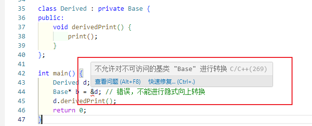
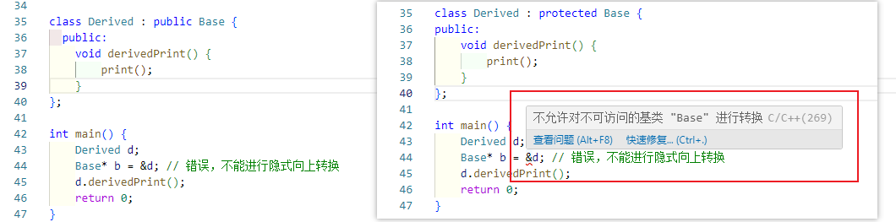
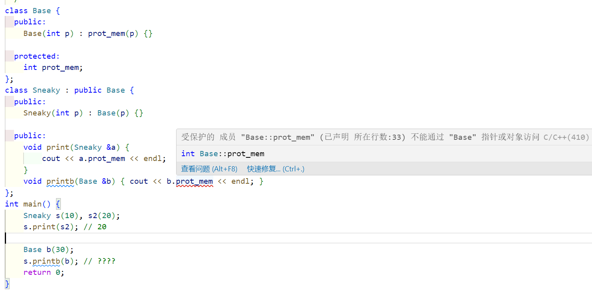
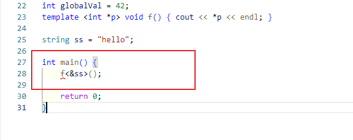
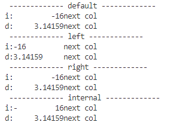
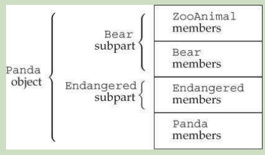
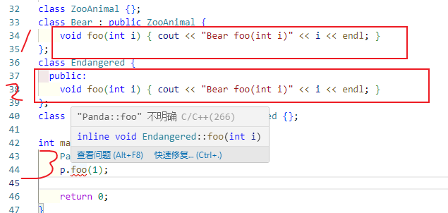
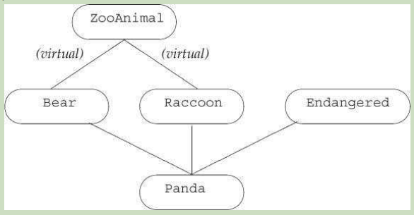

# ch11 关联容器

author: 使用, 概览, 操作, unordered

和序列容器对比, 一个基于位置, 一个基于key

关联容器的3个维度:

1. set还是map
2. 唯一key还是多个key
3. 有序还是无序


```c++ 
map;
set;
multimap;
multiset;

unordered_map;
unordered_set;
unordered_multimap;
unordered_multiset;
```

map和multimap定义在map头部

unordered_map和unordered_multimap定义在unordered_map头部


## 11.1 使用关联容器


## 11.2 概览

### 11.2.1 定义关联容器

定义关联容器, key类型要求, pair类型

```c++ 
map<string, string> authors = {{"Joyce", "James"}, {"Austen", "Jane"}};
```


### 11.2.2 key限制

作为key的类型默认使用 `<`


> 严格弱序

- 若a<b, 那么b不能小于a
- 若a<b, b<c 那么a必须小于c
- a不小于b, b不小于a, 那么a等于b


> 为key提供比较函数

```c++ 
bool compareIsbn(const Sales_data& lhs, const Sales_data &rhs){
    return lhs.isbn()<rhs.isbn();
}

multiset<Sales_data, decltype(compareIsbn)*> bookstore(compareIsbn);
```

提供类型信息和比较函数

当我们使用decltype去指定一个函数指针我们需要添加`*` 


### 11.2.3 The pair Type

pair定义在utility 头部

map中的元素就是pair

pair 的相关操作

```c++ 
pair<T1, T2> p;
pair<T1, T2> p(v1, v2);
pair<T1, T2> p = {v1, v2};
make_pair(v1, v2); // 类型推断, 根据v1, v2

p.first, p.second;
p1==p2 // first和second都相等
```


> 创建pair对象的函数

```c++ 
pair<string, int> process(vector<string> &v){
    if(!v.empty())
        return {v.back(), v.back().size()}; // 列表初始化
    else
        return pair<string, int>();
}

// 或者使用make_pair
if(!v.empty())
    return make_pair(v.back(), v.back().size());
```

make_pair不用写类型, 类型是编译器自己推断的


## 11.3 操作, 关联容器的

me: set判断存在性, map根据key存取

author: 迭代器, 添加元素, 删除元素, map下标, 访问呢元素, 单词map

可以看到我的思维方式就是, 对这个的仅有的记忆

```
key_type
mapped_type
value_type 对于set和key_type一致, 对于map是pair<const key_type, mapped_type>
```

value_type就是每个元素, value_type包含key_type和mapped_type

对于set来说, value_type和key_type是相同的

```c++ 
set<string>::value_type v1;//string
set<string>::key_type v2; //string
map<string, int>::value_type v3; // pair<const string, int>
map<string, int>::key_type v4; // string
map<string, int>::mapped_type v5; // int
```

v4为string不是const string?


### 11.3.1 关联容器迭代器

迭代器得到的是value_type, first是const key, second是value

我们不能改变key, 只能改变value


> set的key是const

所以set的迭代器只读

```c++ 
set<int> iset = {0,1,2,3,4,5,6,7,8,9};
set<int>::iterator set_it = iste.begin();
if(set_it!=iset.end()){
    *set_it = 42;// Error, set的key是read-only
}
```


> 遍历map

```c++ 
auto map_it = word_count.cbegin();
while(map_it!=word_count.cend()){
    cout<<map_it->first<<" occurs "
        <<map_it->second <<" times"<<endl;
    ++map_it;
}
```


### 11.3.2 添加元素

```c++ 
vector<int> ivec = {2,4,6,8, 2,4,6,8};
set<int> set2;
set2.insert(ivec.cbegin(), ivec.cend());
set2.insert({1,3,5,7,1,3,5,7});
```


```c++ 
c.insert(v);
c.emplace(args); // 对于set和map返回pair<iterator, bool>, 对于multimap和multiset返回iterator
```

返回的这个迭代器有什么用 ?

```c++ 
c.insert(b, e);
c.insert(il); // 对于set和map插入不重复的元素, 对于multimap和multiset插入所有元素, 返回void
```

返回void

```c++ 
c.insert(p, v);
c.emplace(p, args); // 暗示从p之后寻找插入的位置, 返回pair或iterator
```


> 添加元素到map

```c++ 
word_count.insert({word,1});
word_count.insert(make_pair(word, 1));
word_count.insert(pair<const string, int>(word, 1));
word_count.insert(map<string,int>::value_type(word, 1));
```

问题, map中的pair, 它的key是const

那么我插入pair的时候是不是要关心pair的key是const?


> insert的返回值

pair<iterator, bool>

- iterator 指向新插入的元素
- bool为true表示插入成功, false表示插入失败

```c++ 
string word;
while(cin>>word){
    auto res = word_count.insert({word, 1});
    if(!res.second)
        ++res.first->second; // res.first解引用为pair, 表示map的元素, pair再取second表示value_type
}
```


> res的类型

```c++ 
pair<map<string, size_t>::iterator, bool> ret;
```

ret 的first为迭代器, 解引用为pair, 表示map的value_type


> 添加元素到multimap或者multiset

因为允许重复, 所以总是插入成功, 返回插入元素的迭代器

```c++ 
multimap<string, string> authors;                  
authors.insert({"Barth, John", "Sot-Weed Factor"});
authors.insert({"Barth, John", "Lost in the Funhouse"});
```


### 11.3.3 删除元素

```c++ 
c.erase(k); // 按照key删除, 返回删除的数量
c.erase(p); // p是迭代器, 删除一个元素, 返回p后面的位置
c.erase(b, e);// 删除一个range, 返回e
```

居然还可以删除迭代器和range

是不是能判断两个迭代器相等?


### 11.3.4 下标一个map

map和unordered_map提供了下标访问和at访问

```c++ 
c[k]; // 返回k对应的元素, 不存在就插入
c.at(k); // 如果不存在返回out_of_range
```

因为`[]` 访问会插入元素, 所以我们只能在非const map上使用


### 11.3.5 访问元素

如果想判断元素是否在容器中, 使用find

```c++ 
c.find(k); // 返回迭代器
c.count(k); // 返回数量

c.lower_bound(k); // 返回迭代器, 第一个不小于k的元素
c.upper_bound(k); // 返回迭代器, 指向第一个大于k的元素
c.equal_range(k);
```

1,2,3,3,4,5 中lower_bound为第一个3, uppper_bound为4


> map中使用find而不是 `[]` 查找元素

```c++ 
if(word_count.find("foobar")==word_count.end())
```


> multimap或multiset中找元素

```c++ 
auto entries = authors.count(search_item);
auto iter = authors.find(search_item);
while(entries){
    cout<<iter->second<<endl;
    ++iter;
    --entries;
}
```


> 迭代器方案

```c++ 
for(auto beg = authors.lower_bound(search_item), auto end = authors.upper_bound(search_item); beg!=end; ++beg){
    cout<<beg->second<<endl;
}
```


> equal_range方案

```c++ 
for(auto pos = authors.equal_range(search_item);pos.first!=pos.second; ++pos.first){
    
}
```

可以直接++pos.first


## 11.4 无序容器

order使用compare组织元素

unordered使用hash函数和key的==操作符

```
c.bucket_count(); // 容器的bucket数量, 不只是包含元素的桶
c.max_bucket_count(); // 该容器最大可以容纳的桶数量
c.bucket_size(n); // 第n个bucket的元素数量
c.bucket(k); // 元素k所在的bucket
```

max_bucket_count 是什么意思?

一个固定上限, 当前系统资源所能容纳的最大桶数量

bucket_count 当前hash表中桶的数量

```
local_iterator // 用来访问bucket
const_local_iterator
c.begin(n), c.end(n); // 遍历第n个bucket
c.cbegin(n), c.cend(n); // const_local_iterator
```

上面的begin带了参数n, 表示第n个桶

```
c.load_factor() // 每个bucket的平均数量, float
c.max_load_factor() // 容器期望维护的平均尺寸
load_factor<=max_load_factor

c.rehash(n); // 调整使得bucket_count>=n, 且>=size/max_load_factor
c.reverse(n); // 不rehash的情况重新排列c使得能容纳n个元素
```

reverse 分配足够多的桶来避免rehash


> 无序容器的key要求

hash<key_type> 计算code

`==` 比较元素

```c++ 
size_t hasher(const Sales_data &sd){
    return hash<string>()(sd.isbn());
}
bool eqOp(const Sales_data &lhs, const Sales_data& rhs){
    return lhs.isbn()==rhs.isbn();
}

using SD_multiset = unordered_multiset<Sales_data, decltype(hasher)*, 
decltype(eqOp)*>;
SD_multiset bookstore(42, hasher, eqOp);
```

也就是可以自定义hash 和 ==


# ch12 动态内存

me: allocator, new placeholder, 智能指针, 

author: 动态内存智能指针, 动态数组, text-query


local static 对象在第一次使用前分配

目前我们只使用了static和stack memory

static: 

- 静态局部
- 全局变量
- 类的静态成员

stack

- 局部变量


## 12.1 动态内存智能指针

- new 分配内存, (可选初始化), 一个对象在动态内存中, 返回一个指针指向和这个对象
- delete 接受一个指针, 销毁对象, 释放内存


shared_ptr, unique_ptr, weak_ptr 在memory 头部


### 12.1.1 shared_ptr

make_shared, 拷贝赋值, 自动销毁,  自动释放, 类包含动态内存, StrBlob


```c++ 
shared_ptr<string> p1;
shared_ptr<list<int>> p2;
```

shared_ptr和unique_ptr的通用操作

```c++ 
shared_ptr<T> sp;
unique_ptr<T> up;

p; // 作为条件, 是否为空
*p; // 获取对象
p->mem; // 访问成员
p.get(); // 内部指针

swap(p, q); // 交换指针
p.swap(q);
```

shared_ptr独有的操作

```c++ 
make_shared<T>(args); 
shared_ptr<T> p(q); // increments the count in q
p = q; // p额数量-1, q的数量+1
p.unique(); // 如果p.use_count()==1 返回true
p.use_count(); // 慢操作, 和p一个共享对象的指针数量

```

use_count 原文是: 

returns the number of objects sharing with p


> make_shared

在动态内存中分配和初始化对象, 返回shared_ptr指向对象

make_shared 定义在memory中

```c++ 
shared_ptr<int> p3 = make_shared<int>(42);
shared_ptr<string> p4 = make_shared<string>(10, '9');
shared_ptr<int> p5 = make_shared<int>();
```

如果参数为空, 默认值初始化


> 拷贝赋值

```c++ 
auto p = make_shared<int>(42);
auto q(p); // p和q的计数器现在为2
```

赋值

```c++ 
auto r = make_shared<int>(42);
r = q;
```

r的计数器-1

q的计数器+1


> shared_ptr自动销毁对象

当指向对象的最后一个智能指针销毁, 智能指针会销毁它指向的对象

析构器: 销毁对象, 释放资源

shared_ptr析构器: 减少数量, 销毁对象, 释放资源


> 自动释放关联的内存

```c++ 
shared_ptr<Foo> factory(T arg){
    return make_shared<Foo>(arg);
}

void use_factory(T arg){
    shared_ptr<Foo> p = factory(arg);
} // p指向的内存自动释放
```

p被销毁, count减少, 


> 类资源具有动态生命周期

使用动态内存的场景

- 不知道数量, 
- 不知道类型
- 需要在多个对象之间共享数据


### 12.1.2 直接管理内存

new没有办法为对象命名, 指示返回对象的指针

```c++ 
int *pi = new int; // p指向未命名, 未初始化的int
```

new在heap上创建了一个int对象, 返回了指向这个对象的指针

动态分配的对象默认初始化

```c++ 
string *ps = new string; // 空string
 int *pi = new int; // undefined
```

直接初始化可以使用小括号或者列表

```c++ 
int *pi = new int(1024);
string *ps = new string(10, '9');
vector<int> *pv = new vector<int>{0,1,2,3,4,5,6,7,8,9};
```

没有携带小括号认为是默认初始化

```c++ 
string *ps1 = new string; // default
string *ps = new string();// value
int *pi1 = new int; // default
int *pi2 = new int(); // value
```

auto根据参数推断类型只能使用单参数

```c++ 
auto p1 = new auto(obj);
auto p2 = new auto{a, b, c};//error
```


> 动态分配常量对象

```c++ 
const int *pci = new const int(1024);
const string *pcs = new const string;
```

为什么new后面要添加const?

表示分配的是常量对象, 其成员不被修改


> 内存耗尽

堆内存不够, bad_alloc

```c++ 
int *p1 = new int;// 堆内存不够抛出bad_alloc
int *p2 = new(nothrow) int; // 不会抛出, 返回nullptr
```

bad_alloc和nothrow都定义在new 头部


> 释放动态内存

delete  接收指针, 销毁对象, 释放内存

```c++ 
delete p;
```


> 重置指针

危险指针: 曾经持有对象, 现在没有了

要么手动赋值为nullptr, 要么scope结束的时候delete

dangling pointer


### 12.1.2 使用shared_ptr和new

使用new创建的指针初始化智能指针

```c++ 
shared_ptr<double> p1;
shared_ptr<int> p2(new int(42));
```


定义或者改变shared_ptr的其它方式

```c++ 
shared_ptr<T> p(q); // q必须是new创建的指针, 指针必须能转为为T*
shared_ptr<T> p(u);// u是unique_ptr, 控制权交给p之后, u为null
shared_ptr<T> p(q, d); // q必须是new创建的指针, 使用d删除
// 以上q为built-in 指针

// 这里p2是智能指针
shared_ptr<T> p(p2, d); // p2是shared_ptr, 使用d删除

p.reset(); // p为null
p.reset(q); // p指向built-in指针q
p.reset(q, d);// p指向built-in指针q, 使用d删除
```

unique_ptr居然可以用来初始化shared_ptr


> 不要混淆普通指针和智能指针

> 不要使用get() 实例化另一个智能指针

> shared_ptr的其它操作

我们可以使用reset将shared_ptr绑定到新的指针

```c++ 
p = new int(1024);// error, 不能用普通指针初始化智能指针
p.reset(new int(1024)); // ok, p指向新的对象
```


> 和unique搭配使用, 独占才修改

```c++ 
if(!p.unique())
    p.reset(new string(*p));
*p += newVal; // 现在可以放心的修改了
```


### 12.1.4 智能指针和异常

智能指针就算异常退出, 内存也会被释放

```c++ 
void f(){
    shared_ptr<int> sp(new int(42));
    // 异常
} // 内存会被释放
```


### 12.1.5 unique_ptr

```c++ 
unique_ptr<T> u1; // 空的unique_ptr
unique_ptr<T, D> u2;// 空的unique_ptr, 使用D类型的对象删除

unique_ptr<T, D> u(d); // 空的unique_ptr
u = nullptr; // 释放对象, 使得u为null
u.release(); // 返回对象, 使得u为null

u.reset(), u.reset(nullptr); // 释放对象, 使得u为null
u.reset(q); // u管理新的对象q
```


为什么shared_ptr没有 sp =nullptr, sp.release()?

有sp=nullptr, 但是没有release()

为什么没有release()?

多个shared_ptr同时管理对象, 不需要release方法, 直接赋值就行了


> unique_ptr可以转移控制

```c++ 
unique_ptr<string> p2(p1.release()); // makes p1 null
unique_ptr<string> p3(new string("Trex"));
p2.reset(p3.release()); // 删除p2的内存
```


> unique_ptr作为返回值

虽然unique_ptr不能拷贝, 但是将要销毁的unique_ptr是可以拷贝的

```c++ 
unique_ptr<int> clone(int p){
    return unique_ptr<int>(new int(p));
}
```

这里, 编译器知道它将要销毁, 所以允许拷贝


> 传递deleter到unique_ptr

```c++ 
unique_ptr<objT, delT> p(new objT, fcn);
```

fcn的类型为delT

传递delT会影响unique_ptr的类型


### 12.1.6 weak_ptr

weak_ptr指向一个对象, that is managed by a shared_ptr

weak_ptr绑定到shared_ptr不会改变shared_ptr的counter

```c++ 
weak_ptr<T> w;
weak_ptr<T> w(sp);

w = p; // p可以是weak_ptr或者shared_ptr

w.reset(); // makes w null
w.use_count(); // 
w.expired(); // w.use_count()为0时返回true
w.lock(); // 返回shared_ptr或者null
```

cc: 使用shared_ptr初始化weak_ptr

weak_ptr要操作对象必须先获取shared_ptr, w.lock()得到, 


## 12.2 动态数组

author: new , allocator class


### 12.2.1 new和array

author: 分配, 初始化, 空数组, 释放, 智能指针

```c++ 
int *pia = new int[get_size()];

// 使用别名
typedef int arrT[42];
int *p =new arrT;
int *q = p;
```


> 分配一个数组, 返回一个到元素类型的指针

不存在array类型

因为没有数组类型, 所以不能调用begin或者end在一个动态数组上


> 初始化数组, 容纳动态分配的对象

new不管创建对象还是数组都是默认初始化, 除非提供了`()` 

```c++ 
int *pia = new int[10]; // 10个未初始化的int
int *pia2 = new int[10](); // 10个0

string *psa = new string[10]; // 10个空string
string *psa2 = new string[10](); // 10个空string

// c++ 11
int *pia3 = new int[10]{0,1,2,3,4,5,6,7,8,9};
string *psa3 = new string[10]{"a", "an", "the", string(3, 'x')};
```

如果列表超过长度抛出bad_array_new_length


> 动态分配空数组合法

```c++ 
char arr[0]; // error, 不能定义0长度的array
char *cp = new char[0]; // ok, 但是不能解引用
```

当我们new分配一个size为0的数组, new返回一个有效的指针

这个指针就像是off-the-end pointer


> 释放动态数组

```c++ 
delete p; // p指向动态分配的对象或者null
delete [] pa; // pa指向动态分配的数组或者null
```


> smart指针和动态数组

```c++ 
unique_ptr<int[]> up(new int[10]);
up.reset();
```

可以使用下标访问元素

```c++ 
for(size_t i =0; i!=10; ++i)
    up[i] = i;
```

unique_ptr操作

```c++ 
unique_ptr<T[]> u;
unique_ptr<T[]> u(p); // p必须要能转化为T*

u[i];
```


> 使用shared_ptr, 需要自己提供deleter

```c++ 
shared_ptr<int> sp(new int[10], [](int *p){delete[] p;});
sp.reset(); // 使用lambda销毁对象, 释放内存

// 因为shared_ptr没有提供数组访问的方法所以,
for(size_t i =0; i!=10; ++i)
    *(sp.get()+i) = i;
```

因为smart指针不支持数学运算, 所以只能使用内部指针


### 12.2.2 allocator类

new的不灵活性体现在, 它将分配内存, 构造对象绑定在一起了

有时候我们希望在需要的时候再来构造对象, 例如数组

```c++ 
string *const p = new string[n]; // 构造了n个空strings
string s;
string *q = p;
while(cin>>s && q!=p+n){
    *q++ = s;
}
const size_t size=q-p; // 记住我们读取了多少string
delete [] p;
```

主要的浪费在于, 我们创建了不需要的元素

并且没有默认构造器不能分配数组


> the allocator 类

allocator类定义在memory 头部

it provides type-aware allocation of raw, unconstructed, memory.

- type-aware
- raw
- unconstructed

```c++ 
allocator<T> a; // 
a.allocate(n); // 分配n个, raw, unconstructed 内存容纳n个元素
a.deallocate(p, n); // p是allocate返回的, n是allocate参数, 调用之前用户必须手动销毁每个对象
a.construct(p, args); // p指向raw memory
a.destroy(p); // 运行p指向的对象的析构器
```


> allocator 分配没有构造的内存

allocator分配的内存是raw, unconstructed

construct 成员接收一个指针和一些参数, 在指定的位置上创建元素

```c++ 
auto q = p;
alloc.construct(q++); // *q是空string
alloc.construct(q++, 10, 'c');// *q是10个c
alloc.construct(q++, "hi");// *q是hi
```

释放内存之前必须手动销毁每个对象

```c++ 
while(q!=p){
    alloc.destroy(--q); // 销毁对象
}
```

销毁对象之后, 我们可以重新利用这些内存或者返回给系统

```c++ 
alloc>deallocate(p,n);
```


> 拷贝和填充未初始化的内存

```c++ 
// 这些算法在目的地构造元素, 而不是拷贝
// b2必须是没有构造的内存
uninitialized_copy(b, e, b2); // range的元素拷贝到b2
uninitialized_copy(b, n, b2);

uninitialized_fill(b, e, t); // t填充range
uninitialized_fill(b, n, t); // t填充b开始的n个元素

auto p = alloc.allocate(vi.size()*2);
auto q = uninitialized_copy(vi.begin(), vi.end(), p);
uninitialized_fill(q, vi.size(), 42);
```


## 12.3 A Text-Query


# ch13 拷贝控制

拷贝构造, 赋值, 移动构造, 赋值

author: 拷贝赋值析构, 拷贝控制和资源管理, swap, 例子, 动态内存, 移动对象

资源管理, swap, 动态内存

资源管理和动态内存不是重复了吗?


## 13.1 拷贝控制

author: 拷贝构造, 拷贝赋值, 析构, 3/5, =default, 阻止拷贝

3/5是撒?


### 13.1.1 拷贝构造

拷贝构造器特征

- 第一个参数是类引用
- 剩余的参数有默认值

```c++ 
class Foo{
    public:
    Foo();
    Foo(const Foo&); // 拷贝控制
};
```

不能是explicit, 否则无法完成拷贝构造

explicit不是能用小括号调用吗?

```c++ 
class Foo {
  public:
    string s;
    Foo() = default; // 默认构造函数
    Foo(string t) : s(t) {};
    explicit Foo(const Foo &) = default; // 拷贝控制
};

int main() {
    Foo f1("hello");
    // Foo f2 = f1; // 无法调用拷贝构造
    Foo f2(f1); // 调用拷贝构造函数

    cout << f2.s << endl; // hello
    return 0;
}
```

可以使用explicit, 只是不建议使用


> 使用拷贝初始化的场景

- =
- 函数形参, 非引用情况
- 函数返回值, 非引用情况
- 大括号初始化数组元素或者聚合类

insert和push是拷贝初始化,emplace是直接初始化


explicit不允许地下交易


### 13.1.2 赋值操作符

赋值操作符特征

- 名称`operator=`
- 参数`const Foo&`
- 返回值 `Foo&`

```c++ 
class Foo{
    public:
    Foo& operator=(const Foo&); // 赋值操作符
}
```

为了和built-in 类型保持一致, 返回左手操作数的引用


### 13.1.3 析构器

析构器特征

- `~` 符号
- 没有参数
- 不能被重载

```c++ 
class Foo{
    public:
    ~Foo();
}
```


> 析构函数的执行顺序

1. 函数的body先执行
2. 成员逆序销毁


> 析构器调用的场景

- 变量离开作用域
- 对象的成员在对象销毁时
- 容器成员在容器销毁时
- delete
- 临时变量在表达式末尾

临时变量在表达式末尾执行析构器如何理解?

```c++ 
TempClass(); // 比如这里创建一个对象不接收, 这句话执行完成对象就销毁了
```


### 13.1.4 3/5规则

> 需要析构通常需要拷贝和赋值

? 为什么呢?

说明普通析构不能完全销毁成员, 那么拷贝和赋值通常会功能不完善


> 需要赋值通常需要拷贝, 反过来也是

拷贝赋值和拷贝构造总是同时存在, 甚至可以没有析构


### 13.1.5 =default

=default 默认为 inline

如果我们不希望是inline, 我们可以把=default放在定义上


### 13.1.6 阻止拷贝

形参列表后面跟上一个=delete

```c++ 
NoCopy() &operator(const NoCopy&)=delete;
```

A deleted function is one that is declared but may not be used in any other way.

`=delete`  告诉编译器我们不会定义这些成员

`=delete` 必须出现在第一次声明上, 因为他是阻止使用


> 析构器不能是delete

否则我们不能创建一个这样的变量


> 拷贝控制成员可能被合成为delete

- 析构器是delete, 只要某个成员的析构器是delete或者private
- 拷贝构造是delete, 只要某个成员的拷贝构造是delete或者private, 或者析构是delete或者private
- 拷贝赋值是delete, 只要某个成员的拷贝赋值是delete或者private, 或者具有const或引用成员
- 默认构造器是delete, 只要某个成员的析构是delete或private
  - 或有一个引用没有内置初始化器
  - const成员没有定义默认构造器且没有内置初始化器

cc: const成员只是没有内置初始化器的化没有问题, 会默认初始化一个, 如果再没有默认构造器就没得搞了

析构是否可访问不影响拷贝赋值

因为拷贝赋值没有创建新的对象


易错点: 析构不影响赋值, const和引用才影响


## 13.2 拷贝控制和资源管理

author: 像值的类, 像指针的类

值拷贝: 两个独立的对象, 相互不影响, 比如string

指针拷贝: 共享状态, 比如shared_ptr


### 13.2.1 value like

value like

- 拷贝构造, 拷贝string, 不是指针
- 析构器, 释放string
- 拷贝赋值, 释放左手string, 拷贝右手操作数


### 13.2.2 pointer like


## 13.3 Swap


## 13.4 copy-control example


## 13.5 管理动态内存


## 13.6 移动对象

右值引用, 必须绑定到右值

右值是一个即将销毁的对象


### 13.6.1 右值引用

右值引用的关键特征: 只能绑定到一个将要销毁的对象

右值和左值只是表达式的一个属性而已 

我们不能把普通引用绑定到

1. 需要转换的对象
2. 字面量
3. 返回右值的表达式

```c++ 
int i = 42;
int &r = i; // ok
int &&rr = i; // error: 不能绑定右值引用到左值

int &r2 = i*42; // Error: i*42是一个右值
const int &r3 = i*42; //  ok: 常量引用可以绑定右值
int &&rr2 = i*42; // ok
```


可以绑定左值的表达式

- 返回左值引用的函数
- 下标
- 解引用
- 前缀递增, 递减
-  赋值

赋值如何理解?

赋值操作返回左值的引用


可以绑定右值引用的表达式

- 函数返回非引用类型
- 数学运算
- 关系运算
- 位运算
- 后缀递增, 递减


> 变量是左值

```c++ 
int &&rr1 = 42;//ok
int &&rr2 = rr1;// error, rr1是一个左值
```


> move函数

右值引用不能直接绑定到左值

```c++ 
int &&rr3 = std::move(rr1); // ok
```

move告诉编译器我们有一个左值, 我们希望把它变成右值


### 13.6.2 move构造和赋值

他们从给定对象那里盗取资源, 而不是拷贝资源


> noexcept

声明和定义都要加上noexcept

```c++ 
class StrVec{
    public:
    StrVec(StrVec&&) noexcept; 
};

StrVec::StrVec(StrVec &&s) noexcept:/*成员初始化*/{
    // body
};
```


> 合成移动操作

只要定义了赋值拷贝, 构造拷贝, 析构器中的任何一个, 编译器都不会合成构造移动, 赋值移动


移动操作不会隐式定义为deleted

除非我们在移动操作上显示添加`=default` 让编译器帮我们合成, 且编译器不能合成的时候

- 某个成员的移动操作为delete
- 某个成员定义了拷贝操作但是没有定义移动操作
- 构造移动为delete, 如果析构器是delete
- 赋值移动为delete, 如果某个成员为引用或者const


### 13.6.3 右值引用和成员函数

```c++ 
void push_back(const X&);
void push_back(X&&);
```

push_back的参数为什么是一个常量引用?

既然是引用, 如果对象被销毁了呢?

里面会存放副本, 所以被销毁了也没关系


> 引用限定符

放在参数列表后面, 表示this指向左值还是右值

```c++ 
// 避免i+j=4的情况, 强制左手操作数为左值
class Foo{
    public:
    Foo &operator=(const Foo&) &;
};
```

如果有const , 引用限定符要放在const之后

```c++ 
Foo anotherMem() const &;
```


> 函数重载

```c++ 
class Foo{
    public:
    Foo sorted()&&; // 运行于可修改的右值上
    Foo sorted() const &; // 运行于任何Foo上
    private:
    vector<int> data;
};
```

为什么可运行于任何Foo上?

有了const修饰符, 普通Foo和const Foo都可以调用


加了引用限定符有什么区别呢?

如果没有右值版本, 右值可以调用左值的吗?

```c++ 
// 对象是右值, 所以可以原地排序
Foo Foo::sorted() &&{
    sort(data.begin(), data.end());
    return *this;
}

// 对象是左值或者const , 都不能原地排序
Foo Foo::sorted() const &{
    Foo ret(*this);
    sort(ret.data.begin(), ret.data.end());
    return ret;
}
```

为什么左值不能原地排序?

cc: 可以看到左值依然搭配了const, 右值没有搭配const

因为该对象可能被其他变量引用


为什么相同名字的函数一个有引用限定符, 另一个必须要有?

```c++ 
Foo sorted() &&;
Foo sorted() const; // Error, 必须有限定符
```

没有引用限定符的函数既可以被左值对象调用, 也可以被右值对象调用


# ch14 重载操作和转换

author: 基本概念, 输入输出, 数学和关系, 赋值, 下标, 递增递减, 成员访问, 函数调用, 重载转换操作


> 定义了操作符和没有定义操作符的区别

```c++ 
// Sales_item
cout<<item1+item2;
// Sales_data
print(cout, add(data1, data2));
```


## 14.1 基本概念

operator后面跟一个符号

如果操作数是一个成员函数, 第一个操作数被绑定到this指针

operator function条件:

- 要么为成员函数
- 要么有一个成员是类类型

```c++ 
int operator+(int, int); // Error, 不能重定义内置类型的操作符
```


操作符

```
+ - * / % & | ~ ^ << >> 11个
+= -= *= /= %= &= |= ^= >>= <<= = 11个
< <= > >= == != 6个
! , 2个
[] () -> ->* 4个
new new[] delete delete[] 4个
&& || ++ -- 4个
```


> 直接调用操作符

```c++ 
data1+data2;
operator+(data1, data2); // 等价形式
```


成员操作函数

```c++ 
data1+=data2;
data1.operator+=(data2);
```

绑定this到data1的地址, data2作为实参传递


> 有些操作符不应该被重载

&& || 取址 逗号


> 成员还是非成员

- =, [], (), -> 必须为成员
- 复合赋值, 建议是成员
- 递增,递减, 解引用, 应该是成员
- 数学, 相等判断, 关系, 位运算, 通常是非成员


数学运算如果定义为成员, 那么左手操作数必须是包含这个成员的对象

```c++ 
// 就会造成
"hi"+s; //error
s+"hi";// ok
```

实际上他们都应该ok


## 14.2 输入输出操作符

### 14.2.1 输出操作<<

输出操作的第一个参数是: a reference to nonconst ostream object

到非常量输出流对象的引用

第二个参数: a reference to const of the class type

返回ostream 形参


> Sales_data的输出操作符

```c++ 
ostream &operator<<(ostream &os, const Sales_data &item);
```


> io操作不能是成员函数

如果是成员函数

```c++ 
Me << me;
```

必须要继承ostream

签名就变成了这样

```c++ 
ostream& operator<<(const Sales_data &item);
```

this 是Sales_data类型的对象

成员函数要求左手操作符必须为this, 输出操作符要求左手操作数必须为ostream, 矛盾


### 14.2.2 重载输入操作符 >>

哈哈

输入操作符的第二个参数不是const, 而是 a reference to nonconst

因为要写入数据


> 指示错误

通常只应该设置failbit , 把其他留给io库自己


## 14.3 数学和关系操作符

通常定义为非成员函数, 目的是为了让任一个参数转换

因为不需要改变参数, 所以通常是 reference to const


### 14.3.1 相等操作符

```c++ 
bool operator==(const Sales_data  &lhs, const Sales_data &rhs);
```

根据`==` 定义`!=`


### 14.3.2 关系操作符


## 14.4 赋值操作符


## 14.5 下标操作符

必须是成员函数, 通常返回一个引用


## 14.6 递增递减操作符

```c++ 
StrBlobPtr& operator++();// 前缀版本
StrBlobPtr& operator--();
```


## 14.7 成员访问操作符

```c++ 
string& operator*() const{}
string* operator->() const{}
```


## 14.8 函数调用操作符

### 14.8.1 lambda是函数对象


### 14.8.2 库函数对象


### 14.8.3 可调用对象和函数

> 库函数类型

```c++ 
function<T> f;
function<T> f(nullptr); // 显示构造空函数
function<T> f(obj); // obj是一个克调用对象
f; // 使用f作为条件, 如果f不是空函数返回true
f(args); // 使用args 调用函数

// 类型成员
result_type;
argument_type;
first_argument_type;
second_argument_type;
```

argument_type是撒?

只有一个参数的时候才有意义, 等价于first_argument_type

两个参数的时候就没有意义了

```c++ 
function<int(int, int)> f1 = add;
function<int(int, int)> f2 = div();
function<int(int, int)> f3 = [](int i, int j){return i*j;};
```

不在乎你有多少, 而在乎有没有可以存的, 有没有可以分享的


## 14.9 重载转化和操作符

这个主题如何理解? 分为

- 重载
- 转化
- 操作符

3个主题吗?


类型转换: operator type() const 这里符号变成了type, 并且为const

类自身决定可以转化为什么样的类型

重载: 内置操作符和重载操作符之间消除歧义, 方法是不可以既能使用内置也可以使用重载


模糊的概念:

第一: 类型转换和构造之间的模糊

A可以通过B构造, B定义了转化为A的操作符, 那么需要A的时候提供B 就会模糊

第二: 内置操作符和重载操作符之间的模糊

si+0; 到底是内置还是重载


### 14.9.1 类型转换

```c++ 
operator type() const;
```

除了转化为数组, 其它都能转化

const 成员函数

没有返回值没有参数列表


explicit conversion operator 在什么条件下隐式转换?

- 条件 if, while, do
- for
- !, ||, &&
- ?:


### 14.9.2 避免模糊转换

模糊的情况

- 同时定义了来和去
- 定义了两个数学类型, (数学类型之间可以相互转换)


> 定义了来和去

```c++ 
struct B;
struct A{
    A() = default;
    A(const B&);
};

struct B{
    operator A() const;
};

A f(const A&);
B b;
A a = f(b);//Error
```

类B 定义了类型转换成员函数, 可以转化为A

类A 定义了构造函数, 可以根据B构造

此时如果在需要A的地方传递了B, 到底是调用A的构造, 还是B的转换?

```c++ 
// 显示调用
A a1 = f(b.operator A()); // 调用b的转换
A a2 = f(A(b)); // 调用A的构造
```


为什么是const?

因为转换为别人不应该改变自己


> 用户自定义的转换, 优先级相同

```c++ 
struct E{E(double);};
struct C{C(int);};

void manip2(const C&);
void manip2(const E&);

manip2(10);//Error
```

10到C到E都需要经过用户自定义的转换

10构造C的代价, 直接构造

10构造E的到家, int转化double, 然后直接构造

表面看起来, 到E的路径更长, 实际上都是用户自定义转换, 优先级一样

作者怎么能想到这种问题?


### 14.9.3 函数匹配和重载操作符

操作符的一个操作数是类类型, 重载的内置的2种操作符都可能成为候选函数

如果左手操作数是类类型 重载的版本, 那个类定义的, 也被包含

什么叫那个类定义的?

后面这句话不是跟前面的语义重复了?

除非后面指的是成员函数


无法区分成员和非成员

如果既可以使用内置的操作符, 也可以使用重载的操作符

```c++ 
SmallInt s1;
int i = s1+0; // 
```

因为smallInt也可以转化为int, int 也可以转换为smallInt

所以就不知道调用内置的+, 还是smallInt定义的 +


# ch15 面向对象编程

封装, 继承, 多态

封装: private

继承: 

多态: 虚函数, pure函数


author: 概览, 基类和衍生类, 虚函数, 抽象基类, 访问控制和继承, 继承之下的类作用域, 构造器和拷贝控制, 容器和继承, text quey

抽象基类, 类作用域, 容器和继承


## 15.1 概览


> 继承

虚函数, 基类的virtual 对应于派生类的override

```c++ 
class Quote{
    public:
    string isbn() const;
    virtual double net_price(size_t n) const;
};

class Bulk_quote: public Quote{
    public:
    double net_price(size_t) const override;
};
```

基类头部的virtual 对应于派生类尾部的override

我们可以把Bulk_quote当成Quote使用


> 动态绑定
>
> 两个条件: 引用或者指针, 虚函数

动态绑定发生在: 虚函数被引用或者指针调用

```c++ 
double print_total(ostream &os, const Quote &item , size_t n){
    double ret = item.net_price(n);
    
    return ret;
}

print_total(cout, basic, 20); // Quote版本
print_total(cout, bulk, 20); // Bulk_quote版本
```

因为item是引用, 所以Quote和Bulk_quote都可能

因为net_price是虚函数, 所以调用net_price的对象根据item的类型决定


## 15.2 定义基类和衍生类

### 15.2.1 定义基类

virtual 只在class body里面出现, 任何非静态函数, 除了构造函数都可以声明为virtual

非virtual函数在编译时确定


### 15.2.2 定义衍生类

衍生列表中, 每个类都需要跟一个访问指示符

衍生列表必须声明每一个它想要重载的虚函数

```c++ 
class Bulk_quote:public Quote{
    double net_price(size_t) const override;
};
```

衍生列表的访问指示符有什么作用?

如果是private, 对于父类的public和protected成员, 全部变成了派生类的private 成员, 只有派生类的成员函数可以访问, 派生类的用户以及派生类的派生类都无法访问这些成员

如果是protected, 父类的public和protected成员全部变成了派生类的protected成员, 派生类的外部不能访问, 但是派生类的派生类可以访问


> 衍生到基类的转换

衍生类通常包含2个以上子对象: 自己的, 父类的

我们可以绑定一个基类引用或者指针到一个衍生对象的基类部分

```c++ 
Quote item;
Bulk_quote bulk;
Quote *p = &item;
p = &bulk; // p指向bulk的Quote部分
Quote &r = bulk; // r绑定到bulk的Quote部分
```

基类的引用或者指针被需要的地方, 可以是衍生类的引用或者指针

衍生到基类的转换是隐式的

核心: 派生类对象包含基类子对象

如果是private继承呢?

private继承只是保护了成员的访问, 还是也保护了基类对象的访问?




那么protected可以吗?



protected也不行, 只有public 才可以


对于那些理解的很透彻的知识点, 我想记录下来, 整理出来, 即使很久不见, 也会一见如故


> 衍生类构造器

派生类不能直接初始化基类成员, 只能通过基类构造器

每个类自己控制成员的初始化

```c++ 
Bulk_quote(const string& book, double p, size_t qty, double disc):Quote(book, p), min_qty(qty), discount(disc){}
```

Quote构造器初始化Bulk_quote的基类部分

基类初始化在派生类成员初始化之前


> 继承静态成员

如果基类有一个静态成员, 整个层级只有一个静态成员

```c++ 
class Base{
    public:
    static void statmem();
};
class Derived: public Base{
    void f(const Derived&);
};
```

静态成员的访问

```c++ 
// 类访问, 对象访问, 直接访问
void Drived::f(const Derived &derived_obj){
    Base::statmem();
    Derived::statmem();
    derived_obj.statmem();
    statmem();
}
```


> 作为基类的类

普通类成为基类之前, 必须被定义

所以一个类不能是自己的基类


> 阻止继承

final关键字

```c++ 
class NoDerived final{}
```


### 15.2.3 转换和继承

可以使用Quote& 引用Bulk_quote对象

可以使用Quote& 指向&Bulk_quote的地址

当我们使用一个基类的指针或者引用, 他可能指向一个衍生类

智能指针也支持衍生到基类的转换


> 静态类型和动态类型

静态类型编译时知道

动态类型运行时知道

一个既不是引用也不是指针的表达式, 动态类型==静态类型

指向基类型的引用或者指针, 它的静态类型和动态类型可能不一致


> 没有基类到衍生类的转换

```c++ 
Bulk_quote bulk;
Quote *itemP = &bulk;
Bulk_quote  *bulkP = itemP; // Error
```


> 也没有对象之间的转换


## 15.3 虚函数

动态绑定的两个条件

1. 虚函数
2. 引用或指针


> 虚函数的调用运行时决定


> 衍生类中的虚函数

衍生类可以不用重复virutal关键字

衍生类的函数签名和基类严格一致, 但返回值如果是指针, 可以是衍生类指针

也就是D继承B, 基类返回D* 那么衍生类可以返回`B*`


> final和override 指示符

如果名字相同, 参数列表不同, 不能叫做override

所以提供override , 让编译器帮我们检查

只有虚函数可以使用override标记


> 虚函数和默认实参

派生类的默认参数最好与基类保持一致

因为及时运行的是衍生类版本, 默认值依然是基类定义的

默认参数是静态类型定义的

比如基类定义di=3, 衍生类定义di=4, 虚函数+引用的动态绑定, di是多少?

是3, 是基类定义的值!!!


> 如果避免动态绑定?

```c++ 
double undiscounted = baseP-> Quote::net_price(42);
```


## 15.4 抽象基类


> pure 虚函数

pure virtual和普通virtual的区别

pure virtual 可以不定义

=0 只出现在class body之中

```c++ 
double net_price(size_t) const =0;
```

如果要给pure virtual 提供函数体, 必须在class body之外


> 有pure virtual的类是抽象基类

我们不能直接创建抽象基类对象

只能创建派生类对象, 

派生类要么实现pure virtual函数, 要么也是一个抽象基类


> 衍生类只初始化直接基类

```c++ 
Bulk_quote(const string& book, double price, size_t qty, double disc):Disc_quote(book, price, qty, disc){}
```


## 15.5 访问控制和继承

> 受保护成员

- 和private一样, 用户不能看
- 和public一样, 可以被衍生类的成员和友元访问
- 衍生类的成员和友元只能通过衍生的对象访问

```c++ 
class Base{
    protected:
    int prot_mem;
};
class Sneaky: public Base{
    friend void clobber(Sneaky&); // 能访问Sneaky::prot_mem
    friend void clobber(Base&); // 不能访问 Base::prot_mem
    int j;
};

// ok
void clobber(Sneaky &s){s.j = s.prot_mem =0;}
// error
void clobber(Base &b){b.prot_mem =0;}
```

如何理解?

虽然sneaky通过public继承了Base, 友元和成员函数能访问Base的protected成员

当通过形参传递进来的时候, 有了细微的差别?

自己的父亲的protected成员能访问, 朋友的父亲的protected成员能访问吗?

在Sneaky的成员函数内访问, 朋友的父亲的protected成员, 和在main函数中访问有什么区别?


> Sneaky的成员函数, 接收Sneaky参数a, 能访问a的protected成员吗?

```c++ 
class Base {
  public:
    Base(int p) : prot_mem(p) {}

  protected:
    int prot_mem;
};
class Sneaky : public Base {
  public:
    Sneaky(int p) : Base(p) {}

  public:
    void print(Sneaky &a) { cout << a.prot_mem << endl; }
};
int main() {
    Sneaky s(10), s2(20);
    s.print(s2); // 20
    return 0;
}
```

为什么s能访问s2的prot_mem?


不能访问b的prot_mem

自己的成员函数不仅能访问自己的所有私有成员, 父类子对象的所有protected及以上成员, 还能访问兄弟的私有, 兄弟的受保护成员

```c++ 
void print(Sneaky &a) {
    cout << a.prot_mem << endl; // 兄弟的父亲的保护成员
    cout << a.priv_mem << endl; // 兄弟的私有
}
```

也就是通过形参将Sneaky传递到这个上下文, 和传递到main的上下文中是不一样的

在Sneaky的成员函数内, 可以访问其它Sneaky的所有成员包括私有的


为什么Sneaky a 能访问 Sneaky b的私有成员?

Sneaky a能不能访问b 是b的类说了算

也就是Sneaky说了算

Sneaky说, 在成员函数内, 别的Sneaky对象能访问所有的成员

类对象之间可以相互访问私有成员


那么Sneaky能不能访问基类的protected成员呢?

```c++ 
void printb(Base &b) { cout << b.prot_mem << endl; }
```

这是Base说了算

Base只是说了Base类的所有对象之间可以相互访问

Sneaky又不是Base的友元

Sneaky继承Base只是说明了, Sneaky包含了Base的一个子对象

既然Base成为了Sneaky 的一部分呢, 那么Sneaky对象之间当然可以相互访问, 但是只能通过Sneaky对象

printb传递进来的Base是一个单独的对象, 并不是哪个兄弟Sneaky的子对象

谁能访问一个类A, 是A说了算?


> public, private, protected继承

只要理解了, 基类成员变成了派生类成员, 访问修饰符通过`&` 操作得到即可

- public 111
- protected 11
- private 1

如果只是变成了派生类成员, 那么基类的友元还能访问派生类中的基类子对象吗?

那就要问能不能访问派生类中的基类子对象是谁说了算?

是派生类说了算, 还是派生类的基类子对象说了算?


> 友元和继承

```c++ 
class Base{
    friend class Pal;
};

class Pal{
    public:
    int f(Base b){return b.prot_mem;} //ok
    int f2(Sneaky s){return s.j;} // error, Pal不是Sneaky友元
    int f3(Sneaky s){return s.prot_mem;};// ok, Pal是Base的友元, 可以访问Sneaky内部的Base部分
}
```

Pal是Base的友元, 所以Pal可以访问Base对象的成员, 

That access includes access to Base objects that are embedded in an object of a type derived from Base.


> using 绕开访问性

```c++ 
class Base{
    public:
    size_t size() const {return n;}
    protected:
    size_t n;
};

class Derived:private Base{
    public:
    using Base::size;
    protected:
    using Base::n;
};
```

using 调整了size和n的可访问性


## 15.6 类作用域与继承

衍生类作用域嵌套在基类里面

名称查找发生在编译时

衍生类的同名成员会覆盖基类


除了虚函数, 衍生类最好不要与基类共用相同的名字

名称查找发生在类型检查之前


## 15.7 构造器和拷贝控制

### 15.7.1 虚构造器

```c++ 
class Quote{
    public:
    virtual ~Quote()=default;
}
```

为了派生类能清理自己的资源


> 关闭move合成

如果定义了析构器, 编译器就不会为这个类合成移动操作


### 15.7.2 合成拷贝控制

- 如果基类的默认构造, 拷贝构造, 拷贝赋值, 析构器是delete或者不可访问, 那么对应衍生类的就为delete, 因为如果衍生类不能调用基类的默认构造, 拷贝构造, 拷贝赋值, 析构器, 那么衍生类就不能调用自己的
- 如果基类的析构器不可访问, 那么衍生类的默认构造, 拷贝构造将不可访问, 因为无法销毁衍生对象的基类部分
- 编译器不会合成删除的移动操作, 除非我们使用=default, 使用了=default, 基类的对应成员不可访问, 衍生类也不可访问. 并且如果基类的析构器不可访问, 衍生类的移动构造不可访问.


### 15.7.3 衍生类拷贝控制


### 15.7.4 继承的构造器

对于基类中的每个构造器, 使用using后, 编译器都会为衍生类合成相同版本的默认构造器

```c++ 
class Bulk_quote: public Disc_quote{
    public:
    using Disc_quote::Disc_quote;
}
```


## 15.8 容器和继承


# ch16 模板和泛型编程

me: 定义模板, 参数推断, 可变模板, 模板专业化

author: 定义模板, 参数推断, 重载和模板, 可变模板, 模板专业化

重载和模板不熟悉


## 16.1 定义模板


### 16.1.1 函数模板

```c++ 
template <typename T> int compare(const T& v1, const T &v2){
    if(v1<v2) return -1;
    if(v2<v1) return 1;
    return 0;
}
```

template + 模板参数列表

模板参数列表在编译时确定


> 实例化函数模板

当我们使用函数模板的时候, 编译器根据参数推断模板参数类型

```c++ 
compare(1, 0);// T is int
```


编译器实例化模板, 就是用模板实参替换模板形参

cc: 模板实参这里是类型不是值

```c++ 
compare(1, 0); // int compare(const int&, const int&)

vector<int> vec1{1,2,3}, vec2{4,5,6};
compare(vec, vec2); // int compare(const vector<int>&, const vector<int>  &)
```

编译器将实例化两个版本的compare

编译器生成的函数叫做模板的实例化

模板->模板实例化

T->int


> 非类型的模板形参

必须是常量表达式

```c++ 
template<unsigned N, unsigned M>
int compare(const char (&p1)[N], const char (&p2)[M]){
    return strcmp(p1, p2);
}
compare("hi", "mom");
// 
int compare(const char(&p1)[3], const char (&p2)[4]);
```

可以是整型, 指针, 或者引用


> 非类型模板形参为指针

```c++ 
int globalVal = 42;
// 对于函数模板来说, 从模板得到的参数和函数列表得到的参数差不多
template <int *p> void f() { cout << *p << endl; }

int main() {
    // 对于函数调用来说, 
    f<&globalVal>();

    return 0;
}
```

什么意义呢? 还不如当成形参传递

编译时就知道了类型, 提高运行时速度



编译时就检查到了错误


> 模板编译

编译器实例化一个模板只当我们使用它的时候


### 16.1.2 类模板

> 定义类模板

```c++ 
typename <typename T> class Blob{}
```


> 实例化类模板

```c++ 
Blob<int> ia;
```


> 类模板和友元

友元非模板, 所以实例的访问权限

友元模板, 所有实例或者部分实例的权限

```c++ 
template <template T> class Pal;
class C{
	// Pal的Pal<C> 实例才是友元, 需要提前声明
    friend class Pal<C>;
    
    // Pal2的所有实例都是C的友元, 不需要提前声明
    template<typename T> friend class Pal2;
};

template <typename T> class C2{
    friend class Pal<T>; // 作用域范围内必须有一个Pal声明
    
	// Pal2的所有实例都是友元, 需要提前声明
    template<typename X> friend class Pal2;
    
    // Pal3是所有实例的友元, 不需要提前声明
    friend class Pal3;
};
```

1. 友元是某个模板的实例化必须要有提前的声明
2. 友元包含template关键字, 主类是普通类不需要声明, 是模板类需要声明
3. 友元是普通类?


> 模板别名

模板的一个实例化, 代表一个类类型

```c++ 
typedef Blob<string> StrBlob;
```

因为模板不是类型, 所以模板不能使用typedef


typedef不能为类模板创建别名, using可以

```c++ 
template<typename T> using twin = pair<T, T>;
twin<string> authors; // pair<string, string>
```


定义别名的时候可以设定部分模板参数

```c++ 
template<typename T> using partNo = pair<T, unsigned>;
partNo<string> books; // pair<string, unsinged>
partNo<Vehicle> cars; // pair<Vehicle, unsigned>
```


> 静态成员

```c++ 
template <typename T> class Foo{
    public:
    static size_t count() {return ctr;}
    private:
    static size_t ctr;
};
```

实例化静态成员

```c++ 
Foo<string> fs; // 实例化静态成员 Foo<string>::ctr 和 Foo<string>::count

// 3个实例化静态成员, Foo<int>::ctr和Foo<int>::count
Foo<int> fi, fi2, fi3;
```


### 16.1.3 模板形参

> 模板参数作用域

和普通的变量名一样, 会隐藏外部作用域的名字

和普通的变量名不一样, 不能重用模板名

```c++ 
typedef double A;
template <typename A, typename B> void f(A a, B b){
    A tmp = a; // A是类型名字, 不是double
    double B; // Error, 不能重用模板名
}
```

并且在形参列表只能出现一次

```c++ 
// 错误, 名字不能重复使用
template <typename V, typename V> 
```


> 模板声明

要求数量和类型相同(类型表示type or nontype) 不要求名称相同

```c++ 
template <typename T> T calc(const T&, const T&);
template <typename U> U calc(const U&, const U&);
template <typename Type> Type calc(const Type&, const Type& b){}
```


> 类型还是成员

```c++ 
T::size_type * p;
```

成员: 这里是乘法

类型: 这里是声明

编译器默认这是一个成员, 如果想指定一个类型需要使用typename关键字

```c++ 
template <typename T> typename T::value_type top(const T& c){
    if(!c.empty())
        return c.back();
    else
        return typename T::value_type();
}
```

为什么value_type后面有小括号?

typename说明value_type是类型, 因为是类型, 所以后面可以接小括号


> 默认模板实参

```c++ 
template <typename T, typename F = less<T>> int compare(const T& v1, const T&v2, F f = F()){
    if(f(v1, v2)) return -1;
    if(f(v2, v1)) return 1;
    return 0;
}
```

1, `typename F = less<T>` 这里`less<T>`  也是一个类型, 用类型初始化类型

2, `F f = F()` 这里还要用默认类型初始化值

光提供默认类型是不够的, 如果只提供类型不提供值, 对于函数来说只看默认值


> 尖括号不可省略

如果模板提供默认实参, 尖括号不能省略, 

cc: 为什么函数可以省略?

```c++ 
template <class T = int> class Numbers{
    public:
    Numbers(T=0):val(v){}
    private:
    T val;
};

Numbers<long double> lost_of_precision;
Numbers<> arverage_precision; // 空<> 表示我们使用默认类型
```


### 16.1.4 模板成员

author: 普通类的模板成员,  模板类的模板成员, 实例化模板成员

> 普通类的模板成员

```c++ 
class DebugDelete{
    public:
    DebugDelete(ostream& s = cerr):os(s){}
    template <typename T> void operator() (T *p)const{
        os<<"deleting unique_ptr"<<endl;
        delete p;
    }
    
    private:
    ostream &os;
};
```

函数模板中形参的类型通过实参推断

```c++ 
double *p = new double;
DebugDelete d;
d(p); // DebugDelete::operator()(double*)
```

为什么这里有两个括号, `operator()` 类似于`operator+` 表示成员名字而已

第二个小括号才表示函数调用

```c++ 
int* ip= new int;
DebugDelete()(ip); // operator()(int*)
```

这种形式有点不太理解

普通类能加上小括号吗?

```c++ 
Foo foo;
Foo foo(); // 的区别?
```


> C++类名后面加小括号是什么意思?

1, 调用构造函数创建临时对象 Foo(42); // 调用构造器

2, DebugDelete()(ip); // 调用构造器

所以类名后面的小括号只表示构造对象


> unique_ptr

unique_ptr的第二个参数接收一个指针, 负责删除它

所以第二个参数可以传递DebugDelete对象

```c++ 
// 实例化DebugDelete::operator()<int>(int*)
unique_ptr<int, DebugDelete> p(new int, DebugDelete());

// 实例化DebugDelete::operator()<string>(string*)
unique_ptr<string, DebugDelete> sp(new string, DebugDelete());
```


> 类模板的模板成员

```c++ 
template <typename T> class Blob{
    template <typename It> Blob(It b, It e);
};
```

类外定义需要同时提供类模板参数, 成员模板参数

```c++ 
template <typename T> // class 的类型参数
template <typename It> // 构造器的类型参数
Blob<T>::Blob<It b, It e):
data(make_shared<vector<T>>(b, e)){}
```


> 实例化模板成员

类的模板参数显示提供, 

函数的模板参数编译器推断

```c++ 
vector<long> vl = {0,1,2,3,4,5,6,7,8,9};
list<const char*> w = {"now","is","the","time"};
// 实例化 Blob<int> 类
// Blob<int>的构造器,  有两个int* 形参
Blob<int> a1(begin(ia), end(ia));
// 实例化Blob<int>构造器
// vector<long>::iterator 形参
Blob<int> a2(vi.begin(), vi.end());
```


### 16.1.5 控制实例化

实例化发生在模板被使用的时候

声明中所有的参数被替换为模板实参

```c++ 
extern template class Blob<string>; // 声明
template int compare(const int&, const int&); // 定义
```

可能存在多个extern声明, 但是只存在一个定义

```c++ 
extern template class Blob<string>;
extern template int compare(const int&, const int&);
Blob<string> sa1, sa2; // 实例化在其它地方
```

这不就是实例化吗? 为什么说实例化在其它地方?


使用和实例化是一起的吗?

```c++ 
extern template class Blob<string>;
extern template int compare(const int&, const int&);
Blob<string> sa1, sa2; // 实例化在其它地方
Blob<int> a1 = {0, 1,2,3,4,5,6,7,8,9};
int i = compare(a1[0], a2[0]);
```

实例化

```c++ 
template int compare(const int&, const int&);
template class Blob<string>; // 实例化类的所有成员
```

也就是上面能使用Blob<string> 是因为这里实例化了

声明加了extern template

实例化加了template

使用什么都没有加


模板类: 声明, 定义, 使用

外部声明, 实例化, 使用

使用会带上模板和实参

```c++ 
// 模板类声明
template <typename T> class ClassName;
// 实例化声明
extern template class Blob<string>;

// 模板类定义
省略;
// 实例化定义, 显示定义
template class Blob<string>;
```


### 16.1.6 效率和灵活性

因为shared_ptr可以动态修改deleter

所以deleter一定不是它的成员

```c++ 
// 存在这样的代码
del? del(p): delete p;
```

跳转到del的位置


In general, we cannot have a member whose type changes at run time. Hence, the deleter must be stored indirectly


> unique_ptr

deleter的类型是unique_ptr的一部分

unique_ptr对象直接存放了deleter

```c++ 
del(p);// 编译时绑定, 没有运行时开销
```


## 16.2 模板实参推断

函数中才存在

nontype比如数组, 指针, 引用

type推断

author: 模板形参类型, 模板显示实参, trailing return, 函数指针, 模板实参推断, 理解std::move, forwarding


### 16.2.1 模板形参类型转换

少部分转换被允许

1. 形参和实参中的top-level const 被忽略

如何理解top-level const 被忽略呢?

1, 实参中有top-level const

如果是非引用? 那就是按照值拷贝, 没问题

如果是引用或者指针, 引用不存在top-level const, 指针若存在top-level, 没关系. top-level const 只是限制了指针不能改变地址

所以不管是普通变量, 还是指针, 带不带top-level const 都无所谓


2, 形参中有top-level const

反正是按值拷贝,无所谓


2. 如果形参中有low-level const, 实参中有没有都无所谓
3. 数组或者函数到指针的转换


总结: 忽略top-level const, 形参有low-level const可以接收普通引用或指针, 数组或函数到指针的转换


### 16.2.2 函数模板显示实参

> 摘要:
>
> 小括号前提供<>指定类型

有时候编译器不能推断模板实参的类型

T1作为返回值的情况

```c++ 
// T1不能被推断, 因为没有出现在参数列表中
template <typename T1, typename T2, typename T3> T1 sum(T2, T3);
```


> 显示指定模板实参

```c++ 
auto val3 = sum<long long>(i, lng);// long long sum(int, long)
```

T1指定为long long, T2推断为int, T3推断为long

模板实参的匹配从左到右?

如果理解从左到右

```c++ 
template <typename T1, typename T2, typename T3>
T3 alternative_sum(T2, T1); // 糟糕的设计, 用户必须显示指定参数
```

从左到右第一个实参匹配第一个形参T1

```c++ 
// 错误的, long long 匹配T1, T3的类型无从得知
auto val3 = alternative_sum<long long>(i, lng);
// ok: 3个形参都显示指定
auto val2 = alternative_sum<long long, int, long>(i, lng);
```


### 16.2.3 trailing return和类型转换

 普通返回值在参数列表之前, trailing return在参数列表之后

```c++ 
template <typename It> ???& fcn(It beg, It end){
    return *beg;
}
```

我们知道返回类型根beg有关,比如

```c++ 
vector<int> vi = {1,2,3,4,5};
auto &i = fcn(vi.begin(), vi.end());// int&
```

但是在返回值的地方还没有看到int

使用trailing return

```c++ 
template <typename It> auto fcn(It beg, It end)->decltype(*beg){
    return *beg;
}
```

trailing return需要搭配auto?


> 类型转换

如果我们想得到的是类型,而不是类型的引用的呢?

type_traits 头部

`Mode<T> `如果Mode是remove_reference,  如果T是 `X& , X&&` , 那么`Mode<T>::type` 是 X


`remove_reference<T>` 作用:  `X& 或者 X&& -> X`

add_const  `T->const T`  如果T 是`X&, const X, 或者函数` 结果为 T

1. 引用自带top-level const
2. const X有了const
3. 函数如何理解?

对函数添加const 是什么意思? 函数会转换为函数指针吗?

好像是本身有const 的添加const 无效

函数这里应该是指针, 

为什么不能对函数添加const , ? 首先对函数添加const表示什么?

不能修改指向

函数没有状态, 本身就是不可修改的


c++中的变量有哪些类型?

基本, 复合, 枚举, 联合体, 自定义类型, 数组


add_lvalue_reference 左值, 右值, 普通, 都变为左值引用

add_rvalue_reference 左值不能变为右值


### 16.2.4 函数指针和实参推断

```c++ 
template <typename T> int compare(const T&, const T&);

// pf1指向compare的实例化版本 int compare(const int&, const int&)
int(*pf1)(const int&, const int&) = compare;
```

当我们将函数模板赋值给指针

编译器使用指针的类型推断模板形参


### 16.2.5 模板实参推断和引用

> 左值引用函数形参

```c++ 
template <typename T> void f1(T&);
f1(i);// int
f1(ci);//const int
f1(5);// Error, 实参必须是左值
```


如果声明中有const

```c++ 
template <typename T> void f1(const T&);
f1(i); // int
f1(ci); // int
f1(5); // int
```


> 右值引用函数形参

```c++ 
template <typename T> void f3(T&&);
f3(42); // T是int
```


> 引用折叠

- X& &, X& &&, X&& & 会折叠为 X&
- X&& && 折叠为右值

假设`X&` 为0, 

```c++ 
// 第一个可以表示为
0&0 = 0;
1&0 = 0;
0&1 = 0;

// 第二个可以表示为
1&1 = 1;
```

Ordinary, we cannot (directly) define a reference to a reference . However, it is possible to do so indirectly through a type alias or through a template type parameter.

- 类型别名
- 模板类型形参

只有右值引用到右值引用会折叠会有右值

模板形参类型  T&& 可以接收任何类型的实参


> 右值引用形参导致的问题?

```c++ 
template <typename T> void f3(T&& val){
    T t = val; // 拷贝还是赋值?
    t = fcn(t);
    if(val==t){}
}
```

无法区分是拷贝还是赋值, 解决办法是重载, 将左值单独拎出来

```c++ 
template <typename T> void f(T&&);
template <typename T> void f(const T&&);
```


### 16.2.6 理解std::move

> std::move 定义

```c++ 
template <typename T>
typename remove_reference<T>::type&& move(T&& t){
    return static_cast<typename remove_reference<T>::type&&>(t);
}
```

如果t是右值, 比如string&&,那么T为string

`remove_reference<string>::type` 为 string

static_cast<string&&>(t) 为string&&


如果t为左值, T为string&

static_cast<typename remove_reference<T>::type&&> 为string&&

remove_reference<T>::type 为string


> static_cast将左值转换为右值是允许的

尽管隐式的转换被被许可, 显示的转换是可以的


### 16.2.7 forwarding

转发参数, 保持引用和top-level const不变

首先理解引用和top-level const是如何丢失的?

```c++ 
template <typename F, typename T1, typename T2>
void flip1(F f, T1 t1, T2 t2){
    f(t2, t1);
}

void f(int v1, int &v2){
    cout<<v1<<" "<<++v2<<endl;
}

flip1(f, i, j);

// 实例化为
void flip1(void(*fcn)(int, int&), int t1, int t2);
```

j传递给t2的时候, 引用符号丢失


> 使用forward保存const和引用

```c++ 
template <typename F, typename T1, typename T2>
void flip(F f, T1&& t1, T2 &&t2){
    f(std::forward<T>(t2), std::forward<T1>(t1));
}
```


## 16.3 重载和模板

优先级

- 如果候选函数中仅有一个非模板, 非模板优先


> 写重载模板

```c++ 
template <typename T> string debug_rep(const T& t){}
template <typename T> string debug_rep(T *p){}
```

T不能用于char`*` 因为io库定义了`char*`  的行为

```c++ 
string s("hi");
debug_rep(s); // 调用const T& t, 这里的T为string

// 如果传递
debug_rep(&s); // 参数为string*
// string*的引用为string*& 所以T为string*
// 第二个 string* p, T为string
```

这个如何理解?

```c++ 
string*&; // 表示对指针的引用
```

如果这样呢

```c++ 
const string* sp = &s;
debug_rep(sp);

// 第一个
const string*&; // T为string*
//第二个 
const string*; // T为const string
```

因为const T& t几乎能绑定任何类型, 所以这里选择T*


> 非模板和模板重载

```c++ 
string debug_rep(const string &s){
    return '"'+s+'"';
}

// template <typename T> string debug_rep(const T& t)
// template <typename T> string debug_rep(T *p)

string s("hi");
debug_rep(s);// 调用谁?
```

当非模板和模板一样好时,调用非模板


> 重载和抓换

```c++ 
cout<<debug_rep("hi world!")<<endl;
// 这里有3个可行函数
debug_rep(const T&); // T绑定到char[10]
debug_rep(T *p); // T绑定到const char
debug_rep(const string&); // 需要const char*转化为string
```


## 16.4 可变模板

author: example, 包展开, 转发形参pack


模板接收可变数量的参数,叫做parameter pack

```c++ 
template <typename T, typename... Args>
void foo(const T& t, const Args& ...rest);
```

Args代表模板形参pack

rest代表函数形参pack


> sizeof... 操作符
>
> 计算参数数量

```c++ 
template <typename ...Args> void(Args ...args){
    cout<<sizeof... (Args)<<endl;// 模板形参数量
    cout<<sizeof... (args)<<endl;// 函数形参数量
}
```


### 16.4.1 写一个可变函数模板

```c++ 
// 结束递归调用, 必须声明在可变版本之前
template <typename T> ostream &print(ostream &os, const T& t){
    return os<<t;
}

template <typename T, typename ... Args>
ostream& print(ostream &os, const T& t, const Args& ... rest){
    os<<t<<",";
    return print(os, rest...);
}
```


### 16.4.2 包扩展

```c++ 
template <typename T, typename... Args> ostream& 
print(ostream &os, const T &t, const Args&... rest)// expand Args
{
    os<<t<<", ";
    return print(os, rest...); // expand rest
}
```

Expanding a pack separate the pack into its constituent elements, applying the pattern to each element as it does so.

分离为多个元素, 并把pattern应用到每个元素上

The expansion of Args applies the pattern const Args& to each element in the template pack Args.

```c++ 
print(cout, i, s, 42);
// 实例化为
print(ostream&, const int&, const string&, const int&);
```

也就是从第三个参数开始, 每个参数都会加上const &


> 理解包扩展

```c++ 
template <typename... Args>
ostream &errorMsg(ostream &os, const Args&... rest){	
	// print(os, debug_rep(a1), debug_rep(a2), ..., debug_rep(an))
    return print(os, debug_rep(rest)...);
}
```

rest代表什么?

我们希望对rest的每个元素应用debug_rep

rest 变量: 

1. 展开后, 变成逗号分隔的元素列表
2. 传递给函数后, 表示将每一个元素传递给这个函数


> debug_rep(rest)...

debug_rep(rest) 表示将rest的每个元素传递给debug_rep

`...` 表示, 得到一个逗号分隔的列表


### 16.4.3 转发形参pack

```c++ 
template <class... Args> inline void StrVec::emplace_back(Args&&... args){
    chk_n_alloc();
    alloc.construct(first_free++, std::forward<Args>(args)...);
}
```

表示args的每个参数传递给forward, 后面的3个点表示得到一个逗号分隔的列表


## 16.5 模板专业化

author: 定义模板专业化, 函数重载vs专业化, 类模板专业化, 类模板部分专业化, 只专业化类成员

只专业化类成员不太熟悉


指定一个或者多个模板参数

```c++ 
// 这个版本可以比较任何两个类型
template <typename T> int compare(const T&, const T&);
// 这个版本只处理string字面量
template<size_t N, size_t M>
int compare(const char(&)[N], const char(&)[M]);
```

当我们传递一个string字面量或者一个数组的时候

```c++ 
const char *p1 = "hi", *p2 = "mom";
compare(p1, p2); // 调用第一个版本
compare("hi", "mom");// 调用第二个版本
```


> 定义模板专业化

函数模板需要为每个形参提供实参

```c++ 
template <> 
int compare(const char* const &p1, const char* const &p2){
    return strcmp(p1, p2);
}
```

尖括号的作用是什么?

表示我们正在专业化一个模板

p1表示到常量指针的一个引用, 指针指向const char*


> 函数重载vs模板专业化

函数重载是函数签名不同, 模板专业化是模板的是一个显示实例化

如何理解专业化不影响函数匹配?

专业化不会纳入候选函数集, 只有当模板匹配的时候才会去选择对应的专业化

先有模板声明, 然后才实例化模板

先有实例化声明, 然后才能使用实例化


> 类模板专业化

专业化hash 模板

一个专业化的hash类必须定义

- 重载call operator, 接收key type 返回size_t
- 两个类型成员, result_type, argument_type
- 默认构造器, 拷贝赋值操作符


实例化类不是就像实例化函数那样提供实参不就好了?

初始模板定义的命名空间和定义实例化的命名空间, 需要在同一个

```c++ 
namespace std{
    template <> // 表示定义一个专业化
    struct hash<Sales_data> // 模板形参为Sales_data
    {
        // 两个必须的成员类型
        typedef size_t result_type;
        typedef Sales_data argument_type;
        
        size_t operator()(const Sales_data& s) const;
        
    };
    
    size_t hash<Sales_data>::operator()(const Sales_data& s) const{
        return hash<string>()(s.bookNo)^hash<unsigned>()(s.units_sold)^hash<double>()(s.revenue);
    }
}
```

template <> 表示我们在定义一个完整的专业化模板

模板名字叫做hash, 专业化版本叫做 hash<Sales_data>

因为hash<Sales_data> 使用了Sales_data的私有成员, 所以我们需要让hash<Sales_data> 成为Sales_data的友元

```c++ 
template <class T> class std::hash;// 
class Sales_data{
    friend class std::hash<Sales_data>;
}
```

普通类模板专业化成员需要提前声明

为了让Sales_data的用户使用hash, 这个专业化应该放在Sales_data头部


> 类模板部分专业化

和函数模板不同, 不用为每个形参提供实参

```c++ 
template <class T> struct remove_reference{
    typedef T type;
}

// 部分专业化, 用于左值
template <class T> struct remove_reference<T&>{
    typedef T type;
}

// 部分专业化, 用于右值
template <class T> struct remove_reference<T&&>{
    typedef T type;
}
```

部分专业化的参数列表, 是第一个版本的子集

```c++ 
int i;
// decltype(42) 是int, 使用原始版本
remove_reference<decltype(42)>::type a;

// decltype(i) 是int&, 使用左值版本
remove_reference<decltype(i)>::type b;
// decltype(std::move(i)) 是int&&, 使用右值版本
remove_reference<decltype(std::move(i))>::type c;
```

a,b,c 的类型都是int


> 只专业化类的成员

```c++ 
template <typename T> struct Foo{
    Foo(const T &t = T()):mem(t){}
    void Bar(){}
    T mem;
};

template <> void Foo<int>::Bar(){}// 实例化Foo<int>的Bar成员
```


# ch17 专业库工具

author: tuple, bitset, regular, random, io


## 17.1 tuple

```c++ 
tuple<T1, T2, ..., Tn> t; // 有n个成员, 值初始化
tuple<T1, T2, ..., Tn> t(v1,v2, ..., vn);// 初始化器初始化
make_tuple(v1, v2, ..., vn); // 类型根据初始化器推断
get<i>(t); // 第i个元素的引用
tuple_size<tupleType>::value; // 类模板, 成员数量
tuple_element<i, tupleType>::type; // 类模板, 元素类型
```

tuple初始化, 这里究竟是小括号, 需要注意

元素数量, 第i个元素的类型, 第i个元素的引用


### 17.1.1 定义和实例化tuple

```c++ 
// 定义tuple, 需要指定每个成员类型
tuple<size_t, size_t, size_t> threeD; // 所有值为0, 值初始化
tuple<string, vector<double>, int, list<int>>
    someVal("constants", {3.14, 2.718},  42, {0,1,2,3,4,5});
```

tuple的默认构造器是值初始化, 和string类型

因为构造器是explicit所以需要使用直接语法

```c++ 
tuple<size_t, size_t, size_t> threeD = {1,2,3}; // error
tuple<size_t, size_t, size_t> threeD{1,2,3}; // ok
```

make_tuple

```c++ 
auto item = make_tuple("0-999-78345-X", 3, 20.00);
```

这里的item类型为

```c++ 
tuple<const char*, int, double>
```


> 访问tuple成员

```c++ 
auto book = get<0>(item); // item的第一个成员
auto cnt = get<1>(item);
auto price = get<2>(item)/cnt;
get<2>(item)*=0.8;
```

尖括号内的值必须是常量表达式

```c++ 
typedef decltype(item) trans; // trans的类型和item一致
size_t sz = tuple_size<trans>::value; // 返回3
tuple_element<1, trans>::type cnt = get<1>(item); // cnt是int
```

value一般放在有右边, type一般放在左边

tuple_size有一个public static数据成员, 名为value, 代表成员数量

tuple_element有一个public成员名为type, 为什么不是static?

因为type不是变量, 只是一个类型


> 关系和相等

我们能比较两个元组, 前提是他们有相同数量的成员


### 17.1.2 使用元组返回多个值

> 返回元组的函数


## 17.2 bitset

定义在bitset头部

### 17.1.2 bitset定义和初始化

bitset 是模板类, 类似array, 有固定的尺寸, 尺寸是类型的一部分

```c++ 
bitset<32> bitvec(1U); // 32bits, 低位bit是1, 剩下的是0
```

默认构造器

```c++ 
bitset<n> b; // n个bits, 每个bit为0, 构造器是constexpr
```

构造器是constexpr是什么意思?

表示该构造器能在编译时被调用

```c++ 
bitset<n> b(u); // 低n为bit是unsigned long long
bitset<n> b(s, pos, m, zero, one);
bitset<n> b(cp, pos, m, zero, one); // 从pos开始的m个位置, 只能包含zero或者one
```

3种构造: 空构造, 整型构造, string构造可以指定0和1


> unsigned value 构造

```c++ 
bitset<13> bitvec1(0xbeef); //1 1110 1110 1111
bitset<20> bitvec2(0xbeef); //0000 1011 1110 1110 1111
bitset<128> bitvec3(~0ULL); // 0...63是1, 63到127是0
```


> string构造

```c++ 
bitset<32> bitvec4("1100"); // 第0,1位为0, 第2,3位为1
```

左边为高位

string部分初始化

```c++ 
bitset<32> bitvec5(str, 5, 4); // 从str[5]开始的4个bits
bitset<32> bitvec6(str, str.size()-4); // 最后4个
```


### 17.2.2 bitset操作

```c++ 
b.any();
b.all();
b.none();
b.set();// 所有设置为1
b.set(pos, v); // 可以不用v啊
b.reset();
b.reset(pos);
b.flip();
b.flip(pos);
b[pos];
b.to_ulong(); // unsigned long 超过overflow_error
b.to_ullong(); // unsigned long long 超过overflow_error
b.to_string(zero, one); // 0使用zero, 1使用one 
os<<b;
b>>is;

b.count(); // 1的个数
b.size(); // bits数
b.test(pos); // pos位置是否为on

```

统计查询, 全局, 转换

为什么set需要有第二个参数v?

也许可以设置为0


> 获取值

to_ulong

to_ullong 

如果超过范围抛出overflow_error


## 17.3 正则

RE library 定义在regex头部

```
regex 正则表达式
regex_match 判断整个字符串是否匹配
regex_search 判断是否有匹配的子串
regex_replace 替换
sregex_iterator 适配器, 调用regex_search遍历
smatch 容器类, 保存查询结果
ssub_match 匹配子表达式
```

regex_match和regex_search 用来查找, 返回true

regex_match和regex_search的参数

```c++ 
(seq, m, r, mft);
(seq, r, mft);
```

seq表示序列, 可以是string, c-style 字符数组, 2个迭代器

r表示regex

m表示查询结果

mft是一个可选配置


### 17.3.1 使用正则

```c++ 
string pattern("[^c]ei");// 找ei, 前面不能是c
pattern = "[[:alpha:]]*"+pattern+"[[:alpha:]]*"; // 可以有前缀后缀
regex r(pattern);
smatch results;
string test_str = "receipt freind theif receive";
if(regex_search(test_str, results, r))
    cout<<results.str()<<endl;
```

`[^c]ei` 只能表示3个字符, 我们允许前缀后缀, 所以使用`[[:alpha:]]`表示其它字符


> 额外的选项

可以通过flags控制regex行为

```c++ 
regex r(re);
regex r(re, f);
```

re可以是

1. string
2. c-style 字符数组
3. b,e
4. 字符数组指针+数量 cn
5. brace list

```c++ 
r1 = r;
r1.assign(r, f);
r.mark_count(); // r中的子表达式数量
r.flags(); // 返回r中的flags

icase; // 忽略大小写
nosubs; // 不要子匹配
optimize; // 执行优于构造
ECMAScript ; // 语法ECMA-262
basic; // POSIX basic语法
extended; // POSIX extended语法
awk; // POSIX版本, awk的
grep; // POSIX版本, grep的
egrep; // POSIX版本, egrep的
```


> 正则错误

运行时编译


> 输入序列和结果类

```c++ 
// string
regex, smatch, ssub_match, sregex_iterator;
// const char*
regex, cmatch, csub_match, cregex_iterator;
// wstring
wregex, wsmatch, wssub_match, wsregex_iterator;
// const wchar_t*
wregex, wcmatch, wcsub_match, wcregex_iterator;
```


### 17.3.2 match和iterator类型

 ```c++ 
 sregex_iterator it(b, e, r); // 
 sregex_iterator end; // off-the-end iterator
 
 *it; // smatch 的引用或指针
 it->; //
 
 ++it, it++; // 调用regex_search跳转下一个匹配
 ```


> 使用sregex_iterator

```c++ 
for(sregex_iterator it(file.begin(), file.end(), r), end_it;it!=end_it; ++it){
    cout<<it->str()<<endl;
}
```


> 使用匹配的结果

```c++ 
m.ready(); // 表示可以使用m的操作了, m被regex_search或者regex_match设置为true
m.size(); // 0表示匹配失败, 1+子表达式数量
m.empty(); // true如果m.size() 为0

m.prefix(); // 匹配之前的ssub_match
m.suffix(); // 匹配后缀
m.format(...);

m.length(n); // 第n个子表达式的长度
m.position(n); // 第n个子表达式到开头距离
m.str(n);// 第n个匹配的string
m[n];// ssub_match对象
```


submatch的操作

```c++ 
matched;// bool
first; // 第一个匹配的字符
second; // 最后一个匹配的字符之后
length(); // 子匹配string的长度
str(); // 子匹配string
```


### 17.3.3 使用子表达式

```c++ 
regex r("([[:alnum:]]+)\\.(cpp|cxx|cc)$", regex::icase);
```

有两个子表达式

- ([[:alnum:]]) 一个或多个数字或字符
- (cpp|cxx|cc) 文件扩展

只打印文件名字

```c++ 
if(regex_search(filename, results, r))
    cout<<results.str(1)<<endl;
```

如果文件名为foo.cpp

那么results.str(0) 是foo.cpp

results.str(1) 是 foo

results.str(2) 是cpp

这里得到了快感, 没有废话, 重点突出, 思路清晰, 简单明了


> 子表达式用于数据验证

- `\{d}` 表示一个数字, `\{d}{n}` 表示n个数字, `\{d}{3}` 表示3个数字
- `[_. ]` 匹配dash, dot, space 中的任何一个字符
- `?` 表示可有可无
- `\` 转移字符

小括号不需要转义, 点需要转义


怎么判断一旦出现前括号, 就要有后括号

```c++ 
"(\\()?(\\d{3})(\\))?([-. ])?(\\d{3})([-. ]?)(\\d{4})"
```

1,3,4,6 可选

2,5,7 代表数字

1. `(\\()?` 表示可选的开括号
2. `(\\d{3})` 表示area code
3. `(\\))` 表示关括号
4. `([-. ])?` 表示可选的分隔符
5. `(\\d{3})` 表示3个数字
6. `([-. ])?` 表示另一个分隔符
7. `(\\d{4})` 表示4个数字


```c++ 
string phone = "(\\()?(\\d{3})(\\))?([-. ])?(\\d{3})([-. ]?)(\\d{4})";
regex r(phone);
smatch m;
string s;
while(getline(cin,s)){
    for(sregex_iterator it(s.begin(), s.end(), r), end_it; it!=end_it; ++it){
        if(valid(*it))
            cout<<"valid: "<<it->str()<<endl;
        else
            cout<<"not valid "<<it->str()<<endl;
    }
}

bool valid(const smatch& m){
    if(m[1].matched)// 如果有开括号
    {
        // 必须有关括号, 并且不存在分隔符或者分隔符为空格
        return m[3].matched && (m[4].matched==0||m[4].matched==" ");
    }else{
        // 如果没有开括号, 
        // 必须没有关括号
        // 并且两个分隔符要相同
        return !m[3].matched && m[4].str()==m[4].str();
    }
}
```

丢掉的, 绕开的都是财富

比如为什么只有m[6]问号在里面?

在里面不存在会返回true, 在外面不存在会返回false

```c++ 
string s = "caaabbbccc";
// 第一个括号问号在里面, 0个或者1个表示匹配
// 第二个括号问号在外面, 只有1个才匹配
regex r = regex("a+([.-]?)([.-])?");
smatch m;
if (regex_search(s, m, r)) {
    cout << "match: " << m.str() << endl; // aaa
    cout << "size=" << m.size() << endl;// 3


    ssub_match sub1 = m[1];
    ssub_match sub2 = m[2];
    cout << "submatch1: " << sub1.matched << endl; // true
    cout << "submatch2: " << sub2.matched << endl; // false

} else {
    cout << "no match" << endl;
}
```


### 17.3.4 regex_replace

```c++ 
string fmt = "$2.$5.$7";// ddd.ddd.dddd

regex r(phone);
string number = "(908) 555-1800";
cout<<regex_replace(number, r, fmt)<<endl;
```

相当于使用regex对number进行了分组, 然后选择第2,5,7个子表达式作为结果

默认行为: 替换匹配的子表达式, 其余的保持不变


m.format用法

```c++ 
m.format(dest, fmt, mft); // 写入dest
m.format(fmt); // 返回string


vector<char> v;
string s = "caaabbbccc";
regex r = regex("a+(b+)(c+)");
smatch m;
if (regex_search(s, m, r)) {
    // 格式化标志，这里使用默认标志
    std::regex_constants::match_flag_type mft =
        std::regex_constants::format_default;

    string fmt = "$1.$2";
    m.format(back_inserter(v), fmt);

} else {
    cout << "no match" << endl;
}

cout << v.data() << endl;
```

这里vector的类型为char

如果没有匹配, 找不到

regex_replace语法

```c++ 
regex_replace(dest, seq, r, fmt, mft);// seq是迭代器
regex_replace(seq, r, fmt, mft); // 这里的seq是string或者c-style
```

我想用replace解决什么问题?

所有的cc替换为aa

```c++ 
string s = "aaccbbbccc";
regex r = regex("cc"); 
auto ss = regex_replace(s, r, "aa");

cout << ss << endl; // aaaabbbaac
```


> 只替换匹配的文本, 其它保持不变

```c++ 
string phone = "(\\()?(\\d{3})(\\))?([-. ])?(\\d{3})([-. ]?)(\\d{4})";
regex pattern = regex(phone);
string input = "hello123-456-7890world123-456-7890nihao";
smatch results;
string output = "$2.$5"; // 也就是将电话替换为第二个和第5个子串
regex_replace(input, pattern, output); 
// 
// Phone number found: hello123.456world123.456nihao
//
// fmt为$2.$5
// 说明123-456-789 被替换为了 123.456
```


> 控制匹配和格式化的标记

匹配和格式化标记格式为match_flag_type

定义在命名空间regex_constants中

flags控制匹配过程, 和格式化

应用: smatch有一个format成员, regex_search, regex_match的参数可以接收

```c++ 
match_default;
match_not_bol; // begin of line 不要把第一个字符当成一行开始
match_not_eol;
match_not_bow;
match_not_eow;
match_any; // 如果超过一个匹配, 返回任一个
match_not_null;// 不要匹配空序列
match_continuous;// 匹配必须开始于第一个字符
match_prev_avail; // 第一个字符前允许有字符
format_no_copy; // 不输出没有匹配的部分
format_first_only; // 只替换第一次出现的地方
```


match_not_null 应用场景

将一个字符都不包含但是匹配正则的空序列过滤掉


## 17.4 随机数

定义在random头部, 包含engine和distribution

engine 生成无符号随机序列

distribution 根据engine, 生成特定类型的随机数

C++程序员推荐使用: default_random_engine + 合适的分布对象


### 17.4.1 引擎和分布

随机数引擎是函数对象类, 也就是class实现了call operator

engine可以直接调用生成无符号整数

```c++ 
default_random_engine e;
for(size_t i=0; i<10; ++i)
    cout<<e()<<" ";
```


engine操作

```c++ 
Engine e; // 默认构造器, 使用默认种子
Engine e(s); // 使用整数值作为种子
e.seed(s); // 使用s重置种子状态
e.min();
e.max(); // 这个引擎可以得到的最大最小值

Engine::result_type; // 值类型, 
e.discard(u); // 引擎前进u步
```


> 分布类型和引擎

生成指定范围内的数

```c++ 
uniform_int_distribution<unsigned> u(0, 9);
default_random_engine e;
for(size_t i = 0; i<10; ++i){
    // u使用e作为source
    // 每个调用返回范围内均匀分布的随机值
    cout<<u(e)<<"";
}
```

解释 `uniform_int_distribution<unsigned> u(0, 9)`

- 均匀分布
- unsigned 值
- 最小值为0, 最大值为9


和engine一样, distribution也是函数对象类

distribution 接收引擎作为参数

engine用来生成数, distribution映射到特定的分布

我们传递给分布的是 e, 不是`e()`

random-number generator 代表: 分布对象+引擎

generator = distribution + engine;


> 返回相同的序列

```c++ 
vector<unsigned> good_randVec(){
    static default_random_engine e;
    static uniform_int_distribution<unsigned> u(0, 9);
    vector<unsigned> ret;
    for(size_t i=0; i<100; ++i)
        ret.push_back(u(e));
    
    return ret;
}
```

避免产生相同的数据, 所以让engine和distribution 为静态局部对象


> 种子

engine使用种子从一个新的点开始生成数

2种方式给一个engine种子

1. 创建engine的时候
2. seed方法

```c++ 
default_random_engine e2(32767);
e2.seed(32767);
```

生成一个好的种子不容易

系统time函数, 定义在ctime头部, 返回一个给定epoch到现在的秒数

time接受一个指针, 并写入值, 如果指针为null, 直接返回秒数

```c++ 
default_random_engine(time(0));
```


### 17.4.2 其它分布

引擎产生无符号数字, 范围内的每个数字产生的概率一样

```c++ 
Dist t;// 默认构造器
d(e); // e是一个engine对象, d是distribution
d.min();
d.max(); // d(e) 会得到的最大数
d.reset(); // 后续的使用不基于d已经生成的数
```


> 真正的随机数

```c++ 
default_random_engine e;
// 均匀分布, 从0到1, 包含
uniform_real_distribution<double> u(0, 1);
for(size_t i=0; i<10; ++i)
    cout<<u(e)<<" ";
```

为什么不使用rand()/RAND_MAX 因为有些值永远不会出现

distribution是模板, 有一个模板参数是double, 

如果想使用默认值需要提供尖括号`<>`

```c++
// <> 表示我们要默认的double类型
uniform_real_distribution<> u(0, 1);// double默认
```


> 非均匀分布的数

均值4, 标准差1.5, 

所以在[0,8] 的范围内概率为99%

```c++ 
default_random_engine e;
normal_distribution<> n(4, 1.5); // 平均值4, 标准差1.5
vector<unsigned> vals(9); // 9个元素, 初始值为0
for(size_t i =0; i!=200; ++i){
    unsigned v = lround(n(e));
    if(v<vals.size())
        ++vals[v]; // 计算每个数出现的次数
}
```

cc: 现在学到3个分布类了: 

- uniform_int_distribution
- uniform_real_distribution
- normal_distribution


> bernoulli_distribution

伯努利分布

伯努利分布不是模板而是一个普通类

返回bool, true的概率为0.5

```c++ 
default_random_engine e;
bernoulli_distribution b;
bool first = b(e); // true|false
```

修改概率

```c++ 
bernoulli_distribution b(.55); // 55%的胜率
```


cc: 分布接收范围, engine 接收种子


## 17.5 IO库回顾

author: 格式化控制, 随机访问


### 17.5.1 格式化输入输出

每个iostream维护了一个format state

一个操作器, 是一个函数或对象, 影响流的状态, 可以作为输入输出操作符的操作数

比如endl;

像值一样写入输出流, 但又不是值, 他执行一个操作: 

写一个newline, 然后刷新buffer


> 许多操作器都改变format state 

- 控制表现
- 控制padding


> 控制bool格式

boolalpha 默认true输出1, false输出0, 可以通过boolalpha修改这个行为

noboolalpha 恢复默认

```c++ 
cout<<boolalpha << val << noboolalpha;
```


> 指定进制

dec, oct, hex

```c++ 
cout<<"default: "<<20<<" "<<1024<<endl;
cout<<"octal: "<<20<<" "<<1024<<endl;
cout<<"hex: "<<20<<" "<<1024<<endl;
cout<<"decimal: "<<20<<" "<<1024<<endl;
```

dec,oct,hex 只会影响整型操作数


> 展示进制

showbase 操作器

- 0x 表示16
- 0表示8
- 缺少表示10

打开: showbase

关闭: noshowbase


大写: uppercase

```c++ 
cout<<uppercase<<showbase<<hex;
// 状态还原
nouppercase<<noshowbase<<dec;
```


> 控制浮点

- 精度
- 进制
- 是否为整数打印小数点

默认6位精度, 省略整数小数点, 非常大或非常小使用科学计数


> 指定精度

setprecision 在iomanip头部

```c++ 
cout.precision(); // 查询精度
cout.precision(12); // 设置精度, 返回旧的精度
setprecision(12); // 设置精度
```

所以设置精度有两个方法


iostream操作符

```
left // 左对齐, 右边填充字符
right // 右对齐, 左边填充
internal // sign和value之间填充
fixed // 浮点数, 十进制
scientific // 浮点数, 科学计数
hexfloat // 浮点数, 16进制
defaultfloat // 重置默认
unitbuf // 每个输出操作刷新buffer
```

fixed和dec的区别: fixed搭配setprecision针对浮点数

```
nounitbuf // 默认
skipws // 输入跳过空格
noskipws // 
flush // 刷新ostream
ends // 插入null, 刷新buffer
endl // 插入newline, 刷新buffer
```


默写

fixed, scientific

skipws,

ends, endl

unitbuf, nounitbuf

忘记了这些: 

left, right, inernal, hexfloat, defaultfloat, flush


precision包含整数和小数位数


> 打印整数的小数点

showpoint

noshowpoint

```c++ 
cout<<10.0<<endl; // 10
cout<<showpoint<<10.0// 10.0000
    <<noshowpoint<<endl;
```


> padding输出

- setw 为接下来的输出指定列数
- left 左对齐, 右边填充
- right
- internal
- setfill 设置填充字符, 默认是空格

```c++ 
cout<<"i:"<<setw(12)<<i<<"next col"<<endl;
```



可以看到默认是右对齐


> 控制输入格式

```c++ 
cin>>noskipws; // set cin 读取空白
while(cin>>ch)
    cout<<ch;
cin>>skipws;
```


### 17.5.2 未格式化的输入输出操作

处理stream作为 uninterpreted bytes


> 单byte操作

一次读取一个字符

```c++ 
char ch;
while(cin.get(ch))
    cout.put(ch);
```


> cin.get(ch), cin>>ch的区别

cin.get(ch) 不会跳过空白字符, 不管输入是什么字符都会尝试读取, 一般不会因为类型不匹配使得输入流进入错误状态


```c++ 
is.get(ch);// istream读取一个字符到ch
os.put(ch); // 字符ch写到os上
is.get(); // 读取下一个byte作为int
```

is.get()不理解

```c++ 
is.putback(ch); // ch放回is
is.unget(); // is往回走一个byte
is.peek(); // 返回下一个byte但是不删除
```

get(ch) 对应 pushback(ch)

get()之后, unget() 可以再次get()


> int 返回值

peek和get会将char读取为int

为什么读取int? 为了表示end-of-file marker

```c++ 
int ch;
while((ch=cin.get())!=EOF)
    cout.put(ch);
```

character转化为unsigned char 然后转化为int


> 多byte操作

```c++ 
is.get(sink, size, delim); // 读取size个字符到sink, 直到遇到delim或size或者end-of-file. delim不读取到sink
is.getline(sink, size, delim); // 读取并抛弃delim
is.read(sink, size); // 读取size个字符
is.gcount(); // 最近一个unformatted read操作读了多少个字符
os.write(soure, size); // 从source写size个字符到os
is.ignore(size, delim); // 读取至多size个字符, 直到遇到delim
```

操作一个字符, 操作多个字符


> is.get(sink, size, delim)
>
> 1, 读取size-1个字符, 先遇到size

```c++ 
char arr[100];
cin.get(arr, 3, 't'); 
// 输入abcdt 输出abc
// 输出ab, 因为第三个字符为null
cout << arr << endl; // ab
```

因为要给'\0' 留出位置, 所以只能读取2个字符


2, 先遇到delim

```c++ 
char arr[100];
cin.get(arr, 6, 't'); 
// 输入abct, 输出abc
cout<<arr<<endl; // abc
```


3, 先遇到end-of-file

```c++ 
char arr[100];
cin.get(arr, 6, 't'); 
// 输入a ctrl+z, 输出a
cout<<arr<<endl; // a
```


> is.getline(sink, size, delim)

和is.get一样, 但是会读取和抛弃delim

如何理解读取和抛弃delim?

get不会读取和抛弃delim吗?

get的分隔符会留在流中

使用getline读取

```c++ 
// // 4, 据说delim会被读取和抛弃
char arr[100];
cin.getline(arr, 6, 't');
// 输入abct, 输出abc
cout << arr << endl;
char c;
cin.get(c);
cout << c << endl; // 空白
```


使用get读取, t会留在流中

```c++ 
// // 4, 据说delim会留在流中
char arr[100];
cin.get(arr, 6, 't');
// 输入abct, 输出abc
cout << arr << endl;
char c;
cin.get(c);
cout << c << endl; // t
```


> 为什么还需要is.read(sink, size)?

is.read(sink, size) 在读取二进制数据的时候具有不可替代的作用

```c++ 
file.read(buffer, size);
```


> is.gcount()

最后一次非格式化读取操作读取的字节数

对应的格式化读取操作是`>>` , 他会将输入数据转化为特定的类型(整数, 浮点数, 字符串), 并且会跳过空白符(空格, 制表符, 换行符)

非格式化读取操作以字节形式读取原始数据

如果前面一次读取是格式化读取呢?

```c++ 
cout << "enter a string: "; 
char arr[100];
cin.getline(arr, 6, 't');
// 输入abct, 输出abc
cout << arr << endl;
string ss;

// 非格式化读取
cin >> ss; // 这里输入helloworld
char c;
auto cnt = cin.gcount(); // 4

// cin.get(c);
// auto cnt = cin.gcount(); // 1

cout << "read " << cnt << " characters" << endl; // 4
```


> os.write(source, size)

将source中的size个bytes写入到os

```c++ 
const char *cstr = "hello world";

cout.write(cstr, 5); // hello
```

这里真正有5个字符, 

那么是不是get, getline, read都是读取的size-1个, 写入确是size个?

```c++ 
char arrc1[10], arrc2[10], arrc3[10];
cin.get(arrc1, 5); // 4
cin.getline(arrc2, 5); // 4
cin.read(arrc3, 5); // 5个
```

read真正能读取5个byte不会添加'\0'


> is.ignore(size, delim)
>
> 忽略至多size个字符, 包含delim
>
> size 默认为1, delim默认为end-off-file

也就是说如果size 个字符没有包含delim, 那么忽略size个字符

如果size 个字符包含了delim, 忽略直到delim


1, ignore 放在read前有效吗?

> ignore在read前

```c++ 
    cin.ignore(3, 't');

    char arrc[100]={0};
    cin.read(arrc, 100); // helloworld
    cout << arrc << endl; // loworld
```


> ignore在read后


> ignore在get后

```c++ 
cin.ignore(3, 't');
char arrc[100];

cin.getline(arrc, 100); // hellow
cout << arrc << endl; // low
```

确实忽略了3个

如果hellow改为htellow呢?

ellow

t也被忽略了


> ignore在get前

```c++ 
char arrc[100];
cin.getline(arrc, 100); // helloworld
cin.ignore(3, 't'); 
cout << arrc << endl; // helloworld
```

已经读取的不被影响


### 17.5.3 流的随机访问

seek 跳转一个位置

tell 得到当前位置

g表示get, p表示putting

```c++ 
tellg(); // input stream
tellp(); // output stream

seekg(pos); // pos是tellg的返回值
seekp(pos); // tellp的返回值

seekg(off, from); // 偏离from off个字符
seekp(off, from);
```

from可以是beg或者cur或者end


> 只有一个marker

一个流中只有一个marker

因为只有一个marker所以我们在转换读写之前要seek

```c++ 
istringstream iss("hello world");
string s, s2;
auto pos = iss.tellg();  
cout<<"pos="<<pos<<endl;
iss >> s;
cout << "s=" << s << endl;
auto pos2 = iss.tellg();
cout << "pos2=" << pos2 << endl;

iss.seekg(pos);
iss >> s2;
cout << "s2=" << s2 << endl;

// pos=0 一开始位置为0
// s=hello 输出s
// pos2=5  输出s之后位置为5
// s2=hello 跳转为位置0, 输出s2
```


> 读写相同的文件

换行符算几个位置? 


# ch18 大型程序工具

author: 异常处理, 命名空间, 多继承和虚拟继承


## 18.1 异常处理

cc: 捕获, 处理, 

author: 抛出, 处理, 构造器的try, noexcept, 异常层级

构造, noexcept 两点不熟悉


### 18.1.1 抛出异常

异常层层捕获, 若都没有被catch, main停止


> 析构器和异常

析构器不能抛出异常, 否则程序马上终止


### 18.1.2 捕获一个异常

异常类型必须是完全类型, 可以是左值引用, 不能是右值引用


> 寻找处理器

异常对象允许的转换

- 非const到const
- 衍生类到基类
- 函数或数组到指针


> rethrow

throw+封号

```c++ 
throw;
```

空的throw只能出现在catch内

rethrow之前可能会修改内容

```c++ 
catch(my_error &eObj){
    eObj.status = errCodes::serverErr;
    throw;
}catch(other_error eObj){
    eObj.status = errCodes::badErr; // 不是引用修改无效
    throw;
}
```


> 捕获所有异常

```c++ 
void manip(){
    try{
        
    }catch(...){
        throw;
    }
}
```

`catch(...) ` 应该放在最后, 因为catch(...) 之后的所有catch 会失效


### 18.1.3 构造器异常

构造器列表中出现的异常呢? 如何捕获

异常列表

exception

- bad_cast
- bad_alloc
- runtime_error
  - overflow_error
  - underflow_error
  - range_error
- logic_error
  - invalid_argument
  - domain_error
  - length_error
  - out_of_range


捕获构造器异常

```c++ 
template <typename T>
Blob<T>::Blob(initializer_list<T> il)try:
data(make_shared<vector<T>>(il)){
    // body
}catch(const std::bad_alloc &e){
    handle_out_of_memory(e);
}
```

叫做函数try block


### 18.1.4 noexcept

> noexcept 2个特征
>
> 1. 可以当成函数
> 2. 指示符

noexcept 放在参数列表后表示不会抛出异常

```c++ 
void recoup(int) noexcept;
```

noexcept 要出现在所有的声明和定义上

在const或者引用限定符之后, final, override, =0之前


> noexcept 检查时机

编译时不会检查

```c++ 
// 所以这样是合法的
void f() noexcept{
    throw exception();
}
```


> noexcept 可以添加参数

```c++ 
void recoup(int) noexcept(true); // 不会抛出
void alloc(int) noexcept(false); // 可以抛出
```


> noexcept 操作符

返回bool右值, 和sizeof一样, 不会计算操作数

```c++ 
noexcept(recoup(i));// true, 如果recoup不抛出
```


> 指示符, 指针, 虚函数, 拷贝控制

如果我们定义一个指针声明为noexcept , 我们可以使用指针指向相同限定符的函数

```c++ 
void (*pf1)(int) noexcept = recoup;

pf1 = alloc;// Error,alloc可能会throw
```


虚函数说了不能throw, 派生函数不能throw

虚函数没有说, 派生函数可以throw, 可以不throw


### 18.1.5 异常层级

exception定义了

- copy构造
- copy赋值
- 虚拟析构
- 虚拟成员 what


what  返回const char* 并保证不会抛出异常

bad_cast和bad_alloc 有默认构造器

runtime_error和logic_error 没有, 必须给一个cstyle string或者string


> 自定义异常类

```c++ 
class out_of_stock: public runtime_error{
    public:
    explicit out_of_stock(const string& s):runtime_error(s){}
};

class isbn_mismatch: public logic_error{
    public:
    explicit isbn_mismatch(const string& s):
    logic_error(s){}
    isbn_mismatch(const string& s){}
    isbn_mismatch(const string& s, const string &lhs, const string &rhs):logic_error(s), left(lhs), right(rhs){}
    const string left, right;
};
```


> 使用

```c++ 
if(isbn()!=rhs.isbn()){
    throw isbn_mismatch("wrong isbns", isbn(), rhs.isbn());
}

// 处理
catch(const isbn_mismatch &e){
    cerr<<e.what()<<" left isbn="<<e.left<< "right isbn="<<e.right<<endl;
}
```


## 18.2 命名空间

可以分离编译, 可以嵌套

author: 定义, 使用命名空间成员, 类命名空间和作用域, 重载和命名空间

类的关系, 重载的关系 不太理解


### 18.2.1 命名空间定义

成员: 类, 函数, 模板, 变量, 其它空间

```c++ 
namespace cplusplus_primer{
    class Sales_data{}
    Sales_data operator+(const Sales_data&, const Sales_data&);
    class Query{}
    class Query_base{}
}
```


> 命名空间可以不连续

```c++ 
namespace nsp{
    
}
```

要么定义新的nsp,  要么添加到已经存在的nsp


建议定义在命名空间的内容

- 类的定义
- 函数声明
- 类接口相关的对象

静态函数成员和静态变量属于类接口相关的对象吗?

对象的特点: 具有状态, 可操作


> 定义命名空间

命名空间一般不包含include , 为什么?


> inline 命名空间

inline命名空间的成员, 被提升为包裹空间的成员

```c++ 
namespace cplusplus_primer{
    #include "FifthEd.h"
    #include "FouthEd.h"
}
```


// FifthEd.h

```c++ 
inline namespace FifthEd{}
namespace FifthEd{
    class Query_base{}
}
```


> 没有名字的命名空间
>
> 匿名空间不能跨越文件

```c++ 
int i;
namespace{
    int i;
}
i = 10; // 错误: 模糊了
```


访问嵌套匿名空间

```c++ 
namespace local{
    namespace{
        int i;
    }
}

local::i = 42;
```


### 18.2.2 使用命名空间成员

> 别名

```c++ 
namespace cplusplus_primer{}
namespace primer = cplusplus_primer; // 别名

namespace Qlib = cplusplus_primer::QueryLib;
Qlib::Query q;
```


> using指令

通过using指令, 我们可以不使用限定符访问命名空间成员

using指令可以出现在global, local, 其它命名空间中, 但是不能出现在类作用域


> using指令的例子

```c++ 
 namespace A{
 int i=1, j=2;
 }

 void f(){
    using namespace A;
    cout << i << " " << j << endl;
 }

int main() {
    f();
    cout << i << " " << j << endl;
    return 0;
}
```

main中无法访问i, j

in f it will be as if the names in A appeared in the global scope prior to the definition of f

A中的名字好像在函数之前就定义了一样

注意这里是好像

实际上, 只有f内可以访问A的成员


> 声明与指令

头文件不该包含声明和指令


### 18.2.3 类, 命名空间, 作用域

> 摘要:
>
> 函数的形参查找
>
> 友元的查找


```c++ 
std::string s;
std::cin>>s;

// 等价于
operator>>(std::cin, s);
```

编译器看到s, 会在定义s的位置查找operator>>

string库定义了 operator>>, string库定义在std命名空间

当函数的参数有一个类类型对象,  编译器会查找

1. 普通作用域
2. 定义类的作用域

所以除了查找当前作用域, 以及上层作用域

还会查找cin, 和s 被定义的作用域

所以就找到了std命名空间, 他定义了 istream和string 类型

在std中, 编译器找到了 operator>> 操作符


> 友元声明

只出现在友元中的函数被认为是包裹空间的成员

an otherwise undeclared class or function that is first named in a friend declaration is assumed to be a member of the closest  enclosing namespace.

- 条件1: 未声明的类或者函数
- 条件2: 第一次出现在友元声明

被认为是类所在命名空间的成员

```c++ 
namespace A{
    class C{
        // f2和f 被当做A的成员
        friend void f2();
        friend void f(const C&);
    }
}

int main(){
    A::C cobj;
    f(cobj); // ok 通过A::C 找到A::f
}
```

在main外面没有找到f, 在定义C的命名空间中去找


### 18.2.4 重载和命名空间

> 摘要
>
> using指令允许签名相同

参数独立查找, using声明和重载, using指令和重载, 多个using指令与重载

> 参数独立查找

```c++ 
int main(){
    Bulk_item book1;
    display(book1);
    return 0;
}
```

查找display除了在main外找, 

还要在Bulk_item和Bulk_item的基类所在的命名空间中找


> 声明和重载

using声明, 声明一个名字, 不是特定的函数, 不能指定形参

```c++ 
using NS::print(int); // Error, 不能指定形参
using NS::print; // ok
```

使用using 声明一个函数, 所有这个名字的函数都被引入进来


> using指令和重载

就像是引入包裹作用域一样, 但是不能在包裹作用域访问

```c++ 
namespace libs_R_us{
    extern void print(int);
    extern void print(double);
}

void print(const std::string&);
using namespace libs_R_us;

// 这里的候选函数是
print(int);
print(double);
print(const std::string&);
```

using声明不允许出现相同签名的函数, using指令允许

```c++ 
// using指令允许
namespace A {
void foo(int i) { cout << "A foo(int i)" << i << endl; }
} // namespace A

using namespace A;
void foo(int i) { cout << "foo(int i) " << i << endl; };

int main() {
    ::foo(1);
    return 0;
}

// using声明报错 
// void foo(int)' conflicts with a previous declaration
namespace A {
void foo(int i) { cout << "A foo(int i)" << i << endl; }
} // namespace A

using A::foo;
void foo(int i) { cout << "foo(int i) " << i << endl; };

int main() {
    foo(1);
    return 0;
}
```


## 18.3 多继承和虚拟继承

多个基类子对象问题

author: 多继承, 约定与多基类, 类作用域, 虚继承, 构造器和虚继承




> 派生类构造器实例化所有基类

```c++ 
// 显示初始化每个基类
Panda::Panda(string name, bool onExhibit)
    : Bear(name, onExhibit, "Panda"),
	  Endangered(Endangered::critical){}

// 隐式初始化Bear
Panda::Panda()
    :Endangered(Endangered::critical){}
```

初始化顺序来源于继承列表

Panda, Bear, Endangered

1. Bear
2. Endangered
3. Panda

初始化Bear

1. ZooAnimal
2. Bear

所以最后的顺序为

ZooAnimal>Bear>Endangered>Panda


> 构造器继承

可以从基类继承构造器, 但是不能从不同的基类继承相同的构造器

```c++ 
struct Base1{
    Base1()=default;
    Base1(const std::string&);
    Base1(std::shared_ptr<int>);
};

struct Base2{
    Base2()=default;
    Base2(const std::string&);
    Base2(int);
};

// Error: D1::D1(const string&) 
struct D1:public Base1, public Base2{
    using Base1::Base1;
    using Base2::Base2;
}
```


### 18.3.2 多个基类

到任何基类的指针或者引用都能指向衍生类对象

```c++ 
void print(const Bear&);
void highlight(const Endangered&);

Panda ying_yang("ying_yang");
print(ying_yang); // Panda传递给Bear&
highlight(ying_yang); // Panda传递给Endangered&
```


> 静态类型决定哪个成员可用

```c++ 
Bear *pb = new Panda("ying_yang");
pb->print(); // ok是Bear接口的一部分, 调用Panda::print()
pb->cuddle(); // Error, 不是Bear接口的一部分
pb->highlight(); // Error, 不是Bear接口的一部分
 delete pb; // ok Panda::~Panda()
```


### 18.3.3 多继承和类作用域

 Names defined in a derived class hide uses of that name inside a base.

衍生类定义的名字会隐藏基类中对应的名字

在Bear中有, ZooAnimal中没有也算错?

分别在两个基类中

- 形参列表不同也错
- private和public也错
- Bear中定义,ZooAnimal中不定义也错


> private和public报错



因为: 名词查找发生在编译阶段


> 在Bear中定义, ZooAnimal不定义不会错

```c++ 
class ZooAnimal {
};
class Bear : public ZooAnimal {
    void foo(int i) { cout << "Bear foo(int i)" << i << endl; }

  public:
    void boo() { cout << "Bear boo()" << endl; }
};
class Endangered {
  public:
    void foo(int i) { cout << "Bear foo(int i)" << i << endl; }
};
class Panda : public Bear, public Endangered {};
```


### 18.3.4 虚拟继承

istream和ostream继承了basic_ios

iostream继承了istream和ostream

所以iostream继承了basic_ios 2次

basic_ios中持有一个buffer, 同一个buffer 不能同时用来读取和写入

虚拟继承, 共享它的基类


> 使用虚拟基类

```c++ 
class Raccoon:public virtual ZooAnimal{}
class Bear: virtual public ZooAnimal{}
```

public和virtual的顺序没有关系

这里的vritual表达了共享基类的意愿

```c++ 
class Panda: public Bear, public Raccoon, public Endangered{};
```


B里面有X

D1继承B, D2继承B

D继承D1, D2

D1, D2如果都定义x就会产生歧义, 只有一个定义x, 或者都不定义不会歧义


### 18.3.5 构造器和虚拟继承



In a virtual derivation, the virtual base is initialized by the most derived constructor. In our example, when we create a Panda object, the Panda constructor alone controls how the ZooAnimal base class is initialized.

虚拟基类被Panda构造, 而不是Bear或Raccoon

```c++ 
Panda::Panda(string name, bool onExhibit):
    ZooAnimal(name, onExhibit, "Panda"),
	Bear(name, onExhibit),
	Raccoon(name, onExhibit),
	Endangered(Endangered::critical){}
```

这里Bear和Raccoon的共同基类ZooAnimal,  由Panda来构造


虚拟基类被优先构造了


# ch19 特殊的工具和技术

author: 内存分配, 运行时类型, 枚举, 类成员指针, 嵌套类, union, 局部类, 内在不兼容特性

内存分配, 局部类, 不兼容特性, 不熟悉


## 19.1 内存分配

重载new和delete, new占位符

### 19.1.1 重载new和delete

new 是怎么工作的?

1. 分配内存
2. 构造对象
3. 返回指针

```c++ 
string *sp = new string("a value"); // 分配和初始化一个string
string *arr = new string[10]; // 分配10个默认初始化的string
```

这里是*arr 而不是arr[10]


> new和delete的接口

```c++ 
// 可能抛出异常 bad_alloc
void *operator new(size_t); // 分配一个对象
void *operator new[](size_t); // 分配一个数组
void *operator delete(void*) noexcept; // 释放一个对象
void *operator delete[](void*) noexcept; // 释放一个数组

// 不会抛出异常的版本
void *operator new(size_t, nothrow_t&) noexcept;
void *operator new[](size_t, nothrow_t&) noexcept;
void *operator delete(void*, nothrow_t&) noexcept;
void *operator delete[](void*, nothrow_t&) noexcept;
```

nothrow_t 是定义在new头部的struct


如果要重载必须在全局定义, 或者定义为类的成员

如果是类的成员, 默认是静态的

为什么?

因为对象不存在他就存在了, 对象消失了他还存在


delete 必须接收void*, 返回void`*`


> malloc和free

malloc和free定义在cstdlib中


> placement new

构造对象但是不分配内存


> 显示调用析构器

```c++ 
string *sp = new string("a value");
sp->~string();
```


## 19.2 运行时类型确认

- typeid operator, 返回给定表达式类型
- dynamic_cast 基类到衍生类


### 19.2.1 dynamic_cast

```c++ 
dynamic_cast<type*>(e);
dynamic_cast<type&>(e);
dynamic_cast<type&&>(e);
```

指针失败返回0, 引用失败返回bad_cast


### 19.2.2 typeid 操作符

```c++ 
typeid(e);
```

e可以是任何表达式, 或者类型名字

typeid的结果为const reference 类型为type_info

typeid的参数是 `*bp` 不是 bp


### 19.2.3 使用rtti


## 19.3 枚举

枚举有两种: scoped和unscoped

带了class的是scoped

```c++ 
enum class open_modes{input, output, append};
enum color(red, yellow, green);
enum{floatPrec=6, doublePrec = 10};
```


第19章讲了哪些主题, 有哪些特殊工具和技术

既然是工具, 那么是扳手还是螺丝刀, 是怎么用的?

下周开始就要进入下一本书了


为什么选择书本?

与视频资源不一样, 可以快速回顾

利润优先, 花了这几周学会了撒

代码读写能力


