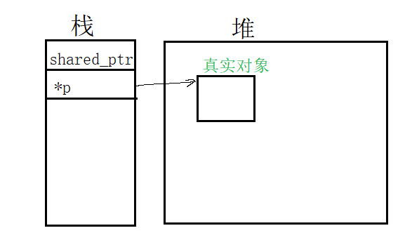

# ch11 Associative Containers

- 11.1 Using an Associative Container
- 11.2 Overview of the Associative Containers
- 11.3 Operations on Associative Containers
- 11.4 The Unordered Containers

使用, 概览, 操作, 无序容器

和序列容器对比: 一个是通过为位置, 一个是通过key

set 存在性的高效查询

关联容器的3个维度:

1. set还是map
2. 唯一key或者多个key
3. 有序或者无序

unordered_multi_set

```
map
set	
multimap // key可以出现多次
multiset // key可以出现多次

unordered_map // hash函数组织
unordered_set
unordered_multimap // key出现多次
unordered_multiset // key出现多次
```


cc: set中key出现多次有什么意思?

放进去, 一次拿到

map和set默认是按顺序的

比我概念中的map和set多了什么?

java中的map和set对应于 unordered_map和unordered_set

有序的map有什么意义?

有序且key重复的?

无序且key重复的?


map和multimap定义在map头部

unordered_map和unordered_multimap定义在定义在unordered_map头部


## 11.1 Using an Associative Container

#### Using a map

```c++ 
map<string, size_t> word_count;
string word;
while(cin>>word)
    ++word_count[word];
```


#### Using a set

```c++ 
map<string, size_t> word_count;
set<string> exclude = {"The","But","Or","An","A","the", "but","or","an","a"};
string word;
while(cin>>word)
    if(exclude.find(word)==exclude.end())
        ++word_count[word];
```


## 11.2 Overview of the Associative Containers

The associative container iterators are bidirectional


### 11.2.1 Defining an Associative Container

```c++ 
map<string, size_t> word_count; // empty
set<string> exclude = {"the","but","and","or","a","an", "The","But","And","Or","A","An"}; // 列表初始化
map<string, string> authors = {{"Joyce","James"}, {"Austen","Jane"},{"Dickens","Charles"}};
```

初始化map的时候必须同时提供key和value, 我们放在一对大括号内

```c++ 
{key, value}
```


初始化可以为空, 拷贝, range, 列表


#### Initializing a multimap or multiset


### 11.2.2 Requirements on Key Type

有序容器, 必须定一个方式比较元素, 默认使用`<`


#### Key Types for Ordered Containers

严格弱序

- 若a<b, 那么b不能小于a
- a<b, b<c, a必须小于c
- a不小于b, b不小于a, 那么a==b


#### Using  a Comparison Function for the key Type

什么叫做操作的类型? 就是函数类型?

```c++ 
bool compareIsbn(const Sales_data &lhs, const Sales_data &rhs){
    return lhs.isbn() < rhs.isbn();
}

// 因为Sales_data没定义< 所以需要提供
multiset<Sales_data, decltype(compareIsbn)*> bookstore(compareIsbn);
```

尖括号提供类型, 小括号提供函数指针

当我们使用decltype去生成一个函数指针, 我们需要添加`*` 


page 535 2025年2月12日08:25:13

### 11.2.3 The pair Type

pair 定义在utility头部中

```c++ 
pair<string, string> anon;
pair<string, size_t> word_count;
pair<string, vector<int>> line;
```

pair 默认是value initializes

```c++ 
// 也可以提供值
pair<string, string> author{"James","Joyce"};
```

map中的元素就是pair

```
pair<T1, T2> p;
pair<T1, T2> p(v1,v2);
pair<T1, T2> p = {v1, v2};
make_pair(v1, v2); // 类型推断根据, v1, v2

p.first
p.second
p1 relop p2  如果p1<p2是true, 那么p1.frist<p2.first或者 
!(p2.first<p1.first) && p1.second<p2.second
p1 == p2 // first和second 都相等
p1!=p2
```


#### A Function to Create pair Objects

```c++ 
pair<string, int> process(vector<string> &v){
    if(!v.empty())
        return {v.back(), v.back().size()}; // 列表初始化
    else
        return pair<string, int>();
}
```


或者使用make_pair

```c++ 
if(!v.empty())
    return make_pair(v.back(), v.back().size());
```

注意: make_pair不用写类型, 类型是编译器自己推断的


## 11.3 Operations on Associative Containers

```
key_type
mapped_type 只有map 才有
value_type 对于set和key_type一致, 对于map为pair<const key_type, mapped_type>
```

value_type 就是每个元素

value_type的第一个元素是key_type, 第二个是mapped_type

对于set来说, value_type和key_type是相同的

map中, pair的可以是const

```c++ 
set<string>::value_type v1; // string
set<string>::key_type v2; // string
map<string, int>::value_type v3; // pair<const string, int>
map<string, int>::key_type v4; // string
map<string, int>::mapped_type v5; // int
```


只有map类型: unordered_map, unordered_multimap, multimap, map 定义了mapped_type.


### 11.3.1 Associative Container Iterators

从迭代器得到的是value_type

如果是map的迭代器, value_type是pair, first 是const key, second是value

```c++ 
auto map_it = word_count.begin();
cout<<map_it->first;
cout<<map_it->second;
++map_it->second;
```

记住:map的value_type是pair, 且我们不能改变key, 只能改变value


#### Iterators for sets Are const

set中的key也是const

所以set iterator只读

```c++ 
set<int> iset = {0,1,2,3,4,5,6,7,8,9};
set<int>::iterator set_it = iset.begin();
if(set_it!=iset.end(){
    *set_it = 42; // Error, set的key是read-only
    cout<<*set_it<<endl;
}
```


#### Iterating across an Associative Container

```c++ 
auto map_it = word_count.cbegin();
while(map_it != word_count.cend()){
    cout<<map_it->first<<" occurs "
        <<map_it->second<<" times"<<endl;
    ++map_it;
}
```

ascending key order

使用迭代器遍历是字典顺序的


#### Associative Containers and Algorithms

因为key为const, 所以不能写入, 或者重排

关联容器在算法中作为目标序列的多


### 11.3.2 Adding Elements

insert可以插入一个元素或者range

```c++ 
vector<int> ivec = {2,4,6,8, 2,4,6,8};
set<int> set2 ;
set2.insert(ivec.cbegin(), ivec.cend());
set2.insert({1,3,5,7,1,3,5,7});
```


```
c.insert(v); 其中v是value_type
c.emplace(args);// pair<iterator, bool> iter指向新插入的元素

c.insert(b,e)
c.insert(il)

c.insert(p, v) 
c.emplace(p, args) // p表示从哪里开始查找存储位置
```

插入一个元素, 一个range和list好理解

p, v不太好理解


#### Adding Elements to a map

```c++ 
word_count.insert({word,1});
word_count.insert(make_pair(word, 1l));
word_count.insert(pair<string, size_t>(word, 1));
word_count.insert(map<string, size_t>::value_type(word, 1));
```

cc: 从map中取出value_type类型比较难理解

就是一个普通类型


#### Testing the Return from insert

返回值除了容器类型还要看形参 ?

cc: 目前只看容器类型, multi不会返回pair, 没有第二个参数bool

pair<iterator, bool>

- iterator 指向新插入的元素
- bool为true, 表示插入成功
- bool 为false, 表示元素已经存在, 不插入

```c++ 
map<string, size_t> word_count;
string word;
while(cin>>word){
    auto res = word_count.insert({word, 1});
    if(!res.second)
        ++res.first->second; // res.first指向新插入的元素, 该元素是一个pair
}
```


#### Unwinding the Syntax

res的类型

```c++ 
pair<map<string,size_t>::iterator, bool> ret
```

ret的第一个元素是pair类型, 是map<string, size_t> 定义的


#### Adding Elements to multiset or multimap

因为multimap允许重复, 所以insert总会插入成功

```c++ 
multimap<string, string> authors;
authors.insert({"Barth, John", "Sot-Weed Factor"});
authors.insert({"Barth, John", "Lost in the Funhouse"});
```

返回一个迭代器, 指向新的元素, 不返回bool了


### 11.3.3 Erasing Elements

```
c.erase(k) // k是key  , 返回count
c.erase(p) // p是迭代器 
c.erase(b, e) // range
```

传递迭代器的时候返回最后一个被删除元素之后的位置

```c++ 
word_count.erase(remove_word); // 删除的个数
```


### 11.3.4 Subscripting a map

map和unordered_map提供了下标访问和at函数

但是我们不能下标访问multimap, unordered_multimap

```
c[k] // 返回k对应的元素, 不存在就插入一个, 并且值初始化
c.at(k) 访问检查, 如果不存在返回out_of_range
```


因为`[]` 访问会插入元素, 所以我们只能在非const map上使用!


#### Using the Value Returned from a Subscript Operation

和vector或者string不一样

map的迭代器的迭代器解引用得到的类型和下标访问得到的类型不一致

- `*`  value_type
- `[]` mapped_type


### 11.3.5 Accessing Elements

```
c.find(k) 返回迭代器, 要么指向元素, 要么为off-the-end
c.count(k) 返回数量或者0
c.lower_bound(k) 返回迭代器, 指向第一个不小于k的元素
c.upper_bound(k) 返回迭代器, 指向第一个大于k的元素

```

1,2,3,3,3,3,3,4,5

k为3, lower_bound, 第一个3

upper_bound, 4

```c++ 
c.equal_range 返回一对迭代器, 表示k所在的range, 如果不存在, 都等于end()
```

如果key可以重复, find的性能好于count,  因为count找到后会继续找


#### Using find Instead of Subscript for maps

```c++ 
if(word_count.find("foobar")==word_count.end())
    //没找到
```


#### Finding Elements in a multimap or multiset

```c++ 
string search_item ("Alain de Botton");
auto entries = authors.count(search_item);
auto iter = authors.find(search_item);
while(entries){
    cout<<iter->second<<endl;
    ++iter;
    --entries;
}
```

可不可以 ? 不可以, iter可能只能表示这些元素, 唯一可以确定的iter能访问所有元素

iter+1!=end && (iter+1).first=="Alain de Botton"

前提是放在一起的

不连在一起也行, 只要iter能访问所有指定key的元素


####  A Different, Iterator-Oriented Solution

lower_bound返回第一个

upper_bound返回最后一个之后

如果不存在, lower_bound==upper_bound

lower_bound , 如果元素不存在, 返回第一个可以不打乱顺序可以插入的位置

```c++ 
for(auto beg = authors.lower_bound(search_item), 
   auto end = authors.upper_bound(search_item);
    beg!=end; ++beg)
    cout<<beg->second<<endl; // 
```

如果不存在, beg返回第一个不小于search_item的值, 就是大于search_item的值, 所以可能是off-the-end iterator

lower_bound 大于等于k的位置

upper_bound 大于k的位置


#### The equal_range Function

```c++ 
for(auto pos=authors.equal_range(search_item); pos.first!=post.second; ++pos.first)
    cout<<pos.first->second<<endl;
```


cc: erase之后返回下一个元素的意义, 可以在遍历的过程中删除


### 11.3.6 A Word Transformation Map

存为map

访问每个单词, 如果找到, 输出对应的


思路分析:

包含3个函数, 

- word_transform 整个过程, 接收两个ifstream
- buildMap 读取规则, 创建map
- transform 接受一个string, 返回一个string


## 11.4 The Unordered Containers

order使用comparison组织元素

unordered 使用hash函数, 和key的 == 操作符

通常使用顺序容器性能更好

什么时候使用unordered , 

1. key本身无序
2. hash 如果有性能优势


#### Using an Unordered Container


#### Managing the Buckets

无序容器是buckets的集合, 每个包含一个或多个元素

hash函数的作用, 将元素映射到buckets

相同hash值的所有元素放在一个bucket中

hash函数的好坏, bucket的容量和数量, 决定了无序容器的性能

buckets中的元素顺序查找

inquire 询问

```
c.bucket_count() 容器的bucket数量, 不只是包含元素的桶
c.max_bucket_count() 该容器最大可以容纳的桶数量
c.bucket_size(n) 第n个bucket的元素数量
c.bucket(k) 元素k所在的bucket
```

100个bucket使用了50个, 第26个bucket有10个元素, 元素k在哪个bucket

```
local_iterator // 访问bucket的元素
const_local_iterator
c.begin(n), c.end(n) // 第n个bucket中, 指向第一个元素的迭代器, 经过最后一个
c.cbegin(), c.cend() // const_local_iterator
```

用来遍历bucket

```
c.load_factor() 每个bucket的平均数量, float
c.max_load_factor() c试图维护的平均尺寸, 通过添加buckets来保持load_factor<=max_load_factor

// 两个都可能增加桶, 一个不rehash, 一个rehash
c.rehash(n) 调整存储使得bucket_count>=n, 且>= size/max_load_factor
c.reverse(n) 在不rehash的情况是的c能容纳n个元素
```

cc, 每个bucket的平均元素数量, 是不是新增一个bucket, 平均数减少

当负载因子过大, 容器自动扩容, 增加桶的数量, 重新hash所有的元素到新的桶中

负载因子= 元素数量/桶的数量

那么桶是所有桶, 还是有元素的桶?


计算负载因子的时候, 桶的数量包不包含没有使用的桶?

包含了

load_factor = size*1.0/bucket_count


rehash 修改桶数量, 重新分配每个元素


max_load_factor通常为1, 所以rehash的时候, 桶的数量不仅大于1, 还要大于元素的个数. 


c++关联容器的reserve操作不rehash如何容纳n个元素?

新增加桶, 但是不对已经分配的元素rehash, 使得不会因为负载因子过大, 因为分母增加了, 导致rehash

reserve 作用, 分配足够多的桶来避免rehash


#### Requirements on Key Type for Unordered Containers

hash<key_type> 计算code

`== ` 比较元素

不理解 == 的作用是干嘛?

用来查找, 插入, 删除

库提供的hash模板支持:  built-in类型, 指针, 智能指针, string

```c++ 
size_t hasher(const Sales_data &sd){
    return hash<string>()(sd.isbn());
}
bool eqOp(const Sales_data &lhs, const Sales_data& rhs){
    return lhs.isbn() == rhs.isbn();
}

using SD_multiset = unordered_multiset<Sales_data, decltype(hasher)*,
decltype(eqOp)*>;
SD_multiset bookstore(42, hasher, eqOp);
```

也就是可以自定义hash和`==`


## Chapter Summary

相同key的元素, 相邻, 不管是有序还是无序容器


# ch12 Dynamic Memory

- 12.1 Dynamic Memory and Smart Pointers
- 12.2 Dynamic Arrays
- 12.3 Using the Library: A Text-Query Program
- Chapter Summary
- Defined Terms

动态内存, 智能指针, 动态数组

Local static 对象在第一次使用前分配

目前我们的程序只是使用了 static 和 stack memory

- static 
  - 静态局部
  - 全局变量
  - 类的静态成员
- stack
  - 局部变量

他们自动创建和销毁


pool of memory : free store, heap


dynamically allocated objects have a lifetime that is independent of where they are created; they exist until they are explicitly freed

dynamically allocate, that is , for objects that the program allocates at run time.

our code must explicitly destroy such objects when they are no longer needed.


## 12.1 Dynamic Memory and Smart Pointers

动态内存操作符

- new : 分配, (可选初始化), 一个对象在动态内存中, 返回一个指针指向这个对象
- delete : 接受一个指针(指向动态对象的), 销毁对象, 释放内存

2个问题: 忘记delete, 或者delete之后继续使用这块内存

shared_ptr 多个指针引用相同对象

unique_ptr 独占指向的对象

weak_ptr 弱引用一个shared_ptr管理的对象

在memory 头部中


### 12.1.1 The shared_ptr Class

```c++ 
// 是模板
shared_ptr<string> p1;
shared_ptr<list<int>> p2;
```

和普通指针一样: 解引用智能指针得到对象, 智能指针可放在条件中

```c++ 
if(p1 && p1->empty())
    *p1 = "hi";
```


shared_ptr和unique_ptr的通用操作

```
shared_ptr<T> sp // 空的智能指针
unique_ptr<T> up

p // 用作条件, 是否为空
*p // 获取对象
p->mem // 访问成员
p.get() // 获取内部指针

swap(p, q) 
p.swap(q)
```


shared_ptr独有的

```
make_shared<T>(args) // args用来初始化T类型对象, 返回智能指针
shared_ptr<T> p(q)  // p是q的拷贝, q的数量+1
p = q  // p的数量-1, q的数量+1
p.unique() // 如果p.use_count()==1 为true
p.use_count() // 慢操作, 和p一起分享的对象数量
```


`p=q, p.get(), make_shared<T>(args)` 


#### The make_shared Function

在动态内存中分配和初始化对象, 返回一个shared_ptr指向那个对象

make_shared 定义在memory中

```c++ 
shared_ptr<int> p3 = make_shared<int>(42);
shared_ptr<string> p4 = make_shared<string>(10, '9');
shared_ptr<int> p5 = make_shared<int>();
```

就像emplace一样, 使用args构造, 若args为空, 默认值初始化

```c++ 
auto p6 = make_shared<vector<string>>();
```


#### Copying and Assigning shared_ptrs

拷贝或者赋值shared_ptr的时候, 每个都知道多少其它shared_ptr 指向相同的对象

```c++ 
auto p = make_shared<int>(42);
auto q(p); // p和q指向的对象现在有2个用户了
```


拷贝, 赋值, 函数参数, 返回值, 会+1

为什么返回值会+1? 如果没有变量接收呢


被赋值, 被销毁, 会-1

也就是在等号左边


```c++ 
auto r = make_shared<int>(42);
r = q;
```

r指向的对象count-1, q指向的对象count+1

r指向的对象没有用户, 自动销毁


类跟踪多少个智能指针引用它的对象

#### shared_ptrs Automatically Destroy Their Objects...

当指向对象的最后一个智能指针销毁, shared_ptr 类自动销毁它指向的对象

析构器: 销毁对象, 释放资源

shared_ptr的析构器: 减少数量, 销毁对象, 释放资源

多了一个减少数量


#### ... and Automatically Free the Associated Memory

```c++ 
shared_ptr<Foo> factory(T arg)
{
    return make_shared<Foo>(arg);
}

void use_factory(T arg){
    shared_ptr<Foo> p = factory(arg);
} // p指向的内存自动释放
```

p被销毁的时候, 它的count被自动减少和检查

内存不被释放, 除非最后一个shared_ptr消失


#### Classes with Resources That Have Dynamic Lifetime

使用动态内存的场景

不知道数量, 不知道类型, 需要在多个对象间共享数据

如何理解对象之间的数据共享?


#### Defining the StrBlob Class

```c++ 
class StrBlob{
    public:
    typedef std::vector<std::string>::size_type size_type;
    StrBlob();
    StrBlob(initializer_list<string> il);
    size_type size() const {return data->size();}
    bool empty() const {return data->empty();}
    void push_back(const string &t){data->push_back(t);}
    void pop_back();
    string& front();
    string& back();
    private:
    shared_ptr<vector<string>> data;
    void check(size_type i, const string &msg)const;
};
```


#### StrBlob Constructors

```c++ 
StrBlob::StrBlob(): data(make_shared<vector<string>>()){}
StrBlob::StrBlob(initializer_list<string> il):data(make_shared<vector<string>>(il)){}
```


#### Element Access Members

pop_back, front, back 都需要访问成员, 访问之前都需要检查合法性

```c++ 
void StrBlob::check(size_type i, const string &msg) const{
    if(i>=data->size())
        throw out_of_range(msg);
}
```

pop_back需要先检查

```c++ 
string& StrBlob::front(){
    check(0, "front on empty StrBlob");
    return data->front();
}

string& StrBlob::back(){
	check(0, "back on empty StrBlob");
    return data->back();
}

void StrBlob::pop_back(){
    check(0, "pop_back on empty StrBlob");
    data->pop_back();
}
```


#### Copying, Assigning, and Destroying StrBlobs


### 12.1.2 Managing Memory Directly


#### Using new to Dynamically Allocate and Initialize Objects

new 没有办法为对象命名, 只是返回对象的指针

```c++ 
int *pi = new int; // pi指向未命名, 未初始化的int
```

new 在heap上创建了一个int的对象, 返回指向这个对象的指针

动态分配的对象是默认初始化

```c++ 
string *ps  = new string; // 空string
int *pi= new int; // undefined
```


直接初始化, 可以使用括号或者列表

```c++ 
int *pi = new int(1024);
string *ps = new string(10, '9');
vector<int> *pv = new vector<int>{0,1,2,3,4,5,6,7,8,9};
```


```c++ 
string *ps1 = new string;// default 初始化
string *ps = new string(); // value initialized
int *pi1 = new int; // default initialized
int *pi2 = new int(); // value intialized
```


auto只是使用单参数+括号

```c++ 
auto p1 = new auto(obj); // 根据obj 推断类型
auto p2 = new auto{a,b,c}; // error
```


#### Dynamically Allocated const Objects

```c++ 
const int *pci = new const int(1024);
const string *pcs = new const string;
```


#### Memory Exhaustion

堆内存不够, bad_alloc.

我们可以避免new 抛出

```c++ 
int *p1 = new int; // 堆内存不够抛出bad_alloc
int *p2 = new (nothrow) int; // 不会抛出, 返回null ptr
```


bad_alloc和nothrow 都定义在new 头部


#### Freeing Dynamic Memory

delete 接收指针

```c++ 
delete p;
```

销毁对象, 释放内存


#### Pointer Values and delete

delete的指针必须指向动态内存, 或者nullptr

insidious 暗中有害


#### Dynamically Allocated Objects Exist util They Are Freed


#### Resetting the Value of a Pointer after a delete...

dangling pointer: 曾经持有对象, 现在没有了

要么手动赋值为nullptr, 要么在scope结束的时候delete


#### ... Provides Only Limited Protection


### 12.1.3 Using shared_ptrs with new

可以使用new创建的指针初始化智能指针

```c++ 
shared_ptr<double> p1;
shared_ptr<int> p2(new int(42));
```


定义和改变shared_ptr的其它方式

```
shared_ptr<T> p(q) // q必须是new创建的指针
shared_ptr<T> p(u) // u的对象控制权转交给p, u为null
shared_ptr<T> p(p2, d) // p是p2的拷贝, 使用d删除

p.reset() // p的count-1, p指向q, 并使用d删除q
p.reset(q)
p.reset(q, d)
```

cc: u可以用来初始化p?


使用new创建的指针初始化智能指针是explicit

```c++ 
shared_ptr<int> p1 = new int(1024); // error
shared_ptr<int> p2(new int(1024)); // ok, 直接初始化
```

我们不能隐式将一个普通指针转化为智能指针


#### Don't Mix Ordinary Pointers and Smart Pointers...

```c++ 
int *x(new int(1024));
process(x); // error
process(shared_ptr<int>(x));
int j = *x; // Error, process会删除x指向的内存
```

我们把一个普通指针的权限交给智能之后之后, 就不能单独使用这个普通指针了

普通指针交给智能指针之后, 我们不能再使用这个普通指针, 因为我们不知道这个普通指针是否被删除


### ... and Don't Use get to Initialize or Assign Another Smart Pointer

get() 返回内置指针

通过get获得指针的代码, 不能删除那个指针

```c++ 
shared_ptr<int> p(new int(42));
int *q = p.get();
{
    shared_ptr<int>(q);
}

int foo = *p;// 未定义, p指向的内存被释放
```

因为p和q指向了相同的内存

每个的数量都是1, 

q清理了内存, p指向的 


#### Other shared_ptr Operations

我们可以使用reset赋值一个新的指针到shared_ptr

```c++ 
p = new int(1024); // error, 不能赋值普通指针到shared_ptr
p.reset(new int(1024)); // ok, p指向新的对象
```


通常和unique使用, 我独占才修改

```c++ 
if(!p.unique())
    p.reset(new string(*p));
*p += newVal; // 现在可以放心的修改了
```


### 12.1.4 Smart Pointers and Exceptions

```c++ 
void f(){
    shared_ptr<int> sp(new int(42)); 
    // 异常
}// 内存会被释放
```

当函数退出不管是正常还是异常, 局部对象都会被销毁


#### Smart Pointers and Dumb Classes

```c++ 
struct destination;
struct connection;
connection connect(destination *);
void disconnect(connection);
void f(destination &d){
    connection c = connect(&d);
    
    // 如果我们忘记调用disconnect, 我们永远不能关闭c了
}
```


#### Using Our Own Deletion Code

```c++ 
void end_connection(connection *p){disconnect(*p);}
```

我们需要一个deleter来清理资源, 并且deleter的参数必须能接受shared_ptr存放的指针

```c++ 
void f(destination &d){
    connection c = connect(&d);
    shared_ptr<connection> p(&c, end_connection);
}
```

为什么不直接使用disconnect?

因为disconnect没有接收connection*


### 12.1.5 unique_ptr

```
unique_ptr<T> u1; // null unique_ptr
unique_ptr<T, D> u2; // u2使用D类型的对象来清理

unique_ptr<T, D> u(d); // null unique_ptr
u = nullptr;  // 删除u指向的对象, makes u null
u.release(); // 放弃并返回u持有的指针, makes u null

u.reset()  // 删除u指向的对象
u.reset(q) // u指向q指向的对爱
```

relinquish 放弃

一个是直接删除对象, 一个返回指针的控制权


cc: 我的理解, share_ptr和unique_ptr都可以使用=nullptr

对于shared_ptr 会ount-1

对于unique_ptr 直接销毁对象, 释放内存


```c++ 
unique_ptr<double> p1;
unique_ptr<int> p2(new int(42));
```

因为unique_ptr独占对象, 所以不支持拷贝和赋值


虽然不可以拷贝, 但是可以转移

```c++ 
unique_ptr<string> p2(p1.release());// makes p1 null
unique_ptr<string> p3(new string("Trex"));
p2.reset(p3.release()); // 删除p2的内存
```

page 588 2025年2月12日17:59:59

frees the memory used by the string initialized from "Stegosaurus", 释放string的内存

调用release breaks the connection between a unique_ptr and thre object it had been managing. 

unique_ptr 管理的对象是什么? get()的指针, 还是get()指针指向的对象?

Often the pointer returned by release if used to initialize of assign another smart pointer. 说明unique_ptr返回的是指针

动态内存的释放转移到另一个智能指针,

如果没有智能指针接受呢?

我们自己要负责释放

```c++ 
p2.release(); // 错误: p2没有释放内存, 并且我们丢失了指针
auto p = p2.release();
delete(p);
```


release 作用: 返回内部指针, 然后将内部指针设置为nullptr

reset作用: 相当于赋值, 会执行一个清理和, 拷贝

那么shared_ptr的reset是不是相当于赋值


#### 理解销毁对象, 释放内存

模型理解: 栈内存2个对象: 堆内存1个对象

1. 销毁对象释放内存的时机, 最后一个shared_ptr被销毁的时候\
2. new在堆内存创建的对象是没有名字的, 唯一访问方式是通过指针p
3. new分配内存, 创建对象
4. delete 销毁对象, 释放内存




有两个对象, 一个是指针指向的对象, 一个是指针本身

dynamically allocated objects have a lifetime that is independent of where they are created; they exist until they are explicitly freed

dynamically allocate, that is , for objects that the program allocates at run time.

our code must explicitly destroy such objects when they are no longer needed.


 new: which allocates, and optionally initializes, an object in dynamic memory and returns a pointer to that object.

delete: which takes a pointer to a dynamic object, destroys that object, and frees the associated memory.

指针可以不用考虑吗?

是不是指针是内置变量, 会自动销毁, 就像int一样, 但是指针指向的对象不会

销毁指针指向的对象必须通过指针

A smart pointer acts like a regular pointer with the important exception that it automatically deletes the object to which it points.

智能指针会管理它指向的对象

A default initialized smart pointer holds a null pointer. 

默认的智能指针持有空指针, 空指针是不是表示占位符有了, 但是没有值, 

可不可以理解为指针对象存放的值为空?


make_shared: This function allocates and initializes an object in dynamic memory and returns a shared_ptr that points to that object.

在某个内存直接创建和初始化对象, 返回智能指针; 怎么没有看到普通指针的身影?

We can think of a shared_ptr as if it has an associated counter; 

shared_ptr有一个counter 是对象具有还是类具有?

不应该是类具有, 否则这个类只能管理一个普通指针了

如果是对象持有

```c++ 
a=b; // b=2, a=2
c=a;// c=3, a=3, 那么b呢? b怎么知道把自己的成员改为3?
```

It is up to the implementation whether to use a counter or another data structure to keep track of how many pointers share state. The key point is that the class  keeps track of how many shared_ptrs point to the same object and automatically frees that object when appropriate.


是由shared_ptr 类而不是对象出面销毁对象, 并且是借用析构器

When the last shared_ptr pointing to an object is destroyed , the shared_ptr class automatically destroys the object to which that shared_ptr points. 当最后一个shared_ptr被销毁的时候, shared_ptr class 会自动销毁 shared_ptr指向的对象

It does so through another special member function known as a destructor. 通过析构器销毁对象

Destructors generally free the resources that an object has allocated. 析构器释放对象分配的资源

比如string的构造器分配内存持有字符, string的析构器释放那个内存

vector的构造器分配内存持有元素, vector的析构器销毁元素, 释放内存

The destructor for shared_ptr decrements the reference count of the object to which that shared_ptr points.

If the count goes to zero, the shared_ptr destructor destroys the object to which the shared_ptr points and frees the memory used by that object.

>  里看起来像是shared_ptr对象管理的count, 销毁的对象

```c++ 
void use_factory(T arg){
    shared_ptr<Foo> p = factory(arg);
}
```

当p销毁的时候, 引用数量被减少和检查, 这里为0, 所以p指向的对象被销毁, 内存被释放


> 到目前为止可以确定的是
>
> 1. 时机发生在shared_ptr对象被销毁时
> 2. 先销毁对象, 释放内存


Because memory is not feed until the last shared_ptr goes away.

StrBlob中有一个shared_ptr成员: That shared_ptr member will keep rtack of how many StrBlobs share the same vector and will delete the vector when the last StrBlob using that vector is destroyed.

> 现在看起来是shared_ptr对象跟踪数量, 并在数量为0时, 销毁对象, 释放内存


and destroying a shared_ptr decrements the count. 是不是只有销毁shared_ptr的时候才会减少counter?


Objects allocated on the heap are unnamed, so new offers no way to name the objects that it allocates. Instead, new returns a pointer to the object it allocates:

```c++ 
int *pi = new int;
```

This new expression constructs an object of type int on the heap and returns a pointer to that object.

In order to prevent memory exhaustion, we must return dynamically allocated memory to the system once we are finished using it. 返回内存到系统

delete的工作: It destroys the object to which its given pointer points, and it frees the corresponding memory.


#### Passing and Returning unique_ptrs

虽然unique_ptr不能拷贝, 但是将要销毁的unique_ptr可以拷贝

```c++ 
unique_ptr<int> clone(int p){
    return unique_ptr<int>(new int(p));
}
```

这里, 编译器知道它将要销毁, 所以允许拷贝


#### Passing a Deleter to unique_ptr

覆盖unique_ptr的deleter会影响unique_ptr的类型

```c++ 
unique_ptr<objT, delT> p (new objT, fcn);
```

fcn的类型为delT


### 12.1.6 weak_ptr

不控制生命周期的智能指针

weak_ptr 指向一个对象, that is managed by a shared_ptr

weak_ptr绑定到shared_ptr 不会改变shared_ptr的counter

```
weak_ptr<T> w;
weak_ptr<T> w(sp);

w=p; // p可以是weak_ptr或者shared_ptr

w.reset() // makes w null
w.use_count() // 和shared_ptr共享的
w.expired() // w.use_count()为0返回true
w.lock(); // 返回shared_ptr或者null shared_ptr
```


```c++ 
auto p = make_shared<int>(42);
weak_ptr<int> wp(p); // 弱引用p
```


在if 的body内访问对象是安全的

```c++ 
if(shared_ptr<int> np = wp.lock()){
    // 这里, np共享p的对象
}
```


#### Checked Pointer Class

 ```c++ 
 class StrBlobPtr{
     public:
     StrBlobPtr():curr(0){}
     StrBlobPtr(StrBlob &a, size_t sz=0):wptr(a.data), curr(sz) {}
     string& deref() const;
     StrBlobPtr& incr(); // 前缀版本
     private:
     share_ptr<vector<string>> check(size_t, const string&) const;
     weak_ptr<vector<string>> wptr; // 表示指向的vector可能已经销毁
     size_t curr;
 }
 ```

It is worth noting that we cannot bind a StrBlobPtr to a const StrBlob object.


```c++ 
shared_ptr<vector<string> StrBlobPtr::check(size_t i, const string &msg) const{
    auto ret = wptr.lock();
    if(!ret)
        throwruntime_error("unbound StrBlobPtr");
    if(i>= ret->size())
        throw out_of_range(msg);
    
    return ret;
}
```


#### Pointer Operations

// 解引用

```c++ 
string& StrBlobPtr::deref() const{
    auto p = check(curr, "dereference past end");
    return  (*p)[curr];
}
```


// 递增

```c++ 
StrBlobPtr& StrBlobPtr::incr(){
    check(curr, "increment past end of StrBlobPtr");
    ++curr;
    return *this;
}
```


// 为了访问data, 必须是友元

```c++ 
class StrBlobPtr;
class StrBlob{
    friend class StrBlobPtr;
    StrBlobPtr begin(){return StrBlobPtr(*this);}
    StrBlobPtr end(){
        auto ret = StrBlobPtr(*this, data->size());
        return ret;
    }
};
```


理解: 

```c++ 
StrBlob sb;
for (string line; getline(in, line);) {
    sb.push_back(line);
}

for (StrBlobPtr p = sb.begin(); p != sb.end(); p.incr()) {
    cout << p.deref() << endl;
}
```


定义了一个类型StrBlobPtr来访问StrBlob的成员data, data的类型是`vector<string>`

StrBlob 类似一个vector, 里面有个数据成员为data, 类型为`vector<string>`

StrBlob 的begin和end成员返回StrBlobPtr

这个StrBlobPtr包含了解引用和递增操作, 在需要一个`!=` 操作符就可以遍历 StrBlob的data了


## 12.2 Dynamic Arrays

### 12.2.1 new and Arrays

```c++ 
int *pia = new int[get_size()];
```

使用别名

```c++ 
typedef int arrT[42];
int *p = new arrT;
int *q = p;
```

cc:  p和q有没有什么区别?


#### Allocating an Array Yields a Pointer to the Element Type

When we use new to allocate an array, we do not get an object with an array type.

没得到array类型

因为分配的内存没有数组类型, 所以不能调用begin或者end在一个动态数组上

These functions use the array dimension (which is part of an array's type) to return pointers to the first and one past the last elements, respectively. 同理也不能在动态数组上使用for 循环

注意: 动态数组没有数组类型


#### Initializing an Array of Dynamically Allocated Objects

new不管创建一个对象还是一个数组都是默认初始化, 除非提供`()`

```c++ 
int *pia = new int[10]; // 10个未初始化的int
int *pia2 = new int[10]();// 10个0

string *psa = new string[10];// 10个空string
string *psa2 = new string[10](); // 10个空string

// c++11
int *pia3 = new int[10]{0,1,2,3,4,5,6,7,8,9};
string *psa3 = new string[10]{"a","an","the",string(3, 'x')};
```

如果列表超出长度, 抛出bad_array_new_length. 定义在new头部, 就像bad_alloc

我们只能使用空的小括号初始化数组, 不能在小括号内使用初始化器, 所以不能使用new auto 分配一个数组

#### It is Legal to Dynamically Allocate an Empty Array

arbitrary 随心所欲

```c++ 
size_t n = get_size();
int  *p = new int[n];
for(int* q = p; q!=p+n; ++q)
```


如果n是0呢?

array变量不能是0, 但是动态array可以

```c++ 
char arr[0]; // error, 不能定义0长度的array
char *cp = new char[0];// ok, 但是不能解引用
```

当我们用new 分配一个size为0的数组, new 返回一个有效的非零指针

This pointer act as the off-the-end pointer for a zero-element array.


#### Freeing Dynamic Arrays

```c++ 
delete p;// p 指向动态分配的对象或者null
delete [] pa; // p指向动态分配的数组或者 null
```

delete[] 销毁数组元素, 释放内存

元素被销毁的顺序是逆序的, 最后一个元素最先销毁


#### Smart Pointers and Dynamic Arrays

```c++ 
// 10个未初始化的int
unique_ptr<int[]> up(new int[10]); 
up.reset(); // 
```

cc: release() 不是说返回内置指针吗? 还有手动删除吗?

我觉得是写错了

可以使用下标访问元素

```c++ 
for(size_t i =0;i!=10;++i)
    up[i] =i;
```


unique_ptr的操作

```c++ 
unique_ptr<T[]> u;
unique_ptr<T[]> u(p);

u[i];
```


使用shared_ptr, 需要自己提供deleter

```c++ 
shared_ptr<int> sp(new int[10], [](int *p){delete[] p;});
sp.reset(); // 使用lambda销毁对象, 释放内存
```

因为shared_ptr没有提供数组访问的方法所以

```c++ 
for(size_t i =0; i!=10;  ++i)
    *(sp.get()+i) = i;
```

因为smart指针不支持数学运算, 所以只能使用内部指针


### 12.2.2 The allocator Class

new的不灵活性表现在, 他将分配内存, 构造对象绑定在了一起

但是构造批量对象, 比如数组的时候, 我们希望, 分配内存和构造对象分开, 使得可以在需要的时候后在构造对象

```c++ 
string *const p = new string[n]; // 构造了n个空strings
string s;
string *q =p;
while(cin>>s&&q!=p+n)
    *q++ = s;
const size_t size = q-p; // 记住我们读了多少个字符
delete [] p;
```

主要浪费在于我们创建了不需要的元素

并且没有默认构造器的不能分配为数组


#### The allocator Class

allocator class定义在memory 头部

让我们将分配和构造分开

It provides type-aware allocation of raw, unconstructed, memory.

- type-aware
- unconstructed
- raw


allocator操作

```c++ 
allocator<T> a; // 为T对象分配内存
a.allocate(n); // 分配n个, raw, unconstructed 内存容纳n个元素
a.deallocate(p, n); // p是allocate返回, n是allocate参数, 调用之前用户必须手动销毁每个对象
a.construct(p, args); // p指向raw memory
a.destroy(p); // 在p指向的对象上运行析构器
```

定义allocator 必须要指定allocator可以分配的类型

当使用allocator分配内存的时候, 他分配内存, 尺寸合适并且对齐

- 尺寸
- 对齐

```c++ 
allocator<string> alloc;
auto const p = alloc.allocate(n); // 分配n个未构造的string
```

`alloc.allocate(n)` 分配内存for n个strings


#### allocators Allocate Unconstructed Memory

allocator分配的内存是raw, unconstructed

我们使用这内存的通过在这个内存上创建对象

construct 成员接收一个指针和一些参数, 在指定的位置创建一个元素

```c++ 
auto q = p;
alloc.construct(q++); // *q是空string
alloc.construct(q++, 10, 'c'); // *q 是cccccccccc
alloc.construct(q++, "hi");// *q is hi!
```

在早期的版本, 我们不能在这个位置构造, 只能构造一个对象拷贝过去

我们必须构造之后才能使用construct 返回的内存

我们必须对每个构造的对象调用destroy

```c++ 
while(q!=p)
    alloc.destroy(--q); // 释放我们分配的对象
```

最后构造的最先销毁

销毁对象之后我们可以重新利用这内存或者返回给系统

```c++ 
alloc.deallocate(p, n);
```

传递给deallocate的指针不能是null

n必须是我们传递给allocate的size


#### Algorithms to Copy and Fill Uninitialized Memory

allocator 算法

```c++ 
// 这些算法在目的地构造元素, 而不是赋值到目的地
// b2必须是未构造的内存
uninitialized_copy(b, e, b2); // b,e的元素拷贝到b2
uninitialized_copy(b, n, b2); // b开始n个元素, 拷贝到b2

uninitialized_fill(b, e, t); // t填充range
uninitialized_fill(b, n, t); // t填充b开始的n个元素
```

我们就可以把vector填充到动态内存了

```c++ 
auto p = alloc.allocate(vi.size()*2);
auto q = uninitialized_copy(vi.begin(), vi.end(), p);
uinitialized_fill(q, vi.size(), 42);
```


## 12.3 Using the Library: A Text-Query Program

### 12.3.1 Design of the Query Program

列出程序的操作, 从而设计数据类型

我们的程序必须做的操作

- 单词出现的次数, set的size()表示
- 每个单词出现在哪些行, set包含
- 根据行数得到原文, vector存放行数和line


作者的分析

- 读取输入, 需要记住单词和行号, 所以一次读取一行, 并且每一行拆分为单词
- 生成输出的时候
  - 根据单词拿到行号
  - 行号是顺序的
  - 根据行号拿到每行的文本


我这样分析能解决问题, 但是每次都提心吊胆


#### Data Structures

为什么TextQuery 需要包含vector和map,  query操作

QueryResult 容纳结果


#### Sharing Data between Classes

queryResult需要从vector拿数据, 但是不想拷贝vector

那么返回指针呢?

返回指针的问题, 如果TextQuery不存在了呢? 指针指向的内存会被销毁


#### Using the TextQuery Class

```c++ 
void runQueries(ifstream &infile){
    TextQuery tq(infile);
    while(true){
        cout<<"Enter a word to look for, or q to quit: ";
        string word;
        if(!(cin>>word) || word=="q") break;
        
        print(cout, tq.query(s))<<endl;
    }
}
```


到这里有哪些难点?

题意的分析, 输入, 输出  如果只是这样的话, 只能生成一坨代码

作者怎么能根据题意想到两个类呢? 第二个类我也能想到, 那么第一个类呢?

如果不能转化为呼吸之间就能完成的步骤, 就会每次都提心吊胆

题意分析, 结构设计, 逻辑封装


我今天这个错误可能还会犯1万次, 也可能不犯错了, 关键看我意识到了没

看到一页代码产生焦虑和感知难度

我希望自己一看就懂, 但是我做不到

我希望代码很简单, 但是实际情况不是这样

我想要一口吞掉一个大象


### 12.3.2 Defining the Query Program Classes

为什么会出现shared_ptr成员, 如果不这样会怎么样?

```c++ 
class QueryResult;
Class TextQuery{
    public:
	using line_no = vector<string>::size_type;
    TextQuery(ifstream&);
    QueryResult query(const string&) const; // 这里返回const
    private:
    shared_ptr<vector<string>> file; // lines
    map<string, shared_ptr<set<line_no>>> wm; // word_map
};
```

untangling 松开, 解开


#### The TextQuery Constructor

```c++ 
TextQuery::TextQuery(ifstream &is):file(new vector<string>){
    string text;
    while(getline(is, text)){
        file->push_back(text);
        int n = file->size()-1;
        istringstream line(text);
        string word;
        while(line>>word){
            auto &lines = wm[word]; // shared_ptr
            if(!lines)
                lines.reset(new set<line_no>);
            lines.insert(n);
        }
    }
}
```


#### The QueryResult Class

```c++ 
class QueryResult{
    friend ostream& print(ostream&, const QueryResult&);
    public:
    QueryResult(string s, shared_ptr<set<line_no>> p, 
               shared_ptr<vector<string> f):
    sought(s), lines(p), file(f){}
    private: 
    string sought;
    shared_ptr<set<line_no>> lines;
    shared_ptr<vector<string>> file;
}
```


#### The query Function

```c++ 
QueryResult TextQuery::query(const string &sought) const{
    static shared_ptr<set<line_no>> nodata(new set<line_no>);
    auto loc = wm.find(sought);
    if(loc==wm.end())
        return QueryResult(sought, nodata, file);// 没有找到
    return QueryResult(sought, loc->second, file);
}
```


#### Printing the Results

```c++ 
ostream &print(ostream& os, const QueryResult &qr){
    os<<qr.sought<<" occurs "<<qr.lines->size()<<" "<<
        make_plural(qr.lines->size(), "time","s")<<endl;
    for(auto num: *qr.lines)
        os<<"\t(line "<<num+1<<")"
        <<*(qr.file->begin()+num)<<endl;
    return os;
}
```


### Chapter Summary

- ch13 Copy Control
- ch14 Overloaded Operations and Conversions
- ch15 Object-Oriented Programming
- ch16 Templates and Generic Programming

拷贝控制, 重载操作和转换, 面向对象, 模板和泛型编程

concludes 结束


variadic templates 可变模板

template type aliases

new ways to control instantiation


page 615 2025年2月13日18:00:14 37页

不敢去碰, 根本不知道自己在哪里不足


# ch13 Copy Control

- 13.1 Copy, Assign, and Destroy
- 13.2 Copy Control and Resource Management
- 13.3 Swap
- 13.4 A Copy-Control Example
- 13.5 Classes That Manage Dynamic Memory
- 13.6 Moving Objects
- Chapter Summary

拷贝控制, 资源管理, 交换, 拷贝控制例子, 管理动态内存, 移动对象


每个类定义了类型和操作, 构造器

copy constructor, move constructor, copy assignment operator, move-assignment operator, and destructor

类定义了当对象 拷贝, 移动, 赋值, 销毁 会发生什么

copy 和 move constructor 定义了发生什么, 从另一个相同类型的对象初始化

copy 和 move assignment operator 定义了, 从另一个相同类型的对象赋值

destructor 定义了, when an object of the type ceases to exist

ceases 停止


## 13.1 Copy, Assign, and Destroy

拷贝控制

| copy constructor | copy assignment operator | destructor |
| :--------------- | -----------------------: | ---------- |
| move constructor | move assignment operator |            |


### 13.1.1 The Copy Constructor

拷贝构造器特征

- 第一个参数是类引用, 
- 剩余的参数有默认值

```c++ 
class Foo{
    public:
    Foo();
    Foo(const Foo&); // 拷贝控制
};
```

第一个参数是引用类型, 并且总是reference to const, 不应该是explicit, 否则无法完成拷贝构造


#### The Synthesized Copy Constructor

不像默认的构造器, 就算我们定义了构造器, 编译器也会为我们合成

规则: 按成员复制

- 类使用copy constructor
- 内置类型直接拷贝
- 数组按照元素拷贝

```c++ 
class Sales_data{
    public:
    Sales_data(const Sales_data&);
};

Sales_data::Sales_data(const Sales_data &orig):
bookNo(orig.bookNo), units_sold(orig.units_sold), revenue(orig.revenue){}
```


#### Copy Initialization

理解直接初始化和拷贝初始化

cc: 一个使用参数, 一个使用类引用并且通常是常量

```c++ 
string dots(10, '.'); // 直接
string s(dots); // 直接
string s2 = dots; // copy
string null_book = "9-999-99999-9"; // copy
string nines = string(100, '9'); // copy
```

为什么第二个也是直接初始化?

直接初始化会使用普通的函数匹配寻找构造器

拷贝初始化:  copy the right-hand operand into the object being created, 并在必要的时候进行转换.

cc: 是不是一定要存在一个等号? 那么第二个格式存在这样的构造器吗? 这个构造器的原型是撒?

调用的是拷贝构造

所以并不是调用了拷贝构造就是拷贝初始化

cc: 猜测直接构造是相对于默认初始化而言的!


拷贝初始化要么使用copy 构造, 要么使用move 构造

拷贝初始化场景

- =
- 非引用函数形参
- 非引用返回类型
- 大括号初始化数组元素或者聚合类

cc: 大括号初始化数组元素或者聚合类不太熟悉

insert或者push也是拷贝初始化

emplace是直接初始化


#### Parameters and Return Values

为什么拷贝构造器的形参必须是引用?

如果不是引用, 那么调用拷贝构造器的时候, 需要传递参数把, 参数是非引用, 需要拷贝把, 

也就是必须要能拷贝参数, 才能调用函数 A, 否则无法调用 函数A

同时必须要能调用函数才能拷贝参数

也就是拷贝参数是调用函数的前提, 毕竟没有合适的参数是无法调用函数的

同时, 调用函数是拷贝参数的前提, 因为参数的拷贝需要借助这个函数

假设拷贝参数这个条件为A, 调用函数这个条件为B

A是B的必要条件, B又是A的必要条件


#### Constraints on Copy Initialization

为什么要区分直接初始化和拷贝初始化?
跟explicit有什么关系?

```c++ 
vector<int> v1(10); // 直接初始化
vector<int> v2 = 10; // 错误: 接受一个size的构造器是explicit


```

通过explicit 不允许拷贝初始化

```c++ 
void f(vector<int>); // f的参数是拷贝初始化
f(10); // 错误: 不允许拷贝初始化
f(vector<int>(10)); // ok, 允许直接初始化
```

使用explicit 阻止拷贝初始化, 让你必须显示使用直接初始化, 让程序更容易读, 且避免了不必要的隐式转化

如果我们想使用explicit 构造器, 我们必须显示的使用

有的东西你想要必须明确提出来, 要正名! 走流程通过官方渠道获取

explicit: 不允许地下交易

#### The Compiler Can Bypass the Copy Constructor

编译器可能将拷贝构造转化为直接构造, 但是拷贝构造必须要可访问

```c++ 
string null_book = "9-999-99999=9";
string null_book("9-999-99999-9");
```


### 13.1.2 The Copy-Assignment Operator

```c++ 
Sales_data trans, accum;
trans = accum; // copy assignment operator
```


#### Introducing Overloaded Assignment

- 名称 `operator=`
- 参数 `const Foo&`
- 返回值 `Foo&`

重载操作符的参数代表了它的操作数

一些操作符必须被定义为成员, 当被定义为成员, 左手操作数就是this, 右手操作数, 是参数

```c++ 
class Foo{
    public:
    Foo& operator=(const Foo&); // 赋值操作符
};
```

为了和built-in 类型保持一致, 返回左手操作数的引用


#### The Synthesized Copy-Assignment Operator

- 类按照成员拷贝
- 数组, 拷贝每个元素

  

> 等价于Sales_data合成的拷贝

```c++ 
Sales_data& Sales_data::operator=(const Sales_data &rhs){
    bookNo = rhs.bookNo;
    units_sold = rhs.units_sold;
    revenue = rhs.revenue;
    return *this;
}
```

不是构造函数, 所以在大括号进行

相比拷贝构造, 多了一个返回值, 名称改为operator=, 初始化改为在大括号内


### 13.1.3 The Destructor

析构函数, 功能和构造器相反, 没有返回值和参数

```c++ 
class Foo{
    public:
    ~Foo();
};
```

- 有~符号
- 没有参数
- 不能被重载


#### What a Destructor Does

析构函数的执行顺序

1. 函数body执行
2. 成员逆序销毁

akin: 类似

类类型成员执行析构器销毁, 内置成员直接销毁


#### When a Destructor Is Called

对象被销毁的时候自动调用

- 变量离开作用域
- 对象成员在对象销毁的时候
- 容器元素在容器销毁的时候
- 动态分配的对象在delete时候
- 临时对象在表达式的末尾

普通变量离开作用域, 

对象成员, 容器成员, 在容器销毁时

delete 

临时变量在表达式之后


一个引用或者普通指针离开作用域的时候, 他所指向的对象的析构器不会运行


#### The Synthesized Destructor

Sales_data合成的析构器等价于

```c++ 
class Sales_data{
    public:
    ~Sales_data(){}
};
```

成员销毁在body执行完成之后


### 13.1.4 The Rule of Three/Five

2025年2月14日10:56:08 page 626


#### Classes That Need Destructors Need Copy and Assignment

首先判断是否需要析构器

如果需要析构器, 通常需要copy constructor和copy assignment

为什么需要析构器通常需要copy costructor和copy assignment


#### Classes That Need Copy Need Assignment, and Vice Versa

有拷贝的时候可以不包含析构!

比如有唯一序列号的类

拷贝赋值和拷贝构造通常同时存在!!!


### 13.1.5 Using =default

```c++ 
class Sales_data{
    public:
    Sales_data() = default;
    Sales_data(const Sales_data&) = default;
    Sales_data& operator=(const Sales_data&);
    ~Sales_data() = default;
};
Sales_data& Sales_data::operator=(const Sales_data&) = default; // 表示合成的版本不要inline
```

怎么有3个default?

设置default之后, 合成的版本默认是inline

如果我们不希望是inline, 我们可以把default放在定义上?

放在定义上就不是inline了?

用default表示让编译器为我们合成


### 13.1.6 Preventing Copies

sensible 明智的


#### Defining a Function as Deleted

A deleted function is on e that is declared but may not be used in any other way.

显示告诉你不可使用

形参列表后面跟一个 =delete

```c++ 
struct NoCopy{
	NoCopy()=default;
    NoCopy(const NoCopy&)=delete;
    NoCopy() &operator(const NoCopy&) = delete;
    ~NoCopy()=default;
};
```

This difference follows logically from the meaning of these declarations.

=delete可以放在任何函数上, 

 除了拷贝控制之外, 还可以放在普通函数上, 阻止函数匹配


#### The Destructor Should Not be a Deleted Member

编译器不允许我们创建一个变量, 如果这个类型拥有一个deleted destructor

虽然不能定义拥有deleted destructor的变量或者成员, 但是我们可以动态分配对象with a deleted destructor

```c++ 
struct NoDtor{
    NoDtor()=default;
    ~NoDtor()=delete;
};

NoDtor = nd; // error, destructor is deleted
NoDtor *p = new NoDtor() ;// ok, 但是我们不能delete p
delete p; // error
```


#### The Copy-Control Members May Be Synthesized as Deleted

- 析构器是deleted, 只要成员的析构器是deleted或者private
- 拷贝构造是deleted, 只要成员的拷贝构造是deleted或者private, 或者析构是deleted或者private
- 拷贝赋值是deleted, 只要某个成员的拷贝赋值是deleted或者private, 或者这个类有一个const或者引用成员
- 默认构造器是deleted, 只要某个成员的析构是deleted或者private; 
  - 或者有一个引用成员没有内置初始化器
  - const成员没有显示定义默认构造器, 或者那个成员没有内置初始化器


cc: 为什么有一个引用成员不允许赋值?

引用成员没有内置初始化器如何理解?

copy constructor或者copy assignment 会调用析构器吗?

1, 析构器不可访问的充分条件: 某个成员的析构器不可访问

2, 拷贝构造不可访问: 只要某个成员不能拷贝构造, 

- 只要某个成员的拷贝构造不可访问
- 只要某个成员的析构器不可访问

成员析构不可访问->成员构造不可访问->类拷贝构造不可访问

3, 赋值不可访问, 成员的赋值不可访问, 这个类有const或者引用成员

为什么一个类有引用成员, 它的copy assignment 默认为deleted?

为什么引用不允许拷贝赋值?

拷贝赋值的默认行为是逐个成员赋值

如果包含引用成员, 会对引用成员进行重新赋值, 可是引用不能被重新绑定, 所以就矛盾了, 导致无法实现合理的默认行为.

4, 构造器不可访问: 成员析构器不可访问, const或者引用成员


#### private Copy Control

```c++ 
class PrivateCopy{
    PrivateCopy(const PrivateCopy&);
    PrivateCopy &operator=(const PrivateCopy&);
    public:
    PrivateCopy()=default;
    ~PrivateCopy();
}
```

因为拷贝构造和拷贝赋值是私有的, 所以用户代码不可访问但是友元可以

为了防止友元访问, 我们声明为private并且不定义他们

调用一个只有声明没有定义的函数, 会报链接异常!!!


## 13.2 Copy Control and Resource Management


### 13.2.1 Classes That Act Like Values

value like

- 拷贝构造器拷贝string, 而不是指针
-  析构器释放string
- 拷贝赋值释放左手string, 拷贝右手操作数


#### Valuelike Copy-Assignment Operator

为了保证自己赋值自己的正确性, 只需要将资源赋值临时变量


### 13.2.2 Defining Classes That Act Like Pointers

#### Reference Counts

- 每个构造器创建一个counter
- 拷贝构造不创建counter, 而是增加
- 析构器减少counter, 如果为0, 删除状态
- 拷贝赋值增加右手操作数的counter, 减少左手操作数的, counter为0删除左手操作数

counter放在哪里?

动态内存中, 创建对象在内存中创建counter, 拷贝对象, 复制counter的指针


#### Defining a Reference-Counted Class

```c++ 
class HasPtr{
    public:
    HasPtr(const string &s = string()):
    ps(new string(s)), i(0), use(new size_t(1)){}
    HasPtr(const HasPtr &p):ps(p.ps), i(p.i), use(p.use){++*use;}
    HasPtr& operator=(const HasPtr&);
    ~HasPtr();
    private:
    string *ps;
    int i ;
    size_t *use;
};
```

use 就是counter, 表示多少用户使用


#### Pointerlike Copy Members Fiddle the Reference Count

fiddle 摆弄, 操作

```c++ 
HasPtr::~HasPtr(){
    if(--*use==0){
        delete ps;
        delete use;
    }
}
```


```c++ 
HasPtr& HasPtr::operator=(const HasPtr& rhs){
    ++*rhs.use;
    if(--*use==0){
        delete ps;
        delete use;
    }
    
    ps = rhs.ps;
    i = rhs.i;
    use = rhs.use;
    return *this;
}
```


## 13.3. Swap

如果类要用在重排算法上, 通常要实现swap, 

swap通常包含1个复制, 2个赋值

```c++ 
HasPtr temp = v1;
v1 = v2;
v2 = temp;
```

交换指针

```c++ 
string *temp = v1.ps;
v1.ps = v2.ps;
v2.ps = temp;
```


#### Writing Our Own swap Function

```c++ 
class HasPtr{
    friend void swap(HasPtr&, HasPtr&);
};

inline void swap(HasPtr &lhs, HasPtr &rhs){
    using std::swap;
    swap(lhs.ps, rhs.ps); // 交换指针, 不是数据
    swap(lhs.i, rhs.i); // 交换i
}
```

为了让swap访问呢HasPtr的成员, 我们让swap成为HasPtr的友元

在swap的body中交换每个数据成员, 所以首先交换了指针, 然后交换了int

swap对于分配资源的类很有必要


#### swap Functions Should Call swap, Not std::swap

需要使用using std::swap, 


#### Using swap in Assignment Operators

```c++ 
HasPtr& HasPtr::operator=(HasPtr rhs){
    swap(*this, rhs);
    return *this;
}
```

第一个参数, 传递*this如何理解?

注意rhs 非引用, 表示先用临时变量缓存了右手操作数


## 13.4 A Copy-Control Example

Message 和 Folder关系 多对多

一个message可以在多个folder中? 如何理解

就像两个文件夹同时存在一个文件, 

文件的内容只有一个呢?

所有文件夹都存有msg的指针, 这样的话message一旦改变, 所有文件夹都看得到

folder中有多个message的指针, 理解了!!!


> 理解一个message在多个folder中?

就像folder维护, folder到message的关系

- folder中增加msg, 指向message的指针+1
- folder中删除message, message 指针-1

message 同样要维护, message到folder的关系

- msg中增加folder, folder指针+1
- msg中减少folder, folder指针-1


 message-> folder: message在哪些文件夹中

folder->message: folder中包含哪些message


2个操作: msg放到folder中, msg从folder移除

1, msg放到folder中这个操作应该是是现在folder还是msg上?


message: 内容, set<folder*>

拷贝的时候内容被拷贝, set也被拷贝, 


1, 数据结构

Message

- string contents
- set<Folder*>


Folder

- set<Message>


2, 操作分析

>  拷贝Message:  

1. 拷贝内容
2. 拷贝包含它的folder指针
3. 每个folder增加当前message的指针

对于旧的msg来说, 3个folder指针表示它在3个folder里面, 每个人folder中都有一个msg指针指向旧的msg

所以关联关系通过6个指针维护


> 销毁message

1. 销毁内容
2. 销毁folder到msg的链接


> 赋值message

1. 拷贝内容
2. 拷贝folder指针
3. 拷贝指针之前要销毁旧folder到旧msg的链接
4. 建立新的folder到新的msg连接


销毁和赋值都包含: 销毁m.folders到msg的链接

copy constructor和copy assign 都包含: m.folders到msg的链接


```c++ 
class Message{
    friend class Folder; 
    public:
    explicit Message(const string &str = ""):contents(str){}
    Message(const Message&);
    Message& operator=(const Message&);
    ~Message();
    void save(Folder&);
    void remove(Folder&);
    
    private:
    string contents;
    set<Folder*> folders;
    void add_to_Folders(const Message&);
    void remove_form_Folders();
}
```

// Folder为什么需要是友元?

需要访问msg的私有成员?
为什么不是Folder来添加和删除消息?


#### The save and remove Members

```c++ 
void Message::save(Folder&f){
    folders.insert(&f);
    f.addMsg(this);
}

void Message::remove(Folder &f){
    folders.erase(&f);
    f.remMsg(this);
}
```


#### Copy Control for the Message Class

```c++ 
void Message::add_to_Folders(const Message &m){
    for(auto f:m.folders)
        f->addMsg(this);
}
```


```c++ 
Message::Message(const Message &m):contents(m.contents), folders(m.folders){
    add_to_Folders(m);
}
```


#### The Message Destructor

```c++ 
void Message::remove_from_Folders(){
    for(auto f : folders)
        f->remMsg(this);
}

Message::~Message(){
    remove_from_Folders();
}
```


#### Message Copy-Assignment Operator

```c++ 
Message& Message::operator=(const Message &rhs){
    remove_from_Folders();
    contents = rhs.contents;
    folders = rhs.folders;
    add_to_Folders(rhs);
    return *this;
}
```


#### A swap Function for Message

```c++ 
void swap(Message &lhs, Message  &rhs){
    using std::swap;
    for(auto f: lhs.folders)
        f->remMsg(&lhs);
    for(auto f: rhs.folders)
        f->remMsg(&rhs);
    
    swap(lhs.folders, rhs.folders);
    swap(lhs.contents, rhs.contents);
    
    for(auto f:lhs.folders)
        f->addMsg(&lhs);
    for(auto f: rhs.folders)
        f->addMsg(&rhs);
}
```


数据结构定义, 操作分析


1. 需求
2. 数据结构
3. 操作


## 13.5 Classes That Manage Dynamic Memory


#### StrVec Class Design

the memory an allocator allocates is unconstructed

- elements 第一个元素
- first_free 最后一个元素之后
- cap, 可用内存之后


StrVec的操作

- alloc_n_copy 分配空间拷贝range
- free 销毁元素释放空间
- chk_n_alloc 检查空间, 如果空间不足重新分配
- reallocate 从新分配空间


#### 构造, 析构, 拷贝的逻辑

> copy 构造

不就是初始化成员吗, 

分配内存, 根据range构造元素, 


> copy 赋值

通常为析构+构造

清理左手资源, 赋值右手操作数, 


> 析构

清理左手资源: 销毁对象, 释放内存


##### 为什么需要size()?

需要分配的空间大小


##### 为什么要提取range_initialize?

多个地方使用了, 拷贝和赋值


##### 为什么需要begin, end?

range初始化需要


##### free()

重复的代码


#### StrVec Class Definition

```c++ 
class StrVec{
	public:
    StrVec():elements(nullptr), first_free(nullptr), cap(nullptr){}
	StrVec(const StrVec&);
    StrVec &operator=(const StrVec&);
	~StrVec();
    void push_back(const string&); // 这里为什么是常量引用? 不应是非引用吗?
    size_t size() const{return first_free - elements;}
    size_t capacity() const {return cap-elements;}
    string *begin() const {return elements;}
    string *end() const {return first_free;} // 为什么begin和end都要是const?
    private:
    allocator<string> alloc;
    void chk_n_alloc(){
        if(size()==capacity())
            reallocate();
    }
    pair<string*, string*> alloc_n_copy(const string*, const string*);
    void free();
    void reallocate();
    
    private:
    string *elements;
    string *first_free;
    string *cap;
}
```


#### Using construct

```c++ 
void StrVec::push_back(const string& s){
    chk_n_alloc();
    alloc.construct(first_free++, s);
}
```


#### The alloc_n_copy Member

```c++ 
pair<string*, string*> StrVec::alloc_n_copy(const string*b, const string* e){
    auto data = alloc.allocate(e-b);
    return {data, uninitialized_copy(b, e, data)};
}
```


#### The free Member

```c++ 
void StrVec::free(){
    if(elements){
        for(auto p = first_free; p!=elements; ){
            alloc.destroy(--p);
        }
        alloc.deallocate(elements, cap-elements);
    }
}
```


#### Copy-Control Members

```c++ 
StrVec::StrVec(const StrVec&s){
    auto newdata = alloc_n_copy(s.begin(), s.end());
    elements = newdata.first;
    first_free = cap = newdata.second;
}

StrVec::~StrVec(){free();}

StrVec &StrVec::operator=(const StrVec &rhs){
    auto data = alloc_n_copy(rhs.begin(), rhs.end());
    free();
    elements = data.first;
    first_free = cap = data.second;
    return *this;
}
```


#### Moving, Not Copying, Elements during Reallocation

reallocate

- 分配新的内存
- 在新的内存构造元素
- 删除旧元素, 释放空间


#### Move Constructors and std::move


#### The reallocate Member

```c++ 
void StrVec::reallocate(){
    auto newcapacity = size()?2*size():1;
    auto newdata = alloc.allocate(newcapacity);
    
    auto dest = newdata;
    auto elem = elements;
    
    for(size_t i=0; i!=size();  ++i)
        alloc.construct(dest++, std::move(*elem++));
    free();
    elements = newdata;
    first_free = dest;
    cap = elements+newcapacity;
}
```

page 658 2025年2月17日17:17:54


## 13.6 Moving Objects

如果对象拷贝之后马上就销毁, 移动会带来更大的性能提升

io和unique_ptr 不能拷贝, 只能移动

superfluous 过多的


### 13.6.1 Rvalue References

An rvalue reference is a reference that must be bound to an rvalue.

必须绑定到右值?

通过`&&` 获取, 而不是 `&` 

右值引用的关键属性: 只能绑定到一个将要销毁的对象

As a result, we are free to move resources from an rvalue reference to another object.

Recall that lvalue and rvalue are properties of an expression. 是表达式的属性

通常来说: 左值代表对象的名字, 右值代表对象的值

我们不能把普通引用绑定到: 

1. 需要转换
2. 字面量
3. 返回右值的表达式

右值引用可以绑定到这些, 但是不能绑定到一个左值

```c++ 
int i = 42;
int &r = i; // ok
int &&rr = i; // error: 不能绑定右值引用到左值

int &r2 = i*42; // error: i*42是一个右值
const int &r3 = i*42; // ok: 常量引用可以绑定右值
int &&rr2 = i*42; // ok
```

可以绑定左值的表达式

- 返回左值引用的函数
- 赋值
- 下标
- 解引用
- 递增递减, 前缀


可以绑定右值的表达式, 可以绑定常量引用的表达式

- 返回非引用类型
- 数学运算
- 关系运算
- 位运算
- 后缀递增, 递减


#### Lvalues Persist; Rvalues Are Ephemeral

Ephemeral 转瞬即逝

左值有持久的状态, 右值多是字面量, 临时对象

- 引用的额对象将被销毁
- 没有其他人使用这个对象


#### Variables Are Lvalues

变量是一个表达式, 没有操作符, 只有一个操作数

像其他表达式一样, 变量也有左值和右值属性, (因为左值和右值属性是表达式的)

我们不能将一个右值引用绑定到一个定义为右值引用的变量, 因为变量有左值属性, 所以即使是右值引用的变量, 也不能绑定右值

```c++ 
int &&rr1 = 42; // ok
int &&rr2 = rr1;  // error: rr1是一个左值
```

rr1是一个右值引用, 同时也是一个变量, 所以是一个左值

右值引用和左值之间的界限在哪儿?


#### The Library move Function

右值引用不能直接绑定到左值, 但是左值可以cast为右值引用类型

move定义在utility头部

cast和move 可以从左值得到 右值引用

```c++ 
int &&rr3 = std::move(rr1); //ok
```

move 告诉编译器, 我们有一个左值, 想把他当成右值

只要左值传递给了move, 我们就不能再直接使用这个左值的值, rr1只能被赋值或者销毁

被move后的左值只有两个用途

1. 被赋值
2. 被销毁


### 13.6.2 Move Constructor and Move Assignment

they steal resources from their given object rather than copy them.

move constructor条件:

第一个参数必须是引用, 剩下的参数必须有默认值

moved-from object 被移动的对象

```c++ 
StrVec::StrVec(StrVec &&s) noexcept // move不能抛出任何异常
    :elements(s.elements), first_free(s.first_free), cap(s.cap){
        s.elements = s.first_free=s.cap = nullptr;
    }
```

没有分配任何新的内存

对象被移动之后, 对象依然存在

如果不把first_free设置为nullptr, 那么删除first_free会删除, 我们刚才移动的内存, 也就是新的StrVec的内存

所以你把资源交给我管理之后, 因为我们还引用了相同的资源, 所以你一定要放手


#### Move Operations, Library Containers, and Exceptions

如果我们没有写noexcept  编译器就会做额外的工作来处理异常

在构造器上添加noexcept , 

```c++ 
class StrVec{
    public:
    StrVec(StrVec&&) noexcept; // 移动构造
};

StrVec::StrVec(StrVec &&s) noexcept: /* 成员初始化 */{
    // body
}
```

头部和外部都要添加noexcept


移动和拷贝的特性分析:

移动可能存在移动一半

拷贝, 如果拷贝一半发生异常, 重新拷贝就是, 原件还在

所以为了安全, 别人宁愿拷贝, 但是当你显示告诉别人移动没有问题的时候, 别人才会使用移动


#### Move-Assignment Operator

move-assignment 做了析构器和move constructor的工作

如果我们的move-assignment不会抛出异常, 我们应该显示指定noexcept

```c++ 
StrVec &StrVec::operator=(StrVec &&rhs) noexcept{
    if(this!=&rhs){
        free() ;
        elements = rhs.elements;
        first_free = rhs.first_free;
        cap = rhs.cap;
        rhs.elements = rhs.first_free = rhs.cap= nullptr;
    }
    
    return *this;
}
```

移动要求, 右手操作数必须为右值


#### A Moved-from Object Must Be Destructible

moved-from object 我们必须确保它处于一个析构器可以运行的状态

我们的StrVec是如何确保的呢? 通过设置指针为nullptr

safe to destroy

move操作要确保对象有效, 对象有效是什么意思?

在不依赖当前值的情况下正常使用, 比如被赋值

所以被移动的对戏, 只要不使用它的值, 他还是一个有效的对象


#### The Synthesized Move Operations

对于构造拷贝和赋值拷贝, 只要我们没有写, 编译器都会生成, 

- 要么按照成员拷贝
- 要么为deleted


和拷贝不一样: 只要定义了赋值拷贝, 构造拷贝, 析构器3者中的任何, 编译器都不会合成构造移动, 赋值移动

如果一个类没有移动操作, 拷贝操作会代替移动操作

什么情况编译器会定义移动?

- 没有定义任何copy-control成员
- 每个数据成员可以移动

```c++ 
struct X{
    int i ;
    string s;
};
struct hasX{
    X mem;
};

X x, x2 = std::move(x); // ok
hasX hx, hx2 = std::move(hx); // ok
```


移动操作不会隐式定义为deleted!

除非我们通过`=default` 非要让编译器合成, 但是又存在不可移动的成员, 编译器才会合成 deleted 的移动操作

- 有一个成员, 定义了copy 构造但是没有定义移动构造
- 有一个成员, 它的move 为deleted
- 析构器为deleted, 移动构造为deleted
- 存在const或者引用成员, 移动赋值为deleted

为什么析构器为deleted , 移动构造就为deleted? 

因为被移动的对象要处于可调用析构器的状态

比如: 假设Y定义了copy constructor 但是没有定义 move constructor

```c++ 
struct hasY{
    hasY() = default;
    hasY(hasY&&) = default;
    Y mem;
};

hasY hy, hy2 = move(hy); // error: move constructor is deleted
```


Whether a class defines its own move operations has an impact on how the copy operations are synthesized.

移动操作影响拷贝操作的合成

如果一个类定义了move constructor 那么合成的copy constructor 为deleted

所以:一个类只要定义了move constructor就要定义copy版本, 否则这些copy版本默认为deleted.


#### Rvalues Are Moved, Lvalues Are Copied...

移动操作的参数为StrVec&& 只能接收(nonconst) rvalue

```c++ 
StrVec v1, v2;
v1 = v2; // v2是左值, 拷贝赋值
StrVec getVec(istream&); // getVec返回右值
v2 = getVec(cin); // getVec(cin) 是一个右值, 移动赋值
```

`v1=v2` 为拷贝赋值, 因为v2是有一个lvalue , 我们不能绑定一个右值引用到v2

理解:  要使用移动赋值, 参数必须为右值, 右值引用只能绑定右值, 

看到了` =` 符号, 并且确定是赋值不是构造

那么就要么是移动赋值, 要么是拷贝赋值

如果右手操作数的类型是右值, 那就是移动赋值

否则是拷贝赋值

常见的右值: 

1. 函数返回, 非引用的
2. 算术, 关系, 位运算
3. 后缀 ++, --


### ...But Rvalues Are Copied If There Is No Move Constructor

```c++ 
class Foo{
    public:
    Foo() = default;
    Foo(const Foo&);
};

Foo x;
Foo y(x); // 构造拷贝, x是左值
Foo z(std::move(x)); // 构造拷贝, 虽然move的结果是右值, 但是没有移动构造 
```

std::move(x) 返回Foo&& 绑定到x. 

拷贝构造可用, 因为我们可以转化一个Foo&& 到一个const Foo&

拷贝构造满足移动构造的要求: 操作后对象处于一个有效状态 valid state

如果类没有移动构造, 会使用拷贝构造替代, 这是安全的, 因为拷贝构造之后, 对象仍然处于有效状态

cc: 处于有效状态就行了吗?

完成了拷贝工作, 并处于有效状态


#### Copy-and-Swap Assignment Operators and Move

```c++ 
class HasPtr{
    public:
    HasPtr(HasPtr &&p) noexcept : ps(p.ps), i(p.i){
        p.ps = 0;
    }
    
    HasPtr& operator=(HasPtr rhs){
        swap(*this, rhs);
        return *this;
    }
};
```

p.ps = 0 是为了确保it is safe to destroy the moved-from object.

赋值中: 

参数是非引用的, 所以是拷贝初始化

同时代表了copy assignment和move assignment

这里不会递归调用吗?

不会, 因为rhs的初始化使用是构造, 不是赋值

```c++ 
hp = hp2; // hp2是左值, 拷贝构造
hp = std::move(hp2); // 移动构造

// 要调用operator=
// 先构造rhs, 
// 因为hp2是左值, 所以构造rhs是copy contructor
// 因为std::move(hp2)是右值, 所以rhs来自于, move constructor
HasPtr& operator=(HasPtr rhs){
    
}
```


既然左值引用不能绑定右值, 右值引用不能绑定左值

为什么能同时代表copy assignment和move assignment?

构造对参数有要求, 赋值呢?

可以是引用或者非引用?

HasPtr rhs = 左值/右值?

这样的rhs变量能接受右值?

当然能, 就像 `int i = 3+2` 一样

左值引用为什么不能接受右值?

因为右值是短暂的, 即将被销毁的

右值引用为什么不能接收左值?

设计初衷, 左值有名称, 生命周期长, 可被多次使用

如果右值引用可以接受左值, 那么销毁右值引用会导致左值状态异常


右值: 利用即将销毁的特性, 实现资源的高效转移


#### Move Operations for the Message Class

```c++ 
void Message::move_Folders(Message *m){
    folders = std::move(m->folders); // 使用set的move赋值
    for(auto f: folders){
        f->remMsg(m);
        f->addMsg(this);
    }
    m->folders.clear(); // 确保删除m无害
}
```

首先移动folders set

```c++ 
Message::Message(Message &&m):contents(std::move(m.contents)){
    move_Folders(&m);
}
```

move-assignment

```c++ 
Message& Message::operator=(Message &&rhs){
    if(!this=&rhs){
        remove_from_Folders();
        contents = std::move(rhs.contents);
        move_Folders(&rhs);
    }
    return *this;
}
```


#### Move Iterators

move iterator adaptor

改变迭代器的解引用行为

通常迭代器的解引用返回左值, move 迭代器的解引用返回右值

make_move_iterator 接收普通迭代器, 返回move 迭代器

```c++ 
void StrVec::reallocate(){
    auto newcapacity = size()?2*size():1;
    auto first = alloc.allocate(newcapcity);
    uninitialized_copy(make_move_iterator(begin()), make_move_iterator(end()), first);
    free();
    elements = first;
    first_free = last;
    cap = elements+newcapacity;
}
```

uninitialized_copy 调用construct 在每个元素上, 拷贝那个元素到目的地

因为我们传递的是move iterator , 解引用得到的是右值引用

所以construct会使用move constructor 来构造这元素

当目标是一个非引用变量的时候, 比如 `HasPtr rhs` 你传递右值就是移动构造, 传递左值就是拷贝构造


page 675 2025年2月18日17:32:59


### 13.6.3 Rvalue References and Member Functions

```c++ 
void push_back(const X&);
void push_back(X&&); // move
```

为什么不提供X&或者const X&& 版本?

const X&兼容X&

X&& 表示会偷取它的成员, 资源, 修改它的状态, 所以不能为const

普通函数通过参数区分移动和拷贝, 通过const X& 或者X&&

```c++ 
class StrVec{
    public:
    void push_back(string&&);
}

void StrVec::push_back(string &&s){
    chk_n_alloc();
    alloc.contruct(first_free++, std::move(s));
}
```

contruct根据参数决定使用哪个构造器

因为move返回右值, 所以construct使用参数为string&&的构造器

```c++ 
StrVec vec;
string s = "some string or another";
vec.push_back(s); // const string&
vec.push_back("done"); // string&&
```

根据实参的类型, 选择不同的push_back


#### Rvalue and Lvalue Reference Member Functions

```c++ 
string s1 = "a value", s2 = "another";
auto n = (s1+s2).find('a');
```

find在rvalue上调用

```c++ 
s1+s2="wow!"; 
```

cc: 赋值到rvalue 是什么意思?

```c++ 
class Foo{
    public:
    Foo &operator=(const Foo&) &; // 后面的&表示: 只能赋值到可修改的左值
};
// const左值不行, 右值不行, 这个意思?
Foo &Foo::operator=(const Foo &rhs) &{
    return *this;
}
```

这个引用限定符 reference qualifier 可以是&或者&&

```c++ 
Foo &retFoo(); // 左值
Foo retVal(); // 右值
Foo i, j;
i = j;
retFoo() = j;
retVal() = j; // Error
i = retVal(); // ok, 右值可以作为右操作数

```

A function can be both const and reference qualified. 这个时候reference qualifier要自爱const后面

```c++ 
class Foo{
    public:
    Foo someMem() & const; // Error, const qualifier必须在前
    Foo anotherMem() const &; // ok
}
```


#### Overloading and Reference Functions

```c++ 
class Foo{
    public:
    Foo sorted() &&; // 运行于可修改的右值上
    Foo sorted() const &; // 运行于任何Foo上
    private:
    vector<int> data;
};

// 对象是右值, 所以可以原地排序
Foo Foo::sorted() &&{
    sort(data.begin(), data.end());
    return *this;
}

// 对象是左值或者const 都不能原地排序
Foo Foo::sorted() const &{
    Foo ret(*this);
    sort(ret.data.begin(), reg.data.end());
    return ret;
}

```

cc: 可以看到左值依然搭配const, 右值没搭配const

```c++ 
regVal().sorted(); // Foo::sorted()&&
retFoo().sorted(); // Foo::sorted() const &
```


相同的名字和参数列表, 如果一个为引用, 另一个也必须为 引用

```c++ 
Foo sorted() &&;
Foo sorted() const; // Error, 必须为引用
```

const版本的sorted是一个错误

因为存在一个版本有引用, 所以每个都必须有引用

如果一个成员函数有引用限定, 所有它的相同参数版本都必须有引用


cc: 构造函数的返回值是左值还是右值?

```c++ 
Foo Foo::sorted() const & {
    cout << "sorted() const &" << endl;
    Foo ret = Foo(*this); // 有名字的对象为左值
    return ret.sorted();
}

Foo Foo::sorted() const & {
    cout << "sorted() const &" << endl;
    return Foo(*this).sorted(); // 临时对象是 右值
}
```

构造函数创建的若是临时对象就是右值

copy and swap : 拷贝右侧参数, 和左侧参数交换

copy initialization: 使用=初始化对象, 按照值传递, 初始化数组或者聚合类

deleted function: 告诉编译器不要默认合成

move: 根据左值得到右值引用

move iterator: 解引用返回右值

reference qualifier: 非静态成员函数可以被左值还是右值调用


# ch14 Overloaded Operations and Conversions

- 14.1 Basic Concepts
- 14.2 Input and Output Operators
- 14.3 Arithmetic and Relational Operators
- 14.4 Assignment Operators
- 14.5 Subscript Operator
- 14.6 Increment and Decrement Operators
- 14.7 Member Access Operators
- 14.8 Function-Call Operator
- 14.9 Overloading, Coversions,  and Operators


输入输出, 数学关系, 赋值, 下标, 递增递减, 成员访问呢, 函数调用, 重载转换

数学 , 关系, 输入, 输出, 递增递减

下标, 成员访问

函数调用, 重载转化


定义了操作符和没有定义操作符的区别

```c++
// Sales_item
cout<<item1+item2;
// Sales_data
print(cout, add(data1, data2));
```


操作符与类型转换


## 14.1 Basic Concepts

operator后面跟一个符号

参数个数等于操作数个数

如果操作符函数是成员函数: 第一个操作数被绑定到this指针

operator function 的条件:

- 要么是一个成员函数
- 要么有一个成员是类类型

```c++ 
int operator+(int, int); // Error, 不能重定义内置类型的操作符
```


操作符

```
+ - * / % & | ~ ^ << >> 11
! ,  2
< > <= >= += -= *= /= %= &= |= ^= != 13
[] () -> ->*  4
new new[] delete delte[] 4
>>= <<= && || == = ++ -- 8 
```

`->*` 这个符号不熟悉, 表示指向成员的指针, 可以不提供成员的名字


#### Calling an Overloaded Operator Function Directly

```c++ 
data1+data2; 
operator+(data1, data2); // 等价形式
```


member operator function

```c++ 
data1 += data2;
data1.operator+=(data2);
```

绑定this到data1的地址, data2作为实参传递


#### Some Operators Shouldn't Be Overloaded

通常逗号, 取址, &&, ||都不应该被重载


#### Use Definitions That Are Consistent with the Built-in Meaning

首先知道一个类需要的操作

- 如果处理IO, 与io处理内置类型一致
- 测试相等 operator==和operator!=
- 顺序 operator<
- logical和relational返回bool, 数学返回值, 赋值返回左手操作数


#### Assignment and Compound Assignment Operators

遵循内置类型的意义

outright 彻底的


#### Choosing Member or NonMember Implementation

- =, [], (), -> 必须为member
- 复合赋值建议是member
- 递增, 递减, 解引用 等解引用的操作符, 应该是member
- 数学, 相等判断, 关系, 位运算, 通常是非成员

symmetric 操作符, 比如 +

如果定义为成员, 左手操作数必须是包含这个成员的对象

```c++ 
string s = "world";
strint t = s+"!"; // ok
string u = "hi"+s; // error: 如果+是s的成员的话
```

如果+是string的一个成员

s.operator+("!") 没问题

但是"hi".operator+(s) 就不行了

如果是非成员 operator+("hi", s) 就可以了


## 14.2 Input and Output Operators

### 14.2.1 Overloading the Output Operator <<

output operator 第一个参数是a reference to nonconst ostream object

第二个参数: a reference to const of the class type

返回值 ostream paramter


#### The Sales_data Output Operator

```c++ 
ostream &operator<<(ostream &os, const Sales_data &item){
    os<<item.isbn()<<" "<<item.units_sold<<" "
        <<item.revenue <<" "<<item.avg_price();
    return os;
}
```


#### Output Operators Usually Do Minimal Formatting


#### IO Operators Must Be Nonmember Functions

io操作符不能是成员函数

如果是成员函数, 左手操作符就是我们的对象

```c++ 
Sales_data data;
data<<cout;
```

如果是任何类的成员, 也必须是io类的成员, 

标准库的类无法增加成员

假如是成员函数, 那么接收的参数就是cout

```c++ 
ostream& operator<<(ostream& os);


// 用法为
data<<cout;
// 不符合习惯
cout<<data;
```

为什么必须是ostream的成员?

因为操作符必须作为ostream的成员, 才满足左操作数是 ostream

成员操作符的条件: 左手操作数是this, 操作符号的参数是右手操作数

为了满足操作习惯需要这样定义

```c++ 
ostream& operator<<(const Sales_data &rhs);
// 并且定义在ostream类中才满足
cout<<data;
```

这需要修改ostream, 


### 14.2.2 Overloading the Input Operator >>

哈哈: 输入操作符的第二个参数不是const, 而是 a reference to nonconst

因为我们要向这个对象写入数据


#### The Sales_data Input Opertor

```c++ 
istream &operator>>(istream &is, Sales_data & item){
    double price;
    is>>item.bookNo>>item.units_sold>>price;
    if(is)
        item.revenue = item.units_sold*price;
    else
        item = Sales_data();
    
    return is;
}
```

输入操作符除了参数不是const之外, 还要处理异常情况

相比输出操作符, 少了const, 多了异常处理


#### Errors during Input

- 类型不对
- end-of-file或者其他错误

不检查每个读取, 而是在使用之前检查

如果中间某个读取错误了呢?

使用stream进行读取就会失败, price的值为undefined

失败之后不会抛出异常, 而是修改is的状态


#### Indicating Errors

一般情况只应该设置failbit

eofbit 表示文件读取完成 file was exhausted

badbit 表示stream was corrupted


## 14.3 Arithmetic and Relational Operators

通常定义为非成员函数, 目的是为了让任一个参数转换

因为不需要改变参数, 所以通常为reference to const

普通赋值使用复合赋值更高效

```c++ 
Sales_data operator+(const Sales_data &lhs, const Sales_data &rhs){
    Sales_data sum = lhs;
    sum+=rhs;
    return sum;
}
```

参数为常量引用, 返回值为非引用


### 14.3.1 Equality Operators

```c++ 
bool operator==(const Sales_data &lhs, const Sales_data &rhs){
    return lhs.isbn() == rhs.isbn() &&
        lhs.units_sold == rhs.units_sold &&
        lhs.revenue == rhs.revenue;
}

bool operator!=(const Sales_data &lhs, const Sales_data &rhs){
    return !(lhs==rhs);
}
```


- == 优先使用, 如果需要比较相等, 而不是使用一个有名字的函数
- 传递性, a==b, b==c, => a==c
- 根据== 定义!=


### 14.3.2 Relational Operators

原则

1. 顺序和容器的key保持一致
2. 和==保持一致


## 14.4 Assignment Operators

允许其它类型作为右手操作数

```c++ 
vector<string> v;
v = {"a","an","the"};

class StrVec{
    public:
    StrVec  &operator=(initializer_list<string>);
};
```


同样应该返回左手操作数

```c++ 
StrVec &StrVec::operator=(initializer_list<string> il){
    auto data = alloc_n_copy(il.begin(), il.end());
    free();
    elements = data.first;
    first_free = cap = data.second;
    return *this;
}
```

因为参数是 initializer_list 所以不需要自己检查自己


#### Compound-Assignment Operators

```c++ 
Sales_data& Sales_data::operator+=(const Sales_data &rhs){
    units_sold+=rhs.units_sold;
    revenue+=rhs.revenue;
    return *this;
}
```

赋值必须是成员, 复合赋值应该是成员


## 14.5 Subscript Operator

必须是一个成员函数

为了兼容下标的普通意义, 通常返回一个引用

通常定义const和非const版本

a plain reference

a reference to const

```c++ 
class StrVec{
    public:
    string& operator[](size_t n){
        return elements[n];
    }
    const string& operator[](size_t n) const{
        return elements[n];
    }
    private:
    string *elements;
};
```

假如我们subscript a const object, 我们就不能赋值

```c++ 
const StrVec cvec = svec;
if(svec.size() && svec[0].empty()){
    svec[0] = "zero"; // ok
    cvec[0] = "Zip"; // error: 这里是a reference to const
}
```


## 14.6 Increment and Decrement Operators

通常为迭代器类实现 

因为改变对象状态, 所以make them members


#### Defining Prefix Increment/Decrement Operators

```c++ 
class StrBlobPtr{
    public:
    StrBlobPtr& operator++(); // 前缀版本
    StrBlobPtr& operator--(); // 前缀版本
};
```

前缀应该返回变化后的引用


```c++ 
StrBlobPtr& StrBlobPtr::operator++(){
    check(curr, "increment past end of StrBlobPtr");
    ++curr;
    return *this;
}

StrBlobPtr& StrBlobPtr::operator--(){
    --curr;
    check(-1, "decrement past begin of StrBlobPtr"); 
    return *this;
}
```

我觉得这里不应该是-1, 应该是curr


#### Differentiating Prefix and Postfix Operators

后缀版本多了个int参数用于区分前缀版本

```c++ 
class StrBlobPtr{
    public:
    StrBlobPtr operator++(int);
    StrBlobPtr operator--(int);
}
```


实现后缀版本

```c++ 
StrBlobPtr StrBlobPtr::operator++(int){
    StrBlobPtr ret = *this;
    ++*this; // 前缀会检查
    return ret;
}

StrBlobPtr StrBlobPtr::operator--(int){
    StrBlobPtr ret = *this;
    --*this;
    return ret;
}
```

因为int参数并没有使用, 所以我们没有给他名字


#### Calling the Postfix Operators Explicitly

手动调用后缀版本

```c++ 
StrBlobPtr p(a1);
p.operator++(0); // 后缀
p.operator++(); // 前缀
```


## 14.7 Member Access Operators

```c++ 
class StrBlobPtr{
    public:
    string& operator*() const{
        auto p = check(curr, "dereference past end");
        return (*p)[curr];
    }
    
    string* operator->() const{
		return & this->operator*();
    }
}
```

cc: 第二个操作符号`->` 为什么是返回指针?

```c++ 
StrBlob a1 = {"hi", "bye", "now"};
StrBlobPtr p(a1);
*p = "okay";

cout<<p->size()<<endl;
cout<<(*p).size()<<endl;
```

`->` 返回的指针能直接访问成员


#### Constraints on the Return from Operator Arrow

The arrow operator never loses its fundamental meaning of member access.

当我们写 `point->mem` 的时候

- point 要么是指向类的指针
- 或者是一个对象,它的类实现了operator->

```c++ 
(*point).mem;// point 是一个内置指针类型
point.operator()->mem; // 类类型对象
```

cc: point.operator->()->mem


## 14.8 Function-Call Operator

```c++ 
struct absInt{
    int operator()(int val)const{
        return val<0?-val:val;
    }
}
```


调用函数类

```c++ 
int i = -42;
absInt = absObj; // 对象有函数调用操作符
int ui = absObj(i); // 
```

虽然absObj是一个对象, 但是我们可以调用那个对象

absObj 叫做函数对象


#### Function-Object Classes with State

```c++ 
class PrintString{
    public:
    PrintString(ostream &o = cout, char c = ' ' ):os(o),sep(c){}
    void operator()(const string&s) const{os<<s<<sep;}
    
    private:
    ostream &os;
    char sep;
};


```


使用函数对象

```c++ 
PrintString printer;
printer(s); // cout上打印s跟着空格
PrintString errors(cerr, '\n');
errors(s); // cerr上打印s跟着newline
```


常用于泛型算法

```c++ 
for_each(vs.begin(), vs.end(), PrintString(cerr, '\n'));
```


### 14.8.1 Lambdas Are Function Objects


#### Classes Representing Lambdas with Captures

lambda生成的函数调用操作符通常为 const member function 

除非在参数列表后面声明了mutable


### 14.8.2 Library-Defined Function Objects

```c++ 
plus<int> intAdd; // 函数对象可以添加2个int
negate<int> intNegate; // 函数对象, 取反

int sum = intAdd(10, 20); //30
sum = intNegate(intAdd(10, 20)); // -30
```


库函数

```c++ 
// 数学
plus<Type>, minus<Type>, multiplies<Type>, divides<Type>, modulus<Type>, negate<Type> ;

// 关系
equal_to<Type>, not_equal_to<Type>, greater<Type>, greater_equal<Type>, less<Type>, less_equal<Type>;

// 逻辑
logical_and<Type>, logical_or<Type>, logical_not<Type>
```


#### Using a Library Function Object with the Algorithms

倒序排列vector

```c++ 
sort(svec.begin(), svec.end(), greater<string>());
```

第三个参数是一个未命名对象of type `greater<string>`

库函数的优点, 支持指针比较


### 14.8.3 Callable Objects and function

c++中的可调用对象:  

函数, 函数指针, lambda, bind, 类实现了call 操作符


#### Different Types Can Have the Same Signature

int(int, int)

例如

```c++ 
int add(int i , int j){return i+j;}
auto mod = [](int i, int j){return i%j;};
struct div{
    int operator() (int denominator, int divisor){
        return denominator/divisor;
    }
};
```

用map存放操作符

```c++ 
map<string, int(*)(int, int)> binops;

binops.insert({"+", add});
binops.insert({"%", mod}); // Error, mod不是一个pointer to function
```

每个lambda都有一个类型, 这个类型不匹配binops中的类型


#### The Library function Type

library type 名为function , 定义在functional 头部

```
function<T> f;
functoin<T> f(nullptr); // 显示构造空函数
function<T> f(obj); // 
f;// 使用f作为条件
f(args); // 使用args调用函数

Types defined as members of function<T>
result_type
argument_type // 只有一个参数的时候, 等价于first_argument_type
first_argument_type
second_argument_type
```


现在可以使用function对象代替add和mod了

```c++ 
function<int(int, int)> f1 =add;
function<int(int, int)> f2= div();
function<int(int, int)> f3 = [](int i , int j){return i*j;};
```


重定义map

```c++ 
map<string, function<int(int, int)>> binops;
```

列表初始化map

```c++ 
map<string, function<int(int, int)>> binops = {
    {"+", add},
    {"-", std::minus<int>()},
    {"/",div()},
    {"*",[](int i, int j){return i*j;}},
    {"%", mod}
};
```


#### Overloaded Functions and function

区分同名不同参的函数

```c++ 
int add(int i, int j){return i+j;}
Sales_data add(const Sales_data&, const Sales_data&);

binops.insert({"+", add});// error: which add?
int (*fp)(int, int) = add;
binops.insert({"+", fp});
```


## 14.9 Overloading, Conversions, and Operators

一个非explicit的构造器可以隐式转换

### 14.9.1 Conversion Operators

```c++ 
operator type() const;
```

转化为数组函数不允许, 转化为其它允许

const 成员函数

没有返回值, 参数列表


#### Defining a Class with a Conversion Operator

```c++ 
class SmallInt{
    public:
    SmallInt(int i=0):val(i){
        if(i<0||i>255)
            throw out_of_range("Bad SmallInt value");
    }
    
    operator int() const{return val;}
    private:
    size_t val;
};
```

conversion operator 控制到某类对象的转化, 这里是SmallInt转化为int

```c++ 
SmallInt si;
si = 4; // int到si
si+3;  // si到int
```

编译器一次只允许应用一个user-defined conversion

但是可以跟着一个标准的转化

比如可以将smallInt转化为int,然后转化为其它类型

```c++ 
SmallInt si = 3.14;// SamllInt(int)
si+3.14; // si先转化为int, 然后转化为double
```

因为转化操作符是隐式调用的, 所以不能传递参数, 虽然转换函数没有返回类型, 但是必须返回一个值, 对应类型的


#### Conversion Operators Can Yield Suprising Results


#### explicit Conversion Operators

```c++ 
class SmallInt{
    public:
    explicit operator int() const{return val;}
}
```

和显示构造器一样, 编译器不会使用一个explicit conversion operator 进行隐式转化

```c++ 
SmallInt si = 3;
si +3; // error
static_cast<int>(si)+3; //ok
```


explicit conversion operator 只有在什么条件下才会隐式进行?

- 条件if,while,do
- for
- !, ||, &&
- ?:


#### Conversion to bool

operator bool 应该总是被定义为explicit

page 722 2025年2月19日17:58:40 47


### 14.9.2 Avoiding Ambiguous Conversions

常见的模糊

- 同时定义了来和去
- 定义了2个数学类型, (因为数学类型可以相互转换)


#### Argument Matching and Mutual Conversions

```c++ 
struct B;
struct A{
    A()=default;
    A(const B&);
};

struct B{
    operator A() const;
};

A f(const A&);
B b;
A a = f(b); // Error
```

f(B::operator A())

f(A::A(const B&))

但是我们可以显示调用

```c++ 
A a1 = f(b.operator A());
A a2 = f(A(b));
```


#### Ambiguities and Multiple Conversions to Built-in Types

to or from types that are themselves related by conversions.

```c++ 
struct A{
    A(int =0);
    A(double);
    operator int() const;
    operator double() const;
};

void f2(long double);
A a;
f2(a); // error: f(A::operator int()) , f(A::operator double())

long lg;
A a2(lg); // error: A:A(int), A::A(double)
```

没有任何一个转换比另外一个更好, 所以调用模糊


#### Overloaded Functions and Converting Constructors

不要重载操作符, 接收数学类型的, 

不要定义到超过一个数学类型的转换


#### Overloaded Functions and User-Defined Conversion

调用相同的函数, 标准转化才会影响匹配

调用不同的函数, 标准转化不会影响匹配

```c++ 
struct E{ E(double);};
struct C{ C(int);};

void manip2(const C&);
void manip2(const E&);

manip2(10); // Error
```

两个manip2是不同的函数, 即使10完全匹配C的构造

即使10到C的构造不用进行转换, 

如何说清楚?
10可以通过2个用户定义的函数分别转化为C和E

10->C 直接构造

10->E int转化为double, 然后直接构造

为什么调用两个user-defined函数, 标准转化不影响优先级?

### 14.9.3 Function Matching and Overloaded Operators

```c++ 
a.operatorsym(b);
operatorsym(a, b);
```

 无法区分成员还是非成员版本


重载的操作符

succinct 简洁的


conversion operator : 通常是一个const 成员

explicit conversion operator: 只有在条件中才会隐式转换

function template: 可以代表任何可调用的类型


# ch15 Object-Oriented Programming

- 15.1 OOP: An Overview
- 15.2 Defining Base and Derived Classes
- 15.3 Virtual Functions
- 15.4 Abstract Base Classes
- 15.5 Access Control and Inheritance
- 15.6 Class Scope under Inheritance
- 15.7 Constructors and Copy Control
- 15.8 Containers and Inheritance
- 15.9 Text Queries Revisited


基类和衍生类, 虚函数, 抽象类, 访问控制和继承, 继承下的类作用域, 构造和拷贝控制, 容器和继承, text查询

基类和继承, 虚函数, 抽象类, 继承和作用域, 访问控制和继承, 


数据抽象, 继承, 动态绑定


## 15.1 OOP: An Overview

关键概念: 数据抽象, 继承, 动态绑定

数据抽象: 接口和实现分离

继承: 模拟相似类型之间的关系

动态绑定: 不用管类型之间的区别, 统一使用


#### Inheritance

base class -> derived classes

Quote不打折

Bulk_quote 可以打折

isbn() 都有

net_price(size_t) 类型特有

基类区分两种函数: 

- 类型依赖
- 从基类直接继承

类型依赖的定义为virtual, 希望基类自己定义

```c++ 
class Quote{
    public:
    string isbn() const;
    virtual double net_price(size_t n) const;
}

class Bulk_quote: public Quote{
    public:
    double net_price(size_t) const override;
};
```

基类函数头部的virtual, 对应派生类函数尾部的override

我们可以把Bulk_quote当成Quote使用, 因为继承使用了public?

为什么?

难道不是public, 就不能把Bulk_quote当成Quote使用了?

衍生类需要实现父类的虚函数, 可以有些不实现吗?


#### Dynamic Binding

```c++ 
double print_total(ostream &os, const Quote &item , size_t n){
    double ret = item.net_price(n);
    os<<"ISBN:"<<item.isbn()
        <<"#sold:"<<n<<" total due: "<<ret<<endl;
    return ret;
}
```


因为item是引用, 所以Quote和Bulk_quote 都可能

因为net_price是虚函数, 所以调用net_price的对象根据item的类型决定

```c++ 
print_total(cout, basic, 20); // Quote版本
print_total(cout, bulk, 20); // Bulk_quote版本
```

动态绑定发生在: 虚函数被引用或者指针调用


## 15.2 Defining Base and Derived Classes

### 15.2.1 Defining a Base Class

```c++ 
class Quote{
    public:
    Quote() = default;
    Quote(const string &book, double sales_price):bookNo(book), price(sales_price){}
    virtual double net_price(size_t n) const{
        return n*price;
    }
    virtual ~Quote() = default;
    private:
    string bookNo;
    protected:
    double price = 0.0;
};
```

net_price和析构函数, 使用了virtual 关键字

price 使用了protected 访问指示符

基类通常定义一个virtual 析构器


#### Member Functions and Inheritance

当我们调用一个虚函数通过一个引用或者指针, 这个调用动态绑定

基类通过virtual指定需要动态绑定的函数

任何非静态成员函数, 除了构造器, 都可以是virtual

virtual只在声明的时候出现, 不在class body外出现

基类中定义的virtual函数, 在派生类中也是virtual

非virtual函数在编译时被确定


#### Access Control and Inheritance


### 15.2.2 Defining a Derived Class

衍生列表中, 每个类都需要跟一个访问指示符

衍生类必须声明每一个它想要重载的虚函数

```c++ 
class Bulk_quote:public Quote{
    Bulk_quote() = default;
    Bulk_quote(const string&, double, size_t, double);
    double net_price(size_t) const override;
    private:
    size_t min_qty = 0;
    double discount =0.0;
}
```

衍生列表的访问指示符只有一个作用:

whether users of a derived class are allowed to know that the derived class inherits from its base class.

是不是要让用户知道, 它继承了某个基类?

如果是public:

可以把衍生类绑定到基类指针


#### Virtual Functions in the Derived Class

如果一个衍生类不重写一个虚函数, 他将继承父类对该函数的定义


#### Derived-Class Objects and the Derived-to-Base Conversion

衍生类通常包含2个以上子对象: 自己的, 父类的

we can use an object of a derived type as if it were an object of its base type.

我们可以绑定一个基类引用或者指针到一个衍生对象的基类部分

```c++ 
Quote item;
Bulk_quote bulk;
Quote *p = &item ;
p = &bulk; // p指向bulk的Quote部分
Quote &r = bulk; // r绑定到bulk的Quote部分
```

erived-to-base conversion

衍生到基类的转化是隐式的

基类的引用或者指针被需要的地方: 可以是派生类的引用或者指针

核心: 派生类对象包含基类子对象


#### Derived-Class Constructors

派生类不能直接初始化基类成员, 只能通过基类构造器

每个类自己控制它的成员初始化

```c++ 
Bulk_quote(const string& book, double p, size_t qty, double disc): Quote(book, p), min_qty(qty), discount(disc){}
```

Quote构造器初始化Bulk_quote的基类部分

基类初始化在派生类成员初始化之前


#### Using Members of the Base Class from the Derived Class

子类可以访问基类的public, protected成员

```c++ 
double Bulk_quote::net_price(size_t cnt) const{
    if(cnt>=min_qty)
        return cnt*(1-discount) *price;
    else 
        return cnt*price;
}
```


#### Inheritance and static Members

如果基类有一个静态成员, 整个层级只有一个静态成员实例

```c++ 
class Base{
    public:
    static void statmem();
};
class Derived:public Base{
    void f(const Derived&);
};
```

静态成员的访问

```c++ 
void Derived::f(const Derived &derived_obj){
    Base::statmem();
    Derived::statmem();
    derived_obj.statmem();
    statmem();
}
```


#### Declarations of Derived Classes

派生类声明不需要包含基类

```c++ 
class Bulk_quote;
```


#### Classes Used as a Base Class

普通类成为基类之前, 必须被定义

所以一个类不能是自己的基类


#### Preventing Inheritance

final关键字

```c++ 
class NoDerived final{}
```


### 15.2.3 Conversions and Inheritance

可以是使用Quote& 引用Bulk_quote 对象

可以把Bulk_quote对象的地址赋值给Quote*

当我们使用一个基类指针或者引用, 他可能指向一个衍生类

智能指针也支持衍生到基类的转化


cc: 智能指针为什么支持衍生到基类的转换?

如何做到的


#### Static Type and Dynamic Type

静态类型编译时知道

动态类型运行时知道

```c++ 
double ret = item.net_price(n);
```

item的静态类型是Quote&

一个非引用或者指针的表达式的动态类型总是等于静态类型

指向基类型的引用或者指针, 它的静态类型和动态类型可能不一致


#### There Is No Implicit Conversion from Base to Derived...

基类不能转化为派生类

```c++ 
Quote base;
Bulk_quote* bulkP = &base; // error
Bulk_quote& bulkRef = base; // error
```

如果这个转化都成立, 那么我们就可以通过bulkP或者bulkRef来使用Quote中没有的成员.

```c++ 
Bulk_quote bulk;
Quote *itemP = &bulk;
Bulk_quote *bulkP = itemP; // Error
```

编译器只能根据指针itemP推断类型为Quote*


#### ...and No Conversion between Objects

当初始化或者赋值对象的时候, 

我们调用构造器或者赋值操作, 他们的参数都是const T

就算我们向基类引用传递了一个派生类对象, 因为构造函数不是虚函数, 所以只能看到基类的成员

```c++ 
Bulk_quote bulk;
Quote item(bulk); // 使用Quote::Quote(const Quote&)
item = bulk; // Quote::operator=(const Quote&)
```

当我们将衍生类对象赋值或初始化基类对象的时候, 只有基类部分被赋值, 移动, 拷贝了, 衍生类部分被忽略


## 15.3 Virtual Functions

我们必须要定义每个虚函数, 因为编译器不知道调用哪个


#### Calls to Virtual Functions May Be Resolved at Run Time

动态绑定只发生在虚函数被指针或者引用调用

cornerstone 奠基石

引用叫做bound, 指针叫points

calls made on an object are bound at compile time 对象的调用在编译时绑定

动态绑定的两个必要条件

- 引用或者指针
- 虚函数

#### Virtual Functions in a Derived Class

衍生类可以不用重复virtual 关键字, 

衍生类的函数签名和基类严格一致, 但是返回值如果是指针类型, 可以为衍生类指针

也就是D继承B, 基类返回 `D*` 衍生类可以返回 `B*`


#### The final and override Specifiers

如果名字相同, 参数列表不同, 不算override

所以提供override, 让编译器帮我们检查

只有虚函数可以用override标记

```c++ 
struct D2:B{
    void f1(int) const final;
};
struct D3: D2{
    void f2();
    void f1(int) const; // error , D2声明f1为final
}
```


#### Virtual Functions and Default Arguments

默认参数是静态类型定义的

比如基类定义了 di=3, 派生类定义di=4, 虚函数+引用的动态绑定, di是3?

即使运行的是衍生版本, 默认值依然是基类定义的

所以派生类的默认参数最好与基类保持一致


#### Circumventing the Virtual Mechanism

circumventing 逃避

满足动态绑定, 但是我想要调用基类定义的虚函数

```c++ 
double undiscounted = baseP->Quote::net_price(42);
```

不管baseP指向的是基类还是衍生类, 这个调用都将在编译时解决


## 15.4 Abstract Base Classes

nonsensical 荒谬的

#### Pure Virtual Functions

pure virtual和普通virtual的区别

pure virtual 可以不定义

=0 只出现在class body中

```c++ 
class Disc_quote: public Quote{
    public:
    Disc_quote() = default;
    Disc_quote(const string& book, double price, size_t qty, double disc):Quote(book, price), quantity(qty), discount(disc){
        
    }
    double net_price(size_t) const = 0;
    protected:
    size_t quantity = 0;
    double discount = 0.0;
};
```

如果要给pure virtual 提供函数体, 必须在class body之外


#### Classes with Pure Virtuals Are Abstract Base Classes

只要包含一个pure virtual function的类就是一个抽象基类

我们不能直接创建抽象基类的对象

我们只能创建派生类对象, 并且派生类要override 基类的pure virtual

派生类要么override 基类, 要么也是一个抽象基类


#### A Derived Class Constructor Initializers Its Direct Base Class Only

```c++ 
class Bulk_quote: public Disc_quote{
    public:
    Bulk_quote() = default;
    Bulk_quote(const string& book, double price, size_t qty, double disc):Disc_quote(book , price, qty, disc){}
    double net_price(size_t) const override;
};
```

Bulk_quote的直接基类Disc_quote, 间接基类Quote

每个Bulk_quote对象有3个子对象, Bulk_quote部分, Disc_quote不分, Quote部分

cc: 间接基类也算一部分?

Quote初始化bookNo和price

Disc_quote 初始化quantity, discount

为什么抽取能不改变代码? 

只是中间加了一层


## 15.5 Access Control and Inheritance

每个类控制它的成员能不能被衍生类访问


#### protected Members

- 和private一样, 用户不能看
- 像public, 可以被衍生类的成员和友元访问
- 衍生类的成员和友元只能通过 衍生的对象访问, 

cc: 除了衍生的对象还有其他方法?

比如base::?

```c++ 
class Base{
    protected:
    int prot_mem;
};
class Sneaky: public Base{
    friend void clobber(Sneaky&); // 能访问 Sneaky::prot_mem
    friend void clobber(Base&); // 不能访问 Base::prot_mem
    int j;
};
// ok
void clobber(Sneaky &s){s.j = s.prot_mem =0;}
// error
void clobber(Base &b) { b.prot_mem = 0};
```

clobber可以访问Sneaky的私有成员, 但仅限于通过Sneaky访问

不能直接访问Base的protected成员

clobber只是Sneaky的友元, 不是Base的

只能通过Sneaky 访问base的受保护成员, 不能直接通过base访问


#### public, private, and protected Inheritance

对继承的成员的访问考虑2个因素:

1. 基类中该成员的访问修饰符
2. 衍生列表中的访问指示符

```c++ 
class Base{
    public:
    void pub_mem();
    protected:
    int prot_mem;
    private:
    char priv_mem;
};
struct Pub_Derv: public Base{
    int f(){return prot_mem;}
	// error: 私有成员不可访问
    char g(){return priv_mem;}
};
struct Priv_Derv: private Base{
    // ok, 私有衍生不影响访问
    int f1() const {return prot_mem;}
};
```

私有衍生不影响,  派生类中的友元, 成员, 对基类成员的访问

只有基类中的指示符会影响

衍生指示符的作用: 

- 衍生类的用户对基类成员的访问
- 衍生类的孩子对基类成员的访问

```c++ 
Pub_Derv d1;
Priv_Derv d2;
d1.pub_mem(); //ok
d2.pub_mem();// error 私有衍生符
```


影响孩子对基类的访问

```c++ 
struct Derived_from_Public: public Pub_Derv{
    int use_base(){ return prot_mem;}
};
struct Derived_from_Private: public Priv_Derv{
    // error
    int use_base(){return prot_mem;}
};
```


#### Accessibility of Derived-to-Base Conversion

- 用户代码只有在public继承下才能使用
- 友元和成员函数始终可用
- 下一级类的友元和成员函数只在public继承和protected继承下才可用


#### Friendship and Inheritance

每个类控制谁可以访问它

```c++ 
class Base{
    friend class Pal;
};

class Pal{
    public:
    int f(Base b){return b.prot_mem;} //ok
    int f2(Sneaky s){return s.j;}// error, Pal不是Sneaky的友元
    int f3(Sneaky s){return s.prot_mem;};// ok, Pal是Base的友元, 可以访问Sneaky内部的Base部分
}
```


#### Exempting Individual Members

```c++ 
class Base{
    public:
    size_t size() const{return n;}
    protected:
    size_t n;
};

class Derived:private Base{
    public:
    using Base::size;
    protected:
    using Base::n;
};
```

using调整了size和n的可访问性


#### Default Inheritance Protection Levels

the default inheritance specifier 

class: private

struct: public

```c++ 
class Base{}
struct D1:Base{}  // public
class D2:Base{} // private
```

struct和class 唯一的区别就是 2个访问指示符

- 成员访问
- 衍生


## 15.6 Class Scope under Inheritance

衍生类作用域嵌套在基类里面


#### Name Lookup Happens at Compile Time


#### Name Collisions and Inheritance

衍生类的同名成员会覆盖基类


#### Using the Scope Operator to Use Hidden Members

```c++ 
struct Derived: Base{
    int get_base_mem(){return Base::mem;}
};
```

作用域操作符覆盖常规的查找

除了虚函数, 衍生类最好不要和基类共用相同的名字

名字查找规则

1. 类中找
2. 基类找
3. 类型检查
4. 是否为虚函数
   1. 是虚函数并且为指针
   2. 不是, 直接调用


#### As Usual, Name Lookup Happens before Type Checking


#### Virtual Functions and Scope


#### Calling a Hidden Virtual through the Base Class


#### Overriding Overloaded Functions

基类有多个重载版本, 派生类如何覆写其中几个?

先用using, 然后再覆写


## 15.7 Constructors and Copy Control

### 15.7.1 Virtual Destructors

```c++ 
class Quote{
    public:
    virtual ~Quote() = default;
}
```

为了派生类能清理自己的资源


#### Virtual Destructor Turn Off Synthesized Move

如果类定义了析构器, 编译器就不会为这个类合成移动操作


### 15.7.2 Synthesized Copy Control and Inheritance


#### Base Classes and Deleted Copy Control in the Derived

- 如果基类的构造, 移动, 赋值拷贝, 析构不可访问, 那么派生类同样不可访问
- 如果基类析构器不可访问, 派生类的合成构造器也不可访问
- 如果基类的析构器不可访问, 或者移动操作不可访问, 派生类同样不可访问


#### Move Operations and Inheritane

基类需要move需要手动定义, 如果定义了move就要定义copy

```c++ 
class Quote{
    public:
    Quote() = default;
    Quote(const Quote&) = default;
    Quote(Quote&&) = default;
    Quote& opertor=(const Quote&)=default;
    Quote& operator=(Quote&&) =default;
    virtual ~Quote()=default;
};
```


### 15.7.3 Derived-Class Copy-Control Members

#### Defining a Derived Copy or Move Constructor


#### Derived-Class Assignment Operator

```c++ 
D &D::operator=(const D&rhs){
    Base::operator=(rhs);
    return *this;
}
```


#### Derived-Class Destructor


#### Calls to Virtuals in Constructors and Destructors

To accommodate this incompleteness, the compiler treats the object as if its type changes  during construction or destruction. That is while an object is being constructed it is treated as if it has the same class as the constructor; calls to virtual functions will be bound as if the object has the same type as the constructor itself. Similarly, for destructors. This binding applies to virtuals called directly or that are called indirectly from a function that the constructor (or destructor) calls.

构造和析构的时候类型改变

has the same type as the constructor 是什么意思?

构造器的类型, 如果在基类的构造器中, 就是基类


### 15.7.4 Inherited Constructors

```c++ 
class Bulk_quote: public Disc_quote{
    public:
    using Disc_quote::Disc_quote;
    double net_price(size_t) const;
};
```

对于基类中的每个构造器, 使用using后, 编译器都会为衍生类合成相同版本的构造器

```c++ 
derived(parms):base(args){}
```


#### Characteristics of an Inherited Constructor

构造器的using声明不会改变访问指示符

using声明不能指定explicit和constexpr


## 15.8 Containers and Inheritance

#### Put(Smart)Pointers, Not Objects, in Containers

```c++ 
vector<shared_ptr<Quote>> basket;
basket.push_back(make_shared<Quote>("0-201-82470-1", 50));
basket.push_back(make_shared<Bulk_quote>("0-201-54848-8", 50, 10, .25));
cout<< basket.back()->net_price(15)<<endl;
```

为什么不是普通指针?

是不是智能指针持有数据?

不是, 普通指针也一样, 关键是智能指针会自动删除


### 15.8.1 Writing a Basket Class

ironies  讽刺

面向对象的技术我们要借助引用和指针

```c++ 
class Basket{
    public:
    void add_item(const shared_ptr<Quote> &sale){items.insert(sale);}
    double total_receipt(ostream&) const;
    private:
    static bool compare(shared_ptr<Quote> &lhs, 
                       shared_ptr<Quote> &rhs){
        return lhs->isbn()< rhs->isbn();
    }
    multiset<shared_ptr<Quote>, decltype(compare)*> items{compare};
};
```

compare 为什么要定义为静态的, 为什么不定义为const?


#### Defining the Members of Basket

```c++ 
double Baseket::total_receipt(ostream &os) const{
    double sum = 0.0;
    for(auto iter = items.cbegin();iter!=items.cend(); 
       iter = items.upper_bound(*iter)){
        sum+= print_total(os, **iter, items.count(*iter));
    }
    os<<"Total Sale: "<<sum<<endl;
    return sum;
}
```


#### Hiding the Pointers

```c++ 
Basket bsk;
bsk.add_item(make_shared<Quote>("123", 45));
bsk.add_item(make_shared<Bulk_quote>("345", 45, 3, .15));
```

目标

```c++ 
void add_item(const Quote& sale);
void add_item(Quote&& sale);
```


#### Simulating Virtual Copy

一个clone方法

```c++ 
class Quote{
    public:
    virtual Quote* clone() const &{
        return new Quote(*this);
    }
    virtual Quote* clone() &&{
        return new Quote(std::move(*this));
    }
};

class Bulk_quote: public Quote{
    Bulk_quote* clone() const &{
        return new Bulk_quote(*this);
    }
    Bulk_quote* clone &&{
        return new Bulk_quote(std::move(*this));
    }
};
```


page 783 2025年2月20日17:59:14

```c++ 
class Basket{
    public:
    void add_item(const Quote& sale){
        items.insert(shared_ptr<Quote>(sale.clone()));
    }
    void add_item(Quote&& sale){
        items.insert(shared_ptr<Quote>(std::move(sale).clone()));
    }
};
```


## 15.9 Text Queries Revisited

### 15.9.1 An Object-Oriented Solution

不同的查询使用不同的类, 共享同一个基类

```
WordQuery //Daddy
NotQuery // ~Alice
OrQuery // hair|Alice
AndQuery // hair&Alice
```


#### Abstract Base Class

is a  子类对于基类

has  a 成员


#### Hiding  a Hierarchy in an Interface Class


#### Understanding How These Classes Work

thoroughly 彻底地 comfortable with the design


### 15.9.2 The Query_base and Query Classes

```c++ 
class Query_base{
    friend class Query;
    protected:
    using line_no = TextQuery::line_no;
    virtual ~Query_base() = default;
    private:
    virtual QueryResult eval(const TextQuery&) const =0;
    virtual string rep() const=0;
};
```


#### The Query Class

```c++ 
class Query{
    friend Query operator~(const Query&);
    friend Query operator|(const Query&, const Query&);
    friend Query operator&(const Query&, const Query&);
    public:
    Query(const string&);
    QueryResult eval(const TextQuery &t) const{return q->eval(t);}
    string rep() const {return q=>rep();}
    private:
    Query(shared_ptr<Query_base> query):q(query){}
    shared_ptr<Query_base> q;
};
```


#### The Query Output Operator

```c++ 
ostream& operator<<(ostream& os, const Query &query){
    return os<<query.rep();
}
```


### 15.9.3 The Derived Classes

#### The WordQuery Class

```c++ 
class WordQuery: public Query_base{
    friend class Query;
    WordQuery(const string&s): query_word(s){}
    QueryResult eval(const TextQuery &t) const{
        return t.query(query_word);
    }
    string rep() const{ return query_word;}
    string query_word;
}

inline Query::Query(const string&s):q(new WordWQuery(s)){}
```


#### The NotQuery Class and the ~ Operator

```c++ 
class NotQuery: public Query_base{
    friend Query operator~(const Query&);
	NotQuery(const Query&q):query(q){}
    string rep() const {return "~(" + query.rep() + ")";}
    QueryResult eval(const TextQuery&) const;
    Query query;
};

inline Query operator~(const Query &operand){
    return shared_ptr<Query_base>(new NotQuery(operand));
}
```

构造器, 根据Query构造

返回了一个智能指针为什么能用Query接收?

Query有接收只能指针的构造函数

794


#### The BinaryQuery Class

```c++ 
class BinaryQuery: public Query_base{
    protected:
    BinaryQuery(const Query &l, const Query &r, string s):lhs(l), rhs(r), opSym(s){}
    string rep() const {return "("+lhs.rep()+" "+opSym +" "+rhs.rep()+")";}
    
    Query lhs, rhs;// 操作数
    string opSym; // 操作符名字
};
```


#### The AndQuery and OrQuery Classes and Associated Operators

```c++ 
class AndQuery: public BinaryQuery{
    friend Query operator&(const Query&, const Query&);
    AndQuery(const Query &left, const Query &right):
    BinaryQuery(left, right, "&"){}
    QueryResult eval(const TextQuery&) const;
};

inline Query operator&(const Query &lhs, const Query &rhs){
    return shared_ptr<Query_base>(new AndQuery(lhs, rhs));
}

class OrQuery: public BinaryQuery{
    friend Query operator|(const Query&, const Query&);
    OrQuery(const Query &left, const Query &right):
    BinaryQuery(left, right, "|"){}
    QueryResult eval(const TextQuery&) const;
};

inline Query operator|(const Query&lhs, const Query &rhs){
    return shared_pre<Query_base>(new OrQuery(lhs, rhs));
}
```


### 15.9.4 The eval Functions

#### OrQuery::eval

```c++ 
QueryResult OrQuery::eval(const TextQuery& text) const{
    auto right = rhs.eval(text), left = lhs.eval(text);
    auto ret_lines = make_shared<set<line_no>>(left.begin(), left.end());
    ret_lines->insert(right.begin(), right.end());
    return QueryResult(rep(), ret_lines, left.get_file());
}
```


### AndQuery::eval

```c++ 
QueryResult AndQuery::eval(const TextQuery& text) const{
    auto left = lhs.eval(text), right = rhs.eval(text);
    auto ret_lines = make_shared<set<line_no>>();
    set_intersection(left.begin(), left.end(), right.begin(), right.end(), inserter(*ret_lines, ret_lines->begin()));
    
    return QueryResult(rep(), ret_lines, left.get_file());
}
```

insert第一个参数: 目标容器的引用 这里是 set<line_no>&

第二个参数: 插入位置


#### NotQuery::eval

```c++ 
QueryResult NotQuery::eval(const TextQuery& text) const{
    auto result = query.eval(text);
    auto ret_lines = make_shared<set<line_no>>();
    auto beg = result.begin(), end = result.end();
    auto sz = result.get_file()->size();
    for(size_t n = 0; n!=sz; ++n){
        if(beg==end||*beg!=n)
            ret_lines->insert(n);
        else if(beg!=end)
            ++beg; 
    }
    
    return QueryResult(rep(), ret_lines, result.get_file());
}
```


abstract base class: 有一个或多个pure virtual functions


# ch16 Templates and Generic Programming

- 16.1 Defining a Template
- 16.2 Template Argument Deduction
- 16.3 Overloading and Templates
- 16.4 Variadic Templates
- 16.5 Template Specializations


blueprint 到函数或者类, 

提供类型或者值, 在编译期间提供

模板, 参数推断, 重载和模板, 可变模板, 模板专业化


## 16.1 Defining a Template

### 16.1.1 Function Templates

a function template is a formula form from which we can generate type-specific versions of that function.

```c++ 
template <typename T> int compare(const T& v1, const T &v2){
    if(v1<v2) return -1;
    if(v2<v1) return 1;
    return 0;
}
```

template + 模板参数列表, 模板参数列表不能为空

模板参数代表: 类型 或值, 用在函数或者类的定义上

参数的实际类型在编译时确定

#### Instantiating a Function Template

当我们使用模板函数的时候, 编译器根据参数推断类型

```c++ 
cout<<compare(1, 0)<<endl; // T is int
```

编译器推断int为模板实参, 并且绑定int到形参T

当编译器实例化一个模板的时候, 它使用模板实参替换模板形参

```c++ 
cout<<compare(1, 0)<<endl; // int compare(const int&, const int&)
vector<int> vec1{1,2,3},vec2{4,5,6};
cout<<compare(vec1, vec2)<<endl; // int compare(const vector<int>&, const vector<int> &)
```

编译器将实例化两个版本的compare

编译器生成的函数通常叫做模板的实例化


#### Template Type Parameters

每个形参前必须有class 或者 typename , 不允许共用

```c++ 
// 错误: U缺少typename
template<typename T, U> T calc(const T&, const &U);
```


#### Nontype Template Parameters

nontype parameters 

必须是const expressions

```c++ 
template<unsigned N, unsigned M>
int compare(const char (&p1)[N], const char (&p2)[M]){
    return strcmp(p1, p2);
}

compare("hi", "mom"); 
// 编译器生成
int compare(const char(&p1)[3], const char (&p2)[4]);
```

nontype parameter 可能是

- integral type
- a pointer to an object / a function type
- lvalue reference to an object / a function type


#### inline and constexpr Function Templates

inline和constexpr跟在模板形参列表后, 返回值前

```c++ 
template <typename T> inline T min(const T&, const T&);
```


#### Writing Type-Independent Code

原则

- 函数参数为const reference
- 测试只使用 <


```c++ 
template <typename T> int compare(const T &v1, const T &v2){
    if(less<T>()(v1, v2)) return -1;
    if(less<T>()(v2, v1)) return 1;
    return 0;
}
```

less内部也是小于, 为什么不直接

```c++ 
template <typename T> int compare(const T&v1, const T&v2){
    if(v1<v2) return -1;
    if(v2<v1) return 1;
    return 0;
}
```

看起来更清爽, 但是如果用户传递两个不是指向同一个数组的指针, 结果未定义了!


#### Template Compilation

编译器生成代码只当哦我们实例化一个模板的时候, 也就是当我们使用而不是定义它

当我们调用一个函数, 编译器只需要看到他的声明

函数, 类型, 操作符, 关联到这个类型, 要可见


#### Compilation Errors Are Mostly Reported during Instantiation


### 16.1.2 Class Templates

类模板不能自己推断参数类型


#### Defining a Class Template

```c++ 
template <typename T> class Blob{
    public:
    typedef T value_type;
    typedef typename vector<T>::size_type size_type; // 这里怎么有typename?
    
    Blob();
    Blob(initializer_list<T> il);
    
    size_type size() const {return data->size();}
    bool empty() const {return data->empty();}
    
    void push_back(const T& t){data->push_back(t);}
    void push_back(T &&t){data->push_back(std::move(t));}
    void pop_back();
    
    T& back();
    T& operator[](size_type i);
    private:
    shared_ptr<vector<T>> data;
    void check(size_type i, const string &msg)const;
};
```


回顾一下: 有2个构造, 2个类型, push_back, size, pop, 有一个成员shared_ptr

还有check和下标


#### Instantiating a Class Template

```c++ 
Blob<int>  ia;
Blob<int> ia2 = {0,1,2,3,4};
```

从这些定义编译器将会生成代码

```c++ 
template <> class Blob<int>{
    typedef typename vector<int>::size_type size_type;
    Blob();
    Blob(initializer_list<int> il);
    //...
    int& operator[](size_type i);
    private:
    shared_ptr<vector<int>> data;
    void check(size_type i, const string &msg) const;
};
```


#### References to a Template Type in the Scope of the Template


#### Member Functions of Class Templates

```c++ 
template <typename T>
ret-type Blob<T>::member-name(parm-list)
```


#### The check and Element Access Members

```c++ 
template <typename T>
void Blob<T>::check(size_type i, const string &msg) const{
    if(i>=data->size())
        throw out_of_range(msg);
}
```

2个改动

- 使用了模板形参列表, 
- 类名使用了模板形参

```c++ 
template <typename T>
T& Blob<T>::back(){
    check(0, "back on empty Blob");
    return data->back();
}

template <typename T>
T& Blob<T>::operator[](size_type i){
    check(i, "subscript out of range");
    return (*data)[i];
}

template <typename T> void Blob<T>::pop_back(){
    check(0, "pop_back on emtpy Blob");
    data->pop_back();
}
```


#### Blob Constructors

```c++ 
template <typename T>
Blob<T>::Blob(): data(make_shared<vector<T>>()){}

template <typename T>
Blob<T>::Blob(initializer_list<T> il):
data(make_shared<vector<T>>(il)){}
```


#### Instantiation of Class-Template Member Functions

成员函数只有在被使用的时候才会实例化

```c++ 
// 实例化Blob<int> 和 initializer_list<int> 构造器
Blob<int> squares = {0,1,2,3,4,5,6,7,8,9};

// 实例化Blob<int>::size() const
for(size_t i =0; i!=squares.size(); ++i)
    squares[i] = i*i; // 实例化 Blob<int>::operator[](size_t)
```

如果某个成员函数没有被使用, 那它就没有被实例化.


#### simplifying Use of a Template Class Name inside Class Code


#### Using a Class Template Name outside the Class Template Body


#### Class Templates and Friends

友元非模板, 所有实例的权限

友元是模板, 所有实例或者部分实例的权限


```c++ 
template <typename> class BlobPtr;
template <typename> class Blob; // == 中需要
template <typename T> bool operator==(const Blob<T>&, const Blob<T>&);
template <typename T> class Blob{
    // Blob的每个实例化赋予访问权限到, 使用相同类型实例化的BlobPtr和operator==
    friend class BlobPtr<T>;
    friend bool operator==<T>(const Blob<T>&, const Blob<T>&);
}
```


page 819 2025年2月21日17:59:44

#### One-to-One Friendship

要指定特定版本的模板为有友元, 需要先声明, 比如上面的Blob, BlobPtr

都是T, 所以这里指定了特定版本

```c++ 
Blob<char> ca; // BlobPtr<char> 和 operator==<char> 是友元
Blob<int> ia; // BlobPtr<int> 和 operator<int> 是友元
```


#### General and Specific Template Friendship

一个类可以让某个模板的所有实例为友元

或者限制一个特定的实例为友元

```c++ 
// 特定的实例需要先声明
template <template T> class Pal;
class C{
    // Pal的Pal<C>实例才是友元, 需要提前声明
    friend class Pal<C>;
    
    // Pal2的所有实例都是C的友元, 不需要提前声明
    template<typename T> friend class Pal2;
};

// 和C不同, C2本身是模板
template <typename T> class C2{
    friend class Pal<T>; // 作用域范围内必须有一个Pal的声明
	
    // Pal2的所有实例都是友元, 需要提前声明
    template<typename X> friend class Pal2;
    
    // Pal3是所有实例的友元, 不需要提前声明
    friend class Pal3; //
}

```

cc总结: 要让所有实例都是友元, 需要包含template 关键字

1, 成员非模板, 是所有实例的友元

2, 成员是模板, 没有template的情况, 泛型只能来自类, 需要提前声明

3, 成员是模板, 有template的情况, 泛型不能来自类, 主类不是泛型不需要提前声明, 是模板需要提前声明

所以主要看2个因素: 

1. 泛型的来源
2. 主类本身是否为模板

为什么主类是类不用提前声明?  是模板需要提前声明?

只有非模板类的模板成员, 模板类的非模板类成员, 不需要提前声明?

为撒?

不是相同的类型, 非模板能看到模板声明? 相同的类型才需要指定先后关系?


#### Befriending the Template's Own Type Parameter

让模板的类型参数成为友元

```c++ 
template <typename Type> class Bar{
    friend Type;
};
```

Foo将是Bar<Foo>的友元

Sales_data将是Bar<Sales_data>的友元

友元可以是函数, 类, 也可以是内置类型, 这样我们就使用如`Bar<int>` 这样的形式


#### Template Type Aliases

模板的一个实例化, 代表一个类类型

```c++ 
typedef Blob<string> StrBlob;
```

因为模板不是类型, 所以模板上不能使用typedef

新标准允许我们为类模板指定别名

```c++ 
template<typename T> using twin = pair<T,T>;
twin<string> authors; // pair<string, string>
```


定义别名的时候, 可以设定部分模板参数

```c++ 
template<typename T> using partNo = pair<T, unsigned>;
partNo<string> books; // pair<string, unsigned>
partNo<Vehicle> cars; // pair<Vehicle, unsigned>
```


#### static Members of Class Templates

```c++ 
template <typename T> class Foo{
    public:
    static size_t count() { return ctr;}
    private:
    static size_t ctr;
};
```

Foo<X> 的所有对象共享 Foo<X>::count() 和 Foo<X>::ctr

```c++ 
// 实例化静态成员 Foo<string>::ctr和Foo<string>::count
Foo<string> fs;

// 3个实例化静态成员, Foo<int>::ctr和Foo<int>::count
Foo<int> fi, fi2, fi3;
```

定义静态成员

```c++ 
template <typename T> size_t Foo<T>::ctr = 0; // 定义和初始化ctr
```

使用静态成员

```c++ 
Foo<int> fi;
auto ct = Foo<int>::count();
ct = fi.count();
```

静态成员只在被使用的时候才实例化


### 16.1.3 Template Parameters

#### Template Parameters and Scope

相同的是, 形参名字会隐藏外部作用域的名字, 

不同的是, 不能重用名字

```c++ 
typedef double A;
template <typename A, typename B> void f(A a, B b){
    A tmp = a;// A是类型名字, 不是double
    double B; //Error
}
```

并且在形参列表中只能使用一次

```c++ 
// 错误, 只能使用一次名字
template <typename V, typename V> //...
```


#### Template Declarations

模板声明会包含模板形参

```c++ 
template <typename T> int compare(const T&, const T&);
template <typename T> class Blob;
```

在声明和定义之间, 名字不要求相同

```c++ 
// 3个使用, 表示同一个函数模板
template <typename T> T calc(const T&, const T&);
template <typename U> U calc(const U&, const U&);

template <typename Type>
Type calc(const Type& a, const Type & b){}
```

但是数量和类型必须相同

类型是指: type or nontype


#### Using Class Members That Are Types

编译器知道是静态成员还是类型 static member or type

如果T是type parameter

T::mem 在没有初始化的时候不知道是 type还是static member

```c++ 
T::size_type * p;
```

编译器需要知道, size_type是成员还是类型

成员: 这里就是乘法

类型: 这里就是声明

默认, 编译器认为这是一个成员, 不是类型, 如果你想要指定类型需要显示提供

```c++ 
template <typename T>
typename T::value_type top(const T& c){
    if(!c.empty())
        return c.back():
    else
        return typename T::value_type();
}
```

当我们要告诉编译器它是一个类型, 不是成员时, 我们通过typename而不是class关键字


#### Default Template Arguments

```c++ 
// compare有一个默认 模板实参 less<T>
// 一个默认的函数实参 F()
template <typename T, typename F=less<T>> 
int compare(const T& v1, const T &v2, F f = F()){
    if(f(v1, v2)) return -1;
    if(f(v2, v1)) return 1;
    return 0;
}
```

cc: `F()` 这F的返回值还是一个函数吗?

```c++ 
bool i = compare(0, 42); // 使用less
Sales_data item1(cin), item2(cin);
bool j = compare(item1, item2, compareIsbn);
```


#### Template Default Arguments and Class Templates

如果模板使用默认实参, 我们必须提供尖括号

```c++ 
template <class T = int> class Numbers{
    public:
    Numbers (T = 0):val(v){}
    private:
    T val;
};
Numbers<long double> lost_of_precision;
Numbers<> arverage_precision; // 空<> 表示我们使用默认类型
```


### 16.1.4 Member Templates

成员函数是模板, 成员模板不能是virtual


#### Member Templates of Ordinary (Nontemplate) Classes

```c++ 
class DebugDelete{
    public:
    DebugDelete(ostream& s = cerr):os(s){}
    template <typename T> void operator() (T *p) const{
        os<<"deleting unique_ptr"<<endl;
        delete p;
    }
    private:
    ostream &os;
};
```

函数模板的类型是通过编译器推断

```c++ 
double* p = new double;
DebugDelete d;
d(p); // DebugDelete::operator()(double*)
int* ip = new int;
DebugDelete()(ip); // operator()(int*)
```

因为调用DebugDelete的对象删除它的给定指针, 所以可以传递给unique_ptr

```c++ 
// 实例化 DebugDelete::operator()<int>(int*)
unique_ptr<int, DebugDelete> p(new int, DebugDelete());

// 实例化 DebugDelete::operator()<string>(string*)
unique_ptr<string, DebugDelete> sp(new string, DebugDelete());
```


#### Member Templates of Class Templates

```c++ 
template <typename T> class Blob{
    template <typename It> Blob<It b, It e);
};
```

类外定义需要同时提供类模板参数, 成员模板参数

```c++ 
template <typename T> // class的类型参数
template <typename It> // 构造器的类型参数
Blob<T>::Blob(It b, It e):
data(make_shared<vector<T>>(b, e)){}
```


#### Instantiation and Member Templates

类的模板参数显示提供, 函数的模板参数编译器推断


### 16.1.5 Controlling Instantiations

实例化发生在模板被使用的时候

避免多个文件实例化相同的模板

```c++ 
extern template declarations; // 实例化声明
template declaration; // 实例化定义
```

声明中所有的参数被替换为模板实参

```c++ 
extern template class Blob<string>; // 声明
template int compare(const int&, const int&);// 定义 
```

extern表明其他文件中一定存在一个非extern的声明

可能存在多个extern声明, 但只存在一个定义

```c++ 
extern template class Blob<string>;
extern template int compare(const int&, const int&);
Blob<string> sa1, sa2; // 实例化在其它地方
int i = compare(a1[0], a2[0]); // 实例化在其它地方
```


#### Instantiation Definitions Instantiate All Members

当模板看到一个实例化定义, 他不知到哪个成员函数将被使用, 他实例化那个类所有的成员.


### 16.1.6 Efficiency and Flexibility

incidental  意外的


#### Binding the Deleter at Run Time

In general, We cannot have a member whose type changes at run time.

假设shared_ptr的 析构逻辑

```c++ 
del? del(p):delete p;
```


#### Binding the Deleter at Compile Time


## 16.2 Template Argument Deduction

template argument deduction 模板实参推断


### 16.2.1 Conversions and Template Type Parameters

实参和形参中的top level const会被忽略, 其它允许的转化

- 常量引用或者指针可以传递给非常量
- 数组或者函数指针, 如果不是引用会转化

至于其它数学的, 衍生到基类的, 用户定义的转化都不会执行

```c++ 
template<typename T> T fobj(T, T); // 实参被拷贝
template <typename T> T fref(const T&, const T&); // 引用
string s1("a value");
const string s2("another value");
fobj(s1, s2); // const 被忽略
fref(s1, s2); // fref

int a[10], b[42];
fobj(a, b); // f(int*, int*)
fref(a, b); // 错误: 数组类型不匹配
```

数组类型不匹配, 一个是10, 一个是42?

对于模板类型: 对于模板类型, const转换, 指针和引用转化是被允许的


#### Function Parameters That Use the Same Template Parameter Type


#### Normal Conversions Apply for Ordinary Arguments


### 16.2.2 Function Template Explicit Arguments

#### Specifying an Explicit Template Argument

```c++ 
// T1 不能被推断, 因为没有出现在参数列表中
template <typename T1, typename T2, typename T3> T1 sum(T2, T3);
```


显示指定模板实参]

```c++ 
auto val3 = sum<long long>(i, lng); // long long sum(int, long)
```

i和lng 推断储T2, 和T3


模板实参的匹配从左到右

```c++ 
template <typename T1, typename T2, typename T3> 
T3 alternative_sum(T2, T1); // 糟糕的设计, 用户必须显示指定参数
```

显示模板实参匹配从左到右, 

```c++ 
// 不能推断初始的模板形参
auto val3 = alternative_sum<long long>(i, lng);
```

为什么呢?


#### Normal Conversions Apply for Explicitly Specified Arguments

```c++ 
long lng;
compare(lng, 1024); // 错误: 模板参数不匹配, 
compare<long>(lng, 1024); // ok compare(long, long)
compare<int>(lng, 1024); // ok compare(int, int)
```


### 16.2.3 Trailing Return Types and Type Transformation

如何返回迭代器的类型?

```c++ 
template <typename It> ??? &fcn(It beg, It end){
    return *beg;
}
```


```c++ 
vector<int> vi = {1,2,3,4,5};
Blob<string> ca = {"hi", "bye"};
auto &i = fcn(vi.begin(), vi.end()); // int&
auto &s = fcn(ca.begin(), ca.end()); // string&
```

trailing return

```c++ 
template <typename It> auto fcn(It beg, It end)->decltype(*beg){
    return *beg;
}
```

前面有一个auto了, 后面为什么还必须有trailing return?

我的意思是为什么不直接在auto的位置写上decltype(*beg)?

因为现在, beg还不存在!!!  beg在参数列表中, 你现在还没有到达参数列表的位置


#### The Type Transformation Library Template Classes

如果我们想得到一个类型而不是类型的引用呢?

type_traits 头部

metaprogramming 元编程

标准类型转换模板

```
Mod<T>中Mod是		  如果T是		Mode<T>::type是

remove_reference	X& 或 X&&	X
					
```


| Mod<T>中Mod是        | 如果T是                   | 那么Mode<T>::type是 |
| -------------------- | ------------------------- | ------------------- |
| remove_reference     | X&或者X&&                 | X                   |
|                      | 其它                      | T                   |
| add_const            | X&, const X, 或者function | T                   |
|                      | otherwise                 | const T             |
| add_lvalue_reference | X&                        | T                   |
|                      | X&&                       | X&                  |
|                      | otherwise                 | T&                  |
| add_rvalue_reference | X&或者X&&                 | T                   |
|                      | otherwise                 | T&&                 |
| remove_pointer       | X*                        | X                   |
|                      | otherwise                 | T                   |
| add_pointer          | X&, X&&                   | X*                  |
|                      | otherwise                 | T*                  |
| make_signed          | unsigned X                | X                   |
|                      | otherwise                 | T                   |
| make_unsigned        | signed type               | unsigned T          |
|                      | otherwise                 | T                   |
| remove_extent        | X[n]                      | X                   |
|                      | otherwise                 | T                   |
| remove_all_extents   | `X[n1][n2]...`            | X                   |
|                      | otherwise                 | T                   |

理解:移除引用, 左引用, 右引用, 移除可以理解, 那么非引用呢? 不变

add_const: 引用, const, 函数, 不存在添加const把

add_lvalue_reference: 

add_rvalue_reference: 为什么对左引用添加右值得到X&?

```c++ 
remove_reference<decltype(*beg)>::type
```

 我们可以通过引用得到类型

```c++ 
template <typename It>
auto fnc2(It beg, It end)-> typename remove_reference<decltype(*beg)>::type{
    return *beg;
}
```


### 16.2.4 Function Pointers and Argument Deduction

```c++ 
template <typename T> int compare(const T&, const T&);
// pf1指向实例版本 int compare(const int&, const int&)
int (*pf1)(const int&, const int&) = compare;
```

这样绑定到compare有什么意义?

```c++ 
// func重载版本
void func(int(*)(const string&, const string&));
void func(int(*)(const int*, const int&));
func(compare); // 错误: 不知道调用哪个
```

通过查看func的参数, 无法推断模板实参类型

```c++ 
func(compare<int>); // 显示指定
```


### 16.2.5 Template Argument Deduction and References

```c++ 
template <typename T> void f(T &p);

```

1, 普通引用绑定

2, 如果有const 为low-level


#### Type Deduction from Lvalue Reference Function Parameters

什么叫做左值引用函数形参

函数的形参是个左值引用吗?

如果参数是到模板类型的引用, 比如T&

```c++
template <typename T> void f1(T&); // 实参必须是左值
f1(i); // T是int
f1(ci);// ci 是const int
f1(5); // Error, 实参必须是左值
```

为什么必须传递左值? 

也就是为5的时候, 为什么不能推断为 const int?

模板类型推断不能类型转换, 字面量不能推断为const int


如果函数的形参本身是const

```c++ 
template <typename T> void f2(const T&); // 能接受一个右值
f2(i); // T 是int
f2(ci); // T是int
f2(5); // T是int
```


#### Type Deduction from Rvalue Reference Function Parameters

右值引用函数形参的类型推断

```c++ 
template <typename T> void f3(T&&);
f3(42); // T是int
```


#### Reference Collapsing and Rvalue Reference Parameters

引用折叠是撒?

发生在类型别名或者模板形参中

- X&& , X&&&, 折叠为X&
- X&& && 折叠为X&&

```c++ 
f3(i); // 实参为左值, T被推断为int&
f3(ci);// 实参是左值, T被推断为const int&
```

为什么需要右值的形参传递了左值后折叠为int&?

T&& 接收 int&, 那么T被推断为int&, 因为int&&& 可以接收int&

- 右值引用的模板类型形参可以绑定到左值


#### Writing template Functions with Rvalue Reference Parameters

```c++ 
template <typename T> void f3(T&& val){
    T t = val; // 拷贝还是引用绑定?
    t = fcn(t);
    if(val == t){}
}
```

当我们使用右值调用f3, 比如42, T是int

右值使用的两个场景:

1, forwarding its arguments

2, template is overloaded

```c++ 
template <typename T> void f(T&&);
template <typename T> void f(const T&);
```


### 16.2.6 Understanding std::move


#### How std::move Is Defined

```c++ 
template <typename T>
typename remove_reference<T>::type&& move(T&& t){
    return static_cast<typename remove_reference<T>::type&&>(t);
}
```

首先, 函数的形参是一个模板形参右值引用

```c++ 
string s1("hi!"), s2;
s2 = std::move(string("bye!"));
s2= std::move(s1);
```


#### How std::move Works


#### static_cast from an Lvalue to an Rvalue Reference Is Permitted

legitimate  合法的

dispensation 特许

尽管我们不能隐式的将左值转化为右值, 但是我们可以显示的使用static_cast

clobber 玩弄


### 16.2.7 Forwarding

转发参数, 保持参数类型不变

```c++ 
template <typename F, typename T1, typename T2>
void flip1(F f, T1 t1, T2 t2){
    f(t2, t1);
}
```

可是top-level const和引用丢失了

```c++ 
void f(int v1, int &v2){
    cout<<v1<<" "<<++v2<<endl;
}
```

如果把f传到flip1中, v2就无法修改了

```c++ 
f(42, i);
flip1(f, j, 42);
```

比如

```c++ 
void flip1(void(*fcn)(int, int&), int t1, int t2);
```

j的值被拷贝到t1, f中的v2绑定到了t1不是j, 所以无法修改j


#### Defining Function Parameters That Retain Type Information

模板类型的右值引用能保存信息?

```c++ 
template <typename F, typename T1, typename T2>
void flip2(F f, T1 &&t1, T2 &&t2){
    f(t2, t1);
}
```

分别考虑能不能保存const, 引用?

1, const

如果传递一个const int, T1推断为const int&, 可以

2, 若为引用

int&, T1推断为int&, 也可以

问题解决了一半, 

但是不能处理右值引用形参

```c++ 
void g(int &&i, int& j){
    cout<<i<<" "<<j<<endl;
}
```

3, 为右值,虽然t 2声明为右值, 但是t2是变量, 本身是左值, 传递给g会报错


#### Using forward to Preserve Type Information in  a Call

使用forward保留初始实参的类型

和move一样, forward定义在utility头部中.

不像move, forward 必须被调用with 一个显示的模板实参. 返回一个右值引用

forward<T> 返回 T&&

```c++ 
template <typename Type> intermediary(Type &&arg){
    finalFcn(forward<Type>(arg));
}
```

所以修改为

```c++ 
template <typename F, typename T1, typename T2>
void flip(F f, T1 &&t1, T2 &&t2){
    f(std::forward<T>(t2), std::forward<T1>(t1));
}
```


## 16.3 Overloading and Templates

presence 

- 候选函数包含所有模板实参推断成功的实例
- 候选函数总是可用的, 因为不可用已经隐藏
- 可用函数通过转换排名
- 如果有更好的匹配, 挑选出来, 否则
  - 如果只有一个非模板, 挑选他
  - 如果全是模板, 挑选一个最好的
  - 模糊


#### Writing Overloaded Templates

```c++ 
template <typename T> string debug_rep(const T&t){
    ostringstream ret;
    ret<<t;
    return ret.str();
}
```

任何有输出操作符的类

```c++ 
template <typename T> string debug_rep(T *p){
    ostringstream ret;
    ret<<"pointer: "<<p;
    if(p)
        ret<<" "<<debug_rep(*p);
    else
        ret <<"null pointer";
    
    return ret.str();
}
```

T 不能用于char*, 因为io库定义了 `char*`的行为

```c++ 
string s("hi");
cout<<debug_rep(s)<<endl;
```

这里会调用const T&版本, 为什么不会调用T*?

这是const char* 啊?


#### Multiple Viable Templates

```c++ 
// 当传递
const string *sp = &s;

// 有两个可行版本
debug_rep(const string* &);
debug_rep(const string*);
```

因为模板 `template <typename T> string debug_rep(const T& t)` 基本可以调用任何参数, 而` template <typename T> string debug_rep(T *p)` 只能调用指针, 所以, 第二个更特殊

cc: 这个搞笑, 因为你什么都有了, 他只有这个,所以你让给他


#### Nontemplate and Template Overloads

```c++ 
string debug_rep(const string &s){
    return '"'+s+'"';
}
// template <typename T> string debug_rep(const T& t)
// template <typename T> string debug_rep(T *p)

string s("hi");
debug_rep(s); // 调用谁?
```

然后调用debug_rep

这里选择非模板, 当模板和非模板一样好时, 选择非模板


#### Overloaded Templates and Conversions

```c++ 
cout<<debug_rep("hi world!")<<endl; 
// 这里有3个可行函数
debug_rep(const T&); // T绑定到char[10]
debug_rep(T *p); // T绑定到const char
debug_rep(const string&); // 需要const char*转化为string
```

因为第三个需要用户定义的转化, 所以排除

两个模板都匹配, T* 更专业


#### Missing Declarations Can Cause the Program to Misbehave

```c++ 
template <typename T> string debug_rep(const T &t);
template <typename T> string debug_rep(T *p);

// 下面的声明必须在作用域内
string debug_rep(const string&);
string debug_rep(char *p){
    return debug_rep(string(p));
}
```


## 16.4 Variadic Templates

模板函数或者类, 接收可变数量的参数

这样的参数叫做parameter pack

表示形式 `class..., typename...`

区分模板形参pack和函数形参pack

```c++ 
template <typename T, typename... Args>
void foo(const T&t, const Args& ...rest);
```

Args代表模板形参pack

rest代表函数形参pack


#### The sizeof... Operator

sizeof... 返回一个常量表达式, 不估算他的实参

```c++ 
template <typename ... Args> void (Args ...args){
    cout<<sizeof... (Args)<<endl; // 类型形参数量
    cout<<sizeof...(args)<<endl; // 函数形参数量
}
```


### 16.4.1 Writing a Variadic Function template

```c++ 
// 结束递归调用, 必须声明在可变版本之前
template <typename T> ostream &print(ostream &os, const T&t){
    return os<<t;//  
}

template <typename T, typename ... Args>
ostream &print(ostream &os, const T&t, const Args&... rest){
    os<<t<<", ";
    return print(os, rest...);
}
```


### 16.4.2 Pack Expansion

page 867 2025年2月24日17:29:53

如何平衡质量和速度?

都可以, 保持耐心, 挑战


#### Understanding Pack Expansions


### 16.4.3 Forwarding Parameter Packs

emplace_back成员是一个variadic member template

1, 保存实参信息

```c++ 
class StrVec{
    public:
    template<class...Args> void emplace_back(Args&&...);
};
```

`Args&&...` 表示每个函数形参都是到实参的右值引用

2, 转发实参信息

```c++ 
template <class... Args>
    inline void StrVec::emplace_back(Args&&... args){
    chk_n_alloc();
    alloc.construct(first_free++, std::forward<Args>(args)...);
}
```

为什么是forward后面跟几个点

`std::forward<Args>(args)` 同时展开Args和args

Args是templage parameter pack

args是function paramter pack

This pattern generates elements with the form

```c++ 
std::forward<Ti>(ti);
```

Ti表示template parameter pack中的第i个元素

ti表示function parameter pack中的第i个元素

```c++ 
sevc.emplace_back(10, 'c');
// 将扩展为
std::forward<int>(10), std::forward<char>(c)
```


参数转发一般场景

```c++ 
template<typename... Args>
void fun(Args&&... args){
    // the argument to word expands both Args and args
    work(std::forward<Args>(args)...);
}
```

presumably 可能


## 16.5 Template Specializations

模板不适用的时候使用特定的版本

```c++ 
// 这个版本可以比较任何两个类型
template <typename T> int compare(const T&, const T&);
// 这个版本处理string字面量
template<size_t N, size_t M>
int compare(const char(&)[N], const char (&)[M]);
```

第二个版本只在...时候调用?

我们传递一个string字面量或者一个数组的时候

```c++ 
const char *p1 = "hi", *p2 = " mom";
compare(p1, p2); // 调用第一个版本
compare("hi", "mom");// 调用第二个版本
```

因为没有指针到数组的转化, 所以p1, p2 不会调用第二个版本

所谓模板专业化: 指定一个或者多个模板参数


#### Defining a Function Template Specialization

specialize 一个函数模板的时候, we must supply arguments for every template parameter in the original template.

每个形参都要提供? 

形式为 template +`<>`

```c++ 
template <>
int compare(const char* const &p1, const char* const &p2){
    return strcmp(p1, p2);
}
```

如何理解`const char* const &p1`?

函数的形参类型必须匹配之前的模板

```c++ 
template <typename T>
int compare(const T&, cosnt T&);
```

函数形参是到常量的引用 references to a const type

As with type aliases the interaction between template parameter types, pointers, and const can be surprising.

我们希望T为const `char*`

我们的函数需要一个 到常量的引用

const char`*` const &, 表示一个常量的引用, 到一个const char指针


#### Function Overloading versus Template Specializations

函数重载是函数签名不同, 模板专业化是普通函数中的优胜者

模板专业化只是模板的一个实例化 instantiation

实例化一个模板之前, 模板的声明必须在作用域之内.

使用实例化的模板, 需要实例化声明

模板声明和实例化声明各长成什么样子?

如果编译器没有找到实例化声明会重新实例化一个


#### Class Template Specializations

hash template的一个专业化

unordered 容器使用hash<key_type> 来组织他们的元素

一个专业化的hash类必须定义

- 重载的call operator, 接收key type, 返回size_t
- 两个类型成员, result_type, argument_type
- 默认构造器, 拷贝赋值操作符


相同的命名空间中, 定义模板的命名空间和定义专业化的命名空间

```c++ 
// 打开命名空间, 才能专业化std::hash
namespace std{
    
}// 关闭命名空间, 注意这里没有封号
```

定义一个 hash的专业化 for Sales_data

```c++ 
namespace std{
    template <> // 表示定义一个专业化
    struct hash<Sales_data> // 模板形参为Sales_data
    {
        // 两个必须的成员类型: 用与无序容器hash
        typedef size_t result_type;
        typedef Sales_data argument_type; // 
        
        size_t operator()(const Sales_data& s) const;
    };
    
    size_t hash<Sales_data>::operator()(const Sales_data& s) const{
        return hash<string>()(s.bookNo)^
            hash<unsigned>()(s.units_sold)^
            hash<double>()(s.revenue);
    }
}
```

template <> 表示我们在定义一个完整的专业化模板 `a fully specialized template` 

模板的名字叫 `hash` 专业化版本叫 `hash<Sales_data>`

```c++ 
// 使用hash<Sales_data> 和 Sales_data operator== 
unordered_multiset<Sales_data> SDset;
```

因为hash<Sales_data> 使用了Sales_data的私有成员, 所以我们需要让hash<Sales_data>成为Sales_data的友元

```c++ 
template <class T> class std::hash; // 友元声明需要
class Sales_data{
    friend class std::hash<Sales_data>;
}
```

普通类的模板专业化成员需要提前声明?

我现在的知识, 一个是普通一个是模板, 是不需要提前声明的

这里两个都是普通类, 专业化算是普通类

这里不应该是专业化声明吗?

定义专业化才需要模板声明啊?

为了让Sales_data的user使用hash, 这个专业化应该定义在Sales_data头部


#### Class-Template Partial Specializations

和函数模板不同, 不用为每个形参提供实参

部分专业化之后, 仍然是一个模板

```c++ 
// 最初的, 最普通的模板
template <class T> struct remove_reference{
    typedef T type;
};

// 部分专业化, used for 左值
template <class T> struct remove_reference<T&>{
    typedef T type;
};

// 部分专业化, used for 右值
template <class T> struct remove_reference<T&&>{
    typedef T type;
};
```

第一个版本可以被实例化为任何类型

部分专业化的的模板参数列表, 是第一个版本的子集, 或者专业化

形参的类型和第一个版本不一样

如何理解子集或者专业化?

3个中的一个表示子集

1个中的专业化, 表示专业化

```c++ 
int i;
 // decltype(42) 是int 使用原始版本
remove_reference<decltype(42)>::type a;
// decltype(i) 是int&, 使用左值版本
remove_reference<decltype(i)>::type b;
// decltype(std::move(i)) 是int&&, 使用第二个T&&
remove_reference<decltype(std::move(i))>::type c;
```

a, b, c 的类型都是int


#### Specializing Members but Not the Class

可以只专业化成员, 而不专业化整个类

```c++ 
template <typename T> struct Foo{
    Foo(const T &t = T()):mem(t){}
    void Bar(){}
    T mem;
};

template <> // 表示我们正在专业化一个模板
void Foo<int>::Bar(){} // 我们正在专业化Foo<int>的Bar成员
```


explicit instantiation: 手动提供类型参数

explicit template argument: 调用函数, 定义模板类型提供的模板实参

instantiate: 函数或者类模板到类型的过程

pack expansion: 一个parameter pack被元素列表替代

parameter pack: 代表0或多个形参


- ch17 Specialized Library Facilities
- ch18 Tools for Large Programs
- ch19 Specialized Tools and Techniques


​	


