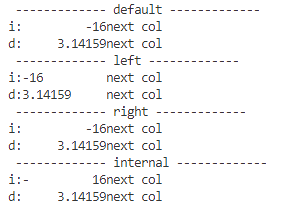
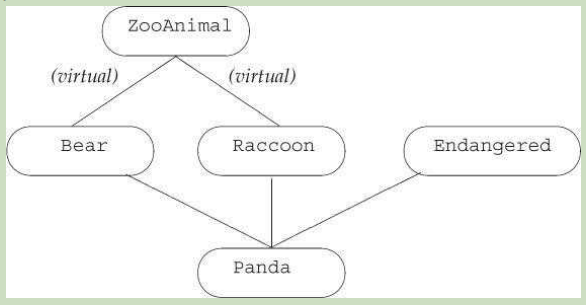

# ch17 Specialized Library Facilities

- 17.1 The tuple Type
- 17.2 The bitset Type
- 17.3 Regular Expressions
- 17.4 Random Numbers
- 17.5 The IO Library Revisited


## 17.1 The tuple Type

tuple是一个模板类似pair

```c++
tuple<T1, T2, ..., Tn> t; // t是一个tuple成员个数为n, 成员是值初始化
tuple<T1, T2, ..., Tn> t(v1, v2, ..., vn); // 初始化器初始化
make_tuple(v1,v2, ..., vn); // 类型根据初始化器推断
t1==t2; // 数量相等, 成员相等, 使用 ==
t1!=t2; // 
t1 relop t2; //
get<i>(t); // 第i个元素的引用
tuple_size<tupleType>::value; // 类模板, 成员数量
tuple_element<i, tupleType>::type; // 类模板, 元素类型
```

知道有多少个元素, 第i个元素类型, 第i个元素引用


### 17.1.1 Defining and Initializing tuples

```c++ 
// 定义tuple , 需要指定每个成员类型
tuple<size_t, size_t, size_t> threeD; // 所有的值为0
tuple<string, vector<double>, int, list<int>>
    someVal("constants", {3.14, 2.718}, 42, {0,1,2,3,4,5});
```

tuple的默认构造器是值初始化的

因为这个构造器是explicit所以必须使用直接语法

```c++ 
tuple<size_t, size_t, size_t> threeD = {1,2,3}; // error
tuple<size_t, size_t, size_t> threeD{1,2,3}; // ok
```

类似make_pair, 这里有make_tuple

```c++ 
auto item = make_tuple("0-999-78345-X", 3, 20.00);
```

这类item的类型是

```c++ 
tuple<const char*, int, double>
```


#### Accessing the Members of a tuple

函数模板名为get, 用来访问tuple 成员

```c++ 
auto book = get<0>(item); // item的第一个成员
auto cnt = get<1>(item); // 
auto price = get<2>(item)/cnt;
get<2>(item) *= 0.8;
```

尖括号内的值必须是 integral constant expression

```c++ 
typedef decltype(item) trans; // trans的类型和item一致
size_t sz = tuple_size<trans>::value; // 返回3
tuple_element<1, trans>::type cnt = get<1>(item); // cnt是int
```

tuple_size有一个public static 数据成员名为value, 代表成员数量

tuple_element 有一个public成员名为type

为什么又不是静态成员了呢?

一个是对象所有, 一个不是


#### Relational and Equality Operators

使用小于号要求, 元素数量必须相同

```c++ 
tuple<string, string> duo("1","2");
tuple<size_t, size_t> twoD(1,2);
bool b = (duo==twoD); // error: 不能比较size_t 和 string
tuple<size_t, size_t, size_t> threeD(1,2,3);
b = (twoD<threeD); // 数量不相同
tuple<size_t, size_t> origin(0,0);
b=(origin<twoD); // ok: b is true
```

因为tuple定义了<和==, 所以可以用作容器的key


### 17.1.2 Using a tuple to Return Multiple Values

```c++ 
vector<vector<Sales_data>> files; // 每个元素代表一个商店的数据
```

在第一个vector中找下标, 第二个vector中找range


#### A Function That Returns a tuple

结果是vector里面装了tuple表示每个书店的查询结果

```c++ 
typedef tuple<vector<Sales_data>::size_type, vector<Sales_data>::const_iterator, vector<Sales_data>::const_iterator> matches;

// findBook 返回每个store中这本书的售卖记录
vector<matches> findBook(const vector<vector<Sales_data>> &files, const string &book){
    vector<matches> ret;
    for(auto it = files.cbegin(); it!=files.cend(); ++it){
        auto found = equal_range(it->cbegin(), it->cend(), book , compareIsbn);
        if(found.first!=found.second)
            ret.push_back(make_tuple(it-files.cbegin(), found.first, found.second));
    }
    
    return ret;
}
```


#### Using a tuple Returned by  a Function

```c++ 
void reportResults(istream &in, ostream &os, const vector<vector<Sales_data>> &files){
    string s;
    while(in>>s){
        auto trans = findBook(files, s);
        if(trans.empty()){
            cout<<s<<"not found in any stores"<<endl;
            continue;
        }
        for(const auto &store: trans){
            os<<"store "<<get<0>(store)<<" sales: "
                <<accumulate(get<1>(store), get<2>(store), Sales_data(s))<<endl;
        }
    }
}
```


## 17.2 The bitset Type

bitset定义在bitset头部


### 17.2.1 Defining and Initializing bitsets

bitset是模板类, 像array一样, 有固定的尺寸, 尺寸是bitset类型的一部分

```c++ 
bitset<32> bitvec(1U); // 32bits, 低位bit是1, 剩下的是0
```


```
bitset<n> b; // b有n个bits, 每个bit为0, 构造器是constexpr
```

构造器是constexpr 是什么意思?

```c++ 
bitset<n> b(u); // b是unsigned long long value的低n位bit
```

构造器仍然是constexpr

```c++ 
bitset<n> b(s, pos, m, zero, one);
```

b是从string  s的pos位置开始拷贝n个字符, s只包含zero和one, 如果包含任何其它字符抛出invalid_argument. 

```c++ 
bitset<n> b(cp, pos, m, zero, one);
```

cp指向的字符数组

size 必须是常量表达式. 


#### Initializing a bitset from an unsigned value

使用整型值初始化bitset的时候, 被转化为 unsigned long long

```c++ 
bitset<13> bitvec1(0xbeef); // 1 1110 1110 1111
bitset<20> bitvec2(0xbeef); // 0000 1011 1110 1110 1111
bitset<128> bitvec3(~0ULL); // 0...63是1, 63到127是0
```

高位0补足


#### Initializing a bitset from a string

```c++ 
bitset<32> bitvec4("1100"); // bits2和3是1, 其它是0
```

string初始化bitset , 左边为高位

使用string的部分

```c++ 
string str("1111111000000011001101"); // 7个1, 7个0, 1100, 1101
bitset<32> bitvec5(str, 5, 4); // 从str[5]开始4个bits, 1100
bitset<32> bitvec6(str, str.size()-4);// 最后4个 1101
```


### 17.2.2 Operations on bitsets

```c++ 
b.any();
b.all();
b.none();
b.count();// 1个个数
b.size(); // bits数
b.test(pos); // pos位置是否为on
b.set(pos, v); // v默认为1
b.set(); // 所有的设置为1
b.reset(pos); // 设置pos位置为0
b.reset(); // 所有为0
b.flip(pos); // 翻转pos位置
b.flip(); // 翻转所有
b[pos]; // 访问
b.to_ulong(); // unsigned long 或者unsigned long long 超过抛出overflow_error
b.to_ullong();

b.to_string(zero, one); // 0使用zero, 1使用one的 string表示
os<<b;
is>>b;
```

对一个位, 设置, 翻转, 取消, 访问, test

转化为ulong, 或者string

```c++ 
bitset<32> bitvec(1U);
bool is_set = bitvec.any();// true
bool is_not_set= bitvec.none(); // false
bool all_set = bitvec.all(); //false
size_t onBits = bitvec.count();// 1
size_t sz = bitvec.size(); // 32
bitvec.flip(); // 
bitvec.reset(); // 所有为0
bitvec.set(); // 所有为1
```


#### Retrieving the Value of a bitset

to_ulong

to_ullong

如果超过范围, 抛出overflow_error


#### bitset IO Operators

字符串到bitset

```c++ 
bitset<16> bits;
cin>> bits;
cout<<"bits: "<<bits<<endl;
```


#### Using bitsets

```c++ 
bool status;
unsigned long quizA = 0;
quizA |= 1UL<<27;
status = quizA &(1UL <<27); // 检查27号学生
quizA &= ~(1UL <<27)
```


换成bitset

```c++ 
bitset<30> quizB;
quizB.set(27);
status = quizB[27];
quizB.reset(27);
```


## 17.3 Regular Expressions

描述序列字符的一种方式.

stunningly 令人震惊的

RE library定义在regex 头部

```
regex 代表正则表达式
regex_match 匹配一个字符串
regex_search 找到第一个子序列
regex_replace 使用给定的format替换正则
sregex_iterator 适配器, 调用regex_search 遍历匹配的元素, 
smatch 容器类, 保存查询的结果
ssub_match 匹配的子表达式
```

sregex_iterator, 是不是从一个匹配到另一个匹配


regex代表正则, 

regex_match和regex_search用来查找 返回值为true

smatch 容器类保存查询结果


regex_replace, sregex_iterator, ssub_match 不太熟悉


```c++ 
(seq, m, r, mft);
(seq, r, mft);
```

m代表match 对象, 放在这个位置?

mft表示可选项: regex_constants::match_flag_type


### 17.3.1 Using the Regular Expression Library

```c++ 
string pattern("[^c]ei"); // 找ei, 但前面不能是c
pattern = "[[:alpha:]]*"+pattern+"[[:alpha:]]*";
regex r(pattern);
smatch results;
string test_str = "receipt freind theif receive";
if(regex_search(test_str, results, r))
    cout<<results.str()<<endl;
```

`[^c]ei` 只能表示3个字符, 我们需要前面后面都允许出现字符

[[:alpha:]] 表示字符


#### Specifying Options for a regex Object

可以通过flags管理regex如果工作


```c++ 
regex r(re);
regex r(re, f);
```

re可以是string, 字符range, null结尾的字符数组, 字符指针和count, braced list of 字符

f不设置默认是ECMAScript

```c++ 
r1 = re; // 可以是大括号字符, null字符数组, string, regex
r1.assign(re, f); 
r.mark_count(); // r中的子表达式数量
r.flags(); // 返回r中的flags

// regex_constants::syntax_option_type
icase ; // 忽略大小写
nosubs;//  不要子匹配
optimize; // 执行速度优于构造
ECMAScript; // 使用语法ECMA-262
basic; // 使用POSIX basic语法
extended; // 使用POSIX extended语法
awk; // POSIX版本, awk的
grep; // POSIX版本, grep的
egrep; // POSIX版本, egrep的
```


```c++ 
regex r("[[:alnum:]]+\\.(cpp|cxx|cc)$", regex::icase);
```

因为`\` 是一个特殊字符, 所以使用`\` 转义


#### Errors in Specifying or Using a Regular Expression

正则表达在运行时编译, 当一个regex对象被初始化或者赋值一个新的pattern

如果正则出错, 运行时抛出异常regex_error


#### Regular Expression Classes and the Input Sequence Type

不同的输入序列对应不同的正则类

```
string regex, smatch,ssub_match, sregex_iterator
const char*	regex, cmatch, csub_match, cregex_iterator
wstring	wregex,wsmatch,wssub_match, wsregex_iterator
const wchar_t*	wregex, wcmatch, wcsub_match, wcregex_iterator
```

match, sub_match, regex_iterator

前面分别加上 s, c, ws, wc


### 17.3.2 The Match and Regex Iterator Types

```c++ 
sregex_iterator it(b, e, r);
sregex_iterator end; // off-the-end iterator

*it; // smatch 的引用或者指针
it->; // 

++it; // 引用
it++; // 值

it1 == it2; // 来自相同的string和r
```

当我们 给 sregex_iterator 传递string和regex对象, 

迭代器自动指向第一个匹配的string


#### Using an sregex_iterator

```c++ 
string pattern("[^c]ei");
pattern = "[[:alpha:]]*"+pattern+"[[:alpha:]]*";
regex r(pattern, regex::icase);
for(sregex_iterator it(file.begin(), file.end(), r), end_it; it!=end_it; ++it)
    cout<<it->str()<<endl;
```


#### Using the Match Data

smatch 操作

```c++ 
m.ready(); // 如果m被regex_search或者regex_match 设置后返回true

m.size(); // 0如果匹配失败, 1+子表达式数量

m.empty(); // true如果m.size()为0

m.prefix(); // 匹配之前 ssub_match
m.suffix(); // 匹配之后
m.format(...);


m.length(n); // 第n个匹配的size
m.position(n); // 第n个子表达式到开头的距离
m.str(n); // 第n个匹配的string
m[n]; // ssub_match对象

m.begin(), m.end();
m.cbegin(), m.cend();
```

format不理解, length不理解, begin不理解

submatch operation

```c++ 
matched; // bool
first;
second;
length(); // 子匹配string 长度
str(); // 子匹配string
s=ssub; // 等价于ssub.str()赋值给s
```


page 907 2025年2月25日17:58:18

### 17.3.3 Using Subexpressions

```c++ 
regex r("([[:alnum:]]+)\\.(cpp|cxx|cc)$", regex::icase);
```

有两个子表达式

- ([[:alnum:]]+) 一个或多个字符
- (cpp|cxx|cc) 文件扩展

只打印文件名字

```c++ 
if(regex_search(filename, results, r))
    cout<<results.str(1)<<endl;
```

如果文件名是foo.cpp

那么: results.str(0) 是foo.cpp

results.str(1) 是 foo

results.str(2) 是 cpp


#### Subexpressions for Data Validation

- `\{d}`  代表一个数字, `\{d}{n}` 代表n个数字, 比如`\{d}{3}` 代表3个数字
- `[_. ]` 匹配dash, dot, space的任何一个字符.
- `?` component后面跟着`?` 表示可选 `\{d}{3}[-. ]?\{d}{4}` 中括号内的字符可选
- `\` 转义字符, 表示内容是字符本身没有特殊含义

怎么判断有前括号就要有后括号呢?

```c++ 
"(\\()?(\\d{3})(\\))?([-. ])?(\\d{3})([-. ]?)(\\d{4})"
```

1,3,4,6 可选

2,5,7 代表数字

1. `(\\()?` 表示可选的开括号
2. `(\\d{3})` 表示area code
3. `(\\))?`  表示可选的关括号
4. `([-. ])?` 表示可选的分隔符
5. `(\\d{3})` 表示3个数字
6. `([-. ])?` 另一个可选的分割符
7. `(\\d{4})` 最后4个素质

```c++ 
string phone = 
    "(\\()?(\\d{3})(\\))?([-. ])?(\\d{3})([-. ]?)(\\d{4})";
regex r(phone); 
smatch m;
string s;
while(getline(cin, s)){
    for(sregex_iterator it(s.begin(), s.end(), r), end_it; it!=end_it; ++it){
        if(valid(*it))
            cout<<"valid: "<<it->str()<<endl;
        else
            cout<<"not valid: "<<it->str()<<endl;
    }
}
```

打印结果使用sregex_iterator的str()


#### Using the Submatch Operations

```c++ 
bool valid(const smatch& m){
    if(m[1].matched)// 如果有开括号
        // 必须有关括号, 并且不存在分隔符或分隔符为空格
        return m[3].matched && (m[4].matched==0||m[4].str()==" ");
    else // 如果没有开括号
        // 必须没有关括号, 这是两个分隔符要相同
        return !m[3].matched && m[4].str() == m[6].str();
}
```


### 17.3.4 Using regex_replace

除了查找之外支持替换

```c++ 
m.format(dest, fmt, mft); // 写入dest
m.format(fmt, mft); // 返回string
```

format是干什么的, fmt和mft各代表了什么?

产生格式化的输出, 格式为fmt.

mft表示match_flag_type flags

fmt表示string或者字符数组, 也就是用字符数组来表示格式?

```c++ 
regex_replace(dest, seq, r, fmt, mft);
regex_replace(seq, r, fmt, mft);

```

通过seq的迭代器, 使用regex_search寻找匹配r 的文本. 使用fmt和mft格式化输出. 

fmt 可以是指针对, 或者c style 字符数组

mft 默认为 match_default


```c++ 
string fmt = "$2.$5.$7"; // ddd.ddd.dddd

regex r(phone);
string number = "(908) 555-1800";
cout<<regex_replace(number, r, fmt)<<endl;
```

结果为908.555.1800


#### Replacing Only Part of the Input Sequence

regex_replace : 将输入序列中所有匹配的文本替换为output, 其它不变

```c++ 
string phone = "(\\()?(\\d{3})(\\))?([-. ])?(\\d{3})([-. ]?)(\\d{4})";
regex pattern = regex(phone);

string input = "hello123-456-7890world123-456-7890nihao";
smatch results;
string output = "$2.$5";
// Phone number found: hello123.456world123.456nihao
cout << "Phone number found: " << regex_replace(input, pattern, output)
     << endl;


// fmt 为$2.$5
// 说明 123-456-789 被替换为了 123.456 
```


#### Flags to Control Matches and Formatting

flag 控制

- 匹配过程
- 替换过程中的格式化


smatch有一个format成员, regex_search和regex_match的参数可以接收

定义在regex_constants::match_flag_type

```
match_default;
match_not_bol; // 不要把第一个字符当成一行开始
match_not_eol; // 不把最后一个字符当做一行结尾
match_not_bow; // 不把第一个字符当做一个单词开始
match_not_eow; // end of word 不把最后一个字符当做单词结尾
match_any; // 如果超过一个匹配, 返回任何一个就行
match_not_null; // 不要匹配空序列
match_continuous; // 匹配必须开始于第一个字符
match_prev_avail; // 第一个匹配字符前允许有字符
format_default; // ECMAScript 规则
format_sed; // POSIX sed规则
format_no_copy; // 不输出没有匹配的部分
format_first_only; // 只替换第一次出现的地方
```


可以理解的内容

format_first_only, format_no_copy, match_pre_avail, match_continuous, match_any, 

不太熟悉的

match_not_bol

format_default

format_sed


在std命名空间中的regex_contants子命名空间中


#### Using Format Flags


## 17.4 Random Numbers

random-number library 定义在random 头部

random-number engines classes

random-number distribution classes

engine生成无符号随机序列

distribution 使用engine, 生成特定类型的随机数, 在给定的范围内, 指定分布

c++程序员推荐使用 default_random_engine + 合适的分布对象


### 17.4.1 Random-Number Engines and Distribution

random-number engines 是函数对象类

engine可以直接调用, 生成无符号整数

```c++ 
default_random_engine e;
for(size_t i=0; i<10; ++i)
    cout<<e()<<" ";
```


engine 操作

```
Engine e; // 默认构造器, 使用默认种子
Engine e(s); // 使用整数值作为种子
e.seed(s); // 使用s重置种子状态
e.min();
e.max(); // 这个生成器可以得到的最大最小值

Engine::result_type;// 值类型, 这个引擎生成的
e.discard(u); // engine前进u步
```


#### Distribution Types and Engines

从一个范围得到数字, 使用distribution type

```c++ 
uniform_int_distribution<unsigned> u(0, 9);
default_random_engine e; // 用来生成无符号随机整数
for(size_t i =0; i<10; ++i)
	// u使用e作为source
    // 每个调用返回范围内均匀分布的随机值
    cout<<u(e)<<"";
```

uniform_int_distribution<unsigned> u(0, 9)

- 均匀分布
- unsigned值
- 最小为0, 最大为9 包含

和engine一样 distribution type也是函数对象类

distribution type类接收一个engine作为参数

engine用来生成数, distribution 对象映射到特定的分布

我们像u传递的是e不是`e()`


random-number generator 代表: 分布对象+引擎


#### Comparing Random Engines and the rand Function


#### Engines Generate a Sequence of Numbers

为了避免每次产生的数据一样, 可以make the engine and associated distribution objects static.

```c++ 
vector<unsigned> good_randVec(){
    static default_random_engine e;
    static uniform_int_distribution<unsigned> u(0,9);
    vector<unsigned> ret;
    for(size_t i = 0; i<100; ++i)
        ret.push_back(u(e));
    
    return ret;
}
```


#### Seeding a Generator

```c++ 
default_random_engine e1;
default_random_engine e2(2147483646); // 使用给定的seed
default_random_engine e3;
e3.seed(32767);
default_random_engine e4(32767); // 
for(size_t i =0; i!=100; ++i){
    if(e1()==e2())
        cout<<"unseeded match at iteration: "<<i<<endl;
    if(e3()!=e4())
        cout<<"seeded differs at iteration: "<<i <<endl;
}
```

e3和e4的seed一样, 所以结果一样

time函数, 定义在ctime头部, 可以 用来作为seed

返回从a given epoch到现在的秒数

如果给time一个指针参数, 秒数写入这个参数, 否则time返回这个秒数

```c++ 
default_random_engine e1(time(0));
```


### 17.4.2 Other Kinds of Distributions

```c++ 
Dist d; // 默认构造器
d(e); // e是一个random-number engine object, d是distribution
d.min();
d.max();
d.reset(); // 后续的使用不基于d已经生成的数
```


#### Generating Random Real Numbers

为什么不用rand()/ RAND_MAX 因为有些值永远不会出现

```c++ 
default_random_engine e;
// 均匀分布, 从0,1, 包含
uniform_real_distribution<double> u(0, 1);
for(size_t i=0; i<10; ++i)
    cout<<u(e)<<" ";
```


#### Using the Distribution's Default Result Type

distribution的类型和结果类型

distribution 是一个模板, 有一个模板参数默认为double, 可以改为int

如果想要使用默认值, 需要提供尖括号

```c++ 
// <> 表示我们要默认的double 类型
uniform_real_distribution<> u(0,1); // double 默认
```


#### Generating Numbers That Are Not Uniformly Distributed

非均匀分布

the library defines 20 distribution types!

均值4, 标准差1.5

normal distribution

所以在[0, 8] 范围内的数为99%

```c++ 
default_random_engine e;
normal_distribution<> n(4, 1.5); // 平均值4, 标准差1.5
vector<unsigned> vals(9); // 9个元素, 初始值为0
for(size_t i = 0; i!=200; ++i){
    unsigned v = lround(n(e));
    if(v<vals.size())
        ++vals[v]; // 计算每个数出现的次数
}

for(size_t j=0; j!=vals.size();++j){
    cout<<j<<": "<<string(vals[j], '*')<<endl;
}
```


#### The bernoulli_distribution Class

伯努利分布

bernoulli_distribution不是一个模板, 而是一个普通类

返回一个bool值, true的可能为0.5

```c++ 
default_random_engine e;
bernoulli_distribution b;
bool first = b(e); // true/false
```

因为engine会产生相同序列的数, 所以我们在循环外面定义

同理, 分布也应该保持状态, 定义在循环之外

```c++ 
bernoulli_distribution b(.55); // 55%的胜率
```


## 17.5 The IO Library Revisited

io特性

1, format control

2, unformatted IO

3, random access


### 17.5.1 Formatted Input and Output

每个iostream对象维护了一个format state

一个操作器manipulator 是一个函数或对象, that 影响一个流的状态, 可以作为输入输出操作符的操作数

熟悉的操作器: endl

endl: 像一个值一样写入到输出流, 但又不是普通值, 他执行一个操作: 写一个newline然后刷新buffer


#### Many Manipulators Change the Format State

- 控制表现形式
- 控制padding


#### Controlling the Format of Boolean Values

boolalpha, 默认true输出1, false输出0, 可以通过boolalpha覆盖这个行为

noboolalpha 恢复默认输出

```c++ 
boolbool_val = get_status();
cout<<boolalpha
    <<bool_val
    <<noboolalpha;
```


#### Specifying the Base for Integral Values

Base 表示进制

```c++ 
cout<<"default: "<<20<<" "<<1024<<endl;
cout<<"octal: "<<oct<<20<<" "<<1024<<endl;
cout<<"hex: "<<hex<<20<<" "<<1024<<endl;
cout<<"decimal: "<<dec<<20<<" "<<1024<<endl;
```

dec, oct, hex 只会影响整型操作数


#### Indicating Base on the Output

showbase manipulator

- 0x 表示hexadecimal
- 0表示octal
- 缺少表示 decimal

打开, showbase, 

关闭, noshowbase


大写: uppercase

```c++ 
cout<<uppercase <<shobase<<hex;
```

回到初始状态: nouppercase, noshowbase, dec


#### Controlling the Format of Floating-Point Values

浮点控制

- 精度
- 进制
- 是否为整数的浮点值打印小数点

默认 6 位精度, 省略整数的小数点, 非常大或小的数使用科学计数法

#### Specifying How Much Precision to Print

setprecision 操作符定义在iomanip 头部

```c++ 
cout.precision();// 查询精度
cout.precision(12);// 设置精度, 返回旧的精度
setprecision(12); // 设置精度
```

设置精度有两个方法: cout.precision(12), setprecision(12)


iostream的操作符

```
left  // 右边填充字符
right	// 左边填充字符
internal // sign和value之间填充
fixed // 浮点数十进制 decimal notation
scientific // 浮点数, 科学计数
hexfloat // 浮点数, 16进制
defaultfloat // 重置默认
unitbuf // 每个输出操作刷新buffer
nonunitbuf // 默认
skipws // 输入跳过空格
noskipws // 不跳过空格
flush // 刷新ostream
ends // 插入null, 刷新ostream buffer
endl // 插入newline, 刷新ostream
```

left, right, 和internal 不太理解

sqrt在cmath头部

square root 平方根


#### Specifying the Notation of Floating-Point Numbers

precision 指定的总数, 小数+整数


#### Printing the Decimal Point

默认如果小数部分为0, 是不打印小数点的

```c++ 
cout<<10.0<<endl; //  10
cout<<showpoint<<10.0 // 10.0000
    << noshowpoint<<endl;
```


#### Padding the Output

- setw 最小空间, 为接下来内容准备的列数
- left 左调整
- right 右调整
- internal 左调整符号, 有调整值, 空格留在中间
- setfill 使用字符填充输出, 默认是空格




看到并记到, 看到并用


#### Controlling Input Formatting

```c++ 
cin>>noskipws; // set cin 读取空白
while(cin>>ch)
    cout<<ch;
cin>>skipws; 
```


### 17.5.2 Unformatted Input/Output Operations

处理一个stream as a sequence of uninterpreted bytes.


#### Single-Byte Operations

一次读取一个字符

```c++ 
char ch;
while(cin.get(ch))
    cout.put(ch);
```


单byte 低级别io 操作

```c++ 
is.get(ch); // 从istream中读取一个字符到ch
os.put(ch); // 字符ch写到os上
is.get(); // 读取下一个byte作为int
is.putback(ch); // ch放回is
is.unget(); // is往回走一个byte
is.peek(); // 返回下一个byte但是不删除
```

get(ch) 对应 pushback(ch)

get()之后是不是unget之后可以再次get()?

```c++ 
int i = cin.get();
cin.unget();
int j = cin.get();
cout<<"i="<<i<<" j="<<j<<endl;
```


#### Putting Back onto an Input Stream

我们想要读取一个数, 但是不想从istream中移除

- peek
- unget 后退一步, 再次读取最后一次读取的值
- putback 返回最后一次读取的值, 接受一个参数必须和最后一次读取的值一样

putback不是多此一举?

不是, 目标是后退一步

通常只能后退一步


#### int Return Values from Input Operations

peek和get 会将char读取为int

为什么读取int? 为了表示end-of-file marker

```c++ 
int ch;
while((ch=cin.get())!=EOF)
    cout.put(ch);
```

character 转化为unsigned char 然后转化为 int


#### Multi-Byte Operations

要求我们管理 character arrays 

```
is.get(sink, size, delim); // 读取size个字符到sink, 直到遇到delim或者size或者end-of-file. delim不读取到sink

is.getline(sink, size, delim); // 读取并抛弃delim

is.read(sink, size); // 读取size个字符

is.gcount(); // 最后一个unformatted read操作读了多少个字符

os.write(source, size);// 从source写size个字符到os

is.ignore(size, delim); // 读取至多size个字符直到delim.
```

ignore有默认值, size=1, delim为end-of-file

3参数的get, sink, size, delim

getline(sink, size, delim) 居然和get一致

read(sink, size) 和get 有什么区别?

is.gcount和is.ignore 不太熟悉


停止位:

- size-1 个字符被读取, 最后一个用来放null把?
- end-of-file
- delimiter 

get和getline区别, get让delimiter 留在is中, getline拿出来丢了


#### Determining How Many Characters Were Read

如果在peek, unget, putback之后运行gcount, 结果为0


### 17.5.3 Random Access to a Stream

#### Seek and Tell Functions

seek到一个新的位置

tell 告诉当前的位置

g表示get, p表示putting

```
tellg() // input stream
tellp() // output stream

seekg(pos) // pos是tellg或者tellp的返回值
seekp(pos) // 

seekp(off, from) // 偏离from off个字符
seekg(off, from)

```

from可以是

beg, cur, beg


#### There Is Only One Marker


#### Repositioning the Marker

绝对位置和相对位置

```c++ 
seekg(new_position); // 设置read marker
seekp(new_position); // 设置write marker

seekg(offset, from); // 从from偏移offset, offset的类型为off_type
seekp(offset, from);
```

位置的类型为 pos_type

offset的类型为off_type

off_type的值可以为正数和负数


#### Accessing the Marker

tellg 和 tellp 返回一个pos_type 指示当前的位置

tell函数通常用来记录一个将要返回的位置

```c++ 
ostringstream writeStr;
ostringstream::pos_type mark = writeStr.tellp();
if(cancelEntry)
    writeStr.seekp(mark);
```


#### Reading and Writing to the Same File

```c++ 
int main(){
    fstream inOut("copyOut", fstream::ate|fstream::in|fstream::out);
    if(!inOut){
        cout<<"Unable to open file!"<<endl;
        return EXIT_FAILURE;
    }
    // ate模式, 所以开始于结尾
    auto end_mark = inOut.tellg(); // 记住最开始的end-off-file
    inOut.seekg(0, fstream::beg);
    
    size_t cnt = 0;
    string line;
    while(inOut && intOut.tellg()!=end_mark && getline(intOut, line)){
        cnt+=line.size()+1;
        inOut.seekp(0, fstream::end);
        inOut<<cnt;
        if(mark!=end_mark) inOut<<" ";
        inOut.seekg(mark);
    }
    inOut.seekp(0, fstream::end);
    inOut<<"\n";
    return 0;
}
```

ate表示指针在文件末尾

我有一个疑问, 如果文件最后一行没有换行, 那么tellg会直接超过end_mark, 最后一行的数量会不会写?


# ch18 Tools for Large Programs

- 18.1 Exception Handling
- 18.2 Namespaces
- 18.3 Multiple and Virtual Inheritance

异常处理, 命名空间, 多继承

大型程序要求

- The ability to handle errors across independently developed subsystems
- The ability to use libraries developed more or less independently
- The ability to model more complicated application concepts

错误处理, 使用库, 概念建模


## 18.1 Exception Handling

### 18.1.1 Throwing an Exception

抛出的异常类型+调用链决定那个处理器处理异常

控制会从throw 转移到catch


#### Stack Unwinding

异常层层捕获, 若都没有捕获, main终止


#### Objects Are Automatically Destroyed during Stack Unwinding

stack  unwinding is no exception

如果构造中发生异常, 我们保证已经构造的成员被合适的销毁

数组或容器中也是, 异常之前创建的对象被合适的销毁

数组和异常不太好理解


#### Destructors and Exceptions

析构器不能抛出异常

如果析构器抛出异常, 程序马上终止


#### The Exception Object


### 18.1.2 Catching an Exception

catch中的异常类必须有完整的类型, 且不能是右值类型


#### Finding a Matching Handler

异常对象可允许的转换

- 非const 到const
- 衍生类到基类
- 函数或数组到指针


page 952 2025年2月26日17:59:00

#### Rethrow

A rethrow is a throw that is not followed by an expression.

```c++ 
throw;
```

空的throw只能出现在catch内

当前的异常被抛出

rethrow之前可能会修改内容

```c++ 
catch(my_error &eObj){
    eObj.status = errCodes::servereErr;
    throw;
}catch(other_error eObj){
    eObj.status = errCodes::badErr; // 修改无效
    throw; 
}
```


#### The Catch-All Handler

使用省略号for 每个可能的异常, ellipsis for the exception declaration

形如 `catch(...)` 可以捕获任何异常

```c++ 
void manip(){
    try{
        
    }catch(...){
        throw;
    }
}
```

catch(...)应该放在最后, 因为catch(...) 后面的所有catch都会失效


### 18.1.3 Function try Blocks and Constructors

constructor initializer 在进入body之前执行, 所以body中的try catch不能捕获异常

- exception
  - bad_cast
  - bad_alloc
  - runtime_error
    - overflow_error
    - underflow_error
    - range_error
  - logic_error
    - domain_error
    - invalid_argument
    - out_of_range
    - length_error


如何捕获构造器初始化器的异常呢?

```c++ 
template <typename T>
Blob<T>::Blob(initializer_list<T> il) try:
data(make_shared<vector<T>>(il)){
    // body
}catch(const std::bad_alloc &e){
    handle_out_of_memory(e);
}
```

这样的try  `try:`

function try block

function try block

function try block


### 18.1.4 The noexcept Exception Specification

关键字noexcept 放在参数列表后面表示不会抛出异常

```c++ 
void recoup(int) noexcept;
```

noexcept 要出现在所有声明和定义上, 在trailing return 前

可以出现在函数指针的定义上

但是不能出现在typedef 和type 别名上

在const 或者引用限定符之后

在final, override, =0之前


#### Violating the Exception Specification

编译器在编译时不会检查noexcept

```c++ 
// 这个函数会编译通过, 也就是没有检查noexcept语法
void f() noexcept{
    throw exception();
}
```

废弃的throw() 等价于noexcept


#### Arguments to the noexcept Specification

noexcept 允许接受一个参数, true表示不会抛出,

```c++ 
void recoup(int) noexcept(true); // 不会抛出
void alloc(int) noexcept(false); // 能抛出
```


#### The noexcept Operator

noexcept操作符返回bool右值

和sizeof一样, 不会计算操作数

```c++ 
noexcept(recoup(i)); // true, 如果recoup不会抛出
```

 

```c++ 
noexcept(e); // e 调用的所有函数都不抛出, e本身不抛出, 返回true
```


```c++ 
void f() noexcept(noexcept(g())); // f和g的修饰符一致
```

多包装一个noexcept的意义?


#### Exception Specifications and Pointers, Virtuals , and Copy Controls

如果我们定义了一个指针声明为nonthrowing, 我们可以使用指针指向相同限定的函数. 

指针的定义表示可以抛出, 就可以指向任何函数.

```c++ 
// pf1和recoup 都不会throw
void (*pf1)(int) noecept = recoup; 

// pf2可能throw
void(*pf2)(int) = recoup;

pf1 = alloc; // Error, alloc可能throw
pf2 = alloc; // ok, pf2和alloc都会throw
```


虚函数表示不能throw, 派生函数必须为不能throw

虚函数没有说, 派生函数可以throw, 可以不throw

```c++ 
class Base{
    virtual double f1(double) noexcept;
    virtual int f2() noexcept(false);
    virtual void f3();
};

class Derived: public Base{
    public:
    double f1(double); // Error, Base::f1 承诺不throw
    int f2() noexcept(false);
    void f3() noexcept; 
};
```


### 18.1.5 Exceptions Class Hierarchies

exception定义了 

- copy constructor
- copy assignment
- virtual destructor
- virtual member 名为what


what 返回一个const char*, 并且保证不会抛出异常

bad_cast 和 bad_alloc 有默认构造器

runtime_error和logic_error没有, 必须接受一个c-style或者string


#### Exception Classes for a Bookstore Application

```c++ 
class out_of_stock: public runtime_error{
    public:
    explicit out_of_stock(const string &s):runtime_error(s){}
    
};

class isbn_mismatch: public logic_error{
    public:
    explicit isbn_mismatch(const string &s):
    logic_error(s){}
    isbn_mismatch(const string &s){}
    isbn_mismatch(const string &s, const string &lhs, const string &rhs):logic_error(s), left(lhs), right(rhs){}
    const string left, right;
};
```


#### Using Our Own Exception Types

```c++ 
Sales_data& Sales_data::operator+=(const Sales_data& rhs){
    if(isbn()!=rhs.isbn())
        throw isbn_mismatch("wrong isbns", isbn(), rhs.isbn());
    //...
    
}
```


处理异常

```c++ 
Sales_data item1, item2, sum;
while(cin>>item1>>item2){
    try{
        sum = item1+item2;
    }catch(const isbn_mismatch &e){
        cerr<<e.what()<<": left isbn("<<e.left
            <<") right isbn("<<e.right<<")"<<endl;
    }
}
```


## 18.2 Namespaces

### 18.2.1 Namespace Definitions

任何可以出现在全局作用域的声明都可以出现在命名空间中

类, 函数, 变量,模板, 其它空间

```c++ 
namespace cplusplus_primer{
    class Sales_data{}
    Sales_data operator+(const Sales_data&, const Sales_data&);
    class Query{}
    class Query_base{}
}
```

namespace 不能定义在函数或者类里面


#### Each Namespace Is a Scope


#### Namespaces Can Be Discontiguous

```c++ 
namespace nsp{
    
}
```

要么定义nsp, 要么添加到已经存在的nsp

- 定义类, 函数声明, 对象of 类接口, 需要在头文件
- 成员的定义可以在不同的文件中

非内联函数, 静态数据成员, 变量, 只能定义一次

内联函数可以定义多次?

可以, 但是只有一个版本会被保留


#### Defining the Primer Namespace

命名空间内一般不包含include,

因为include之后会变成命名空间的成员

比如命名空间include<string> 头文件包含了这个命名空间, 并且包含string就会冲突


#### Defining Namespace Members

可以在命名空间外定义, 比如全局作用域, 

但是不能在其它命名空间定义


#### Template Specializations

模板专业化必须和原模板在相同的命名空间

```c++ 
// 必须在std里面声明
namespace std{
    template <> struct hash<Sales_data>;
}

// 在std中声明了之后, 就可以在外面定义了
template <> struct std::hash<Sales_data>{
    size_t operator()(const Sales_data& s)const{
        return hash<string>()(s.bookNo)^
            hash<unsigned>()(s.units_sold)^
            hash<double>()(s.revenue);
    }
}
```


#### The Global Namespace

 ```c++ 
 ::member_name
 ```

访问全局命名空间的member_name


#### Nested Namespaces

```c++ 
namespace cplusplus_primer{
    namespace QueryLib{
        class Query{}
        Query operator&(const Query&, const Query&);
    }
    
    namespace Bookstore{
        class Quote{}
        class Disc_quote: public Quote{}
    }
}
```

cplusplus_primer 包含两个嵌套的命名空间, QueryLib和Bookstore

一个嵌套的命名空间就是一个嵌套的作用域

从外面访问嵌套的命名空间需要带上名字

```c++ 
cplusplus_primer::QueryLib::Query
```


#### Inline Namespaces

inline namespace 里面的成员, 就像是包裹空间自己的成员

```c++ 
inline namespace FifthEd{}
namespace FifthEd{
    class Query_base{}
}
```

inline关键字必须出现在第一次定义的时候, 之后可以不携带 

编译器怎么知道是第一次?


#### Unnamed Namespaces

namespace后面没有名字

static lifetime

在第一次使用前创建, 程序结束的时候销毁

匿名空间不能够跨越文件

```c++ 
int i;
namespace {
    int i;
}
i =10; // 错误: 模糊了

```


嵌套匿名空间的访问

```c++ 
namespace local{
    namespace{
        int i;
    }
}

local::i = 42;
```

应该用匿名空间取代文件静态声明


### 18.2.2 Using Namespace Members


#### Namespace Aliases

```c++ 
namespace cplusplus_primer{}
namespace primer = cplusplus_primer; // 别名

namespace Qlib = cplusplus_primer::QueryLib;
Qlib::Query q;
```


#### using Declarations: A Recap

一次引入一个命名空间


#### using Directives

using指令让我们使用未限定的名字

比using的区别是, 没有一次只引入一个的限制


#### using Directives and Scope

using 声明好像是给命名空间成员声明了一个本地别名

using 指定没有声明本地别名, 就像是把成员直接放到了作用域


#### using Directives Example

函数中using ,为什么是放到了全局作用域

```c++ 
namespace blip{
    int i = 16, j = 15, k =23;
}

int j = 0;
void manip(){
    using namespace blip;
    ++i;
    ++j;// Error, 模糊了
	++::j;
    ++blip::j;
    int k = 97;
    ++k;
}
```

那么blip的成员应该出现在哪儿呢?

both blip and manip 被定义的地方

如果manip定义在全局作用域, 那么blip的成员就像是在全局作用域声明了一样


#### Headers and using Declarations or Directives

通常情况下, 头文件不应该包含using声明或者using 指令

除开在函数或者命名空间内

using 声明能在声明的地方找到碰撞并且修复, 所以比指令更好


### 18.2.3 Classes, Namespaces, and Scope

Only names that have been declared before the point of use that are in blocks that are still open are considered.

1. 使用前声明
2. 在打开的块中

```c++ 
namespace A{
    int i;
    namespace B{
        int i;
        int j;
        int f1(){
            int j; // j是局部于f1
            return i;// returns B::i
        }
    }
    int f2(){
        return j; // error: j没有定义
    }
    int j = i; // 初始化从A::i
}
```

注意B中的j没有被A中的`j` 覆盖, 因为A中的j 没有在B之前声明


#### Argument-Dependent Lookup and Parameters of Class Type

```c++ 
std::string s;
std::cin>>s;

// 等价于
operator>>(std::cin, s);
```

这`operator>>` 函数被这string 库定义, string定义在std 命名空间中

当我们将一个类类型传递到一个函数, 编译器查找定义实参类的命名空间

编译器看到operator>>()的调用, 会进行普通作用域查找

1. 普通作用域查找
2. 定义cin和s的命名空间

通过2找到了std 里面定义了string的output operator函数


#### Lookup and std::move and std::forward


#### Friend Declarations and Argument-Dependent Lookup

为什么友元中没有声明的类或函数是关闭空间的成员?

被假定是, 而不是确定

```c++ 
namespace A{
    class C{
		// 两个函数都没声明, 被假定是A的成员
        friend void f2();
        friend void f(const C&);
    }
}
```


通过实参独立查找, 我们能调用f

```c++ 
int main(){
    A::C cobj;
    f(cobj); // ok 通过A::C找到A::f
}
```

从main外面没有找到f, 但是f接受了类类型的参数

所以可以在A::C所在的作用域中去找f()

因为f是C的友元,  并且C外面没声明f, 所以f被假定为A的成员

f 所在的作用域和C所在的作用域并列


### 18.2.4 Overloading and Namespaces

#### Argument-Dependent Lookup and Overloading

name lookup for function that have class-type arguments includes the namespace in which each argument's class is defined.

```c++ 
namespace NS{
    class Quote{}
    void display(const Quote&){}
}

class Bulk_item:public NS::Quote{}
int main(){
    Bulk_item book1;
    display(book1);
    return 0;
}
```

找display除了在main外面找, 还可以在Bulk_item和Bulk_item的基类所在的命名空间找

page 981 2025年2月27日17:59:38


#### Overloading and using Declarations

using声明和重载的区别

using声明, 声明一个名字, 不是一个特定的函数

```c++ 
using NS::print(int); // Error, 不能指定形参
using NS::print; // ok
```

使用using声明一个函数, 所有这个名字的函数都被 引入进来

incorporates 包含

using 声明会增加候选函数


#### Overloading and using Directives

A using directive lifts the namespace members into the enclosing scope.

引入包裹作用域不是当前作用域

也是添加到重载的set

```c++ 
namespace libs_R_us{
    extern void print(int);
    extern void print(double);
}

// 普通声明
void print(const std::string&);

using namespace libs_R_us;

// 这里的候选函数是
print(int);
print(double);
print(const std::string&);
```

和using声明不同, 如果形参列表重复, 不会报错

除非使用的时候不带限定名, 造成模糊

cc: using指令引入的内容是在当前作用域还是上一级作用域


#### Overloading across Multiple using Directives

```c++ 
namespace AW{
    int print(int);
}
namespace Primer{
    double print(double);
}
using namespace AW;
using namespace Primer;
long double print(long double);
int main(){
    print(1);
    print(3.1); // Primer::print(double)
    return 0;
}
```

全局作用域包含print(int), print(double), print(long double)


## 18.3 Multiple and Virtual Inheritance

超过一个直接基类.

pedagogical 教育的


### 18.3.1 Multiple Inheritance

```c++ 
class Bear: public ZooAnimal{}
class Panda: public Bear, public Endangered{}
```

基类只能是已经定义, 并且非final的类


#### Multiply Derived Classes Inherit State from Each Base Class

Panda object

- Bear subpart
  - ZooAnimal members
  - Bear members
- Endangered subpart
  - Endangered members
- Panda members


#### Derived Constructors Initialize All Base Classes

```c++ 
// 显示初始化每个直接基类
Panda::Panda(string name, bool onExhibit)
    :Bear(name, onExhibit, "Panda"),
Endangered(Endangered::critical){}

// 隐式使用Bear默认的构造器
Panda::Panda()
    :Endangered(Endangered::critical){}
```

初始化的顺序来源于继承列表class Panda: public Bear, public Endangered

所以Bear>Endangered>Panda

ZooAnimal>Bear

所以最后的顺序为 ZooAnimal>Bear>Endangered>Panda


#### Inherited Constructors are Multiple Inheritance

可以从基类继承构造器, 但是不能从不同的基类继承相同的构造器

```c++ 
struct Base1{
    Base1() = default;
    Base1(const std::string&);
    Base1(std::shared_ptr<int>);
};
struct Base2{
    Base2() = default;
    Base2(const std::string&);
    Base2(int);
};

// Error: D1::D1(Const string&) 从两个基类
struct D1: public Base1, public Base2{
    using Base1::Base1;
    using Base2::Base2;
};
```

如果两个基类有相同的构造器, 那么衍生类就需要显示定义

```c++ 
struct D2: public Base1, public Base2{
    using Base1::Base1; // 从Base1继承构造器
    using Base2::Base2; // 从Base2继承构造器
    
    // D2必须定义它自己的构造器, that takes a string
    D2(const string&s): Base1(s), Base2(s){}
    D2() = default;
};
```


#### Destructors and Multiple Inheritance

析构在的执行顺序相反: ~Panda>~Endangered>~Bear>~ZooAnimal


#### Copy and Move Operations for Multiply Derived Classes

衍生类的base parts 被自动移动, 拷贝, 赋值, 如果使用了合成版本.


### 18.3.2 Conversions and Multiple Base Classes

到任何基类的指针和引用能指向衍生类对象

```c++ 
void print(const Bear&);
void highlight(const Endangered&);
ostream& operator<<(ostream&, const ZooAnimal&);
Panda ying_yang("ying_yang");
print(ying_yang); // Panda传递给Bear引用
highlight(ying_yang); // Panda传递给Endangered&
cout<<ying_yang<<endl; // Panda 传递给ZooAnimal&
```


#### Lookup Based on Type of Pointer or Reference

object, pointer or reference 的静态类型决定了哪个成员可以使用

```c++ 
Bear *pb = new Panda("ying_yang");
pb->print(); // ok 是Bear接口的一部分, 调用Panda::print()
pb->cuddle(); // Error, 不是Bear接口的一部分
pb->highlight(); // Error, 不是Bear接口的一部分
delete pb; // ok Panda::~Panda()
```


### 18.3.3 Class Scope under Multiple Inheritance

多继承,名字在多个基类中同时寻找, 如果找到了多个就有歧义

不同基类中的两个函数

- 形参列表不同也报错?
- private和public也报错?
- Bear中定义, ZooAnimal中不定义也报错?

因为名字检查发生在类型查找前

最好的办法就是在基类定义

```c++ 
double Panda::max_height() const{
    return std::max(ZooAnimal::max_weight(), 
                   Endangered::max_weight());
}
```


### 18.3.4 Virtual Inheritance

istream和ostream继承了basic_ios

iostream 继承了istream和ostream

所以iostream继承了basic_ios两次

basic_ios中持有一个buffer, 同一个buffer 不能同时用来读取和写入

虚拟继承, 共享它的基类

共享的基类子对象叫做 virtual base class

不管相同的虚拟基类在继承链中出现多少次, 衍生类只包含一份共享的虚拟基类


#### A Different Panda Class



虚拟的衍生, 要在使用之前出现

实际上当我们定义Panda的时候才需要虚拟继承

然而, 如果Bear和Raccoon没有指定virtual on their derivation from ZooAnimal


#### Using a Virtual Base Class

virtual 放在衍生列表中

```c++ 
class Raccoon: public virtual ZooAnimal{}
class Bear: virtual public ZooAnimal{}
```

pubic 和 virtual的顺序没关系

这virtual 指示符表达了分享基类的意愿

```c++ 
// 对于使用Raccoon和Bear的衍生类没有影响
class Panda: public Bear, public Raccoon, poublic Endangered{};
```


#### Normal Conversions to Base Are Supported


#### Visibility of Virtual Base-Class Members

B里面有x

D1 继承 B, D2继承B

D继承D1和D2

D1和D2如果再同时定义x就会产生歧义,单独一个定义或者不定义都不会


### 18.3.5 Constructors and Virtual Inheritance

两个作为基类的兄弟衍生类, 会先初始化他们共同的虚拟基类

```c++ 
Bear::Bear(string name, bool onExhibit)
    :ZooAnimal(name, onExhibit, "Bear"){}
Raccoon::Raccoon(string name, onExhibit)
    :ZooAnimal(name, onExhibit, "Raccoon"){}
```

当构建Panda的时候, 由Panda来构建ZooAnimal, 即使ZooAnimal不是它的直接基类

```c++ 
Panda::Panda(string name, bool onExhibit)
    :ZooAnimal(name, onExhibit, "Panda"),
Bear(name, onExhibit),
Raccoon(name, onExhibit),
Endangered(Endangered::critical),
sleeping flag(false){}
```


#### How a Virtually Inherited Object Is Constructed

顺序有点不同, 

虚拟基类被优先构造了

然后是直接基类

比如Panda的构造

- ZooAnimal
- Bear
- Raccoon
- Endangered
- Panda

虚拟基类, 不管出现的顺序如何, 总是优先构造


#### Constructor and Destructor Order

如果出现多个虚拟基类, 构造顺序从左到右

按照 declaration order,  先构造虚拟基类, 再构造非虚拟基类

anomalies 异常


几个关键类要烂熟于心


# ch19 Specialized Tools and Techniques

- 19.1 Controlling Memory Allocation
- 19.2 Run-Time Type Identification
- 19.3 Enumerations
- 19.4 Pointers to Class Member
- 19.5 Nested Classes
- 19.6 union: A Space-Saving Class
- 19.7 Local Classes
- 19.8 Inherently Nonportable Features


## 19.1 Controlling Memory Allocation

### 19.1.1 Overloading new and delete

new是怎么工作的?

```c++ 
string *sp = new string("a value"); // 分配和初始化一个string
string *arr = new string[10];// 分配10个默认初始化的string
```

1. 表达式调用一个库函数operator new或者operator new[] 分配raw内存
2. 编译器运行合适的构造器构造对象
3. 返回指针


疑问?分配多大的内存呢?


当我们删除对象

```c++ 
delete sp; // 销毁*sp, 释放sp指向的内存
delete [] arr; // 销毁数组中的元素, 释放内存
```

1. 合适的析构器is run on the object to which sp points
2. 调用operator delete或者operator delete[] 释放内存


首先在类或基类的成员中找delete, 没有找到就在global中找

可以使用`::new` 强制使用全局作用域的new


#### The operator new and operator delete Interface

```c++ 
// 可能抛出异常
void *operator new(size_t); // 分配一个对象
void *operator new[](size_t); // 分配一个数组]
void *operator delete(void*) noexcept; // 释放一个对象
void *operator delete[](void*) noexcept; // 释放一个数组

// 不会抛出异常的版本
void *operator new(size_t, nothrow_t&) noexcept;
void *operator new[](size_t, nothrow_t&) noexcept;
void *operator delete(void*, nothrow_t&) noexcept;
void *operator delete[](void*, nothrow_t&) noexcept;
```

类型nothrow_t 是一个struct 定义在new 头部

这个类型没有成员

new头部还有一个成员名为nothrow, 用户可以传递给new, 选择没异常的版本

当我们重载这些函数, 我们也要带上noexcept 指示符


如果要自定义这些函数, 必须在全局作用域, 或者类作用域

如果作为一个类的成员, 是隐式静态的?

为什么默认是静态的?

因为是所有实例共用的, 并且不需要操作成员数据


第一个参数必须为size_t, 必须返回void*

size_t 表示bytes


delete 的第一个参数必须是void*, 返回值指向被释放的内存


#### The malloc and free Functions

malloc 和 free 定义在cstdlib

malloc 接受一个size_t , says how many bytes to allocate

返回指针或者0, 0表示不能分配内存

free接收void*,  这个`void*` 是一个拷贝, malloc返回的指针

free(0) 没有效果

```c++ 
void *operator new(size_t size){
    if(void *mem = malloc(size))
        return mem;
    else 
        throw bad_alloc();
}

void operator delete(void *mem) noexcept {free(mem);}
```


### 19.1.2 Placement new Expressions

```
new (place_address) type
new (place_address) type (initializers)
new (place_address) type [size]
new (place_address) type [size] {braced initializer list}
```

只提供地址而不提供参数的情况, placement new 使用operator new(size_t, void*) 去分配它的内存

这是一个我们不能重载的new版本

```c++ 
operator new(size_t, void*);
```

去分配它的内存

new表达式完成它的工作在这给定的地址

placement new 允许我们在一个分配好的内存地址构造对象

传递一个指针参数会构造对象, 但是不分配内存

placement new 的作用是构造对象

就像allocator的construct成员

placement new与allocator的construct的区别, 是对内存的要求?

construct 要求必须是allocator自己分配的

placement new没有这个要求, 甚至可以引用非动态内存!!!


#### Explicit Destructor Invocation

```c++ 
string *sp = new string("a value");
sp->~string();
```

调用析构器销毁对象但是没有释放空间


## 19.2 Run-Time Type Identification

- typeid operator, 返回给定表达式的类型
- dynamic_cast, 基类到衍射类


如果不是虚函数, 编译器不会通过引用自动调用基类方法

我们可以使用RTTI 运行时类型推断


### 19.2.1 The dynamic_cast Operator

```c++ 
dynamic_cast<type*>(e);
dynamic_cast<type&>(e);
dynamic_cast<type&&>(e);
```

第一个e必须是指针

第二个e必须是左值

第三个e必须不是左值

不是左值这样表示吗?


指针转化失败返回0, 引用转换失败抛出bad_cast异常

e的类型限制:

- 继承目标类型
- 被目标类型继承
- 就是目标类型


#### Pointer-Type dynamic_casts

```c++ 
if(Derived *dp = dynamic_cast<Derived*>(bp)){
    // 使用Derived
}else{
    // 使用Base
    
}
```

如果bp指向Derived 对象, 转化成功

否则结果为0, 转化失败


dynamic_cast 可以转化null pointer 到指定类型的null pointer


把dp放在括号中, 避免后续使用


#### Reference-Type dynamic_casts

错误提示方式不同, 相比指针的动态转化

因为不存在null reference, 所以转化失败抛出 std::bad_cast异常.

bad_cast定义在typeinfo 头部

```c++ 
void f(const Base& b){
    try{
        const Derived &d = dynamic_cast<const Derived&>(b);
    }catch(bad_cast){
        
    }
}
```


### 19.2.2 The typeid Operator

计算表达式类型

```c++ 
typeid(e)
```

e可以是任何表达式, 或者一个类型名字

typeid的结果的 const reference 类型为 type_info

type_info类型定义在typeinfo头部

typeid(a) 如果a是数组类型, 结果是数组类型不是指针

typeid 会忽略top-level

对于引用会得到对象的类型

如果操作数为类类型的左值, 且有至少一个虚函数, 类型会在运行时决定


#### Using the typeid Operator

typeid 通过用来比较两个类型

```c++ 
Derived *dp = new Drived;
Base *bp = dp;
if(typeid(*bp)==typeid(*dp)){
    
}
if(typeid(*bp)==typeid(Derived)){
    
}
```

注意typeid的参数是*bp不是bp

```c++ 
if(typeid(bp)==typeid(Derived)){
    // code never executed
}
```

这里比较Base* 和 Derived

typeid 对于一个指针, 返回指针的静态类型

typeid是否需要运行时检查取决于, 表达式是否需要计算, 表达式是否需要计算取决于, 类型是否有虚函数

如果typeid(*p) 中p指向的类型没有虚函数, 那么p可以是一个无效的指针

否则p必须是一个有效的指针


### 19.2.3 Using RTTI

不应该是派生类的operator=?

```c++ 
class Foo{
    
}
bool operator==(const Foo &lhs, const Foo &rhs){
    
}
```

为什么不会调用派生类的==?


#### The Class Hierarchy

```c++ 
class Base{
    friend bool operator==(const Base&, const Base&);
    public:
    protected:
    virtual bool equal(const Base&) const;
};

class Derived: public Base{
    public:
    protected:
    bool equal(const Base&) const;
};
```


#### A Type-Sensitive Equality Operator

```c++ 
bool operator==(const Base &lhs, const Bast &rhs){
    // 如果typeid不同, 返回false, 否则调用虚函数
    return typeid(lhs)  == typeid(rhs) && lhs.equal(rhs);
}
```

operator==是Base的友元, 但并不是Derived的友元啊


#### The Virtual equal Functions

```c++ 
bool Base::equal(const Base &rhs) const{
    
}
```


### 19.2.4 The type_info Class

type_info 定义在typeinfo 头部

type_info 操作

```
t1==t2; 
t1!=t2;

t.name(); // C-style character string
t1.before(t2); // 
```

t1.before(t2) 不理解

怎样做到只有typeid 操作符可以得到type_info 对象的?


## 19.3 Enumerations

enumeration 定义了一个新的类型, 是一个字面量类型

枚举有两种: scoped 和 unscoped

```c++ 
enum class open_modes{input, output, append};
```

unscoped enumeration 省略class关键字

```c++ 
enum color{red, yello, green};
enum{floatPrec = 6, doublePrec = 10, double_doublePrec = 10};
```


#### Enumerators

the enumerator names in an unscoped enumeration are placed into the same scope as the enumeration itself:

```c++ 
enum color{red, yellow, green};
enum stoplight{red, yellow, green}; // error
enum class peppers{red, yellow, green}; // ok, enumerators 被隐藏
color eyes = green; // ok
peppers p = green; // error, peppers 的 enumerator不在作用域
color hair = color::red; // ok
peppers p2 = peppers::red; // ok
```


默认迭代器开始于0

```c++ 
enum class intTypes{
    charTyp = 8, shortTyp = 16, intType = 16, 
    longTyp = 32, long_longTyp = 64
};
```

可以看到值, 可以相同

enumerators 的值是const

```c++ 
// 定义一个constexpr 变量
constexpr intTypes charbits = intTypes::charTyp;
```

用在switch 语句中

用作nontype template parameter

实例化类的静态数据成员


#### Like Classes, Enumerations Define New Types

```c++ 
open_modes om = 2; // Error, 2不是 type open_modes
om = open_modes::input; // ok
```

unscoped 枚举的对象或者枚举元素, 会自动转化为一个整数类型

```c++ 
int i = color::red;
int j = peppers::red;
```


#### Specifying the Size of an enum

尽管每个枚举定义了一个唯一的类型, 但是它由内置的整数类型表示

枚举不能是字符串?

```c++ 
enum intValues: unsigned long long{
    charTyp = 255, shortTyp = 65535, intTyp = 65535,
    longTyp = 4294967295UL, 
    long_longTyp = 184467407379551615ULL
};
```

如果我们没有指定内置类型, 默认scoped枚举是int

unscoped 枚举没有默认类型;


#### Forward Declarations for Enumerations

```c++ 
 // forward declaration of unscoped enum named intValues
enum intValus: unsigned long long; // unscoped, 必须指定类型
enum class open_modes; // scoped 默认是int
```

因为没有默认的size for unscoped enum, 每个声明必须包含enum的size


#### Parameter Matching and Enumerations

枚举参数不接受整数值, 

整型参数可以接收枚举值, 总是会先提升为int

## 19.4 Pointer to Class Member

a pointer to member

```c++
class Screen{
    public:
    typedef string::size_type pos;
    char get_cursor() const{ return contents[cursor];}
    char get() const;
    char get(pos ht, pos wd) const;
    private:
    string contents;
    pos cursor;
    pos height, width;
};
```


### 19.4.1 Pointers to Data Members

```c++ 
// pdata can point to a string member of a const (or non const) Screen object 
const string Screen::*pdata;
```

const Screen对象的string 成员

指向class Screen的成员, that has 类型const

pdata指向const string成员

当我们初始化了一个  a pointer to member, 我们指出它指向那个成员

```c++ 
pdata = &Screen::contents;
```

这里的取址操作符不是对于内存中的对象, 而是对于类的成员


#### Using a Pointer to data Member

当我们初始化或者赋值一个a pointer to member 那个指针并没有指向任何数据

他指定了一个成员, 但并不是一个对象的成员

当我们解引用这个指针的时候需要传递对象

使用操作符`.* And ->*`

```c++ 
Screen myScreen, *pScreen = &myScreen;
// 解引用pdata, 去获取myScreen对象的成员
auto s = myScreen.*pdata;
// 解引用pdata 通过->获取pScreen指向的对象的成员
s = pScreen->*pdata;

```


#### A Function Returning a Pointer to Data Member

```c++ 
class Screen{
    public:
    static const std::string Screen::*data(){
        return &Screen::contents;
    }
};
```

返回Screen的contents成员的指针

当我们调用data 我们得到一个 a pointer to member

```c++ 
const string Screen::*pdata = Screen::data();
```

访问对象的成员

```c++ 
auto s =  myScreen.*pdata;
```


### 19.4.2 Pointers to Member Functions

```c++ 
auto pmf = &Screen::get_cursor;
```

显示定义

```c++ 
char (Screen::*pmf2)(Screen::pos, Screen::pos) const;
pmf2 = &Screen::get;
```

确实, 只有成员函数才允许有const 限定符

```c++ 
// Error, 必须使用括号
char Screen::*p(Screen::pos, Screen::pos)const; 
```

成员函数不会自动转化为a pointer to that member

```c++ 
pmf = &Screen::get; // 
pmf = Screen::get; // Error
```


#### Using a Pointer to Member Function

```c++ 
Screen myScreen, *pScreen = &myScreen;
// 解引用pmf在pScreen上调用这个函数
char c1 = (pScreen->*pmf)();
char c2 = (myScreen.*pmf2)(0, 0);
```

为什么要添加括号, 因为`()` 的优先级高于 pointer to member

#### Using Type Aliases for Member Pointers

```c++ 
using Action = char (Screen::*)(Screen::pos, Screen::pos) const;
```

使用这个别名

```c++ 
Action get = &Screen::get;
```

当成员指针作为参数传递

```c++ 
Screen& action(Screen&, Action = &Screen::get);
```


#### Pointer-to-Member Function Tables

```c++ 
class Screen{
    public:
    Screen& home();
    Screen& forward();
    Screen& back();
    Screen& up();
    Screen& down();
};
```


定义一个move函数

```c++ 
class Screen{
    public:
    // Action可以表示任何一个动作, home, forward...
    using Action = Screen& (Screen::*)(); // 
    enum Directions{HOME, FORWARD, BACK, UP, DOWN};
    Screen& move(Directions);
    private:
    static Action Menu[];
};
```

move函数

```c++ 
Screen& Screen::move(Directions cm){
    return (this->*Menu[cm])(); // Menu[cm] 指向一个成员函数
}
```

使用move

```c++ 
Screen myScreen;
myScreen.move(Screen::HOME); // 调用myScreen.home
myScreen.move(Screen::DOWN); // 调用myScreen.down
```

初始化table

```c++ 
Screen::Action Screen::Menu[] = {
    &Screen::home, 
    &Screen::forward,
    &Screen::back,
    &Screen::up,
    &Screen::down,
};
```


### 19.4.3 Using Member Functions as Callable Objects


使用成员指针

```c++ 
auto fp = &string::empty; // fp指向string的空函数
// Error, 必须使用.*, ->* 来调用成员指针
find_if(svec.begin(), svec.end(), fp);
```

find_if需要的是一个可调用对象

但是我们提供了fp, 他是一个成员指针

find_if中是这样使用可调用对象的

```c++ 
if(fp(*it)) // error, 需要使用 ->*
```


#### Using function to Generate a Callable

怎样根据成员指针得到可调用对象呢?

需要绑定对象把?

```c++ 
function<bool(const string&)> fcn = &string::empty;
find_if(svec.begin(), svec.end(), fcn);
```

我们告诉function empty是一个函数, 接收一个const string&, 返回一个bool

当function对象持有一个成员指针, 它知道使用`.*` 操作符调用

```c++ 
if(fcn(*it))
```

function会转化为

```c++ 
if(((*it).*p)())
```

`*it` 表示对象, p是成员指针

cc: function既可以接收真实的函数, 也可以接收函数占位符

并且function知道如何处理函数和函数占位符

要是我们的vector持有的是string, 我们要告诉function , 期待一个指针

```c++ 
vector<string*> pvec;
function<bool (const string*)> fp = &string::empty;
// fp接受一个string*, 使用->*去调用empty
find_if(pvec.begin(), pvec.end(), fp);
```


#### Using mem_fn to Generate a Callable

page 1031 2025年2月28日17:28:56

活用算法

记忆类

框架梳理

到4月1号, 整整一年, 有没有学会怎么去看一本书?
第一遍, 语言

第二遍, 语法

第三遍, 习题

第四遍, 思路

怎样才算掌握一个知识点

从无到有学会一个知识点会经历哪些过程

想起来年会记忆名字, 如此困难

一个知识点有逐步掌握的过程

000

001

010

011

100表示-4, 取反011, 加1表示100

101

110

111

所以0和-4, 的相反数是本身

要知道量子力学, 要知道c++内存模型,  理解引用不是对象是什么意思?


#### Using mem_fn to Generate a Callable

要使用function, 我们必须提供调用签名

让编译器推断类型呢?

mem_fn

定义在functional拖布

mem_fn 从一个 a pointer to member 生成可调用对象

```c++ 
find_if(svec.begin(), svec.end(), mem_fn(&string::empty));
```

mem_fn生成的函数对象可以接收对象或者指针

```c++ 
auto f = mem_fn(&string::empty);
f(*svec.begin());
f(&svec[0]);
```


#### Using bind to Generate a Callable

```c++ 
auto it = find_if(svec.begin(), svec.end(), bind(&string::empty, _1));
```

bind传递的不是函数吗? 成员指针也行?

```c++ 
auto f = bind(&string::empty, _1);
f(*svec.begin()); // 使用 .* 调用empty
f(&svec[0]); //使用 .-> 调用empty
```


## 19.5 Nested Classes

#### Declaring a Nested Class

```c++ 
class TextQuery{
    public:
    class QueryResult; // 嵌套内之后定义
};
```

现在QueryResult变成了类型成员, 我们使用之前必须先要声明


#### Defining a Nested Class outside of the Enclosing Class

在包裹类外面定义 

```c++ 
class TextQuery::QueryResult{
    friend std::ostream& print(std::ostream&, const QueryResult&);
    public:
    QueryResult(std::string, std::shared_ptr<std::set<line_no>>, 
               std::shared_ptr<std::vector<std::string>>);
};
```


#### Defining the Members of a Nested Class

```c++ 
TextQuery::QueryResult::QueryResult(string s, 
                                   shared_ptr<set<line_no>> p,
                                   shared_ptr<vector<string>> f):
sought(s), lines(p), file(f){}
```


#### Nested-Class static Member Definitions

如果QueryResult定义了一个static 成员, 它的定义将出现在TextQuery之外

```c++ 
int TextQuery::QueryResult::static_mem =1024;
```


#### Name Lookup in Nested Class Scope

a nested class is a type member of its enclosing class.

```c++ 
TextQuery::QueryResult TextQuery::query(const string  &sought) const{
    static shared_ptr<set<line_no>> nodata(new set<line_no>);
    auto loc = wm.find(sought);
    if(loc == wm.end())
        return QueryResult(sought, nodata, file);
    else
        return QueryResult(sought, loc->second, file);
}
```

因为返回值不在类的作用域内, 所以指定TextQuery::

函数内部就可以直接引用QueryResult了


#### The Nested and Enclosing Classes Are Independent

Text::query中的第二个return语句

```c++ 
return QueryResult(sought, loc->second, file);
```


## 19.6 union: A Space-Saving Class

A union is a special kind of class.

可能有多个成员, 但一个时刻只有一个成员有值

就像单选框?

一个union 定义了一个新类型, 空间至少为最大成员的空间

不能有引用成员, 默认union的成员是public, 

不能继承和被继承, 没有虚函数


#### Defining a union

mutually 相互的

不同类型的, 相互排他值的, 一个集合

```c++ 
union Token{
    char cval;
    int ival;
    double dval;
};
```

Token的对象包含以下任何一个成员


#### Using a union Type

```c++ 
Token first_token = {'a'};
Token last_token;
Token *pt = new Token;
```

优先初始化第一个成员

成员访问

```c++ 
last_token.cval = 'z';
pt->ival = 42;
```

赋值一个成员, 就使得其它成员为undefined

所以我们必须时刻知道, 当前union中存放的成员


#### Anonymous unions

关闭的大括号和封号之间没有名字, 是匿名的一个条件

```c++ 
union{
    char cval;
    int ival;
    double dval;
}; // 定义一个未命名对象, 它的成员可以直接访问
cval = 'c';
ival =42; // 那个匿名对象现在持有值42
```

不能有成员函数, 不能有private和protected修饰符


#### unions with Members of Class Type

如果一个类定义了构造器, 并且作为union的成员, 会被编译器添加delete修饰符?

如果union包含了一个string, 且没有定义默认构造器或拷贝控制成员, 编译器将会把这些遗漏的成员标记为deleted

也就是包含string必须包含构造器?


#### Using a Class to Manage union Members

discriminant  判别

为了保证union和discriminant 一致

union作为Toke类的匿名成员, discriminant作为Token的成员

```c++ 
class Token{
    public:
    // 拷贝控制是需要的, 因为我们的类有一个union包含了一个string成员
    Token(): tok(INT), ival{0}{}
    Token(const Token &t):tok(t.tok){copyUnion(t);}
    Token &operator=(const Token&);
    ~Token() {if(tok==STR) sval.~string();}
    Token &operator=(const std::string&);
    Token &operator=(char);
    Token &operator=(int);
    Token &operator=(double);
    private:
    enum{INT, CHAR, DBL, STR} tok;
    uion{
        char cval;
        int ival;
        double dval;
        std::string sval;
    };
    void copyUnion(const Token&);
};
```

union 持有int值, tok将have the value INT

union 持有string值, tok 将have the value string

为什么tok可以拥有两种类型?

为什么可以把t.tok赋值给 tok? t.tok不是类型吗? 不是, 是一个私有成员

tok cc = INT

析构器不知道union持有的是哪个值, 所以不会主动运行


#### Managing the Discriminant and Destroying the string

```c++ 
Token &Token::operator=(int i){
    if(tok==STR) sval.~string(); // 有string要显示释放
    ival =i;
    tok = INT;
    return *this;
}
```


如果是string

```c++ 
Token &Token::operator=(const std::string &s){
    if(tok == STR)
        sval = s;
    else
        new(&sval) string(s);
    tok = STR;
    return *this;
}
```

使用placement new 在已有的内存空间构造对象

格式为new (地址) type(initializer_list)


#### Managing Union Members That Require Copy Control

```c++ 
void Token::copyUnion(const Token &t){
    switch(t.tok){
        case Token::INT: ival = t.ival; break;
        case Token::CHAR: cval = t.cval; break;
        case Token::DBL: dval = t.dval; break;
        case Token::STR: new(&sval) string(t.sval);break;
    }
}
```


处理string的情况

```c++ 
Token &Token::operator=(const Token&t){
    if(tok==STR && t.tok!=STR) val.~string();
    if(tok==STR && t.tok==STR)
        sval = t.sval;
    else
        copyUnion(t);
    tok = t.tok;
    return *this;
}
```


## 19.7 Local Classes

函数内部定义的类

局部类不能定义静态成员


#### Local Classes May Not Use Variables from the Function's Scope

局部类对包裹作用域的访问限制

- type names 可以
- static variables 可以
- 枚举可以

不能使用函数的局部变量


```c++ 
int a, val;
void foo(int val){
    static int si;
    enum Loc{a = 1024, b};
    struct Bar{
        Loc locaVal;
        int barVar;
        void fooBar(Loc l = a){
            barVal = val; // Error, val is local to foo;
            barVal = ::val; // ok, 使用全局
            barVal = si; // 使用静态局部对象
            locVal = b; // 使用枚举
        }
    }
}
```


#### Normal Protection Rules Apply to Local Classes


#### Name Lookup within a Local Class


#### Nested Local Classes

```c++ 
void foo(){
    class Bar{
        public:
        class Nested;
    };
    class Bar::Nested{};
}
```

with all the attendant restrictions


## 19.8 Inherently Nonportable Features

bit-fields 

volatile qualifier


### 19.8.1 Bit-fields

一个类可以定义非静态数据成员为bit-field

用来传递二进制数据

bit-field 必须有整型或者枚类型

冒号加上数字表示有几个bit

```c++ 
typedef unsigned int Bit;
class File{
    Bit mode:2;
    Bit modified:1; // 1bits
    Bit prot_owner: 3;
    Bit prot_group:3;
    Bit prot_world:3; // 3bits
    public:
    // 八进制
    enum modes{READ=01, WRITE=02, EXECUTE=03};
    File &open(modes);
    void close();
    void write();
    bool isRead() const;
    void setWrite();
}
```

取址符号不能用于bit-field


#### Using Bit-fields

```c++ 
void File::write(){
    modified = 1;
}
void File::close(){
    if(modified)
}
```

超过一个bit的bit-fields通常使用位运算

```c++ 
File &File::open(File::modes m){
    mod |= READ;
    if(m&WRITE)
        return *this; // 处理可以读写的文件
}
```

定义了bit-field成员的类,通常定义很多inline 成员来设置和测试bit-field

```c++ 
inline bool File::isRead() const {return mode&READ;}
inline void File::setWrite() { mode|= WRITE;}
```


### 19.8.2 volatile Qualifier

modifier 修饰符, 就像const

```c++ 
volatile int display_register;
volatile Task*curr_task; // cur_task指向一个volatile 对象
volatile int iax[max_size]; // iax中的每个元素都是volatile
volatile Screen bitmapBuf; // bitmapBuf的每个成员都是volatile
```

volatile对象只能调用volatile 函数

```c++ 
volatile int v;
int *volatile vip ;// volatile 指针
volatile int *ivp; // 指针指向 volatile int

volatile int *volatile vivip; // volatile pointer to volatile int
int *ip = &v; // 错误: 必须使用a pointer to volatile
ivp = &v;
vivp = &v;
```


#### Synthesized Copy Does Not Apply to volatile Objects

```c++ 
class Foo{
    public:
    Foo(const volatile Foo&);
    Foo& operator=(volatile const Foo&);
    Foo& operator=(volatile const FOo&) voaltile;
};
```


### 19.8.3 Linkage Directives: extern "C"

c++使用linkage directives 指示它使用的其它语言


#### Declaring a Non-C++ Function

两种形式: single or compund

单语句和复合语句链接指令

```c++ 
extern "C" size_t strlen(const char*);
extern "C"{
    int strcmp(const char*, const char*);
    char *strcat(char*, const char*);
}
```


#### Linkage Directives and Headers

```c++ 
extern "C"{
    #include<string.h>
}
```


#### Pointers to extern "C" Functions

```c++ 
extern "C" void (*pf)(int);
```

pf 指向一个c 函数, that 返回void 且接受一个int

当pf调用的时候, 假定是调用一个c函数

不同链接指令的指针不能相互赋值

```c++ 
void (*pf1)(int); // 指向一个c++函数
extern "C" void (*pf2)(int); // 指向一个c函数
pf1 = pf2; // Error, pf1和pf2有不同的类型
```


#### Linkage Directives Apply to the Entire Declaration

当我们使用链接指令, 参数和返回值都是这个语言的

```c++ 
// f1 是一个c函数
extern "C" void f1(void(*)(int));
```

链接指令应用到整个函数声明

```c++ 
// FC is a poniter to a C function
extern "C" typedef void FC(int);
// f2 is a C++ function
void f2(FC *);
```


#### Exporting Out C++ Functions to Other Languages

通过链接指令, 我们可以让一个c++函数被当做C使用

```c++ 
// calc可以被c 程序调用
extern "C" double calc(double dparm){}
```

当编译器为这个函数生成代码, 他将生成C语言的对应代码

```c++ 
// 预处理指令 __cplusplus
// 为了允许c和c++在一份代码中
#ifdef __cplusplus
extern "C"
#endif
int strcmp(const char*, const char*);
```


#### Overloaded Functions and Linkage Directives

C不支持重载, 所以不能出现两个函数名字相同

```c++ 
extern "C" void print(const char*);
extern "C" void print(int);
```

如果重载集合中一个是c 函数, 其它必须是c++函数

```c++ 
class SmallInt{}
class BigNum{}

// C函数可以被C 或者 C++ 调用
// C++函数重载那个函数, 在C++中是可用的
extern "C" double calc(double);
extern SmallInt calc(const SmallInt&);
extern BigNum calc(const BigNum&);
```

tailored 量身订做的

page 1055 2025年3月4日17:59:49


malloc 在头部cstdlib, 分配内存, 需要free释放

mem_fn 根据a pointer to member得到可调用对象

pointer to member 指针, 封装了类类型和成员类型

```c++ 
T C::*pmem = &C::member;
```

左边: pmem是C的成员指针

右边: 赋值C的member成员

typeid operator 返回type_info

type_info  对象不能被移动, 赋值, 有一个name成员

volatile 会被程序外控制, 不能优化


# Appendix A. The Library


- A.1 Library Names and Headers
- A.2 A Brief Tour of the Algorithms
- A.3 Random Numbers

```
Name	Header
abort	cstdlib
accumulate	numeric
allocator	memory
array	array
auto_ptr	memory
back_inserter	interator
bad_alloc	new
bad_array_new_length	new
bad_cast	typeinfo
begin	iterator
bernoulli_distribution	random
bind	functional
bitset	bitset
boolalpha	iostream
cerr	iostream
cin	iostream
cmatch	regex
copy	alogrithm
count	algorithm
count_if	algorithm
cout	iostream
```

abort 在cstdlib 里面

accumulate 在 numeric 里面

bad_cast 在 typeinfo 里面


```
cref	functional // 这是干嘛的, 获得引用
csub_match	regex
dec	iostream
default_float_engine	random
default_random_engine	random
deque	deque
domain_error	stdexcept
end	iterator
endl	iostream
ends	iostream
equal_range	algorithm
exception	exception
fill	algorithm
fill_n	algorithm
find 	algorithm
find_end	algorithm
find_first_of	algorithm
find_if	algorithm
fixed	iostream // 这个是干嘛的
flush	iostream
for_each	algorithm
forward	utility
forward_list	forward_list
free	cstdlib
```

free在cstdlib里面

```
front_inserter	iterator
fstream	fstream
function	functional
get tuple
getline string
greater	functional
hash	functional
hex	iostream
hexfloat	iostream
ifstream	fstream
initializer_list	initializer_list
inserter	iterator
internal	iostream// 对齐?
ios_base	ios_base
isalpha	cctype
islower	cctype
isprint	cctype
ispunct	cctype
isspace	cctype
istream	iostream
istream_iterator	iterator
istringstream	sstream
isupper	cctype
left	iostream
less 	functional
less_equal	functional
list 	list
logic_error	stdexcept
lower_bound	algorithm
lround	cmath
```

isalpha 在cctype里面, isupper在cctype里面

less 在functional里面


```
make_move_iterator	iterator// 干嘛的?
make_pair	utility
make_shared	memory
make_tuple	tuple
malloc	cstdlib
map	map
max	algorithm
max_element	algorithm
mem_fn	functional
min	algorithm
move	utility
multimap	map
multiset	set
negate	functional
noboolalpha	iostream
normal_distribution	random
noshowbase	iostream
noshowpoint	iostream
noskipws	iostream
notl	functional // 干嘛的?
nothrow	new
nothrow_t 	new
nounitbuf	iostream
nouppercase	iostream
nth_element	algorithm
oct	iostream
ofstream	fstream
ostream	iostream
ostream_iterator	iterator
ostringstream	sstream
out_of_range	stdexcept
pair 	utility
partial_sort	algorithm
placeholders	functional
```

make_pair在utility里面

make_shared在memory里面

make_tuple在tuple里面

move在utility里面

ostringstream在sstream里面

pair在utility里面

```
placeholders::_1	functional
plus	functional
priority_queue	queue
ptrdiff_t	cstddef
queue	queue
rand random
random_device	random // 这撒意思?
range_error	stdexcept
ref	functional
regex	regex
regex_constants	regex
regex_error	regex
regex_match	regex
regex_replace	regex
regex_search	regex
remove_pointer	type_traits
remove_reference	type_traits
replace	algorithm
replace_copy	algorithm
reverse_iterator	iterator
right	iostream
runtime_error	stdexcept
scientific	iostream
set	set
set_difference	algorithm
set_intersection	algorithm
set_union	algorihm
setfill	iomanip
setprecision	iomanip
setw	iomanip
```

ptrdiff_t在cstddef头部

remove_pointer	在type_traits里面

runtime_error 在stdexcept头部

setprecision	在iomanip头部

```
shared_ptr	memory
showbase	iostream
showpoint	iostream
size_t	cstddef
skipws	iostream
smatch	regex
sort	algorithm
sqrt	cmath
sregex_iterator	regex
ssub_match	regex
stable_sort	algorithm
stack	stack
stoi	string
strcmp	cstring
strcpy	cstring
string	string
stringstream	sstream
strlen	cstring
strncpy	cstring
strtod	string
swap	utility
```

size_t在cstddef头部, 记得ptrdeff_t也是, 是不是所有_t都是?

sqrt在cmath里面

stoi 在 string里面

strlen在cstring里面, strcmp也是

swap在utility里面, 目前有move, pair, make_pair

```
terminate	exception
time	ctime
tolower	cctype
toupper	cctype
transform	algorithm
tuple	tuple
tuple_element	tuple
tuple_size	tuple
type_info	typeinfo
unexpected	exception
uniform_int_distribution	random
uniform_real_distribution	random
uninitialized_copy	memory
uninitialized_fill	memory
unique	algorithm
unique_copy	algorithm
unique_ptr	memory
unitbuf	iostream
unordered_map	unordered_map
unordered_multimap	unordered_map
unordered_set	unordered_set
unordered_multiset	unordered_set
upper_bound	algorithm
uppercase	iostream
vector	vector
weak_ptr	memory
```

terminate 在exception里面

toupper 在 cctype里面

uninitialized_copy在memory里面

unordered_map在unordered_map里面


## A.2 A Brief Tour of the Algorithms

understanding their structure

- beg 和 end
- beg2 表示第二个输入序列, end2可选
- dest 目的地
- unaryPred 和 binaryPred 返回的类型可作为条件
- comp 是一个binary predicate, 必须满足key的顺序要求
- unaryOp和binaryOp, 可调用对象, 接收input range的参数

那么unaryPred是不是首先必须是unaryOp, 然后附加返回bool?


### A.2.1 Algorithms to Find an Object

2个版本, 第一个使用 `==` 比较, 第二个使用`unaryPred或者binaryPred`


#### Simple Find Algorithms

```c++ 
find(beg, end, val);
find_if(beg, end, unaryPred);
find_if_not(beg, end, unaryPred);
count(beg, end, val);
count_if(beg, end, unaryPred);
```

加了一个if就是把val换成unaryPred, 一个是等于具体的值, 一个是满足指定条件

not放在if之后

3个find返回指向元素的iterator或者end

```c++ 
all_of(beg, end, unaryPred);
any_of(beg, end, unaryPred);
none_of(beg, end, unaryPred);
```

如果序列为空, any_of返回false, all_of和none_of返回true

6个find方法以f结尾


#### Algorithms to Find One of Many Values

需要前向迭代器 forward iterator

```c++ 
adjacent_find(beg, end);
adjacent_find(beg, end, binaryPred);
```

为什么是binaryPred? 

因为要判断兄弟之间的关系

找到第一对重复的元素

```c++ 
search_n(beg, end, count, val);
search_n(beg, end, count, val, binaryPred);
```

count表示出现多少个val吗?

返回子序列迭代器, 如果找到了count个val


#### Algorithms to Find Subsequence

只有find_first_of的第一个range是input iterator其它都是forward iterator

那么forward iterator相比input iterator多了什么?

可以多次遍历

```c++ 
search(beg1, end1, beg2, end2);
search(beg1, end1, beg2, end2, binaryPred);
```

第一个序列中找第二个序列出现的位置

```c++ 
find_first_of(beg1, end1, beg2, end2);
find_first_of(beg1, end1, beg2, end2, binaryPred);
```

第一个序列中找第二个序列中**任何一个**元素出现的位置, 没有找到返回end1

```c++ 
find_end(beg1, end1, beg2, end2);
find_end(beg1, end1, beg2, end2, binaryPred);
```

第一个序列中找第二个序列最后一次出现的位置

search 找第一个匹配

find_end 找最后一个匹配


### A.2.2 Other Read-Only Algorithms

input iterator作为前两个参数

```c++ 
replace_iffor_each(beg, end, unaryOp);
```

unary可调用对象, 处理每个元素, 输入range中的, 忽略返回值

```c++ 
mismatch(beg1, end1, beg2);
mismatch(beg1, end1, beg2, binaryPred);
```

两个序列中第一个不匹配的元素, 返回pair

第一个元素表示序列1的位置, 第二个元素表示序列2的位置

全部匹配, 第一个元素为end1, 第二个位置偏移end1

```c++ 
equal(beg1, end1, beg2);
equal(beg1, end1, beg2, binaryPred);
```

返回bool

### A.2.3 Binary Search Alsortgorithms

logarithmic 对数

至少是forward iterator, 如果是random-access iterators更好

equal_range, lower_bound, upper_bound 返回一个位置, 插入元素不改变顺序

```c++ 
lower_bound(beg, end, val);
lower_bound(beg, end, val, comp);
```

val不小于这个元素

下限表示, 不能小于这个值

这里要注意区分, 是val不小于range中的某个值,而不是不小于val

range中找一个数, 它小于等于val且它的下一个大于val

范围中找下限? 如何理解

你给我100个人, 我需要175到185的, 其它不要

那么100个排好顺序的人, 第一个大于等于175的值, 可以是175, 或者176

val is not less than that element 可以等于

val>=那个元素

1,2,3,3,4

那么3的lower_bound是谁?

是不是最后一个小于等于3的值? 也就是第二个3

找到第一个大于val之前的数

最后一个等于或者小于val的数

```c++ 
upper_bound(beg, end, val);
upper_bound(beg, end, val, comp);
```

第一个大于val的数

都是3和4之间

```c++ 
equal_range(beg, end, val);
equal_range(beg, end, val, comp);
```

返回一个pair第一个元素表示lower_bound的返回值, 

第二个表示upper_bound的返回值

```\
binary_search(beg, end, val);
binary_search(beg, end, val,comp);
```

返回bool


### A.2.4 Algorithms That Write Container Elements

写入区别于

1. 输入序列的迭代器种类, 
2. 写入到input还是dest


#### Algorithms That Write but Do Not Read Elements

需要output iterator表示destination

`_n` 版本, 第二个参数为count, 表示写入多少个数

如果是write_n(dest, n) 像dest写入n个元素

```c++ 
fill(beg, end, val);
fill_n(dest, cnt, val);
generate(beg, end, Gen);
generate_n(dest, cnt, Gen);
```

赋值val到range的每个元素, 这是**赋值**哦!

Gen可调用对象, 每次返回一个不同的值

fill和generate返回void, 

_n 版本返回刚经过最后一个元素的位置


#### Write Algorithms with Input Iterators

```c++ 
copy(beg, end, dest);
copy_if(beg, end, dest, unaryPred);
copy_n(beg, n, dest);
```

输入迭代器必须是input iterators以上

copy拷贝所有, copy_if拷贝满足条件的, copy_n 拷贝前n个

```c++ 
move(beg, end, dest);
```

输入序列的元素移动到dest

```c++ 
transform(beg, end, dest, unaryOp);
transform(beg, end, beg2, dest, binaryOp);
```

调用给定的操作, 然后将结果写到dest

```c++ 
replace_copy(beg, end, dest, old_val, new_val);
replace_copy_if(beg, end, dest, unaryPred, new_val);
```

第一个使用`==` 第二个使用if, 是不是if都是将val变为unaryPred?

```c++ 
merge(beg1, end1, beg2, end2, dest);
merge(beg1, end1, beg2, end2, dest, comp);
```

第一个使用`<` 第二个使用 complexicographical_compare


#### Write Algorithms with Forward Iterators

需要input iterator, 因为他们写元素到input 序列

```c++ 
iter_swap(iter1, iter2); // 交换iter1和iter2的元素
swap_ranges(beg1, end1, beg2); // 交换range和beg2的子序列
```

swap_ranges为什么就一个版本?

```c++ 
replace(beg, end, old_val, new_val);
replace_if(beg, end, unaryPred, new_val);
```

replace使用`==` , replace_if使用unaryPredaccumulate

需要forward iterator的只有4个: replace和swap 原地修改


#### Write Algorithms with Bidirectional Iterators

```c++ 
copy_backward(beg, end, dest);
move_backward(beg, end, dest);
```

这里的dest有点特殊, 表示off-the-end iterator

从后往前, 最后返回beg表示的元素的迭代器

```c++ 
inplace_merge(beg, mid, end);
inplace_merge(beg, mid, end, comp);
```

merge两个子序列, 从beg到mid, 和mid到end


### A.2.5 Partitioning and Sorting Algorithms

所有的划分和排序算法分为stable和unstable

stable保持相等的元素, 相对位置不变, 消耗更多的内存

#### Partitioning Algorithms

input range分为2组

第一组满足predicate, 第二组不满足

需要bidirectional iterators, 

原地替换需要forward, 后面都需要bidirectional

```c++ 
is_partitioned(beg, end, unaryPred);
```

如果unaryPred为真的都在unaryPred为假的前面, 返回true

```c++ 
partition_copy(beg, end, dest1, dest2, unaryPred);
```

满足unaryPred的到dest1, 不满足的到dest2

```c++ 
partition_point(beg, end, unaryPred);
```

返回一个迭代器, 表示第一个不满足unaryPred的元素, 就像upper_bound

```c++ 
stable_partition(beg, end, unaryPred);
partition(beg, end, unaryPred);
```

返回迭代器, 表示第一个unaryPred为false的元素


#### Sorting Algorithms

random-access iterators

只有partial_sort_copy会返回destination的迭代器, 其它返回void

```c++ 
sort(beg, end);
stable_sort(beg, end);
sort(beg, end, comp);
stable_sort(beg, end, comp);
```

排序整个序列

```c++ 
is_sorted(beg, end);
is_sorted(beg, end, comp);
is_sorted_until(beg, end);
is_sorted_until(beg, end, comp);
```

is_sorted_until 返回有序子序列后面的那个元素的迭代器, 也是upper_bound逻辑

这里: partition_point, is_sorted_until 都是upper_bound逻辑

```c++ 
partial_sort(beg, mid, end);
partial_sort(beg, mid, end, comp);
```

beg到mid的元素会排好序, 之前是没有排序的mid怎么来?

可以用beg+4

```c++ 
partial_sort_copy(beg, end, destBeg, destEnd);
partial_sort_copy(beg, end, destBeg, destEnd, comp);
```

之前是通过mid-beg指定元素数量

这里是通过destEnd-destBeg指定元素数量

指向最后一个排序元素之后, 如果destEnd-destBeg小于元素数量, 返回destEnd

```c++ 
nth_element(beg, nth, end);
nth_element(beg, nth, end, comp);
```

和partial_sort的参数类似

nth指向的元素位置, 正好是该元素该出现的位置, 如果序列按照升序排列的话

那么partial_sort和nth_element的区别?

partial_sort 前面n个数排序了

nth_element前面n个数没有排序

### A.2.6 General Reordering Operations

remove, unique 第一部分符合要求

reverse, rotate, random_shuffle 重排整个序列

原地操作

#### Reordering Algorithms Using Forward Iterators

要求迭代器至少是forward iterators

```c++ 
remove(beg, end, val);
remove_if(beg, end, unaryPred);
remove_copy(beg, end, dest, val);
remove_copy_if(beg, end, dest, unaryPred);
```

remove, 使用需要保留的元素覆盖要删除的元素

返回迭代器, 符合upper_bound模式

```c++ 
unique(beg, end);
unique(beg, end, binaryPred);
unique_copy(beg, end, dest);
unique_copy_if(beg, end, dest, binaryPred);
```

返回迭代器, 符合upper_bound模式

```c++ 
rotate(beg, mid, end);
rotate_copy(beg, mid, end, dest);
```

交换范围[mid, end) 到序列开头

后面跟着[beg, mid)

返回中间的指针,  指向的元素为之前的 *beg


#### Reordering Algorithms Using Bidirectional Iterators

至少需要bidirectional iterator,

因为他们从后到前处理输入序列

```c++ 
reverse(beg, end);
reverse_copy(beg, end, dest);
```

reverse返回void

reverse_copy返回dest中, 最后一个拷贝的元素之后, 满足uppper_bound模式


#### Reordering Algorithms Using Random-Access Iterators

这些算法随机重排元素, 所以需要random access iterators

```c++ 
random_shuffle(beg, end);
random_shuffle(beg, end, rand);  // c++17之后弃用
shuffle(beg, end, Uniform_rand);
```

第二个版本, 一个可调用对象接收一个int值, 返回0到这个值的随机数

第三个版本, 通用随机数生成器


### A.2.7 Permutation Algorithms

lexicographical 字典学

返回bool 表示是否有前一个排列

一个顺序就是一个排列?

不同的顺序代表不同的排列?

比如abc是一个排列, 经过一个变化后bac第二个排列

abc acb bac bca cab cba

为什么acb是第二个排列, 因为acb的第一个字符比后面所有排列的第一个字符都小

acb的前一个排列是abc, abc的前一个排列不存在

算法假定算法中的元素是唯一的

```c++ 
is_permutation(beg1, end1, beg2);
is_permutation(beg1, end1, beg2, binaryPred);
```

返回true, 如果有两个不同的排列

如果range2表示的元素和rang1中的一样,  只是顺序不同而已

```c++ 
next_premutation(beg, end);
next_permutation(beg, end, comp);
```

如果当前的排列是最后一个, next_permutation重排排列为第一个, 然后返回false

否则重排为下一个排列返回true

也就是始终会重排为下一个, 如果是最后一个, 会重排为第一个, 只是会返回false

```c++ 
prev_permutation(beg, end);
prev_permutation(beg, end, comp);
```


### A.2.8 Set Algorithms for Sorted Sequences

```c++ 
includes(beg, end, beg2, end2);
includes(beg, end, beg2, end2, comp);
```

返回true, 如果rang2在range1中

```c++ 
set_union(beg, end, beg2, end2, dest);
set_union(beg, end, beg2, end2, dest, comp);
```

新建一个有序序列dest, 合并的结果写到dest 中

```c++ 
set_intersection(beg, end, beg2, end2, dest);
set_intersectoin(beg, end, beg2, end2, dest, comp);
```

新建一个有序序列dest, 结果为相交的结果

```c++ 
set_difference(beg, end, beg2, end2, defst);
set_difference(beg, end, beg2, end2, dest, comp);
```

新建一个有序序列dest, 将只存在于第一个序列中的元素写入dest

```c++ 
set_symmetric_difference(beg, end, beg2, end2, dest);
set_symmetric_difference(beg, end, beg2, end2, dest, comp);
```

新建一个有序序列, 包含每个序列特有的元素


### A.2.9 Minimum and Maximum Values

```c++ 
min(val1, val2);
min(val1, val2, comp);
min(init_list);
min(init_list, comp);

max(val1, val2);
max(val1, val2, comp);
max(init_list);
max(init_list, comp);
```

两个值或者init_list中取最值

```c++ 
minmax(val1, val2);
minmax(val1, val2, comp);
minmax(init_list);
minmax(init_list, comp);
```

返回一个pair, 第一个成员是小值, 第二个是大值

```c++ 
min_element(beg, end);
min_element(beg, end, comp);
max_element(beg, end);
max_element(beg, end, comp);
minmax_element(beg, end);
minmax_element(beg, end, comp);
```

返回iterator或者iterator pair


#### Lexicographical Comparison

比较相对于第一对不相等的元素

```c++ 
lexicographical_compare(beg1, end1, beg2, end2);
lexicographical_compare(beg1, end2, beg2, end2, comp);
```

如果第一个序列小于第二个, 返回true, 否则返回false


### A.2.10 Numeric Algorithms

数学算法定义在numeric头部

 需要input iterators

```c++ 
accumulate(beg, end, init);
accumulate(beg, end, init, binaryOp );
```

返回所有元素的和

初始值为init

返回值的类型和init一致

第一个函数用+, 第二个用binaryOp, 接收2个参数

```c++ 
inner_product(beg1, end1, beg2, init);
inner_product(beg1, end1, beg2, init, binOp1, binOp2);
```

tandem 串联

两个序列的乘积之和

第一个版本使用`*` 和`+` 

第二个版本, binOp1用在乘法的位置, binOp2用在加法的位置

```c++ 
partial_sum(beg, end, dest);
partial_sum(beg, end, dest, binaryOp);
```

所有前面的元素, 不包含自己的和, 写入dest对应的位置

第一个版本使用`+` 

第二个版本使用二元操作符

```c++ 
adjacent_difference(beg, end, dest);
adjacent_difference(beg, end, dest, binaryOp);
```

相邻元素的差值, 第一个使用`-` 操作符

第二个使用binaryOp

```c++ 
iota(beg, end, val);
```

val设置给beg, 然后递增val再设置给beg+1, 直到end


## A.3 Random Numbers

random number engine classes

adaptors

a collection of distribution templates

接下来会列出engine和distribution types

### A.3.1 Random Number Distributions

bernouilli_distribution 生成bool

其它的分布是模板, 接受一个type parameter

分布模板的类型参数有限制, 有的只能是浮点, 有的只能是整型

RealT表示可以使用float, double, long double

IntT 表示可以使用built-in integral types, 不包含bool, char

short, int, long, long long, unsigned short, unsigned int, unsigned long, unsigned long long 

分布模板提供了默认的类型参数

整型是int

浮点是double

#### Uniform Distributions

```c++ 
uniform_int_distribution<IntT> u(m, n);
uniform_real_distribution<RealT> u(x, y);
```

m是最小值, n是最大值

x默认为0, y默认是1


#### Bernoulli Distribution

```c++ 
bernoulli_distribution b(p);
```

返回true或者false

p是返回true的概率, 默认为0.5

```c++ 
binomial_distribution<IntT> b(t, p);
```

binomial 二项分布

t默认是1, p为0.5

```c++ 
geometric_distribution<IntT> g(p);
```

每次成功的概率, p默认是0.5

```c++ 
negative_binomial_distribution<IntT> nb(k, p);
```

k默认为1, p为0.5


#### Poisson Distributions

泊松分布

```c++ 
poisson_distribution<IntT> p(x);
```

围绕双精值x的分布

```c++ 
exponential_distribution<RealT> e(lam);
```

浮点值lam, 默认为1.0

```c++ 
gamma_distribution<RealT> g(a,b);
```

a表示shape

b表示scale

都默认为1.0

```c++ 
weibull_distribution<RealT> w(a, b);
```

a表示shape, b表示scale 默认为1.0

```c++ 
extreme_value_distribution<RealT> e(a,b);
```

a默认为0.0, b默认为1.0

#### Normal Distributions

```c++ 
normal_distribution<RealT> n(m , s);
```

平均数m, 标准差s

m默认为0.0, s默认为1.0

```c++ 
lognormal_distribution<RealT> ln(m, s);
```

m=0.1, s=1.0

```c++ 
chi_squared_distribution<RealT> c(x);
```

x是自由的程度, 默认是1.0

```c++ 
cauchy_distribution<RealT> c(a, b);
```

location a  = 0.0

scale b = 1.0

```c++ 
fisher_f_distribution<RealT> f(m, n);
```

m和n, 默认为1

```c++ 
student_t_distribution<RealT> s(n);
```

n=1


#### Sampling Distributions

```c++ 
discrete_distribution<IntT> d(i, j);
discrete_distribution<IntT> d{il};
```

il的元素必须能转化为double

```c++ 
piecewise_constant_distribution<RealT> pc(b, e, w);
```

b, e, w是输入迭代器

```c++ 
piecewise_linear_distribution<RealT> pl(b, e, w);
```

b, e, w 是输入迭代器


### A.3.2 Random Number Engines

```c++ 
default_random_engine
```

类型别名, 常规使用

```c++ 
linear_congruential_engine
```


```c++ 
mersenne_twister_engine
```

mt19937 32bit的unsigned Mersenne twister 生成器

mt19937_64 64bit 的unsigned Mersenne twister generator

```c++ 
subtract_with_carry_engine
```

ranlux24_base 32bit unsigned subtract with carry generator

ranlux48_base 64bit unsigned subtract with carry generator

```c++ 
discard_block_engine;
independent_bits_engine;
shuffle_order_engine;
```


