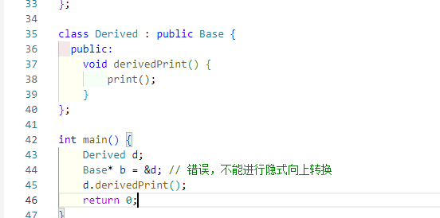
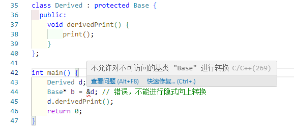
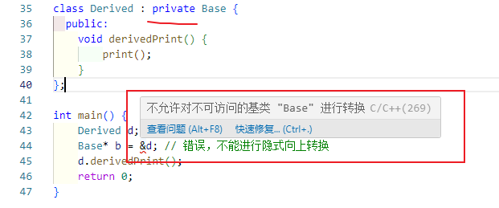
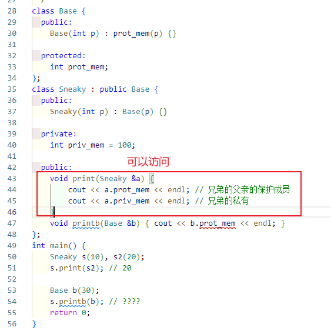
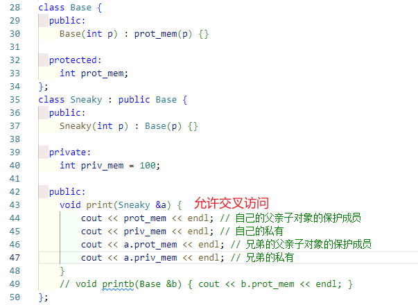
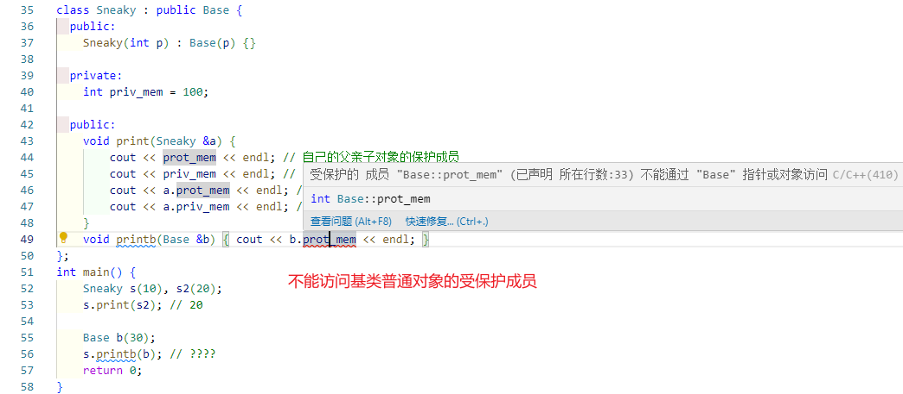

初心: 

对于那些理解的很透彻的知识点, 我想记录下来, 整理出来, 即使很久不见, 也会一见如故

整理100个知识点, 这就是自己的宝

标准: 已经掌握的知识点才能进入这个列表, 为什么?

为了复习的时候不要感知痛苦


智能指针为什么支持衍生类到基类的转换?


## 衍生列表指示符作用?

> 摘要
>
> 访问指示符同时保护了基类成员和基类子对象


class derived list

access specifier

访问指示符的作用

1, 保护基类成员

2, 保护基类子对象


### 保护基类成员

#### public

父类的public和protected成员, 仍然作为派生类的public和protected成员


#### protected

父类的public和protected成员, 现在变为派生类的protected成员

和public的区别就是, 在基类中是public的成员这里变成了protected, 就好像进行了一个与运算

```c++ 
public=111;
protected =11;
private = 1;

public & protected ;// 11
```


#### private

父类的public和protected成员变成了这里的private成员

```c++ 
public&private ; //1
protected & private ; // 1
```


### 保护基类对象

基类的引用或指针被需要的地方: 可以使用衍生类

衍生类到基类的转化是隐式的

衍生类包含了基类子对象


那么访问指示符会保护基类子对象吗?

#### public



public继承的情况, 基类指针能接收衍生类


#### protected



procted继承的情况, 基类指针不能接收衍生类指针


#### private



private继承的情况, 基类指针不能接收衍生类指针


## 衍生类, 基类对象, protected成员

每个类控制它能被谁访问

> 摘要
>
> 衍生类继承基类, 只是让基类的成员成为它的一部分
>
> 衍生类能访问的是基类子对象, 不能访问基类普通对象


谁能访问一个类A的私有成员, 是类A说的算, 

- 目前只有类A的所有对象, 
- 类A的友元可以访问


### 相同类的对象之间

相同类的对象之间能相互访问私有成员




### 衍生类和基类子对象




### 衍生类和基类普通对象




